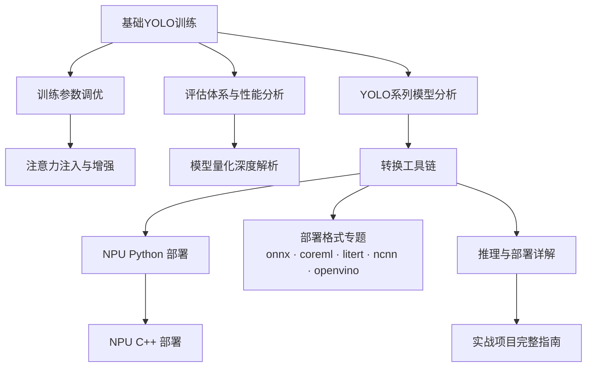

# YOLO 技术博客导读：从零到部署的完整学习路径

## 概述

本博客是一套围绕 YOLO 目标检测的系统性技术文章合集，覆盖从**模型认知 → 训练调优 → 评估量化 → 转换部署 → 落地实战**的完整生命周期。无论你是初次接触目标检测的新手，还是需要将模型落地到边缘设备的工程师，都可以按照下面的路线图循序渐进地阅读。

> **建议阅读方式**：按「学习路径」章节顺序阅读核心篇目；各部署专题（CoreML / LiteRT / NCNN / ONNX / OpenVINO）可根据实际目标硬件选读。

---

## 一、学习路径总览

| 阶段 | 涵盖文章 | 阶段产出 |
|------|---------|---------|
| ① 认知篇 | [YOLO系列模型分析](YOLO系列模型分析.md) · [YOLOv8多任务模型详解](YOLOv8多任务模型详解.md) | 理解 YOLO 演进与多任务架构 |
| ② 训练篇 | [基础YOLO模型训练与指标分析](基础YOLO模型训练与指标分析.md) · [训练参数的调优](训练参数的调优.md) · [训练管道中注意力注入与常见增强措施分析](训练管道中注意力注入与常见增强措施分析.md) | 训练出可用模型并掌握调优方法 |
| ③ 评估篇 | [YOLO模型评估体系与性能分析](YOLO模型评估体系与性能分析.md) | 科学衡量、诊断模型效果 |
| ④ 部署准备 | [模型量化深度解析](模型量化深度解析.md) · [YOLO模型的转换与rknn-toolkit相关工具链的使用](YOLO模型的转换与rknn-toolkit相关工具链的使用.md) | 压缩模型、产出可转换格式 |
| ⑤ 边缘部署 | [YOLO模型在npu的python部署](YOLO模型在npu的python部署.md) · [模型在npu的cpp部署](模型在npu的cpp部署.md) · [YOLO模型推理与部署详解](YOLO模型推理与部署详解.md) | 在真实硬件上跑通推理 |
| ⑥ 实战篇 | [YOLO模型实战项目完整指南](YOLO模型实战项目完整指南.md) | 端到端项目交付能力 |
| ➕ 延伸 | [九眼标定与手眼标定](九眼标定与手眼标定.md) | 机器人视觉标定基础 |

> 💡 阅读建议：按上表顺序精读核心链路；「部署格式专题」（三）按目标平台选读即可。

---

## 二、核心文章（按推荐阅读顺序）

### 第 1 章 · 认知篇：理解 YOLO（预计 60–90 分钟）

| 序号 | 文章 | 内容概要 |
|-----|------|---------|
| 1 | [yolo系列模型分析](YOLO系列模型分析.md) | YOLOv1 → YOLOv8/YOLO11/YOLO26 的演进脉络、各版本架构差异与选型建议 |
| 2 | [YOLOv8多任务模型详解](YOLOv8多任务模型详解.md) | 检测 / 分割 / 分类 / 姿态 / OBB 五大任务的模型结构与头设计 |

### 第 2 章 · 训练篇：炼出自己的模型（预计 60–90 分钟）

| 序号 | 文章 | 内容概要 |
|-----|------|---------|
| 3 | [基础yolo模型训练与指标分析](基础YOLO模型训练与指标分析.md) | 数据集准备、训练全流程、loss/mAP 曲线解读 |
| 4 | [训练参数的调优](训练参数的调优.md) | lr0/lrf/batch/warmup 等超参的作用机理与调参策略 |
| 5 | [训练管道中注意力注入与常见增强措施分析](训练管道中注意力注入与常见增强措施分析.md) | CBAM/SE/坐标注意力原理、自定义模块注册、增强策略取舍 |

### 第 3 章 · 评估篇：科学衡量效果（预计 30–45 分钟）

| 序号 | 文章 | 内容概要 |
|-----|------|---------|
| 6 | [yolo模型评估体系与性能分析](YOLO模型评估体系与性能分析.md) | Precision/Recall/F1/mAP 计算、混淆矩阵、校准与误差分析 |

### 第 4 章 · 部署准备篇：压缩与转换（预计 30–45 分钟）

| 序号 | 文章 | 内容概要 |
|-----|------|---------|
| 7 | [模型量化深度解析](模型量化深度解析.md) | PTQ/QAT 原理、INT8/FP16 数学表示、TensorFlow/PyTorch/RKNN 实战 |
| 8 | [Yolo模型的转换与rknn-toolkit相关工具链的使用](YOLO模型的转换与rknn-toolkit相关工具链的使用.md) | ONNX → RKNN 完整流程、Toolkit1/Toolkit2 参数对照、常见报错排查 |

### 第 5 章 · 边缘部署篇：跑在真实硬件上（预计 90–120 分钟）

| 序号 | 文章 | 内容概要 |
|-----|------|---------|
| 9 | [yolo模型在npu的python部署](YOLO模型在npu的python部署.md) | RK3588/RK3568 选型、RKNN Python API、预处理对齐与性能优化 |
| 10 | [模型在npu的cpp部署](模型在npu的cpp部署.md) | RKNN C++ API、工程化封装、多线程流水线 |
| 11 | [yolo模型推理与部署详解](YOLO模型推理与部署详解.md) | TensorRT/OpenVINO/TFLite/Jetson 全平台推理与服务化方案 |

### 第 6 章 · 实战篇：完整项目闭环（预计 60–80 分钟）

| 序号 | 文章 | 内容概要 |
|-----|------|---------|
| 12 | [yolo模型实战项目完整指南](YOLO模型实战项目完整指南.md) | 从需求到上线的端到端项目模板与经验沉淀 |

### 延伸专题 · 视觉系统配套（预计 30–40 分钟）

| 文章 | 内容概要 |
|------|---------|
| [九眼标定与手眼标定](九眼标定与手眼标定.md) | 相机内参、手眼标定（eye-in-hand / eye-to-hand）、ROS2 工程实践——机器人抓取类项目的必备前置知识 |

---

## 三、部署格式专题（按目标平台选读）

| 平台 | 文章 | 适用场景 |
|------|------|---------|
| Apple 生态 | [coreml.md](coreml.md) | iOS / macOS / Neural Engine |
| Android / TPU | [litert.md](litert.md) | 安卓手机、Edge TPU、Google 生态 |
| 端侧通用 | [ncnn.md](ncnn.md) | 无框架依赖的移动端/嵌入式 CPU 推理 |
| 交换格式 | [onnx.md](onnx.md) | 跨框架中间表示、几乎所有转换链路的起点 |
| Intel 平台 | [openvino.md](openvino.md) | x86 CPU / 核显 / NPU |

> 这五篇来自 Ultralytics 官方文档的整理归档，内容为英文原文；与第 5 章的中文实操文章互为补充。

---

## 四、知识依赖关系

> **机器人方向**：[九眼标定与手眼标定](九眼标定与手眼标定.md) 为独立前置，可与训练篇并行阅读。

**典型组合**：

- **纯软件算法岗**：①②③ + 推理与部署详解
- **边缘端落地**：④⑤ 全读 + 对应平台专题
- **机器人视觉**：①②③ + 九眼标定 + NPU 部署

---

## 五、核心术语速查

| 术语 | 含义 | 详见 |
|------|------|------|
| IoU | 交并比，衡量预测框与真实框的重叠程度 | [评估体系](YOLO模型评估体系与性能分析.md) |
| mAP50 / mAP50-95 | IoU 阈值 0.5 / 0.5~0.5(步长0.05) 下的平均精度，越高越好 | [评估体系](YOLO模型评估体系与性能分析.md) |
| NMS | 非极大值抑制，去除重复检测框的后处理 | [推理与部署详解](YOLO模型推理与部署详解.md) |
| Letterbox | 保持长宽比的图像缩放填充方式，预处理必须与训练一致 | [NPU-Python部署](YOLO模型在npu的python部署.md) |
| PTQ / QAT | 训练后量化 / 量化感知训练 | [模型量化深度解析](模型量化深度解析.md) |
| 校准数据集 | PTQ 时用于统计激活分布的代表性图片集（txt 列表）| [模型量化深度解析](模型量化深度解析.md) |
| FP16 / INT8 | 半精度 / 8位整数量化格式，速度与精度的权衡 | [模型量化深度解析](模型量化深度解析.md) |
| ONNX | 跨框架模型交换格式，多数转换链路的中间步骤 | [onnx.md](onnx.md) |
| RKNN | Rockchip NPU 模型格式；转换用 Toolkit2，板端用 Runtime | [转换工具链](YOLO模型的转换与rknn-toolkit相关工具链的使用.md) |
| TensorRT Engine | NVIDIA 平台专用编译引擎，与 GPU 架构绑定 | [推理与部署详解](YOLO模型推理与部署详解.md) |
| eye-in-hand / eye-to-hand | 相机装在末端 / 固定于基座两种手眼标定构型 | [九眼标定与手眼标定](九眼标定与手眼标定.md) |

---

## 六、常见问题速查（FAQ）

**Q：训练时 mAP 很高，部署后效果变差？**
最常见原因是预处理不一致（letterbox 参数、BGR/RGB、归一化系数）。见[NPU-Python部署 §常见问题](YOLO模型在npu的python部署.md)。

**Q：RKNN 转换报 `config` 相关错误？**
Toolkit2 要求 `config()` 在 `load_onnx()` **之前**调用，且参数名为 `mean_values/std_values/target_platform`（不是 Toolkit1 的 `channel_mean_value`）。见[转换工具链 §参数对照表](YOLO模型的转换与rknn-toolkit相关工具链的使用.md)。

**Q：INT8 量化后精度掉太多？**
增加校准图片数量与多样性、换 `quantized_algorithm='mmse'`、或对敏感层保持 FP16。见[模型量化深度解析 §6.3](模型量化深度解析.md)。

**Q：表格/代码块显示异常？**
本系列所有 Markdown 已规范化：标题/代码块/表格前后均有空行。若自行编辑后出现渲染问题，检查是否删除了这些空行。

---

## 七、约定与说明

- 所有代码示例默认基于 **Ultralytics YOLOv8+** 与 **RKNN-Toolkit2**；涉及 Toolkit1 的旧参数均已标注。
- 文中性能数据若无特别说明，均来自对应硬件的公开基准或实测，实际结果随环境浮动。
- 各文章开头的「参考来源」指向官方文档原文，遇到版本差异时以官方文档为准。

---

## 八、实验记录与开源贡献

> 本系列知识在真实硬件上的验证与落地（2026-08，RK3588 + rknn-toolkit2 2.3.2）。

### 实验：YOLOv8 输出布局 9 头 vs 6 头（RK3588 INT8）

同一权重 `yolov8n.pt` 的两种导出布局，在**完全相同的 INT8 转换与评测条件**下对比：

| 布局 | 输出结构 | 结论 |
|---|---|---|
| 9 头 | `[box, Sigmoid(cls), score_sum]×3` | 对照组；mAP 与 6 头**逐位一致**（mAP 是排序指标），但 INT8 置信度顶部压缩、台阶化 |
| **6 头** | `[box, Sigmoid(cls)]×3` | **无损**（mAP 相同、速度略快 23.78 vs 24.27ms），且置信度连续保真（相对 FP32 ±0.02 内）|

- **完整数据与复现**：📄 [评测报告](coco_benchmark_结果_9头vs6头/评测报告.md) ｜ 🛠 [基准环境说明](coco_benchmark/README_BENCHMARK.md)
- **关键前提**：校准集预处理必须与部署一致（letterbox 灰 114），否则 INT8 置信度被磨平、mAP 显著劣化——[模型量化深度解析](模型量化深度解析.md) 的实战注脚
- **与本系列的关联**：直接解释了 [NPU-Python 部署](YOLO模型在npu的python部署.md) §5.1「推理结果与 PC 端不一致」中的置信度刻度问题

### 开源贡献（PR）

| 目标仓库 | 内容 | 材料 |
|---|---|---|
| `airockchip/rknn_model_zoo` | YOLOv8 **6 头输出**支持（修复 INT8 置信度压缩） | [yolov8n/](yolov8n/README.md) |
| `ultralytics/ultralytics` | YOLOv8 **RKNN 推理示例** | [ultralytics_rknn/](ultralytics_rknn/README.md) ｜ [PR 正文](ultralytics_pr/PR_DESCRIPTION.md) |

---

## 九、更新日志

**2026-08 系统性修订**

- **排版规范化**：全站统一空行规范、清理重复分隔线与空行空洞、修复 11 处表格紧贴正文导致的渲染失效
- **API 正确性**：RKNN-Toolkit1→Toolkit2 参数全面校正（含 config 调用顺序、校准数据集用法）、C++ API 签名修正、TensorRT/PyTorch QAT 示例重写为真实可用代码
- **事实核查**：YOLO 各版本作者/会议/arXiv 编号勘误；移除不存在的 YOLOv8 论文引用；损失函数归属修正（YOLOv8 分类用 BCE 而非 Varifocal）；CIoU 公式修正
- **基准数据对齐**：v2/v7/YOLO11 等 mAP 数值与官方 COCO val 结果对齐，修正错位的对比表
- **数学实现修复**：手眼标定 Tsai-Lenz/Park 实现的平移方程与零空间求解 bug；mAP 计算中无 GT 类别的 COCO 约定修正
- **工程实践**：FastAPI 服务的事件循环阻塞、异常吞噬等问题修复
- **体系贯通**：全站文章双向导航 + 术语表 + FAQ + 阅读时长指引

---

*本导读随文章更新持续维护。*
