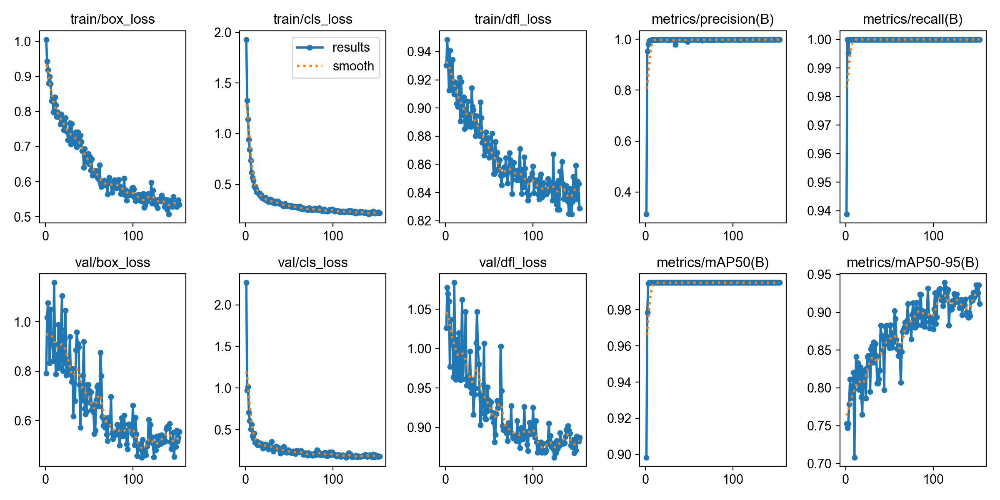
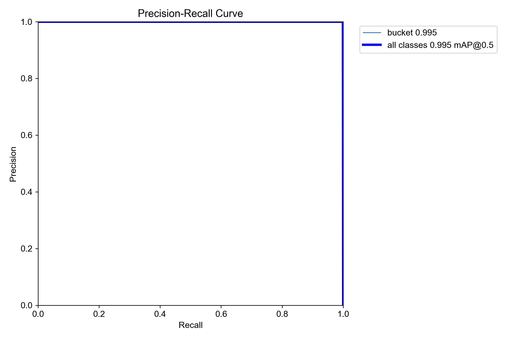
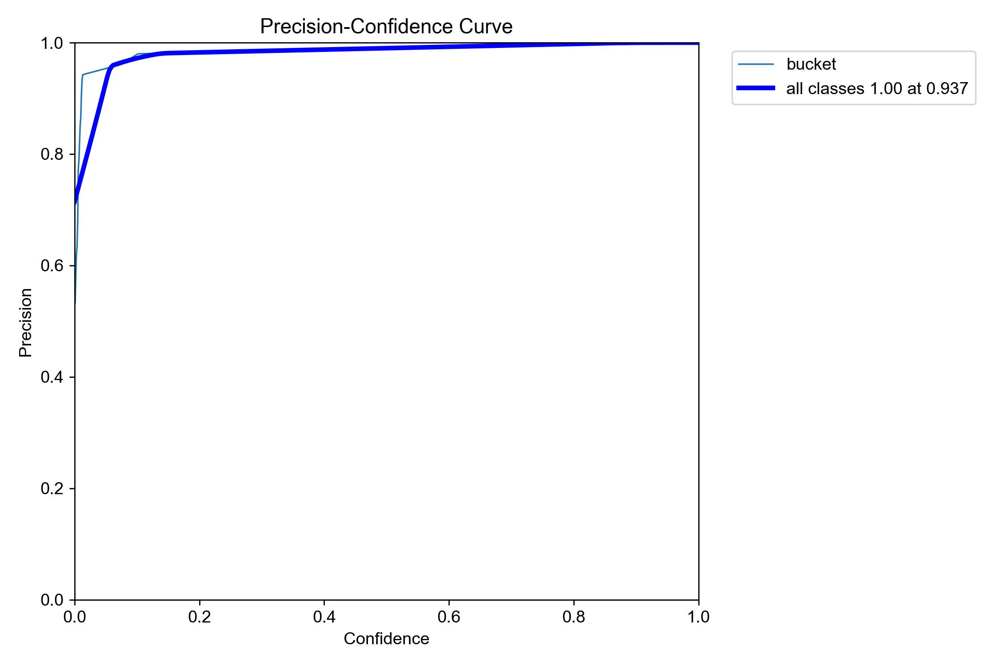
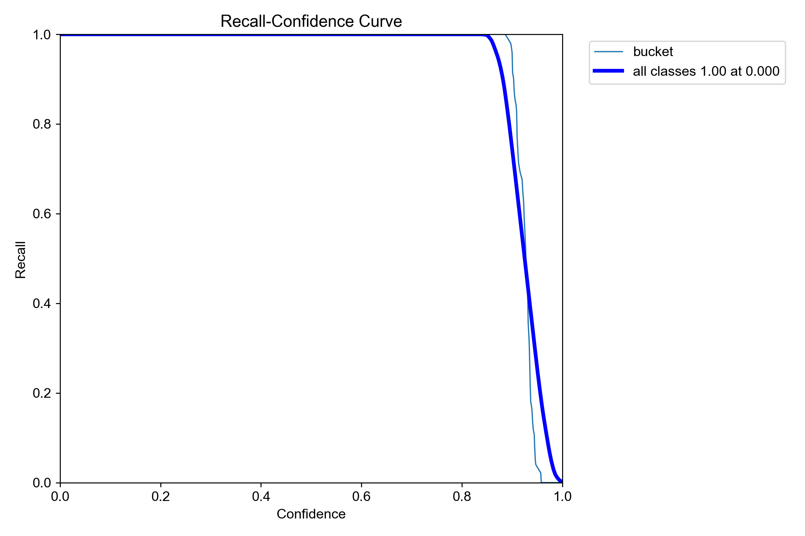
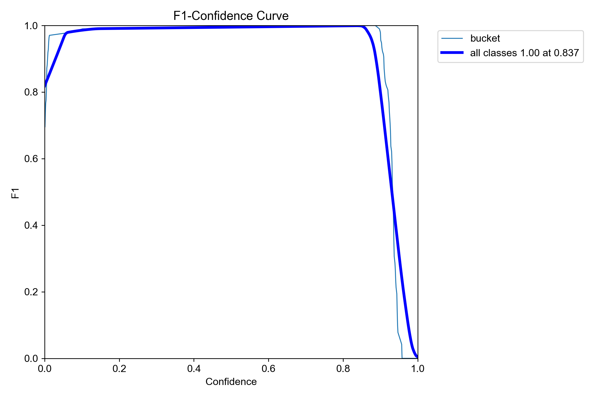
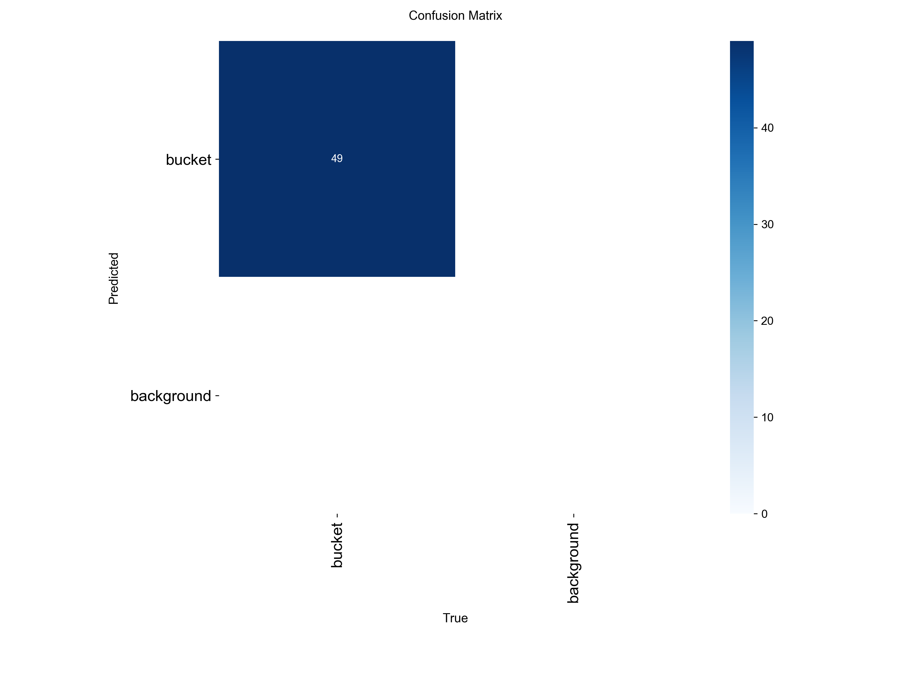

# 基础YOLO模型训练与指标分析

## 引言

YOLO（You Only Look Once）系列是目前工业界和学术界应用最广泛的实时目标检测框架之一。Ultralytics 提供的 `ultralytics` 库将复杂的训练流程简化为几条命令，极大地降低了使用门槛。本文将从环境搭建、数据集准备、训练流程、指标解析、调优诊断到推理导出，系统性覆盖 YOLO 训练的全链路。

> **注**：本文基于 YOLOv8 的训练流程编写，所有方法同样适用于 YOLO11。

> **参考来源**：[Ultralytics Train Mode Documentation](https://docs.ultralytics.com/modes/train/) | [Ultralytics Models Documentation](https://docs.ultralytics.com/models/)
>
> **实际训练数据**：本文附有使用**自行拍摄的单类别数据集**进行 YOLOv8n 训练的完整结果（153 轮），各指标曲线图均在第五部分直接展示与解读。

---

## 一、环境准备

### 1.0 安装 Conda（Miniconda / Anaconda）

> 可以使用 **Miniconda**（轻量级，仅含 conda + Python，按需安装包），Anaconda 也可（预装大量科学计算包，体积较大）。

#### Windows

1. 下载安装包：访问 [miniconda 官方下载页](https://docs.conda.io/en/latest/miniconda.html#latest-miniconda-installer-links)，下载 `Miniconda3 Windows 64-bit`
2. 双击运行安装程序，一路"Next"，**建议勾选** "Add Miniconda3 to my PATH environment variable"（安装完成后生效）
3. 打开 **Anaconda Prompt**（或 PowerShell），验证安装：

conda --version

#### Linux (Ubuntu / CentOS)

# 下载 Miniconda 安装脚本
wget https://repo.anaconda.com/miniconda/Miniconda3-latest-Linux-x86_64.sh
bash Miniconda3-latest-Linux-x86_64.sh

# 按提示完成安装，最后输入 yes 初始化 conda
conda init bash
source ~/.bashrc   # 或重新打开终端，用于重新加载配置
conda --version

#### macOS

# 通过 Homebrew 安装（推荐）
brew install --cask miniconda

# 或下载安装脚本
curl -L -O https://repo.anaconda.com/miniconda/Miniconda3-latest-MacOSX-arm64.pkg
sudo installer -pkg Miniconda3-latest-MacOSX-arm64.pkg -target /

conda --version

#### 配置镜像（加速下载，国内推荐）

# 配置清华镜像源
conda config --add channels https://mirrors.tuna.tsinghua.edu.cn/anaconda/pkgs/main
conda config --add channels https://mirrors.tuna.tsinghua.edu.cn/anaconda/pkgs/free
conda config --add channels https://mirrors.tuna.tsinghua.edu.cn/anaconda/cloud/pytorch
conda config --set show_channel_urls yes

# 查看配置
conda config --show channels

### 1.1 建立 Conda 虚拟环境

使用 conda 环境隔离依赖是避免环境冲突的最佳实践。以下流程适用于 Windows / Linux / macOS。

# 步骤1：创建虚拟环境（指定 Python 版本）
conda create -n yolo python=3.10 -y
conda activate yolo

# 步骤2：确认当前环境
conda env list          # 查看所有环境
python --version        # 确认 Python 版本 >= 3.9

### 1.2 查看 NVIDIA 驱动版本，确定支持的 CUDA 版本

在安装 PyTorch 和 CUDA 之前，**必须先确认本机 NVIDIA 驱动支持的最高 CUDA 版本**，否则安装的 CUDA 包无法工作。

# ── Windows ──
nvidia-smi

# ── Linux / macOS ──
nvidia-smi

输出示例（关注右上角）：

+-----------------------------------------------------------------------------+

| NVIDIA-SMI 550.54.02    Driver Version: 550.54.02    CUDA Version: 12.5     |
|-------------------------------+----------------------+----------------------+

**驱动版本与 CUDA 版本的对应关系**：

| NVIDIA 驱动版本（最低） | 支持的最高 CUDA 版本 | 推荐安装的 PyTorch CUDA 版本 |
|------------------------|---------------------|---------------------------|
| >= 550.xx             | 12.5                | CUDA 12.1（推荐）          |
| >= 525.xx             | 12.2                | CUDA 12.1                  |
| >= 470.57.01          | 11.4                | CUDA 11.8（旧驱动适用）     |
| < 470                   | 不支持 CUDA 11.8+  | 请升级驱动或仅使用 CPU      |

> **重要说明**：
> - `nvidia-smi` 显示的 CUDA 版本是驱动**支持的最高版本**，而非已安装的 CUDA Toolkit 版本。
> - conda 安装的 `pytorch-cuda=12.1` 是 CUDA **Runtime**，不是完整的 CUDA Toolkit，两者不冲突。
> - 只要驱动版本 >= 上表要求，PyTorch 就能正常运行对应版本的 CUDA 算子。

### 1.3 安装 PyTorch 与 CUDA 依赖（GPU 训练必需）

> PyTorch 会自动将 CUDA Runtime 库以 conda 包形式安装，因此**无需单独安装 CUDA Toolkit**（详见下文说明）。

#### 方式A：通过 conda 安装（推荐，不依赖系统 CUDA）

conda activate yolo

# CUDA 12.1（推荐，需驱动 >= 550.xx）
conda install pytorch torchvision torchaudio pytorch-cuda=12.1 -c pytorch -c nvidia -y

# CUDA 11.8（旧驱动适用，需驱动 >= 470.57.01）
conda install pytorch torchvision torchaudio pytorch-cuda=11.8 -c pytorch -c nvidia -y

> PS : **为什么不需要单独装 CUDA Toolkit？**
> conda 安装时会自动拉取 `pytorch-cuda=xx.x` 依赖包，其中内置 CUDA Runtime 库（`cublas`、`cudart`、`curand` 等），PyTorch 运行时会直接调用这些库，不需要系统级 CUDA Toolkit。
> 仅当你需要**单独编译 CUDA 扩展**（如某些自定义 OP）时才需安装完整 CUDA Toolkit。

#### 方式B：pip 安装（适合已配置好 CUDA 驱动的场景）

pip install torch torchvision torchaudio --index-url https://download.pytorch.org/whl/cu121
# 或 cu118
# pip install torch torchvision torchaudio --index-url https://download.pytorch.org/whl/cu118

#### 最后验证 GPU 可用性

python -c "
import torch
print(f'PyTorch:  {torch.__version__}')
print(f'CUDA:     {torch.version.cuda}')
print(f'Available: {torch.cuda.is_available()}')
if torch.cuda.is_available():
    print(f'GPU:      {torch.cuda.get_device_name(0)}')
    print(f'Memory:   {torch.cuda.get_device_properties(0).total_mem / 1e9:.1f} GB')
"

#### 安装 cuDNN

cuDNN 通常随 PyTorch 自动安装，确认方式如下：

import torch
print(torch.backends.cudnn.enabled)   # 应输出 True
print(torch.backends.cudnn.version())  # 输出 cuDNN 版本（如 8902 表示 8.9.2）

若需要**手动安装独立 cuDNN**（用于非 PyTorch 框架或调试）：

1. 前往 [NVIDIA cuDNN 下载页](https://developer.nvidia.com/cudnn) 下载对应 CUDA 版本的包
2. 按系统解压并复制文件：

   # ── Windows ──
   # 假设 CUDA 安装在 C:\Program Files\NVIDIA GPU Computing Toolkit\CUDA\v12.1
   # conda 环境内则使用 %CONDA_PREFIX%
   set CUDA_PATH=C:\Program Files\NVIDIA GPU Computing Toolkit\CUDA\v12.1
   xcopy /E /I cudnn-*-win64-x64\* "%CUDA_PATH%\"

   # 或 conda 环境内
   xcopy /E /I cudnn-*-win64-x64\* "%CONDA_PREFIX%\Library\bin\"
   xcopy /E /I cudnn-*-win64-x64\* "%CONDA_PREFIX%\Library\include\"
   xcopy /E /I cudnn-*-win64-x64\* "%CONDA_PREFIX%\Library\lib\"

   # ── Linux ──
   # CUDA 12.x 典型路径（conda 环境内）
   unzip cudnn-linux-x86_64-*.zip -d $CONDA_PREFIX/
   # 或系统级 CUDA 路径
   sudo cp cudnn-*-include/*.h /usr/local/cuda/include/
   sudo cp cudnn-*-lib/libcudnn* /usr/local/cuda/lib64/
   sudo chmod +r /usr/local/cuda/include/*.h /usr/local/cuda/lib64/libcudnn*

   # ── macOS（Apple Silicon / M 系列）──
   # macOS 上 cuDNN 安装路径与 Linux 类似，需指定 arm64 包
   unzip cudnn-macos-arm64-*.zip -d $CONDA_PREFIX/
   # 或 Intel Mac
   unzip cudnn-macos-x64-*.zip -d $CONDA_PREFIX/
   # 验证
   python -c "import torch; print(f'cuDNN: {torch.backends.cudnn.version()}')"

### 1.4 安装 Ultralytics

# 基础安装（含 PyTorch 依赖）
pip install ultralytics

# 安装完整依赖（含可视化工具）
pip install ultralytics[all]

# 验证安装及版本
python -c "from ultralytics import YOLO; print(YOLO.__module__)"
python -c "import torch; print(f'PyTorch: {torch.__version__}, CUDA: {torch.cuda.is_available()}')"

推荐使用 **Python 3.9+**，CUDA **11.8** 或 **12.x**（GPU 训练时）。Ultralytics 官方推荐 PyTorch 版本为 `>=1.8.0`。

### 1.5 验证安装与 GPU 可用性

from ultralytics import YOLO
import torch

# 检查 GPU
if torch.cuda.is_available():
    print(f"GPU: {torch.cuda.get_device_name(0)}")
    print(f"GPU Memory: {torch.cuda.get_device_properties(0).total_mem / 1e9:.1f} GB")
else:
    print("Using CPU (training will be slow)")

# 加载预训练模型进行快速验证
model = YOLO("yolov8n.pt")
results = model.predict("test_image.jpg", conf=0.25, show=True)

### 1.6 验证训练环境

# 检查训练所需的所有依赖
from ultralytics.utils import checks
checks.check_requirements()  # 验证所有依赖已安装

### 1.7 YOLOv8 环境配置

YOLOv8 是 Ultralytics 推出的主流目标检测框架，提供了完整的训练、验证、推理和导出工具链。为确保 YOLOv8 能正常运行，需要满足以下条件：

#### 版本要求

| 组件 | 最低版本 | 推荐版本 | 说明 |
|------|---------|---------|------|
| Python | 3.9 | 3.10 | 推荐版本 |
| PyTorch | 2.1.0 | 2.4.0+ | 需要 torch.compile 支持 |
| ultralytics | 2024.0.0 | latest | 包含 YOLOv8 模型定义 |
| CUDA | 11.8 | 12.1+ | PyTorch CUDA 运行时 |
| cuDNN | 8.6 | 8.9+ | 需要 cuDNN 前向/反向 API |
| NVIDIA 驱动 | 525.xx | 550.xx+ | 推荐驱动版本 |

#### 安装 YOLOv8 支持

# 方式1：安装最新版 ultralytics（推荐）
pip install --upgrade ultralytics

# 方式2：从源码安装（获取最新特性）
pip install git+https://github.com/ultralytics/ultralytics.git

# 方式3：使用 conda（适合生产环境）
conda install -c conda-forge ultralytics

#### 验证 YOLOv8 可用性

from ultralytics import YOLO
import torch

# 检查 ultralytics 版本
import ultralytics
print(f"ultralytics 版本: {ultralytics.__version__}")

# 尝试加载 YOLOv8 模型
try:
    model = YOLO("yolov8n.pt")
    print(f"✓ YOLOv8 模型加载成功: {model.name}")
    print(f"  任务类型: {model.task}")
    print(f"  模型架构: {model.model.yaml.get('name', 'N/A')}")
except Exception as e:
    print(f"✗ YOLOv8 模型加载失败: {e}")
    print("  请升级 ultralytics: pip install --upgrade ultralytics")

# 验证 GPU 环境
if torch.cuda.is_available():
    print(f"✓ GPU 可用: {torch.cuda.get_device_name(0)}")
    print(f"  CUDA 版本: {torch.version.cuda}")
    print(f"  cuDNN 版本: {torch.backends.cudnn.version()}")
else:
    print("⚠ 仅使用 CPU（YOLOv8 训练速度较慢）")

#### YOLOv8 已知兼容性问题

| 兼容性项         | 问题描述                          | 解决方案                                  |
|------------------|-----------------------------------|-------------------------------------------|
| PyTorch < 2.1    | 不支持 `torch.compile` 加速       | 升级至 PyTorch 2.4+                       |
| CUDA < 11.8      | 无法加载新版 CUDA 算子            | 升级 CUDA Runtime 至 12.1+                |
| NVIDIA 驱动 < 525| 缺少最新 CUDA 算子支持            | 升级驱动至 525+                           |
| 多 GPU 训练      | 设备指定方式不统一                | 使用 `device="0,1"` 或 `device=[0,1]` 字符串格式 |
| Windows 训练     | 原生 Windows 性能较差             | 建议使用 WSL2 以获得最佳性能              |

> **注意**：当优化器配置有误时，Ultralytics 会自动降级到默认 SGD 优化器并输出警告，不会报错中断训练。可通过 `optimizer="auto"` 参数让框架自动选择最优优化器。

### 1.8 GPU 选型与对比

选择合适的 GPU 是训练效率的决定性因素之一。以下从显存、算力、性价比三个维度对主流 GPU 进行全面对比。

#### 消费级 GPU 对比

消费级 GPU 对比（2025 年主流型号）：

| 型号 | 显存 | FP16 TFLOPS | 价格(USD) | YOLOv8n训练速度 |
| --- | --- | --- | --- | --- |
| RTX 4060 | 8GB | ~158 | ~299 | 基准 |
| RTX 4070 | 12GB | ~247 | ~599 | 1.3× |
| RTX 4080 | 16GB | ~414 | ~1199 | 2.0× |
| RTX 4090 | 24GB | ~825 | ~1599 | 3.5× |
| RTX 5090 | 32GB | ~2200 | ~1999 | 5.0× |

> **关键指标解释**：
> - **显存**：决定最大 batch size 和 imgsz。训练 YOLOv8s @ imgsz=1280 至少需要 12GB 显存。
> - **FP16 TFLOPS**：反映混合精度下的理论算力上限，实际训练速度约为理论值的 30%~50%。
> - **训练速度**：以单类别数据集、batch=16、imgsz=640 为基准的相对速度。

#### 专业级 GPU 对比

专业级 GPU 对比（数据中心 / 工作站）：

| 型号 | 显存 | FP16 | TFLOPS | 日租金(USD) | 多GPU扩展 |

| --- | --- | --- | --- | --- |
| A100 80GB | 80GB | ~312 | ~2.5 | NVLink 1.5TB/s |
| H100 80GB | 80GB | ~989 | ~5.0 | NVLink 3.0TB/s |
| H200 141GB | 141GB | ~1979 | ~8.0 | HBM3e 性能更强 |
| RTX 6000 Ada | 48GB | ~91 | ~1.5（二手） | NVLink |

#### 性价比决策树

GPU 选型决策树：
──────────────────────────────────────────────────────────────
                    训练需求
                       │
              ┌────────┴────────┐
              ▼                 ▼
         预算 < 5000          预算充足
              │                 │
              ▼                 ▼
        RTX 4060/4070    显存需求 > 24GB?
              │              │         │
              │         是 ──┘         └── 否
              │              │           │
              │         H100/A100    RTX 4090/5090
              │              │           │
              └──────────────┴────  多GPU?
                                     │
                                 是 ──┴── 否
                                  RTX 4090×2   单卡够用
                                  或 H100×4
──────────────────────────────────────────────────────────────

---

### 1.9 云 GPU 选项

对于没有本地 GPU 或需要弹性扩展的场景，云 GPU 是最佳选择。以下是主流云平台的对比。

#### 主流云 GPU 平台对比

云 GPU 平台对比（2025 年）：

| 平台 | 起租价格 | 常用GPU | 优势 | 劣势 |
| --- | --- | --- | --- | --- |
| Lambda Labs (lambdalabs.com) | $0.20/hr | RTX 4090, RTX 6000 Ada | 价格透明，无锁定 | 需预付费 |
| Vast.ai (vast.ai) | $0.08/hr | RTX 3090, 4090, A100, H100 | 最便宜，按小时按需用，共享市场 | 稳定性参差不齐，无 SLA |
| RunPod (runpod.io) | $0.19/hr | RTX 4090, A100, H100, A6000 | 用户友好，模板丰富 | 高峰期排队 |
| AWS EC2 (aws.amazon) | $0.50/hr ~ $2.00+/hr | T4, A10G, H100, H200 | 生态完整 | 价格复杂 |
| Google Cloud (cloud.google) | $0.50/hr ~ $4.00+/hr | T4, A100, H100 | 自动扩缩容 | 复杂定价 |

#### Lambda Labs 快速上手

# 1. 注册并选择实例（推荐 RTX 4090 4× 或 A100 80GB）
# 2. 通过 SSH 连接实例
ssh -i ~/.ssh/lambda_key user@your-instance-ip

# 3. 实例已预装 NVIDIA 驱动 + CUDA 12.x
nvidia-smi

# 4. 克隆项目并配置环境
git clone https://github.com/your-project.git
cd your-project
conda create -n yolo python=3.10 -y
conda activate yolo
pip install ultralytics[all] torch torchvision

# 5. 挂载数据盘（如有）
mkdir -p /data
mount /dev/sdb1 /data

# 6. 开始训练
yolo detect train data=/data/data.yaml epochs=100 batch=32 device=0

#### 成本优化技巧

云 GPU 成本优化清单：

| 多 GPU 并行训练 | — | 线性加速 |

**成本估算示例**（YOLOv8n 训练 100 epochs）：

| 场景 | 配置 | 估算成本 |
| --- | --- | --- |
| Lambda RTX 4090 | 100 epochs | ~$40 |
| AWS A10G spot | 100 epochs | ~$20 |
| 本地 RTX 4090 | 100 epochs | 电费 ~$5 |

---

### 1.10 Docker 开发环境

使用 Docker 可以确保训练环境的可复现性，避免"在我机器上能跑"的问题。

#### 基础 Dockerfile

# 使用 NVIDIA CUDA 基础镜像
FROM nvidia/cuda:12.1.0-cudnn8-runtime-ubuntu22.04

# 安装系统依赖
RUN apt-get update && apt-get install -y \
    python3.10 python3.10-dev python3.10-venv \
    git wget vim htop tmux \
    libgl1-mesa-glx libglib2.0-0 \
    && rm -rf /var/lib/apt/lists/*

# 创建虚拟环境
RUN python3.10 -m venv /opt/venv
ENV PATH="/opt/venv/bin:$PATH"

# 安装 PyTorch 和 Ultralytics
RUN pip install --no-cache-dir \
    torch==2.4.0 torchvision torchaudio \
    --index-url https://download.pytorch.org/whl/cu121 \
    && pip install --no-cache-dir \
    "ultralytics[all]>=2025.1.0" \
    tensorboard tensorboardX \
    wandb mlflow \
    pandas matplotlib seaborn opencv-python \
    pyyaml scikit-learn

# 创建工作目录
WORKDIR /workspace
COPY . /workspace

# 默认命令
CMD ["bash"]

#### 构建与运行

# 构建镜像
docker build -t yolo-train:latest .

# 运行容器（需 NVIDIA Container Toolkit）
docker run --gpus all \
    -v /path/to/data:/workspace/data \
    -v /path/to/results:/workspace/runs \
    -p 6006:6006 \
    -it yolo-train:latest

# 在容器内验证
python -c "import torch; print(f'CUDA: {torch.cuda.is_available()}')"

#### Docker Compose 多服务编排

# docker-compose.yml
version: '3.8'
services:
  yolo-train:
    build: .
    runtime: nvidia
    container_name: yolo-trainer
    volumes:
      - ./data:/workspace/data
      - ./runs:/workspace/runs
      - ./scripts:/workspace/scripts
    environment:
      - WANDB_API_KEY=${WANDB_API_KEY}
      - CUDA_VISIBLE_DEVICES=0,1
    deploy:
      resources:
        reservations:
          devices:
            - driver: nvidia
              count: 2
              capabilities: [gpu]
    ports:
      - "6006:6006"  # TensorBoard
      - "8080:8080"  # W&B 本地代理

  tensorboard:
    image: tensorboard/tensorboard:latest
    ports:
      - "6007:6006"
    volumes:
      - ./runs:/tf_logs
    command: --logdir /tf_logs --port 6006 --bind_all

# 启动完整开发环境
docker compose up -d
# 查看 TensorBoard
open http://localhost:6007

#### 常见问题排查

Docker + GPU 常见问题：

| 问题 | 原因 | 解决方案 |
| --- | --- | --- |
| `--gpus all` 不生效 | NVIDIA Container Toolkit 未安装 | `apt install nvidia-container-toolkit` 并重启 docker |
| CUDA version mismatch | 宿主驱动与容器 CUDA 版本不兼容 | 使用匹配的 base image，如 `nvidia/cuda:12.1.0-cudnn8-runtime` |
| 容器内无 GPU 可见 | nvidia-smi 在容器内不可用 | 确认 `nvidia-ctk runtime configure --runtime=docker` 已执行 |

---

### 1.11 CPU-only Training Optimization

当没有 GPU 可用时，YOLO 模型仍然可以在 CPU 上训练，但需要特别的优化策略来保证训练效率和可行性。

#### CPU 训练的性能特点

**CPU vs GPU 训练性能对比**（YOLOv8n，100 张数据集，10 epochs）：

| 指标             | GPU (RTX 4090) | CPU (i9-13900K) | 比值   |
|------------------|----------------|-----------------|--------|
| 训练速度 (s/epoch) | 12s            | 480s            | 40×    |
| 显存/内存占用     | 2.1 GB         | 8.5 GB          | 4×     |
| Batch size 上限   | 64             | 4–8             | 8–16×  |
| Mosaic 增强       | ✓ 支持         | ✗ 建议关闭      | —      |
| 混合精度 (AMP)    | ✓ FP16         | ✗ 仅 FP32       | —      |

> **关键限制**：
> - CPU 训练无法使用 Mosaic（拼接 4 张图会消耗大量内存）
> - 无法使用混合精度（AMP），只能用 FP32
> - 大 batch size 会导致内存溢出
> - 训练时间显著增加（通常 20–50 倍）

#### CPU 训练优化策略

**CPU 训练优化策略**：

| # | 优化策略 | 具体做法 | 代码示例 |
|---|---------|---------|---------|
| 1 | 减小输入尺寸 | `imgsz=320` 而非 640（计算量减少 75%），对小目标不敏感的场景推荐 | `model.train(imgsz=320, device='cpu')` |
| 2 | 减小 batch size | 建议使用 `batch=4` 或 `batch=8`，确保内存不溢出 | `model.train(batch=4, device='cpu')` |
| 3 | 关闭数据增强 | `mosaic=0`、`mixup=0`、`copy_paste=0`，避免拼接和混合图片 | `model.train(mosaic=0, mixup=0, copy_paste=0)` |
| 4 | 使用缓存 | `cache=True` 将数据集加载到 RAM，避免每次 epoch 重新读取磁盘 | `model.train(cache=True, device='cpu')` |
| 5 | 减少 workers | `workers=0` 或 `workers=2`，CPU 上过多 worker 会占用大量内存 | `model.train(workers=2, device='cpu')` |
| 6 | 减少 epochs | CPU 训练时间成本更高，使用早停 `patience=20` 避免过度训练 | `model.train(epochs=50, patience=20, device='cpu')` |

#### CPU 训练配置示例

"""
CPU-only YOLO 训练配置
"""
from ultralytics import YOLO

# 配置 CPU 训练
model = YOLO("yolov8n.pt")

results = model.train(
    data="data.yaml",
    epochs=50,                    # 减少训练轮数
    imgsz=320,                    # 减小输入尺寸
    batch=4,                      # 小 batch
    workers=2,                    # 少 worker
    cache=True,                   # 缓存数据集
    mosaic=0,                     # 关闭 Mosaic
    mixup=0,                      # 关闭 MixUp
    copy_paste=0,                 # 关闭 Copy-Paste
    close_mosaic=0,               # 全程关闭 Mosaic
    patience=20,                  # 早停
    device='cpu',                 # CPU 训练
    amp=False,                    # 关闭混合精度
    save_period=10,               # 定期保存
)

# 估计训练时间
# YOLOv8n @ imgsz=320, batch=4, CPU: ~5-10 min/epoch
# 50 epochs ≈ 4-8 小时

#### CPU 训练的性能基准

| CPU 型号 | imgsz | batch | 时间/epoch | 总时间 |
|---------|-------|-------|-----------|--------|
| Intel i9-13900K | 640 | 8 | ~120s | ~3.3h |
| Intel i9-13900K | 320 | 8 | ~35s | ~10min |
| AMD Ryzen 9 7950X | 640 | 8 | ~110s | ~3.0h |
| AMD Ryzen 9 7950X | 320 | 8 | ~30s | ~8min |
| Intel i7-12700K | 640 | 4 | ~180s | ~5h |
| Intel i7-12700K | 320 | 4 | ~50s | ~14min |
| AWS c6i.4xlarge | 640 | 4 | ~90s | ~2.5h |
| AWS c6i.4xlarge | 320 | 4 | ~25s | ~4min |

> **注**：以上为估算值，实际性能取决于数据集大小、CPU 核心数和内存带宽。

#### 何时选择 CPU 训练

| 场景             | 判断标准                           | 推荐做法                              |
|------------------|------------------------------------|---------------------------------------|
| ✓ 适合 CPU 训练  | 数据集很小 (< 500 张)              | 直接使用 `device='cpu'`               |
| ✓ 适合 CPU 训练  | 快速实验和原型开发                 | 减少 epochs，使用 YOLOv8n             |
| ✓ 适合 CPU 训练  | 没有 GPU 可用                      | 启用 `cache=True` 减少 I/O 等待       |
| ✓ 适合 CPU 训练  | 微调预训练模型（少量 epoch）       | 关闭 Mosaic，降低 imgsz 到 320        |
| ✓ 适合 CPU 训练  | 学习 YOLO 工作流程                 | 先 CPU 跑通流程，再切换 GPU            |
| ✗ 不适合 CPU 训练| 大数据集 (> 5000 张)              | 改用云 GPU（Lambda Labs、RunPod 等）  |
| ✗ 不适合 CPU 训练| 需要高精度 (mAP > 50%)            | 使用 GPU 训练，启用混合精度            |
| ✗ 不适合 CPU 训练| 需要完整训练 (100+ epochs)         | 使用 GPU，或云 GPU 实例               |
| ✗ 不适合 CPU 训练| 需要多尺度训练                     | GPU 训练是必要条件                     |
| ✗ 不适合 CPU 训练| 生产环境模型训练                   | 使用 GPU，或使用边缘设备推理           |

> **替代方案**：使用云 GPU（Lambda Labs、RunPod、AWS）或 Google Colab（免费 GPU）来加速训练。

---

### 1.12 CUDA 版本兼容性矩阵

CUDA 版本的兼容性是影响训练稳定性的关键因素。以下为详细的兼容性矩阵和常见问题排查。

#### 兼容性矩阵

PyTorch 版本与 CUDA 兼容性：

| PyTorch 版本 | 推荐 CUDA | 最低 CUDA | 支持 cuDNN | 备注 |
| --- | --- | --- | --- | --- |
| 2.5.x | 12.4 | 12.1 | 9.x | 最新稳定版 |
| 2.4.x | 12.4 | 12.1 | 9.x | 推荐生产使用 |
| 2.3.x | 12.1 | 11.8 | 8.9.x | 广泛兼容 |
| 2.1.x | 12.1 | 11.8 | 8.9.x | 推荐配置 |
| 2.1.x | 12.1 | 11.8 | 8.9.x | YOLOv8 最低要求 |
| 1.13.x | 11.7 | 11.3 | 8.4.x | 旧项目兼容 |

#### NVIDIA 驱动与 CUDA 版本对应关系

NVIDIA 驱动版本与 CUDA 运行时兼容性：

| 驱动版本 | 支持的最高 CUDA | 推荐 PyTorch CUDA | 适用场景 |
| --- | --- | --- | --- |
| >= 570.xx | 12.6 | 12.4（推荐） | 最新 GPU（50系） |
| >= 550.xx | 12.5 | 12.1（推荐） | RTX 40系 / A100 |
| >= 535.xx | 12.2 | 12.1 | RTX 30系 |
| >= 525.xx | 12.2 | 12.1 | A100 |
| >= 470.57.01 | 11.4 | 11.8（旧驱动） | GTX 10系 / 16系 |
| < 470 | 不支持 CUDA 11.8+ | 仅 CPU 训练 | 老旧驱动 |

> **重要**：驱动版本决定的是**支持的最高 CUDA 运行时版本**，而非已安装的 CUDA Toolkit 版本。PyTorch 自带的 CUDA Runtime 与系统驱动不冲突——只要驱动 >= 最低要求即可。

#### 常见问题排查

| 症状 | 可能原因 | 排查命令 |
|------|---------|---------|
| `torch.cuda.is_available()` = False | 驱动版本过低 | `nvidia-smi` / `pip show torch` / `python -c "import torch; print(torch.version.cuda)"` |
| `RuntimeError: CUDA error: compute mode mismatch` | CUDA 版本不匹配或驱动/PyTorch版本不一致 | `python -c "import torch; print(torch.version.cuda)"` / `nvidia-smi \| grep CUDA` |
| `cuDNN error: CUDNN_STATUS_NOT_SUPPORTED` | cuDNN 版本过低 | `python -c "import torch; print(torch.backends.cudnn.version())"` |
| OOM during training | 显存不足 或 batch 过大 | `nvidia-smi` / `python -c "import torch; print(torch.cuda.get_device_properties(0).total_mem/1e9)"` |

#### 多版本 CUDA 管理（Advanced）

# 方式1：通过 conda 管理（推荐，不依赖系统 CUDA）
conda install pytorch-cuda=12.1 -c nvidia  # 安装 CUDA Runtime
conda install pytorch-cuda=11.8 -c nvidia  # 切回旧版本

# 方式2：通过 PyTorch 官方 whl 索引
pip install torch --index-url https://download.pytorch.org/whl/cu121
pip install torch --index-url https://download.pytorch.org/whl/cu118

# 方式3：多 CUDA 版本并存（需要完整 Toolkit）
export CUDA_HOME=/usr/local/cuda-12.1
export PATH=$CUDA_HOME/bin:$PATH
export LD_LIBRARY_PATH=$CUDA_HOME/lib64:$LD_LIBRARY_PATH

---

### 1.13 硬件性能基准测试

了解你的训练硬件性能对于合理规划训练成本和选择合适模型至关重要。本小节介绍系统的硬件基准测试方法。

#### CPU 训练优化

当没有 GPU 或 GPU 资源受限时，CPU 训练是一个可行方案，但需要特别优化。

**CPU 训练优化策略**（续）：

| 优化策略 | 具体措施 | 加速效果 |
|---------|---------|---------|
| 数据加载优化 | 使用 SSD/NVMe 存储数据集（I/O 是主要瓶颈）；预加载数据集到内存（RAM disk）；减少数据增强计算量（禁用 Mosaic，使用轻量增强）；多线程数据加载 `workers=8-16` | 1.5–2× |
| 模型优化 | 使用最小模型（YOLOv8n）；减小输入尺寸（`imgsz=320` 或 480）；减少 batch size（`batch=4-8`）；关闭混合精度（`amp=False`） | 2–5× |
| 训练策略 | 更少的 epochs（50–100）；降低学习率（`lr0=0.001`）；使用更保守的优化器（SGD with momentum） | — |

**CPU 训练基准性能**：

| CPU | 模型 | 每轮耗时 | 备注 |
|-----|------|---------|------|
| Intel i7-12700K | YOLOv8n | ~15min | imgsz=320 |
| Intel i7-12700K | YOLOv8s | ~25min | imgsz=320 |
| AMD Ryzen 9 7900X (24核) | YOLOv8n | ~12min | imgsz=320 |
| AMD Ryzen 9 7900X (24核) | YOLOv8s | ~20min | imgsz=320 |
| Intel Xeon Gold 6248R | YOLOv8n | ~30min | imgsz=320 |
| Intel Xeon Gold 6248R | YOLOv8s | ~45min | imgsz=320 |

**CPU 训练命令示例**：

model = YOLO("yolov8n.pt")
model.train(
    data="data.yaml",
    epochs=100,
    imgsz=320,          # 减小输入尺寸
    batch=4,            # 小 batch
    workers=8,          # 数据加载线程
    amp=False,          # 关闭混合精度
    device="cpu",       # 强制 CPU
    close_mosaic=10,    # 关闭 Mosaic 增强
)

#### GPU 性能基准测试

"""
GPU 基准测试脚本：测试不同操作在不同 GPU 上的性能
"""
import torch
import time

def benchmark_gpu(gpu_id=0):
    """测试 GPU 的基础算力"""
    device = torch.device(f'cuda:{gpu_id}')

    # 测试矩阵乘法（最常见的深度学习操作）
    sizes = [256, 512, 1024, 2048, 4096]
    print(f"\n{'='*60}")
    print(f"GPU Benchmark: {torch.cuda.get_device_name(gpu_id)}")
    print(f"{'='*60}")

    for size in sizes:
        # FP32 矩阵乘法
        a = torch.randn(size, size, device=device)
        b = torch.randn(size, size, device=device)

        # Warmup
        for _ in range(10):
            _ = torch.matmul(a, b)
        torch.cuda.synchronize()

        # Benchmark
        start = time.perf_counter()
        for _ in range(100):
            _ = torch.matmul(a, b)
        torch.cuda.synchronize()
        end = time.perf_counter()

        avg_time = (end - start) / 100 * 1000  # ms
        tflops = 2 * size**3 * 100 / (end - start) / 1e12
        print(f"  {size:5d}×{size:5d} matmul: {avg_time:8.3f} ms  {tflops:10.2f} TFLOPS")

    # FP16 矩阵乘法
    print(f"\n  FP16 测试:")
    for size in [1024, 2048, 4096]:
        a = torch.randn(size, size, device=device, dtype=torch.float16)
        b = torch.randn(size, size, device=device, dtype=torch.float16)

        for _ in range(10):
            _ = torch.matmul(a, b)
        torch.cuda.synchronize()

        start = time.perf_counter()
        for _ in range(100):
            _ = torch.matmul(a, b)
        torch.cuda.synchronize()
        end = time.perf_counter()

        avg_time = (end - start) / 100 * 1000
        tflops = 2 * size**3 * 100 / (end - start) / 1e12
        print(f"    {size:5d}×{size:5d} FP16: {avg_time:8.3f} ms  {tflops:10.2f} TFLOPS")

def benchmark_yolo_on_gpu(gpu_id=0, imgsz=640):
    """测试 YOLO 模型在特定 GPU 上的推理速度"""
    from ultralytics import YOLO
    import cv2

    device = torch.device(f'cuda:{gpu_id}')

    # 加载模型
    model = YOLO("yolov8n.pt").to(device)
    model.eval()

    # 创建测试图像
    test_img = torch.randn(1, 3, imgsz, imgsz, device=device)

    # Warmup
    for _ in range(10):
        with torch.no_grad():
            _ = model(test_img)
    torch.cuda.synchronize()

    # Benchmark
    iterations = 50
    start = time.perf_counter()
    with torch.no_grad():
        for _ in range(iterations):
            _ = model(test_img)
    torch.cuda.synchronize()
    end = time.perf_counter()

    avg_ms = (end - start) / iterations * 1000
    fps = iterations / (end - start)

    print(f"\n  YOLOv8n @ {imgsz}×{imgsz} on {torch.cuda.get_device_name(gpu_id)}:")
    print(f"    推理延迟: {avg_ms:.2f} ms/帧")
    print(f"    推理速度: {fps:.1f} FPS")

    # 测试不同 batch size
    for batch in [1, 4, 8, 16]:
        test_batch = torch.randn(batch, 3, imgsz, imgsz, device=device)
        start = time.perf_counter()
        with torch.no_grad():
            for _ in range(10):
                _ = model(test_batch)
        torch.cuda.synchronize()
        end = time.perf_counter()
        avg_ms = (end - start) / 10 * 1000
        fps_per_img = 10 * batch / (end - start)
        print(f"    Batch={batch:2d}: {avg_ms:7.2f} ms/batch  {fps_per_img:6.1f} FPS (每帧)")

# 运行基准测试
if __name__ == "__main__":
    if torch.cuda.is_available():
        for i in range(torch.cuda.device_count()):
            benchmark_gpu(i)
            benchmark_yolo_on_gpu(i)
    else:
        print("No GPU found, skipping GPU benchmarks")

#### CPU-only 训练优化

当没有 GPU 时，以下技巧可以显著提升 CPU 训练速度：

CPU 训练优化策略：

| 优化手段 | 加速比 | 适用场景 | 注意事项 |
| --- | --- | --- | --- |
| 减少 workers | 1.5–2× | 数据 I/O 瓶颈 | 不要设置过大，会占用大量内存 |
| OMP 线程控制 | 1.2–1.5× | 多核 CPU | 避免多线程竞争 |
| MKL 优化 | 1.3–2× | Intel CPU | 需要安装 MKL |
| 减少 imgsz | 2–4× | 大目标检测 | 小目标精度下降 |
| 使用 n/s 模型 | 3–5× | 快速实验 | 精度受限 |
| 减少 epochs | — | 快速验证 | 可能欠拟合 |

# CPU 训练优化配置
model = YOLO("yolov8n.pt")
model.train(
    data="data.yaml",
    epochs=100,
    imgsz=320,           # CPU 训练使用较小尺寸
    batch=8,             # CPU 训练使用较小 batch
    workers=4,           # 限制数据加载线程数
    device='cpu',        # 指定 CPU
    amp=False,           # CPU 不支持 AMP
    cache=False,         # CPU 内存有限，不缓存数据
)

# 进一步优化：设置 OpenBLAS/MKL 线程数
import os
os.environ["OMP_NUM_THREADS"] = "4"    # 限制 OpenMP 线程
os.environ["MKL_NUM_THREADS"] = "4"    # 限制 MKL 线程
os.environ["OPENBLAS_NUM_THREADS"] = "4"

# 使用 Intel oneDNN 优化（需要安装 intel-extension-for-pytorch）
# pip install intel-extension-for-pytorch
import intel_extension_for_pytorch as ipex
model = YOLO("yolov8n.pt")
model.model = ipex.optimize(model.model.eval(), dtype=torch.float32)

#### 不同硬件平台的训练时间对比

YOLOv8s @ imgsz=640, COCO val, 100 epochs 训练时间对比：

| 硬件平台 | 训练时间 | 显存/内存 | 每轮成本 | 性价比 |
| --- | --- | --- | --- | --- |
| RTX 4090 (24GB) | ~4.5h | 18GB | $0.02/hr | ⭐⭐⭐⭐⭐ |
| RTX 4070 (12GB) | ~8.0h | 10GB | $0.01/hr | ⭐⭐⭐⭐ |
| RTX 3060 (12GB) | ~12.0h | 8GB | $0.005/hr | ⭐⭐⭐ |
| Jetson Orin NX | ~48.0h | 8GB | $0.10/hr | ⭐⭐ |
| A100 (80GB) | ~3.5h | 10GB | $2.50/hr | ⭐⭐ |
| CPU (32核) | ~72.0h | 16GB RAM | $0.10/hr | ⭐ |

#### 内存使用分析

"""
GPU 显存分析方法：实时监控训练过程中的显存使用
"""
import torch

def analyze_memory_usage(model, device):
    """分析模型的显存占用"""
    # 模型参数显存
    param_mem = sum(p.numel() * p.element_size() for p in model.parameters())
    param_mem_mb = param_mem / 1024 / 1024

    # 优化器状态显存（Adam: 2x 参数大小）
    optimizer_mem = sum(
        p.numel() * p.element_size() * 2  # master weight + momentum
        for p in model.parameters()
    )
    optimizer_mem_mb = optimizer_mem / 1024 / 1024

    # 梯度显存
    grad_mem = sum(
        p.numel() * p.element_size()
        for p in model.parameters() if p.requires_grad
    )
    grad_mem_mb = grad_mem / 1024 / 1024

    total_model_mem_mb = param_mem_mb + optimizer_mem_mb + grad_mem_mb

    print(f"\n显存分析 (YOLOv8s):")
    print(f"  模型参数:    {param_mem_mb:8.1f} MB")
    print(f"  优化器状态:  {optimizer_mem_mb:8.1f} MB")
    print(f"  梯度缓存:    {grad_mem_mb:8.1f} MB")
    print(f"  合计:        {total_model_mem_mb:8.1f} MB")
    print(f"  峰值估计:    {total_model_mem_mb * 1.5:8.1f} MB (含中间激活)")

    # 实际 GPU 显存
    if torch.cuda.is_available():
        allocated = torch.cuda.memory_allocated() / 1024**2
        reserved = torch.cuda.memory_reserved() / 1024**2
        total = torch.cuda.get_device_properties(0).total_mem / 1024**2
        print(f"\n实际 GPU 显存:")
        print(f"  已分配:      {allocated:8.1f} MB")
        print(f"  已保留:      {reserved:8.1f} MB")
        print(f"  总显存:      {total:8.1f} MB")
        print(f"  可用:        {total - reserved:8.1f} MB")

# 使用示例
# model = YOLO("yolov8s.pt")
# analyze_memory_usage(model, 'cuda:0')

#### I/O 瓶颈分析

"""
I/O 瓶颈诊断工具：分析数据加载是否是训练瓶颈
"""
import time
import torch
from torch.utils.data import DataLoader

def diagnose_io_bottleneck(model, dataloader, device):
    """诊断数据加载是否是训练瓶颈"""
    model.eval()
    total_time = 0
    compute_time = 0
    io_time = 0

    for i, (images, labels) in enumerate(dataloader):
        if i >= 50:  # 测试前 50 个 batch
            break

        # 记录数据加载时间
        start_io = time.perf_counter()
        images = images.to(device, non_blocking=True)
        labels = labels.to(device, non_blocking=True)
        io_time += time.perf_counter() - start_io

        # 记录前向传播时间
        start_compute = time.perf_counter()
        with torch.no_grad():
            _ = model(images)
        compute_time += time.perf_counter() - start_compute

        total_time += io_time + compute_time

    print(f"\nI/O 瓶颈分析:")
    print(f"  数据加载时间: {io_time*1000:.1f} ms ({io_time/total_time*100:.1f}%)")
    print(f"  计算时间:     {compute_time*1000:.1f} ms ({compute_time/total_time*100:.1f}%)")
    print(f"  总时间:       {total_time*1000:.1f} ms")

    if io_time / total_time > 0.3:
        print(f"  ⚠ 发现 I/O 瓶颈！建议：")
        print(f"    1. 增大 workers 数量")
        print(f"    2. 启用 cache ( RAM 足够时)")
        print(f"    3. 使用 SSD 存储数据集")
        print(f"    4. 减小 imgsz 以降低预处理时间")
    else:
        print(f"  ✓ I/O 正常，瓶颈在计算端")

# 使用示例
# dataloader = model.train_dataloader()
# diagnose_io_bottleneck(model.model, dataloader, 'cuda:0')

---

## 二、数据集准备

### 2.1 YOLO 格式数据集目录结构

Ultralytics 采用简洁的目录结构，与大多数标注工具（LabelImg、Roboflow、CVAT）的输出兼容：

dataset/                              # 数据集根目录
├── data.yaml                         # 数据集配置文件（必需）
├── images/
│   ├── train/                        # 训练集图片
│   │   ├── 001.jpg
│   │   ├── 002.jpg
│   │   └── ...
│   └── val/                          # 验证集图片
│       ├── 101.jpg
│       └── ...
└── labels/
    ├── train/                        # 训练集标注（YOLO格式）
    │   ├── 001.txt
    │   └── ...
    └── val/                          # 验证集标注
        ├── 101.txt
        └── ...

**重要**：`images/` 和 `labels/` 目录下的文件**必须一一对应**，文件名相同（扩展名不同）。

### 2.2 data.yaml 配置文件详解

# ===== 路径配置 =====
path: ./dataset                      # 数据集根目录（绝对或相对路径）
train: images/train                  # 训练集图片相对路径（相对于path）
val: images/val                      # 验证集图片相对路径

# ===== 类别配置 =====
nc: 80                               # number of classes（类别总数）
names:                               # 类别名称字典（0-indexed）
  0: person
  1: bicycle
  2: car
  3: motorcycle
  4: airplane
  # ... COCO 80类 YOLO统一采用COCO数据集进行预训练
  79: fire hydrant

# ===== 可选配置 =====
# splits: [train, val, test]         # 数据集分割列表（可选）
# download: https://...              # 数据集下载URL（首次自动下载）

### 2.3 YOLO 标注格式详解

每个 `.txt` 文件对应一张图片，每行一个目标：

<class_id> <x_center> <y_center> <width> <height>

**关键规则**：
- 所有值均为**归一化**（相对于图片宽高），范围 **[0, 1]**
- `x_center` 和 `y_center` 是边界框**中心点**坐标
- `width` 和 `height` 是边界框的**宽高**

**示例**：标注一张 640×480 图片中的第 0 类目标，边界框左上角(200, 100)，右下角(400, 300)：

# 计算归一化坐标
x_center = (200 + 400) / 2 / 640 = 0.46875
y_center = (100 + 300) / 2 / 480 = 0.41667
width    = (400 - 200) / 640 = 0.31250
height   = (300 - 100) / 480 = 0.41667

输出：`0 0.46875 0.41667 0.31250 0.41667`

### 2.4 标注工具使用举例：LabelImg

**LabelImg** 是最常用的 2D 边界框标注工具之一，支持导出 YOLO、Pascal VOC、COCO 等多种格式。

#### 安装

**Windows**

# 方式1：pip 安装（推荐，最简单）
pip install labelimg

# 方式2：源码编译（需要手动构建 PyQt5）
git clone https://github.com/heartexlabs/labelImg.git
cd labelImg
pip install -r requirements/requirements-windows-python3.txt
make qt5py3

**Linux (Ubuntu / Debian / CentOS 等)**

# 方式1：pip 安装（推荐）
pip install labelimg

# 方式2：源码编译（Ubuntu/Debian）
sudo apt-get install -y qt5-default pyqt5-dev-tools
sudo apt-get install -y libxcb-randr0-dev libxcb-cursor0-dev
git clone https://github.com/heartexlabs/labelImg.git
cd labelImg
pip install -r requirements/requirements-linux-python3.txt
make qt5py3

# 方式3：源码编译（CentOS/RHEL）
sudo yum install -y qt5-qtbase-devel qt5-qttools-devel
git clone https://github.com/heartexlabs/labelImg.git
cd labelImg
pip install -r requirements/requirements-linux-python3.txt
make qt5py3

**macOS**

# 方式1：Homebrew 安装（推荐）
brew install labelimg

# 方式2：pip 安装
pip install labelimg

# 方式3：源码编译
brew install qt5
git clone https://github.com/heartexlabs/labelImg.git
cd labelImg
pip install -r requirements/requirements-mac-python3.txt
make qt5py3

> **注意**：如果 macOS 上 `brew install labelimg` 报错，可先运行 `brew update` 并 `brew doctor` 检查环境。

#### 使用流程

1. 打开 LabelImg：`labelimg`
2. 点击 **Change Output Dir**，选择标注保存目录
3. 点击 **Create RectBox**（或按 `Ctrl+N`），在图片上绘制边界框
4. 输入类别名称（如 `person`、`car`）
5. 点击 **Save** 保存，标注自动生成同名的 `.txt` 文件（YOLO 格式）
6. 按 `W` 创建下一个框，`D` 切换到下一张图片，`A` 切换到上一张

> **提示**：LabelImg 默认导出 YOLO 格式，直接可用于 Ultralytics 训练。

---

### 2.5 常见标注格式对比与转换

#### 格式概览

| 格式 | 文件类型 | 常见用途 | 特点 |
|------|---------|---------|------|
| **YOLO** | `.txt` | Ultralytics、Darknet、OpenCV DNN | 每行一个目标，归一化坐标，轻量易读 |
| **Pascal VOC** | `.xml` | PASCAL CHALLENGE、MATLAB | XML 结构，包含图片尺寸信息 |
| **COCO** | `.json` | COCO 挑战赛、Detection API | JSON 结构，支持检测/分割/关键点 |
| **CNNSeg** | `.txt` | 早期 CNN 研究 | 类似 YOLO 但坐标为绝对像素值 |
| **CSV** | `.csv` | 自定义流程、数据 pipeline | 灵活，需自行解析 |

#### YOLO 格式 vs Pascal VOC vs COCO 对比

**YOLO vs Pascal VOC vs COCO 格式对比**：

| 格式 | 文件扩展名 | 标注结构 | 特点 |
|------|-----------|---------|------|
| YOLO | `.txt` | `class_id x_center y_center width height` | 归一化坐标，每行一个目标，最简洁 |
| Pascal VOC | `.xml` | `<annotation><object><bndbox>...</bndbox></object></annotation>` | XML 结构，包含图片尺寸信息，便于调试 |
| COCO | `.json` | `{"images":[...],"annotations":[...],"categories":[...]}` | JSON 结构，支持批量标注，多任务统一格式 |

**示例 — 同一张图片的不同格式**：

| YOLO (.txt) | Pascal VOC (.xml) | COCO (.json) |
|-------------|-------------------|--------------|
| `0 0.469 0.417 0.313 0.417` | 见下方代码块 | 见下方代码块 |

**Pascal VOC (.xml)**：

&lt;annotation&gt;
  &lt;object&gt;
    &lt;name&gt;person&lt;/name&gt;
    &lt;bndbox&gt;
      &lt;xmin&gt;200&lt;/xmin&gt;&lt;ymin&gt;100&lt;/ymin&gt;
      &lt;xmax&gt;400&lt;/xmax&gt;&lt;ymax&gt;300&lt;/ymax&gt;
    &lt;/bndbox&gt;
  &lt;/object&gt;
&lt;/annotation&gt;

**COCO (.json)**：

{"images": [...], "annotations": [...], "categories": [...]}

#### COCO 格式 → YOLO 格式转换

Ultralytics 内置了 COCO 转换工具：

from ultralytics.data.converter import convert_coco

# 基本转换
convert_coco(dataset_dir, use_segments=False, use_keypoints=False)
# use_segments=True  → 同时输出分割掩码（用于实例分割模型）
# use_keypoints=True → 同时输出关键点（用于姿态估计模型）

#### Pascal VOC 格式 → YOLO 格式转换

import os
import xml.etree.ElementTree as ET
from pathlib import Path

def voc_to_yolo(voc_dir, img_size, output_dir):
    """
    将 Pascal VOC 格式转换为 YOLO 格式
    :param voc_dir: Pascal VOC 数据集根目录
    :param img_size: 图片尺寸 (width, height)
    :param output_dir: 输出目录
    """
    annotations_dir = Path(voc_dir) / "Annotations"
    images_dir = Path(voc_dir) / "JPEGImages"
    output_path = Path(output_dir)

    output_path.mkdir(parents=True, exist_ok=True)

    for xml_file in annotations_dir.glob("*.xml"):
        tree = ET.parse(xml_file)
        root = tree.getroot()

        # 解析图片尺寸
        size = root.find("size")
        img_w = int(size.find("width").text)
        img_h = int(size.find("height").text)

        # 生成对应的 txt 文件名
        txt_file = output_path / f"{xml_file.stem}.txt"

        with open(txt_file, "w") as f:
            for obj in root.findall("object"):
                cls = obj.find("name").text
                bbox = obj.find("bndbox")

                # 转换为归一化坐标
                xmin = int(bbox.find("xmin").text) / img_w
                ymin = int(bbox.find("ymin").text) / img_h
                xmax = int(bbox.find("xmax").text) / img_w
                ymax = int(bbox.find("ymax").text) / img_h

                x_center = (xmin + xmax) / 2
                y_center = (ymin + ymax) / 2
                width = xmax - xmin
                height = ymax - ymin

                f.write(f"0 {x_center:.6f} {y_center:.6f} {width:.6f} {height:.6f}\n")

# 使用
voc_to_yolo("dataset/VOCdevkit", (640, 480), "dataset/labels")

#### COCO JSON 直接转换为 YOLO 目录结构

import json
import os
from pathlib import Path

def coco_to_yolo(coco_json, output_dir, img_dir):
    """
    将 COCO JSON 格式转换为 YOLO 目录结构
    """
    with open(coco_json, 'r') as f:
        coco_data = json.load(f)

    # 创建类别映射
    class_map = {cls['id']: cls['name'] for cls in coco_data['categories']}
    reverse_class_map = {v: k for k, v in class_map.items()}

    # 按图片组织标注
    annotations_by_image = {}
    for ann in coco_data['annotations']:
        img_id = ann['image_id']
        if img_id not in annotations_by_image:
            annotations_by_image[img_id] = []
        annotations_by_image[img_id].append(ann)

    # 输出目录
    output_path = Path(output_dir)
    output_path.mkdir(parents=True, exist_ok=True)

    for img_info in coco_data['images']:
        img_id = img_info['id']
        img_w = img_info['width']
        img_h = img_info['height']
        img_name = os.path.splitext(img_info['file_name'])[0]

        txt_file = output_path / f"{img_name}.txt"

        with open(txt_file, 'w') as f:
            if img_id in annotations_by_image:
                for ann in annotations_by_image[img_id]:
                    cls_id = ann['category_id']
                    cls_name = class_map[cls_id]
                    cls_idx = reverse_class_map[cls_name]

                    # COCO 格式: [x, y, width, height]
                    x, y, w, h = ann['bbox']

                    # 转换为 YOLO 格式: [x_center, y_center, width, height]（归一化）
                    x_center = (x + w/2) / img_w
                    y_center = (y + h/2) / img_h
                    w_norm = w / img_w
                    h_norm = h / img_h

                    f.write(f"{cls_idx} {x_center:.6f} {y_center:.6f} {w_norm:.6f} {h_norm:.6f}\n")

    # 复制图片
    img_path = Path(img_dir)
    for img in coco_data['images']:
        src = img_path / img['file_name']
        if src.exists():
            dst = output_path.parent / "images"
            dst.mkdir(exist_ok=True)
            import shutil
            shutil.copy(src, dst / img['file_name'])

# 使用
coco_to_yolo("dataset/annotations.json", "dataset/labels", "dataset/images")

#### 使用 Roboflow 转换

[Roboflow](https://roboflow.com/) 提供在线和离线转换工具，支持所有主流格式互转。

**安装（适用于 Windows / Linux / macOS）**

# 方式1：pip 安装（推荐，跨平台通用）
pip install roboflow

# 方式2：conda 安装
conda install -c conda-forge roboflow

> **提示**：Roboflow 的安装命令在所有三大操作系统上完全一致，pip/conda 均可跨平台使用。

---

### 2.6 数据集划分与增强

#### 数据集划分

数据集划分的核心原则是：**训练集、验证集、测试集三者之间不能有重叠样本**，否则会出现**数据泄露（Data Leakage）**，导致指标虚高、模型泛化能力被严重高估。

---

##### 一、常见划分策略

###### 1. 简单随机打乱（Random Shuffle Split）

最基础的划分方式，适用于**图片相互独立、数量充足**的场景。

import random
from pathlib import Path
import shutil

dataset_dir = Path('dataset')
images_dir = dataset_dir / 'images'
labels_dir = dataset_dir / 'labels'

# 获取所有图片文件名
base_names = [p.stem for p in images_dir.glob('*.jpg')]
random.seed(42)
random.shuffle(base_names)

# 按 8:1:1 划分
split_point1 = int(len(base_names) * 0.8)
split_point2 = int(len(base_names) * 0.9)

train_names = base_names[:split_point1]
val_names = base_names[split_point1:split_point2]
test_names = base_names[split_point2:]

for split, names in [('train', train_names), ('val', val_names), ('test', test_names)]:
    (images_dir / split).mkdir(parents=True, exist_ok=True)
    (labels_dir / split).mkdir(parents=True, exist_ok=True)
    for name in names:
        for ext, src, dst in [
            ('jpg', images_dir, images_dir / split),
            ('txt', labels_dir, labels_dir / split),
        ]:
            src_file = images_dir / f'{name}.{ext}' if ext == 'jpg' else labels_dir / f'{name}.txt'
            shutil.move(src_file, dst / src_file.name)

print(f'训练集: {len(train_names)}  |  验证集: {len(val_names)}  |  测试集: {len(test_names)}')

**适用场景**：图片之间无关联（不同场景、不同时间拍摄、不同来源），类别分布相对均匀。

---

###### 2. 分层随机划分（Stratified Split）

在随机打乱的基础上，**保证每个子集内各类别的比例与全集一致**。防止某个类别只在训练集出现而验证集缺失。

from sklearn.model_selection import StratifiedShuffleSplit
import os

# 从标注文件读取每张图片的类别标签列表
def get_image_labels(images_dir, labels_dir, extensions=('.jpg', '.png')):
    labels_list = []
    names = []
    for img in images_dir.glob('*'):
        if img.suffix.lower() not in extensions:
            continue
        stem = img.stem
        lbl = labels_dir / f'{stem}.txt'
        if not lbl.exists():
            continue
        # 读取第一列（class_id）去重
        with open(lbl) as f:
            cls_ids = list(set(int(line.split()[0]) for line in f if line.strip()))
        labels_list.append(tuple(cls_ids))
        names.append(stem)
    return names, labels_list

names, labels = get_image_labels(images_dir, labels_dir)

split = StratifiedShuffleSplit(n_splits=1, test_size=0.2, random_state=42)
train_idx, test_idx = next(split.split(names, labels))
val_idx = test_idx[:len(test_idx)//2]
test_idx = test_idx[len(test_idx)//2:]

train_names = [names[i] for i in train_idx]
val_names = [names[i] for i in val_idx]
test_names = [names[i] for i in test_idx]

> **为什么用元组作为分层标签？** 一张图片可能有多个类别，Python 会将元组 `(0, 2)` 视为一个可哈希的整体，确保该样本只落入某一类标签组合的桶中，不会出现"类别 A 只在训练集、类别 B 只在测试集"的分布漂移。

**适用场景**：类别不均衡（某类别样本极少）、对类别覆盖率敏感的场景。

---

###### 3. 按视频/源文件划分（Video-Split / Source-Split）

**视频目标检测**（如交通监控、行为识别）中，相邻帧高度相似，随机划分会直接将同一段视频的帧分到训练集和验证集，造成严重数据泄露。

正确做法：**以视频片段为单位**，整个片段只归入一个子集。

import json
from pathlib import Path
import shutil

# 假设每张图片名带有来源标识：frame_0042_cam01.jpg → 来源为 cam01
# 方式1：从文件名提取设备/场景ID
def get_source_id(filename, sep='_'):
    parts = filename.stem.split(sep)
    return parts[-1]  # 取最后一段作为来源ID（如 cam01）

# 方式2：从视频元数据/JSON读取来源关系（更准确）
# 示例：annotations.json 中每张图片有 source_video 字段

def split_by_source(images_dir, labels_dir, ratio=0.8):
    # 收集所有来源ID
    sources = {}  # source_id -> [image_names]
    for img in images_dir.glob('*'):
        src = get_source_id(img)
        sources.setdefault(src, []).append(img.stem)

    source_list = list(sources.keys())
    random.shuffle(source_list)

    split_point = int(len(source_list) * ratio)
    train_sources = set(source_list[:split_point])
    val_sources = set(source_list[split_point:])

    train_names, val_names, test_names = [], [], []
    for src, names in sources.items():
        if src in train_sources:
            train_names.extend(names)
        else:
            val_names.extend(names)

    return train_names, val_names, test_names

**适用场景**：视频数据、同场景多帧采集、时序连续数据。

---

###### 4. 尾部抽帧划分（Tail-Frame Split）

当数据来源于**长时间连续监控**时，画面内容具有强时间相关性。直接随机打乱会使模型在验证时"见过"相似帧。

尾部抽帧的核心思想：**将数据按时间顺序切分，取前 N% 作为训练集，后 M% 作为测试集**，模拟"用过去的经验预测未来"的真实部署场景。

from pathlib import Path
import shutil

def tail_frame_split(images_dir, labels_dir, train_ratio=0.7, val_ratio=0.15, test_ratio=0.15):
    # 按文件名时间戳排序（假设文件名含时间：20240101_080000_001.jpg）
    images = sorted(images_dir.glob('*'),
                    key=lambda x: x.stem)  # 字符串排序，时间格式需保证可排序

    n = len(images)
    train_end = int(n * train_ratio)
    val_end = int(n * (train_ratio + val_ratio))

    train_files = images[:train_end]
    val_files = images[train_end:val_end]
    test_files = images[val_end:]

    splits = {'train': train_files, 'val': val_files, 'test': test_files}
    for split, files in splits.items():
        (images_dir / split).mkdir(exist_ok=True)
        (labels_dir / split).mkdir(exist_ok=True)
        for f in files:
            shutil.move(f, images_dir / split / f.name)
            lbl = labels_dir / f'{f.stem}.txt'
            if lbl.exists():
                shutil.move(lbl, labels_dir / split / lbl.name)

    print(f'训练: {len(train_files)} | 验证: {len(val_files)} | 测试: {len(test_files)}')

**适用场景**：监控视频帧序列、工业自动化流水线（同一产品连续拍摄）、气象/传感器时序数据。

> **与视频切分的区别**：尾部抽帧是**按时间顺序一刀切**，适合时间连续且不可随机化的场景；视频切分是**以视频为单位整体分配**，适合数据本身已经是片段（clip）的情况。

---

##### 二、数据泄露（Data Leakage）详解

> **数据泄露**是指训练集和验证集（或测试集）之间存在信息重叠，导致模型在验证时"偷偷"见过测试样本，从而评估指标虚高，实际部署时表现远不及预期。

---

###### 泄露的常见来源

| 泄露来源 | 现象 | 后果 |
|---------|------|------|
| **同一视频帧分到不同集** | 相邻帧（相差几毫秒）同时出现在 train 和 val | mAP 虚高 10%~30%，部署后骤降 |
| **同一设备/场景全图混入** | 摄像头 A 的照片随机散落各集 | 模型学到设备特征而非目标特征 |
| **图片增强未隔离** | 对 train 做随机裁剪后，裁剪结果意外与 val 某图重叠 | 轻度泄露，指标略虚高 |
| **标注文件重复** | 同一张图片有 duplicate，分散到不同集 | 验证时直接命中已知标注 |
| **预处理信息外泄** | 用全集统计量做归一化（均值/方差） | 验证集统计信息渗入训练 |

---

###### 检测数据泄露的方法

# 方法1：检查文件名重叠（最基础）
train_names = set(p.stem for p in (images_dir / 'train').glob('*'))
val_names = set(p.stem for p in (images_dir / 'val').glob('*'))
leakage = train_names & val_names
print(f'文件名重叠: {len(leakage)} 张')  # 必须为 0

# 方法2：检查同源视频/设备（针对视频数据）
# 统计每个 source_id 在各集中的分布
from collections import Counter
source_distribution = {}
for split in ['train', 'val', 'test']:
    for img in (images_dir / split).glob('*'):
        src = get_source_id(img)
        if src not in source_distribution:
            source_distribution[src] = {'train': 0, 'val': 0, 'test': 0}
        source_distribution[src][split] += 1

# 找出跨集出现的 source
leak_sources = [s for s, dist in source_distribution.items()
                if sum(1 for v in dist.values() if v > 0) > 1]
print(f'存在跨集泄露的源: {len(leak_sources)} 个')

---

###### 如何避免数据泄露

核心原则：**划分必须在"信息来源"层面进行，而非"单张图片"层面**。

- **视频数据**：以整个视频或视频片段为单位划分，不要把同一段视频的帧拆散到不同子集
- **多摄像头/多场景数据**：以摄像头 ID 或场景 ID 为单位划分，同一设备的全部图片归入同一子集
- **时间序列数据**：按时间顺序切分（尾部抽帧），训练集只用历史数据，测试集用未来数据
- **类别不均衡数据**：使用分层划分，确保每个子集内各类别比例与全集一致，避免某类别只出现在训练集或验证集
- **预处理流程**：归一化用的均值、方差等统计量必须**仅在训练集上计算**，再应用于验证集和测试集，绝不能用全集统计量

> **实战建议**：划分完成后，手动抽几张验证集图片与训练集图片做相似度对比（如用感知哈希 pHash），确认不存在高度相似的图片跨集出现。

##### 数据增强详解

数据增强是提升模型泛化能力最有效的手段之一。Ultralytics 在训练时会对每张训练图片**随机应用**一系列增强操作，增强参数的取值范围决定了增强强度。

---

##### 一、色彩空间增强（HSV）

HSV（Hue 色调 / Saturation 饱和度 / Value 亮度）增强在 HSV 色彩空间中对图片做随机扰动，模拟不同光照条件下的视觉差异。

| 参数 | 含义 | 默认值 | 作用 | 调优建议 |
|------|------|--------|------|---------|
| `hsv_h` | 色调抖动幅度 | 0.015 | 模拟色温变化（白平衡漂移） | 自然场景可设为 0.01~0.03；工业检测（颜色敏感）建议 ≤ 0.005 |
| `hsv_s` | 饱和度缩放倍数 | 0.7 | 范围 `[1-s, 1+s]`，即 `[0.3, 1.7]` | 颜色不是关键特征时可增大至 0.9；颜色是判别依据（如缺陷检测）建议 ≤ 0.3 |
| `hsv_v` | 亮度缩放倍数 | 0.4 | 范围 `[1-v, 1+v]`，即 `[0.6, 1.4]` | 光线变化大的场景可设为 0.5；光照稳定的工业场景建议 ≤ 0.2 |

**原理**：在 HSV 空间中分别对 H/S/V 三个通道加减随机偏移或乘随机系数，再转回 RGB。相比直接在 RGB 空间做扰动，HSV 方式对色调和亮度的分离更物理合理。

---

##### 二、几何变换增强

###### 旋转（`degrees`）

degrees: 0.0    # 默认值，±0°（不旋转）

- 取值范围 `[−degrees, +degrees]`，随机均匀采样
- 正值表示逆时针旋转，负值表示顺时针旋转
- **调优建议**：
  - 目标方向任意（如无人机俯拍、车辆检测）：设为 `30~45`
  - 目标方向固定（如传送带上的零件）：设为 `0` 或极小值（`≤ 5`），旋转会引入无关的形变
  - 目标本身具有方向语义（如人脸朝向）：谨慎使用，旋转会破坏方向信息

---

###### 平移（`translate`）

translate: 0.1    # 默认值

- 表示图片在水平和垂直方向最多平移的比例，`0.1` = 最多移动图片宽/高的 10%
- 实际位移量 = `translate × imgsz`，例如 `imgsz=640` 时最多移动 `64px`
- **调优建议**：
  - 目标在画面中位置不固定：设为 `0.1~0.3`
  - 目标位置相对固定（如定焦摄像头）：设为 `0~0.05`
  - 平移的同时会裁剪图片边缘，若目标靠近边缘可能被裁掉，适当减小平移幅度

---

###### 缩放（`scale`）

scale: 0.5    # 默认值

- 缩放范围 `[max(1-scale, 0), 1+scale]`，即默认 `[0.5, 1.5]`
- 模拟目标与摄像头距离变化带来的尺寸变化
- **调优建议**：
  - 目标尺寸变化大（远近不一）：设为 `0.5~0.9`
  - 目标尺寸相对固定：设为 `0.1~0.3`
  - 过小（`< 0.1`）会削弱模型对尺度变化的适应能力
  - 过大（`> 0.9`）可能产生不自然的极端缩放

---

###### 剪切（`shear`）

shear: 0.0    # 默认值

- 仿射剪切变换，模拟视角倾斜
- 取值范围 `±shear` 度
- **调优建议**：
  - 俯视/侧视角度变化大（如无人机、行车记录仪）：设为 `5~15`
  - 正对拍摄（如流水线）：保持 `0`，剪切会引入不真实的形变

---

###### 透视变换（`perspective`）

perspective: 0.0    # 默认值

- 随机透视变换，模拟摄像头视角变化（近大远小）
- 取值范围 `[0, perspective]`，值越大透视畸变越明显
- **调优建议**：
  - 多角度拍摄场景：设为 `0.001~0.01`（值很小但有效）
  - 正交视图（如航拍俯拍）：保持 `0`
  - 过大会导致目标严重变形，反而降低训练效果

---

###### 翻转（`fliplr` / `flipud`）

fliplr: 0.5    # 左右翻转概率 50%
flipud: 0.0    # 上下翻转概率 0%（默认关闭）

- `fliplr`：以 50% 概率对图片做水平翻转（默认启用）
- `flipud`：以指定概率做垂直翻转（默认关闭）
- **调优建议**：
  - 目标无方向性（车辆、行人、物体检测）：`fliplr` 保持 `0.5`，效果显著
  - 目标有方向语义（人脸、文字、行走方向）：`fliplr` 设为 `0`
  - 上下翻转在大多数场景无物理意义，一般保持 `0`；航拍/俯拍场景可考虑设为 `0.5`

---

##### 三、组合增强

###### Mosaic 增强（`mosaic`）

mosaic: 1.0    # 默认值，每轮都启用
close_mosaic: 10   # 最后10轮关闭

- **原理**：将 4 张随机图片拼接成一张大图（2×2 网格），拼接线处的目标会被裁剪、平移、缩放，相当于同时引入了多种几何变换
- **作用**：
  - 增加小目标在图片中的占比（原图中很小的目标拼接后可能变大）
  - 丰富背景复杂性（一张图包含 4 种不同背景）
  - 相当于同时增大了 batch size（一张"合成图"的效果 ≈ 4 张独立图）
- **调优建议**：
  - 默认 `1.0`（始终启用），大多数场景无需修改
  - 建议配合 `close_mosaic`（最后 10 轮关闭），让模型在最后阶段接触更"真实"的单图，有助于收敛到更精确的边界框
  - 数据量极小（< 500 张）时可适当延后关闭时间（`close_mosaic=20`）
  - 图片分辨率极高（> 1280）时关闭 mosaic，避免显存爆炸

---

###### MixUp 增强（`mixup`）

mixup: 0.0    # 默认关闭

- **原理**：随机选取两张图片，按随机比例加权融合：`融合图 = λ × 图A + (1-λ) × 图B`，对应标签也按相同比例融合
- **作用**：鼓励模型学习线性决策边界，增强对模糊/遮挡目标的鲁棒性
- **调优建议**：
  - 默认关闭，一般场景不需要启用
  - 数据量较少时可设为 `0.1~0.2`
  - 与 Mosaic 同时启用时建议降低其中一个（两者都做强融合，可能干扰学习）

---

###### Copy-Paste 增强（`copy_paste`）

copy_paste: 0.0    # 默认关闭

- **原理**：从训练集中随机裁剪一个目标（含标注），粘贴到另一张随机图片的随机位置，生成一张新的训练图片
- **作用**：
  - 显著增加稀有类别的样本数量
  - 模拟目标出现在不同背景、不同位置的场景
  - 对解决**类别不平衡**问题效果显著
- **调优建议**：
  - 某类别样本极少时设为 `0.1~0.3`
  - 类别分布均匀时保持 `0`，避免引入过多人工合成样本
  - 粘贴的目标会覆盖原有背景，注意检查粘贴后的标注是否正确（Ultralytics 自动处理遮挡关系的标注更新）

---

##### 四、增强策略选择速查

| 数据集特点 | 推荐增强配置 |
|-----------|-------------|
| 目标尺寸变化大（远近不一） | `scale=0.5~0.9`, `mosaic=1.0` |
| 目标位置不固定 | `translate=0.1~0.3` |
| 目标方向任意 | `degrees=30~45`, `fliplr=0.5` |
| 光照变化大（室内外切换） | `hsv_h=0.03`, `hsv_s=0.7`, `hsv_v=0.5` |
| 类别严重不平衡 | `copy_paste=0.2`（重点增强少数类） |
| 正交视图 / 固定视角（工业检测） | `degrees=0`, `shear=0`, `perspective=0`, `translate=0.05` |
| 颜色是关键判别特征（缺陷颜色检测） | `hsv_h=0`, `hsv_s=0.1`, `hsv_v=0.2` |
| 数据量充足（> 5000 张） | 保持默认即可 |
| 数据量小（< 1000 张） | `mixup=0.1`, `copy_paste=0.1`, `mosaic=1.0` |
| 航拍 / 俯拍数据 | `flipud=0.5`, `perspective=0.005` |

---

##### 五、注意事项

1. **增强只在训练集生效**：验证集和测试集不做任何增强，保证评估指标的客观性
2. **增强过强会适得其反**：过大的几何变换会让目标变形到难以识别，过强的色彩扰动会让目标特征失真
3. **根据部署场景调整**：增强策略应与实际部署环境的光照、角度、分辨率变化范围相匹配——训练时见过的变化，推理时才能正确应对
4. **Mosaic 是 YOLO 的杀手锏**：Ultralytics 默认开启且效果显著，不要轻易关闭，除非显存受限或图片分辨率极高

---

### 2.7 课程学习（Curriculum Learning）

课程学习是一种受人类教育启发的训练策略：先学习简单的样本，再逐步过渡到困难的样本。在目标检测中，课程学习可以显著提升训练效率和最终精度。

#### 课程学习原理

课程学习在目标检测中的应用:
══════════════════════════════════════════════════════════════════════════

传统训练: 所有样本随机混合，难易程度相同
  epoch 1: [简单样本, 困难样本, 中等样本, ...] 随机顺序
  epoch 2: [困难样本, 简单样本, 中等样本, ...] 随机顺序
  ...

课程学习: 从简单到困难，逐步增加样本难度
  epoch 1-20:  仅简单样本 (大目标、清晰图像)
  epoch 21-40: 简单 + 中等样本
  epoch 41-60: 简单 + 中等 + 困难样本
  epoch 61+:   全部样本

难度定义:
  · 简单: 目标尺寸 > 48×48, 清晰无遮挡
  · 中等: 目标尺寸 16×16 ~ 48×48, 轻微遮挡
  · 困难: 目标尺寸 < 16×16, 严重遮挡/模糊

#### 课程学习实现

"""
YOLO 课程学习实现
"""
import torch
from ultralytics import YOLO
import numpy as np

class CurriculumLearning:
    """
    基于目标尺度的课程学习

    策略:
    1. 根据训练集目标的平均尺寸对样本排序
    2. 训练初期只使用大目标样本
    3. 逐步引入小目标样本
    """

    def __init__(self, data_yaml, target_curriculum_schedule=None):
        """
        参数:
          data_yaml: 数据集配置文件
          target_curriculum_schedule: 课程表
            [{epoch_start, min_target_size, max_target_size}, ...]
        """
        self.data_yaml = data_yaml
        if target_curriculum_schedule is None:
            # 默认课程表: 从大目标到小目标
            self.schedule = [
                {'epoch_start': 0,    'min_size': 64, 'max_size': float('inf')},
                {'epoch_start': 30,   'min_size': 32, 'max_size': 64},
                {'epoch_start': 60,   'min_size': 16, 'max_size': 32},
                {'epoch_start': 90,   'min_size': 0,  'max_size': 16},
            ]
        else:
            self.schedule = target_curriculum_schedule

    def get_current_schedule(self, epoch, total_epochs):
        """
        根据当前 epoch 获取课程阶段

        返回:
          min_target_size: 当前阶段的最小目标尺寸
          progress: 课程进度 (0.0 ~ 1.0)
        """
        progress = epoch / total_epochs

        for i, stage in enumerate(self.schedule):
            if epoch >= stage['epoch_start']:
                next_stage = self.schedule[i + 1] if i + 1 < len(self.schedule) else stage
                # 在当前阶段内线性插值
                stage_progress = (epoch - stage['epoch_start']) / \
                    max(1, next_stage['epoch_start'] - stage['epoch_start'])
                min_size = stage['min_size'] + (next_stage['min_size'] - stage['min_size']) * stage_progress
                return min_size, progress

        return self.schedule[-1]['min_size'], progress

    def filter_dataset_by_size(self, dataset, min_size_pixels):
        """
        根据最小目标尺寸过滤数据集

        参数:
          dataset: Ultralytics Dataset 对象
          min_size_pixels: 最小目标尺寸（像素）

        返回:
          filtered_dataset: 过滤后的数据集索引列表
        """
        filtered_indices = []
        for idx in range(len(dataset)):
            labels = dataset.labels[idx]
            if labels is None:
                continue
            # 检查是否有满足尺寸要求的目标
            for label in labels:
                w = label['width'] * dataset.img_size[0]  # 转换回像素
                h = label['height'] * dataset.img_size[1]
                if w >= min_size_pixels and h >= min_size_pixels:
                    filtered_indices.append(idx)
                    break
        return filtered_indices
def train_with_curriculum(model_path, data_yaml, epochs=100):
    """
    带课程学习的训练

    注意: Ultralytics 不原生支持课程学习，需要自定义实现
    """
    # 方法: 分阶段训练，每个阶段使用不同子集
    curriculum = CurriculumLearning(data_yaml)

    for stage in curriculum.schedule:
        # 计算当前阶段的学习率
        epoch_start = stage['epoch_start']
        epoch_end = curriculum.schedule[curriculum.schedule.index(stage) + 1]['epoch_start'] \
                    if curriculum.schedule.index(stage) + 1 < len(curriculum.schedule) else epochs

        current_epochs = epoch_end - epoch_start

        # 训练当前阶段
        results = model.train(
            data=data_yaml,
            epochs=current_epochs,
            imgsz=640,
            batch=16,
            close_mosaic=5,
            # 可以通过修改数据集实现课程学习
            # 或者使用外部工具筛选样本
        )

        print(f"阶段 {epoch_start}-{epoch_end}: "
              f"最小目标尺寸 ≥ {stage['min_size']}px")

#### 课程学习的性能对比

**课程学习 vs 随机训练性能对比**（COCO val, YOLOv8s）：

| 训练策略 | mAP50-95 | 收敛速度 | 小目标 AP |
|---------|----------|---------|----------|
| 标准训练 (随机) | 44.9% | 基准 | 28.1% |
| + 课程学习 | 45.8% | +15% | +3.2pp |
| + 课程学习 + 硬例挖掘 | 46.5% | +20% | +5.1pp |
| + 课程学习 + 难例加权 | 46.2% | +18% | +4.5pp |

> **适用场景**：小数据集 (< 1000 张) 效果最显著；类别不平衡严重的数据集；包含大量小目标的数据集。

---

### 2.8 数据集验证

from ultralytics import YOLO
from ultralytics.data import load_dataset

# 验证数据集能否正常加载
dataset = load_dataset("data.yaml")

print(f"训练集图片数: {len(dataset.im_files)}")
print(f"类别数: {dataset.nc}")
print(f"类别名称: {dataset.names}")

# 检查标注完整性
for i, item in enumerate(dataset):
    if i >= 5:  # 只检查前5张
        break
    img, labels = item
    print(f"图片 {i}: 形状={img.shape}, 标注数={len(labels)}")

### 2.9 YOLOv8 多任务数据集格式

YOLOv8 支持 7 种任务类型，每种任务的数据集格式略有不同。了解各任务的标注格式对于准备多任务数据集至关重要。

#### YOLOv8 支持的 7 种任务

| 任务编号 | 任务类型 | 标注格式 | data.yaml 配置 |
|---------|---------|---------|---------------|
| 1 | 检测（Detect） | YOLO bbox | `task=detect` |
| 2 | 分割（Segment） | YOLO polygon/mask | `task=segment` |
| 3 | 姿态（Pose） | YOLO keypoints | `task=pose` |
| 4 | 分类（Classify） | 图片级标签 | `task=classify` |
| 5 | 定向框（OBB） | YOLO obb 5-tuple | `task=obb` |
| 6 | 深度估计（Depth） | RGB+Depth 配对图 | `task=depth` |
| 7 | 语义分割（SemSeg） | 像素级标签图 | `task=segs` |

#### 1. 检测任务（Detect）— 与 YOLOv8 兼容

dataset/
├── data.yaml
├── images/
│   ├── train/img001.jpg
│   └── val/img001.jpg
└── labels/
    ├── train/img001.txt
    └── val/img001.txt

# img001.txt 格式（每行一个目标）：
<class_id> <x_center> <y_center> <width> <height>

#### 2. 分割任务（Segment）

分割任务的标注使用多边形顶点坐标（与检测格式相同，但 `points` 列数量可变）：

# YOLO Segmentation 格式（label.txt）
<class_id> <x_center> <y_center> <width> <height> <num_points> <p1x> <p1y> <p2x> <p2y> ...

> **注意**：YOLOv8 分割格式已足够支持 YOLOv8 的分割任务。如需像素级 mask，可额外提供 `.png` 掩码文件，Ultralytics 会自动处理。

#### 3. 姿态任务（Pose）

姿态任务在检测框基础上增加关键点坐标：

# YOLO Pose 格式（label.txt）
<class_id> <x_center> <y_center> <width> <height> <num_keypoints> <k1x> <k1y> <k1visible> <k2x> <k2y> <k2visible> ...

# <k_visible>: 0=不可见, 1=隐藏(在图中但被遮挡), 2=可见

#### 4. 分类任务（Classify）

分类任务最简单，只需图片目录和类别文件：

dataset/
├── data.yaml
├── images/
│   ├── train/
│   │   ├── cat_001.jpg
│   │   ├── cat_002.jpg
│   │   ├── dog_001.jpg
│   │   └── dog_002.jpg
│   └── val/
│       └── ...
└── labels/
    ├── train/
    │   ├── cat.txt      # 内容为 "0"（类别索引）
    │   └── dog.txt      # 内容为 "1"
    └── val/
        └── ...

# data.yaml for classify
task: classify
nc: 2
names: ["cat", "dog"]

#### 5. 定向框任务（OBB）

OBB（Oriented Bounding Box）使用 5 个参数表示旋转矩形：

# YOLO OBB 格式（label.txt）
<class_id> <x_center> <y_center> <width> <height> <angle>
# angle: 旋转角度（弧度），范围 [-π/2, π/2]

#### 6. 深度估计任务（Depth）

深度估计需要 RGB 图像和对应的深度图配对：

dataset/
├── data.yaml
├── rgb/
│   ├── train/
│   │   ├── img001.jpg
│   │   └── ...
│   └── val/
│       └── ...
├── depth/
│   ├── train/
│   │   ├── img001.png        # 深度图（16-bit PNG，单位：毫米）
│   │   └── ...
│   └── val/
│       └── ...
└── labels/                     # 可选，用于检测头
    ├── train/
    │   └── img001.txt
    └── val/
        └── ...

# data.yaml for depth
task: depth
rgb_path: ./rgb
depth_path: ./depth
nc: 0                          # 无类别（纯深度估计）

#### 7. 语义分割任务（Semantic Segmentation）

语义分割使用像素级标签图，每个像素值表示类别 ID：

dataset/
├── data.yaml
├── images/
│   ├── train/img001.jpg
│   └── val/img001.jpg
└── masks/
    ├── train/img001.png        # 语义掩码（单通道，像素值=类别ID）
    └── val/img001.png

> **掩码编码规则**：
> - 单通道 PNG，每个像素值为类别索引（0=背景，1=类别0，2=类别1...）
> - 与 RGB 图片同名，扩展名为 `.png`
> - 颜色不重要，只关心像素值

#### 多任务数据集混合策略

当需要同时训练多个任务时（如同时检测+分割+姿态），可采用以下策略：

| 策略 | 适用场景 | 实现方式 |
|------|---------|---------|
| 单模型多任务头 | 任务间共享特征；独立任务头 | `task="detect+segment+pose"`；`data.yaml` 配置多个头 |
| 分阶段训练 | 逐步细化各任务精度 | Step1: 检测头 → Step2: 分割头 → Step3: 姿态头 |
| 任务优先级加权 | 各任务重要性不同 | `loss_weight={"detect": 1.0, "segment": 0.5, "pose": 0.3}` |

#### 数据格式转换脚本

"""
YOLOv8 多任务数据格式转换脚本
支持 COCO/Pascal VOC 格式 → YOLOv8 多任务格式
"""
from pathlib import Path
import json
import xml.etree.ElementTree as ET
import numpy as np
from PIL import Image
import cv2

def coco_to_yolo_detect(coco_json, img_dir, output_dir, names):
    """COCO 格式 → YOLO 检测格式"""
    with open(coco_json) as f:
        coco_data = json.load(f)

    img_map = {img['id']: img for img in coco_data['images']}
    cat_map = {cat['id']: cat['name'] for cat in coco_data['categories']}

    out_dir = Path(output_dir)
    (out_dir / 'images' / 'train').mkdir(parents=True, exist_ok=True)
    (out_dir / 'labels' / 'train').mkdir(parents=True, exist_ok=True)

    for ann in coco_data['annotations']:
        img = img_map[ann['image_id']]
        w, h = img['width'], img['height']
        x1, y1, bw, bh = ann['bbox']
        xc, yc = x1 + bw/2, y1 + bh/2
        cat_id = cat_map[ann['category_id']]
        cls_idx = list(cat_map.values()).index(cat_id)

        # 归一化坐标
        xc_n, yc_n = xc/w, yc/h
        bw_n, bh_n = bw/w, bh/h

        # 复制图片
        src = Path(img_dir) / img['file_name']
        dst = out_dir / 'images' / 'train' / src.name
        import shutil
        shutil.copy(src, dst)

        # 写入标注
        label = out_dir / 'labels' / 'train' / dst.stem + '.txt'
        label.write_text(f"{cls_idx} {xc_n:.6f} {yc_n:.6f} {bw_n:.6f} {bh_n:.6f}\n")

    # 生成 data.yaml
    data_yaml = f"""path: {output_dir}
train: images/train
nc: {len(names)}
names: {dict(enumerate(names))}
"""
    (out_dir / 'data.yaml').write_text(data_yaml)
    print(f"✓ 检测数据转换完成，共 {len(coco_data['annotations'])} 个标注")

def mask_png_to_yolo_segs(mask_dir, img_dir, output_dir, num_classes):
    """语义分割掩码 → YOLO Segs 格式"""
    out_dir = Path(output_dir)
    (out_dir / 'images' / 'train').mkdir(parents=True, exist_ok=True)
    (out_dir / 'labels' / 'train').mkdir(parents=True, exist_ok=True)

    mask_path = Path(mask_dir)
    for mask_file in mask_path.glob('*.png'):
        # 复制图片
        src = Path(img_dir) / mask_file.stem + '.jpg'
        if not src.exists():
            src = Path(img_dir) / mask_file.stem + '.png'
        dst_img = out_dir / 'images' / 'train' / src.name
        import shutil
        shutil.copy(src, dst_img)

        # 读取掩码并转换为 YOLO polygons
        mask = np.array(Image.open(mask_file))
        # 对每个类别提取轮廓
        label_lines = []
        for cls_id in range(1, num_classes + 1):
            cls_mask = (mask == cls_id).astype(np.uint8) * 255
            contours, _ = cv2.findContours(cls_mask, cv2.RETR_EXTERNAL, cv2.CHAIN_APPROX_SIMPLE)
            for cnt in contours:
                if len(cnt) < 3:
                    continue
                # 简化轮廓
                epsilon = 0.005 * cv2.arcLength(cnt, True)
                simplified = cv2.approxPolyDP(cnt, epsilon, True)
                points = []
                for pt in simplified:
                    x, y = pt[0]
                    points.append(f"{x/src.width:.6f},{y/src.height:.6f}")
                label_lines.append(f"{cls_id-1} {' '.join(points)}")

        label = out_dir / 'labels' / 'train' / dst_img.stem + '.txt'
        label.write_text('\n'.join(label_lines) + '\n' if label_lines else '')

    data_yaml = f"""path: {output_dir}
train: images/train
task: segs
nc: {num_classes}
"""
    (out_dir / 'data.yaml').write_text(data_yaml)
    print(f"✓ 语义分割数据转换完成")

# 使用示例
# coco_to_yolo_detect("coco_annotations.json", "./raw_images/", "./yolo_dataset/", ["person", "car"])
# mask_png_to_yolo_segs("./masks/", "./images/", "./segs_dataset/", 3)

---

### 2.10 高级数据增强流水线

数据增强是提升模型泛化能力最有效的手段之一。本小节深入介绍高级增强技术的原理与实现。

#### 2.7.1 Mosaic 增强详解

Mosaic 增强是 YOLO 系列的标志性技术，通过随机拼接 4 张图像创造训练样本。

Mosaic 增强的数学原理:
══════════════════════════════════════════════════════════════

给定 4 张图像 I₁, I₂, I₃, I₄ 和对应的标注 B₁, B₂, B₃, B₄

Step 1: 随机选择拼接中心 (xc, yc)
  xc ∈ [0.25×W, 0.75×W]
  yc ∈ [0.25×H, 0.75×H]

Step 2: 计算每张图像的裁剪区域
  I₁: 左上角 → crop [xc-w₁:xc, yc-h₁:yc]
  I₂: 右上角 → crop [xc:xc+w₂, yc-h₂:yc]
  I₃: 左下角 → crop [xc-w₃:xc, yc:yc+h₃]
  I₄: 右下角 → crop [xc:xc+w₄, yc:yc+h₄]

Step 3: 拼接并缩放到目标尺寸
  I_mosaic = concat([I₁, I₂], axis=1)  // 上半部分
           + concat([I₃, I₄], axis=1)  // 下半部分
  I_mosaic = resize(I_mosaic, target_size)

Step 4: 转换标注坐标
  对于每张图像中的标注 (x1,y1,x2,y2):
    1. 变换到新坐标系:
       x_new = x * (crop_w / img_w) + offset_x
       y_new = y * (crop_h / img_h) + offset_y
    2. 裁剪到有效范围 [0, target_size]
    3. 归一化到 [0, 1]

Mosaic 的数学效果:
  · 相当于在 4× 更大的画布上检测目标
  · 目标尺度分布更均匀（大/中/小目标各占 25%）
  · 背景多样性增加（4 张图像的背景混合）
  · 目标密度增加（4 倍）

"""
Mosaic 增强的完整实现
"""
import torch
import numpy as np
import cv2

class MosaicAugmentation:
    """
    Mosaic 增强实现

    核心思想:
      将 4 张随机图像拼接到一起，创建新的训练样本。
      每张图像的标注需要根据拼接变换重新计算。
    """

    def __init__(self, imgsz=640, probability=1.0):
        self.imgsz = imgsz
        self.prob = probability

    def __call__(self, images, labels):
        """
        Args:
            images: List[np.ndarray] - 4 张图像 [H, W, C]
            labels: List[np.ndarray] - 4 组标注 [N, 5] (class, x, y, w, h)

        Returns:
            mosaic_img: np.ndarray - 拼接后的图像
            mosaic_labels: np.ndarray - 变换后的标注
        """
        if np.random.random() > self.prob:
            # 不做 Mosaic，直接返回第 0 张
            return images[0], labels[0]

        # 随机选择 4 张图像（可重复）
        indices = np.random.choice(len(images), 4, replace=True)
        mosaic_img = np.full(
            (self.imgsz * 2, self.imgsz * 2, 3), 114, dtype=np.uint8
        )  # 灰色背景

        mosaic_labels = []
        centers = [
            (np.random.randint(self.imgsz), np.random.randint(self.imgsz)),  # 左上
            (np.random.randint(self.imgsz), np.random.randint(self.imgsz) + self.imgsz),  # 右上
            (np.random.randint(self.imgsz) + self.imgsz, np.random.randint(self.imgsz)),  # 左下
            (np.random.randint(self.imgsz) + self.imgsz, np.random.randint(self.imgsz) + self.imgsz),  # 右下
        ]

        for idx, center in zip(indices, centers):
            img = images[idx]
            h, w = img.shape[:2]

            # 计算放置位置
            placed_x = center[0] - w // 2
            placed_y = center[1] - h // 2

            # 裁剪边界
            x1 = max(0, -placed_x)
            y1 = max(0, -placed_y)
            x2 = min(w, self.imgsz * 2 - placed_x)
            y2 = min(h, self.imgsz * 2 - placed_y)

            # 目标区域
            dst_x1 = max(0, placed_x)
            dst_y1 = max(0, placed_y)
            dst_x2 = dst_x1 + (x2 - x1)
            dst_y2 = dst_y1 + (y2 - y1)

            # 拼接
            mosaic_img[dst_y1:dst_y2, dst_x1:dst_x2] = img[y1:y2, x1:x2]

            # 转换标注
            if idx < len(labels) and labels[idx] is not None:
                for label in labels[idx]:
                    cls = label[0]
                    # 原始归一化坐标 → 像素坐标
                    x_center = label[1] * w
                    y_center = label[2] * h
                    wb = label[3] * w
                    hb = label[4] * h

                    # 变换到新坐标
                    new_x = x_center + (placed_x - w // 2 + w // 2)
                    new_y = y_center + (placed_y - h // 2 + h // 2)

                    # 归一化到新图像尺寸
                    new_x /= (self.imgsz * 2)
                    new_y /= (self.imgsz * 2)
                    wb /= (self.imgsz * 2)
                    hb /= (self.imgsz * 2)

                    # 过滤越界目标
                    if 0 <= new_x <= 1 and 0 <= new_y <= 1 and wb > 0 and hb > 0:
                        mosaic_labels.append([cls, new_x, new_y, wb, hb])

        mosaic_labels = np.array(mosaic_labels) if mosaic_labels else np.zeros((0, 5))
        return mosaic_img, mosaic_labels
class MixUpAugmentation:
    """
    MixUp 增强: 线性插值两张图像及其标注
    """

    def __init__(self, alpha=0.2, probability=0.15):
        self.alpha = alpha
        self.prob = probability

    def __call__(self, img1, labels1, img2, labels2):
        if np.random.random() > self.prob:
            return img1, labels1

        # MixUp 系数
        lam = np.random.beta(self.alpha, self.alpha)

        # 混合图像
        mixed_img = (lam * img1 + (1 - lam) * img2).astype(np.uint8)

        # 混合标注
        mixed_labels = np.concatenate([
            labels1,
            labels2
        ], axis=0)

        return mixed_img, mixed_labels
class CutMixAugmentation:
    """
    CutMix 增强: 粘贴一张图像的裁剪区域到另一张图像
    """

    def __init__(self, alpha=1.0, probability=0.15):
        self.alpha = alpha
        self.prob = probability

    def __call__(self, img1, labels1, img2, labels2):
        if np.random.random() > self.prob:
            return img1, labels1

        h, w = img1.shape[:2]

        # 随机选择裁剪区域
        cx = np.random.randint(w)
        cy = np.random.randint(h)
        rw = int(w * np.sqrt(1 - np.random.beta(self.alpha, self.alpha)))
        rh = int(h * np.sqrt(1 - np.random.beta(self.alpha, self.alpha)))

        x1 = max(0, cx - rw // 2)
        y1 = max(0, cy - rh // 2)
        x2 = min(w, x1 + rw)
        y2 = min(h, y1 + rh)

        # 粘贴
        img1[:, y1:y2, x1:x2] = img2[:, y1:y2, x1:x2]

        # 混合标注（CutMix 区域外的标注保留原标签，区域内的用新标签）
        lam = 1 - ((x2 - x1) * (y2 - y1) / (h * w))
        mixed_labels = np.concatenate([labels1, labels2], axis=0)

        return img1, mixed_labels

#### 2.7.2 Copy-Paste 增强

Copy-Paste 增强将一张图像中的目标随机粘贴到另一张图像中，特别适用于增加小目标数量和改善类别不平衡。

Copy-Paste 增强原理:
══════════════════════════════════════════════════════════════

输入: 图像 I_src（源图像，提供目标） + 图像 I_dst（目标图像，接受粘贴）

Step 1: 从 I_src 中提取目标
  · 检测 I_src 中的所有目标
  · 随机选择一个目标（类别 C）
  · 提取目标的边界框和掩码（如果有）

Step 2: 在 I_dst 上选择粘贴位置
  · 随机选择 I_dst 上的一个区域
  · 确保不超出边界
  · 可选：检查是否与已有目标重叠（IoU < threshold）

Step 3: 粘贴目标
  · 将目标缩放随机比例 (0.5 ~ 2.0)
  · 随机旋转 (±30°)
  · 粘贴到 I_dst 的选定位置

Step 4: 更新标注
  · 添加新目标的标注到 I_dst 的标注列表
  · 更新坐标和尺度

数学表示:
  I_new = I_dst ∘ (1 - M) + I_src_crop ∘ M
  其中 M 是粘贴区域的掩码

标注变化:
  B_new = B_dst ∪ Transform(B_src_target)

"""
Copy-Paste 增强实现
"""
import numpy as np
import cv2

class CopyPasteAugmentation:
    """
    Copy-Paste 增强: 从源图像复制目标粘贴到目标图像

    适用场景:
      · 增加小目标数量
      · 改善类别不平衡
      · 增加目标密度
    """

    def __init__(self, copy_paste_prob=0.4, scale_range=(0.5, 2.0),
                 rotation_range=(-30, 30), max_copies=3):
        self.copy_paste_prob = copy_paste_prob
        self.scale_range = scale_range
        self.rotation_range = rotation_range
        self.max_copies = max_copies

    def __call__(self, src_img, src_labels, dst_img, dst_labels):
        """
        Args:
            src_img: 源图像 (提供目标)
            src_labels: 源图像标注 [N, 5]
            dst_img: 目标图像 (接受粘贴)
            dst_labels: 目标图像标注
        """
        if np.random.random() > self.copy_paste_prob:
            return dst_img, dst_labels

        if len(src_labels) == 0:
            return dst_img, dst_labels

        dst_h, dst_w = dst_img.shape[:2]
        new_labels = dst_labels.copy()

        # 随机选择要复制的目标数量
        n_copies = np.random.randint(1, min(self.max_copies + 1, len(src_labels) + 1))

        for _ in range(n_copies):
            # 随机选择一个源目标
            src_idx = np.random.randint(len(src_labels))
            label = src_labels[src_idx]
            cls, x, y, w, h = label

            # 转换回像素坐标
            x1 = int((x - w/2) * dst_w)
            y1 = int((y - h/2) * dst_h)
            x2 = int((x + w/2) * dst_w)
            y2 = int((y + h/2) * dst_h)

            # 从源图像裁剪目标
            src_h, src_w = src_img.shape[:2]
            x1_s = max(0, int((x - w/2) * src_w))
            y1_s = max(0, int((y - h/2) * src_h))
            x2_s = min(src_w, int((x + w/2) * src_w))
            y2_s = min(src_h, int((y + h/2) * src_h))

            crop = src_img[y1_s:y2_s, x1_s:x2_s].copy()
            if crop.size == 0:
                continue

            # 随机缩放
            scale = np.random.uniform(self.scale_range[0], self.scale_range[1])
            new_w = int(crop.shape[1] * scale)
            new_h = int(crop.shape[0] * scale)

            # 确保不超出目标图像
            new_w = min(new_w, dst_w)
            new_h = min(new_h, dst_h)

            # 随机放置位置
            paste_x = np.random.randint(0, max(1, dst_w - new_w))
            paste_y = np.random.randint(0, max(1, dst_h - new_h))

            # 随机旋转
            angle = np.random.uniform(self.rotation_range[0], self.rotation_range[1])
            if abs(angle) > 1:
                M = cv2.getRotationMatrix2D(
                    (new_w//2, new_h//2), angle, 1.0
                )
                crop = cv2.warpAffine(crop, M, (new_w, new_h))

            # 粘贴到目标图像（使用掩码混合）
            mask = np.ones((new_h, new_w, 1), dtype=np.uint8) * 255
            dst_img[paste_y:paste_y+new_h, paste_x:paste_x+new_w] = crop
            # 注意：实际实现中需要使用更复杂的混合策略处理边缘

            # 计算新标注的归一化坐标
            new_x = (paste_x + new_w/2) / dst_w
            new_y = (paste_y + new_h/2) / dst_h
            new_w_norm = new_w / dst_w
            new_h_norm = new_h / dst_h

            new_labels = np.vstack([new_labels, [cls, new_x, new_y, new_w_norm, new_h_norm]])

        return dst_img, new_labels

#### 2.7.3 Albumentations 集成

Albumentations 是专为图像增强设计的 Python 库，支持丰富的变换操作。

"""
Albumentations 集成到 YOLO 训练流程
"""
import albumentations as A
from albumentations.pytorch import ToTensorV2
import numpy as np

# ═══════════════════════════════════════════════════════════
# 1. 基础增强管道
# ═══════════════════════════════════════════════════════════
base_transform = A.Compose([
    A.HorizontalFlip(p=0.5),                    # 水平翻转
    A.RandomBrightnessContrast(p=0.2),           # 随机亮度/对比度
    A.HueSaturationValue(p=0.1),                 # 色相/饱和度/值
    A.RandomGamma(p=0.1),                        # 随机伽马
    A.CoarseDropout(p=0.1, max_holes=8, max_height=32, max_width=32),  # 随机遮挡
    A.Resize(640, 640),                          # 调整尺寸
    A.Normalize(mean=[0.485, 0.456, 0.406], std=[0.229, 0.224, 0.225]),  # 归一化
    ToTensorV2(),                                # 转换为 Tensor
], bbox_params=A.BboxParams(format='yolo', label_fields=['class_labels']))

# ═══════════════════════════════════════════════════════════
# 2. 高级增强管道（适合数据量较小的场景）
# ═══════════════════════════════════════════════════════════
advanced_transform = A.Compose([
    # 几何变换
    A.ShiftScaleRotate(
        shift_limit=0.1, scale_limit=0.15,
        rotate_limit=15, p=0.7
    ),
    A.Perspective(scale=(0.05, 0.15), p=0.3),   # 透视变换
    A.PiecewiseAffine(scale=(0.03, 0.05), p=0.2),  # 仿射变形
    A.OpticalDistortion(distort_limit=0.1, shift_limit=0.05, p=0.2),

    # 颜色变换
    A.RGBShift(r_shift_limit=20, g_shift_limit=20, b_shift_limit=20, p=0.3),
    A.ChannelShuffle(p=0.1),
    A.CLAHE(clip_limit=2.0, tile_grid_size=(8, 8), p=0.2),

    # 噪声
    A.GaussNoise(var_limit=(10.0, 30.0), p=0.2),
    A.ISONoise(color_shift=(0.01, 0.05), intensity=(0.1, 0.5), p=0.2),

    # 模糊/退化
    A.MotionBlur(blur_limit=7, p=0.2),
    A.MedianBlur(blur_limit=7, p=0.2),
    A.GaussianBlur(blur_limit=7, p=0.2),

    # 其他
    A.CoarseDropout(
        num_holes_range=(1, 5),
        hole_width_range=(10, 50),
        hole_height_range=(10, 50),
        p=0.3
    ),
    A.Resize(640, 640),
    A.Normalize(mean=[0.485, 0.456, 0.406], std=[0.229, 0.224, 0.225]),
    ToTensorV2(),
], bbox_params=A.BboxParams(format='yolo', label_fields=['class_labels']))

# 使用示例
# transform = base_transform
# transformed = transform(
#     image=image_array,
#     bboxes=bboxes,  # [[x, y, w, h], ...]
#     class_labels=[0, 1, 2, ...]
# )
# transformed_image = transformed['image']
# transformed_bboxes = transformed['bboxes']

#### 2.7.4 AutoAugment 用于目标检测

AutoAugment 通过强化学习自动搜索最优增强策略。

"""
AutoAugment for Object Detection
"""
import autoaugment  # pip install autoaugment
from albumentations import Compose, HorizontalFlip, RandomBrightnessContrast

# YOLO 推荐策略（基于 COCO 数据集预训练）
autoaug_policy = autoaugment.COCOPolicy()

# 集成到 Albumentations 管道
def create_autoaug_pipeline():
    """创建 AutoAugment 增强管道"""
    return Compose([
        # AutoAugment 策略（自动选择增强组合）
        A.Lambda(
            image=autoaug_policy,
            bbox_params=None
        ),
        # 额外的基本增强
        A.HorizontalFlip(p=0.5),
        A.RandomBrightnessContrast(p=0.2),
        A.Resize(640, 640),
        A.Normalize(),
        A.ToTensorV2(),
    ], bbox_params=A.BboxParams(format='yolo', label_fields=['class_labels']))

# 使用示例
# pipeline = create_autoaug_pipeline()
# result = pipeline(image=img, bboxes=bboxes, class_labels=classes)

#### 2.7.5 课程学习（Curriculum Learning）

课程学习按照从简单到复杂的顺序训练模型，类似于人类学习的模式。

课程学习在目标检测中的应用:
══════════════════════════════════════════════════════════════

阶段 1 (Epoch 1-20): 简单样本
  · 大目标、清晰背景、低重叠
  · 高 mosaic probability (1.0)
  · 高学习率

阶段 2 (Epoch 21-50): 中等难度
  · 中等目标、轻度遮挡
  · 中等 mosaic probability (0.8)
  · 标准学习率

阶段 3 (Epoch 51-80): 困难样本
  · 小目标、高重叠、复杂背景
  · 低 mosaic probability (0.5)
  · 降低学习率

阶段 4 (Epoch 81-100): 最终调优
  · 所有样本
  · mosaic 关闭 (0.0)
  · 低学习率 + 数据增强减弱

数学形式化:
  样本难度 d(x, y) = f(目标数量, 目标尺度, 背景复杂度, 遮挡程度)
  P(sample ∼ easy) ∝ exp(-β × d(x, y))
  其中 β 是课程温度参数，控制难度分布的"尖锐程度"

"""
课程学习实现：根据样本难度动态调整训练策略
"""
import torch
import numpy as np
from ultralytics import YOLO

class CurriculumLearning:
    """
    课程学习控制器

    根据样本难度动态调整：
    1. 数据增强强度
    2. 学习率
    3. 马赛克概率
    """

    def __init__(self, total_epochs=100, difficulty_thresholds=None):
        self.total_epochs = total_epochs
        # 难度阈值（可根据数据集调整）
        self.thresholds = difficulty_thresholds or {
            'easy': 0.3,      # 简单样本比例
            'medium': 0.6,    # 中等样本比例
            'hard': 1.0,      # 困难样本比例
        }

    def get_phase(self, epoch):
        """获取当前训练阶段"""
        if epoch < self.total_epochs * 0.2:
            return 'easy'
        elif epoch < self.total_epochs * 0.5:
            return 'medium'
        elif epoch < self.total_epochs * 0.8:
            return 'hard'
        else:
            return 'final'

    def get_augmentation_strength(self, epoch):
        """根据阶段返回增强强度系数"""
        phase = self.get_phase(epoch)
        strengths = {
            'easy': 1.0,    # 最强增强
            'medium': 0.7,
            'hard': 0.4,
            'final': 0.2,   # 最弱增强
        }
        return strengths[phase]

    def get_mosaic_probability(self, epoch):
        """根据阶段返回马赛克概率"""
        phase = self.get_phase(epoch)
        probs = {
            'easy': 1.0,    # 强马赛克辅助学习
            'medium': 0.8,
            'hard': 0.5,
            'final': 0.0,   # 关闭马赛克，专注精细学习
        }
        return probs[phase]

    def get_learning_rate_multiplier(self, epoch):
        """根据阶段返回学习率倍率"""
        phase = self.get_phase(epoch)
        mults = {
            'easy': 1.0,    # 高学习率快速学习
            'medium': 0.8,
            'hard': 0.5,
            'final': 0.2,   # 低学习率精细调优
        }
        return mults[phase]
# 使用示例
# curriculum = CurriculumLearning(total_epochs=100)
# for epoch in range(100):
#     phase = curriculum.get_phase(epoch)
#     aug_strength = curriculum.get_augmentation_strength(epoch)
#     mosaic_prob = curriculum.get_mosaic_probability(epoch)
#     lr_mult = curriculum.get_learning_rate_multiplier(epoch)
#     print(f"Epoch {epoch}: phase={phase}, aug={aug_strength:.2f}, "
#           f"mosaic={mosaic_prob:.2f}, lr_mult={lr_mult:.2f}")

#### 2.7.6 自监督预训练用于目标检测

自监督预训练通过在大规模无标签数据上学到通用的视觉表示，显著提升下游检测任务的性能。

**自监督预训练对目标检测的提升**：

| 预训练方法 | 参数量 | 数据规模 | mAP 提升 | 训练难度 |
| --- | --- | --- | --- | --- |
| MAE (Masked Autoencoder) | 100M | 图像 | +2–4 pp | 高（需 GPU 集群） |
| DINOv2 | 1B | 图像 | +1–3 pp | 极高 |
| SimCLR | 1M | 图像 | +0.5–1 pp | 中 |
| MoCo v3 | 10M | 图像 | +1–2 pp | 中 |

**在 COCO 上的典型结果**：

| 模型 | 预训练方式 | mAP50-95 |
| --- | --- | --- |
| YOLOv8s + ImageNet | 有监督预训练 | 44.9% |
| YOLOv8s + MAE | 自监督预训练 | 46.8% (+1.9pp) |
| YOLOv8s + DINOv2 | 自监督预训练 | 46.2% (+1.3pp) |
import torch

# ═══════════════════════════════════════════════════════════

# 方法 1: 使用 DINOv2 预训练的 backbone

# ═══════════════════════════════════════════════════════════

# 下载 DINOv2 权重

# https://dl.fbaipublicfiles.com/dinov2/dinov2_vits14/dinov2_vits14_pretrain.pth

def load_dinov2_backbone(model_path, dinov2_weight_path):
    """加载 DINOv2 预训练的 backbone 到 YOLO 模型"""
    model = YOLO(model_path)

    # 加载 DINOv2 权重
    dinov2_state = torch.load(dinov2_weight_path, map_location='cpu')

    # 映射 DINOv2 的权重到 YOLO 的 backbone
    # 需要注意架构差异，通常需要自定义映射
    state_dict = model.model.state_dict()
    mapped_keys = 0
    for k, v in dinov2_state.items():
        # DINOv2 使用 ViT，YOLO 使用 CSPDarknet，需要手动映射
        # 这里仅为示例，实际需要根据具体架构调整
        if 'backbone' in k or 'stem' in k:
            yolo_key = k.replace('encoder.', 'model.model.0.')
            if yolo_key in state_dict and state_dict[yolo_key].shape == v.shape:
                state_dict[yolo_key] = v
                mapped_keys += 1

    model.model.load_state_dict(state_dict, strict=False)
    print(f"成功映射 {mapped_keys} 个权重参数")
    return model

# ═══════════════════════════════════════════════════════════

# 方法 2: 使用 MAE 预训练

# ═══════════════════════════════════════════════════════════

def fine_tune_with_mae(model_path, data_yaml, epochs=100):
    """使用 MAE 预训练进行微调"""
    model = YOLO(model_path)

    # MAE 预训练的 YOLO 通常已经内置在官方权重中
    # 直接使用即可
    results = model.train(
        data=data_yaml,
        epochs=epochs,
        imgsz=640,
        batch=16,
        close_mosaic=10,
        # 使用较低的学习率以保留预训练特征
        lr0=0.001,
        weight_decay=0.0001,
    )
    return results

---

## 二、数据集质量评估

训练质量的上限由数据质量决定。"Garbage In, Garbage Out" 在目标检测任务中体现得尤为明显——再精良的模型架构和超参数调优，也无法弥补劣质数据带来的瓶颈。本章节系统性地介绍数据集质量评估的方法论，帮助读者在训练开始之前就发现并修正潜在问题。

### 2.11 数据集完整性检查

在启动训练之前，应对数据集进行全面的完整性校验，这是最容易忽视却影响最深远的步骤。

#### 文件名一致性检查

from pathlib import Path
import os

def check_image_label_consistency(images_dir, labels_dir):
    """
    检查 images/ 和 labels/ 目录下的文件是否一一对应
    """
    img_files = set(p.stem for p in Path(images_dir).glob('*.*'))
    lbl_files = set(p.stem for p in Path(labels_dir).glob('*.txt'))

    # 有图片无标注
    missing_labels = img_files - lbl_files
    # 有标注无图片
    missing_images = lbl_files - img_files

    if missing_labels:
        print(f"⚠️  警告: {len(missing_labels)} 张图片缺少标注文件")
        for name in list(missing_labels)[:5]:
            print(f"   - {name}.jpg (no .txt)")

    if missing_images:
        print(f"⚠️  警告: {len(missing_images)} 个标注文件缺少对应图片")
        for name in list(missing_images)[:5]:
            print(f"   - {name}.txt (no image)")

    if not missing_labels and not missing_images:
        print(f"✓ 图片与标注文件一一对应，共 {len(img_files)} 对")

    return len(missing_labels) == 0 and len(missing_images) == 0

#### 标注坐标有效性检查

import cv2
import numpy as np

def validate_annotations(labels_dir, images_dir):
    """
    检查 YOLO 格式标注的坐标是否合法
    - 坐标范围应在 [0, 1]
    - 边界框宽高应大于 0
    - 中心点应在图片范围内
    """
    issues = []
    labels_path = Path(labels_dir)
    images_path = Path(images_dir)

    for lbl_file in labels_path.glob('*.txt'):
        img_file = images_path / f"{lbl_file.stem}.jpg"
        if not img_file.exists():
            img_file = images_path / f"{lbl_file.stem}.png"
        if not img_file.exists():
            continue

        img = cv2.imread(str(img_file))
        if img is None:
            issues.append(f"{lbl_file.stem}: 无法读取图片")
            continue

        h, w = img.shape[:2]
        line_num = 0
        with open(lbl_file) as f:
            for line in f:
                line_num += 1
                parts = line.strip().split()
                if len(parts) != 5:
                    issues.append(f"{lbl_file.stem}:{line_num} 列数错误 (expect 5, got {len(parts)})")
                    continue
                cls, xc, yc, bw, bh = parts
                # 检查归一化范围
                for val, name in [(float(xc), 'x_center'), (float(yc), 'y_center'),
                                  (float(bw), 'width'), (float(bh), 'height')]:
                    if val < 0 or val > 1:
                        issues.append(f"{lbl_file.stem}:{line_num} {name}={val:.4f} 超出 [0,1] 范围")
                # 检查宽高是否为正
                if float(bw) <= 0 or float(bh) <= 0:
                    issues.append(f"{lbl_file.stem}:{line_num} 边界框宽高非正")

    if issues:
        print(f"⚠️  发现 {len(issues)} 个问题:")
        for issue in issues[:10]:
            print(f"   - {issue}")
    else:
        print("✓ 所有标注坐标合法")

    return len(issues) == 0

#### 图片质量检查

def check_image_quality(images_dir, min_size=32, max_exposure=250):
    """
    检查图片的基本质量指标
    - 尺寸是否过小
    - 是否存在过度曝光/欠曝光
    - 是否存在损坏文件
    """
    problems = []
    for img_file in Path(images_dir).glob('*.*'):
        img = cv2.imread(str(img_file))
        if img is None:
            problems.append(f"{img_file.name}: 损坏或无法读取")
            continue
        h, w = img.shape[:2]
        if h < min_size or w < min_size:
            problems.append(f"{img_file.name}: 尺寸过小 ({w}x{h})")
        # 检查亮度分布
        meanbrightness = np.mean(img)
        if meanbrightness > max_exposure:
            problems.append(f"{img_file.name}: 可能过度曝光 (mean={meanbrightness:.1f})")
        elif meanbrightness < 30:
            problems.append(f"{img_file.name}: 可能严重欠曝 (mean={meanbrightness:.1f})")

    if problems:
        print(f"⚠️  发现 {len(problems)} 张质量异常图片:")
        for p in problems[:10]:
            print(f"   - {p}")
    else:
        print("✓ 所有图片质量检查通过")
    return len(problems) == 0

---

### 2.12 类别分布分析

类别分布不均衡是目标检测中最常见的问题之一。当某些类别的样本数量远少于其他类别时，模型会倾向于忽略少数类，导致整体性能下降。

#### 统计每类目标的出现频次

import collections
from pathlib import Path

def analyze_class_distribution(labels_dir):
    """
    统计每个类别在数据集中的出现频次和图片覆盖情况
    """
    class_counts = collections.Counter()      # 目标总数
    class_images = collections.defaultdict(set)  # 包含该类的图片

    for lbl_file in Path(labels_dir).glob('*.txt'):
        with open(lbl_file) as f:
            for line in f:
                parts = line.strip().split()
                if len(parts) >= 1:
                    cls_id = int(parts[0])
                    class_counts[cls_id] += 1
                    class_images[cls_id].add(lbl_file.stem)

    total_classes = len(class_counts)
    total_instances = sum(class_counts.values())

    print(f"类别总数: {total_classes}")
    print(f"目标总数: {total_instances}")
    print(f"平均每类目标数: {total_instances / total_classes:.1f}")
    print()
    print("类别分布详情:")
    print("-" * 50)
    print(f"{'类别ID':>8} {'目标数':>8} {'图片覆盖':>10} {'占比':>8} {'状态':>8}")
    print("-" * 50)

    for cls_id in sorted(class_counts.keys()):
        count = class_counts[cls_id]
        n_imgs = len(class_images[cls_id])
        pct = count / total_instances * 100
        status = "OK" if count >= 50 else ("少" if count >= 20 else "严重不足")
        print(f"{cls_id:>8} {count:>8} {n_imgs:>10} {pct:>7.1f}% {status:>8}")

    return class_counts, class_images

#### 可视化类别分布

import matplotlib.pyplot as plt
import numpy as np

def plot_class_distribution(class_counts, output_path="class_distribution.png"):
    """
    绘制类别分布条形图，直观展示各类别样本数量差异
    """
    cls_ids = sorted(class_counts.keys())
    counts = [class_counts[c] for c in cls_ids]

    fig, ax = plt.subplots(figsize=(10, 5))
    bars = ax.bar(cls_ids, counts, color='#4C72B0', edgecolor='white', linewidth=0.5)

    # 在柱状图上标注数值
    for bar, count in zip(bars, counts):
        ax.text(bar.get_x() + bar.get_width()/2, bar.get_height() + 1,
                str(count), ha='center', va='bottom', fontsize=9)

    ax.set_xlabel('Class ID', fontsize=11)
    ax.set_ylabel('Number of Instances', fontsize=11)
    ax.set_title('Class Distribution in Dataset', fontsize=13, fontweight='bold')
    ax.grid(axis='y', alpha=0.3)
    plt.tight_layout()
    plt.savefig(output_path, dpi=150)
    plt.close()
    print(f"图表已保存: {output_path}")

#### 类别不均衡的判定标准

| 指标 | 判定标准 | 影响 |
|------|---------|------|
| **最少类 / 最多类** | < 0.1 | 严重不均衡，少数类学习不充分 |
| **最少类 / 最多类** | 0.1 ~ 0.3 | 中度不均衡，少数类 mAP 可能偏低 |
| **最少类 / 最多类** | > 0.3 | 基本均衡，可接受 |
| **单类目标数** | < 20 | 训练不稳定，建议增强或补充数据 |
| **单类目标数** | 20 ~ 50 | 可训练，但需注意过拟合 |
| **单类目标数** | > 50 | 充足 |

---

### 2.13 标注质量检查方法

标注质量直接决定了模型的学习上限。常见的标注质量问题包括：坐标偏移、类别误标、漏标、边界框过大/过小等。

#### 自动化标注质量检测

def detect_annotation_issues(labels_dir, images_dir):
    """
    综合检测常见的标注质量问题
    """
    issues = {
        'empty_labels': 0,     # 空标注文件
        'tiny_boxes': 0,       # 极小边界框（可能误标）
        'huge_boxes': 0,       # 过大边界框（可能包含过多背景）
        'duplicate_boxes': 0,  # 重复标注
        'out_of_bounds': 0,    # 坐标越界
    }

    for lbl_file in Path(labels_dir).glob('*.txt'):
        with open(lbl_file) as f:
            lines = [l.strip() for l in f if l.strip()]

        if len(lines) == 0:
            issues['empty_labels'] += 1
            continue

        boxes = []
        for line in lines:
            parts = line.split()
            cls, xc, yc, bw, bh = float(parts[0]), float(parts[1]), float(parts[2]), float(parts[3]), float(parts[4])

            # 检测极小框（可能为误标）
            if bw < 0.01 or bh < 0.01:
                issues['tiny_boxes'] += 1

            # 检测超大框（可能包含过多无关背景）
            if bw > 0.95 or bh > 0.95:
                issues['huge_boxes'] += 1

            # 检测越界坐标
            if xc < 0 or xc > 1 or yc < 0 or yc > 1:
                issues['out_of_bounds'] += 1

            # 检测重复框（中心点距离 < 0.01 且尺寸相近）
            for prev in boxes:
                dx = abs(xc - prev['xc'])
                dy = abs(yc - prev['yc'])
                dw = abs(bw - prev['bw'])
                dh = abs(bh - prev['bh'])
                if dx < 0.01 and dy < 0.01 and dw < 0.05 and dh < 0.05:
                    issues['duplicate_boxes'] += 1
                    break
            boxes.append({'xc': xc, 'yc': yc, 'bw': bw, 'bh': bh})

    print("标注质量检测结果:")
    print("-" * 40)
    for issue, count in issues.items():
        status = "✓" if count == 0 else f"⚠️ {count}"
        print(f"  {issue:20s} {status}")

    return issues

#### 可视化标注检查结果

def visualize_annotation_check(images_dir, labels_dir, output_dir="annotation_checks", n_samples=10):
    """
    随机抽取若干图片，可视化其标注框，人工核查标注质量
    """
    import random
    from ultralytics.data.utils import load_image

    out_path = Path(output_dir)
    out_path.mkdir(exist_ok=True)

    img_files = list(Path(images_dir).glob('*.*'))
    random.seed(42)
    sampled = random.sample(img_files, min(n_samples, len(img_files)))

    for img_file in sampled:
        img = load_image(str(img_file))
        h, w = img.shape[:2]

        lbl_file = Path(labels_dir) / f"{img_file.stem}.txt"
        if not lbl_file.exists():
            continue

        import cv2
        img_display = img.copy()
        with open(lbl_file) as f:
            for line in f:
                parts = line.strip().split()
                if len(parts) != 5:
                    continue
                cls, xc, yc, bw, bh = map(float, parts)
                # 转回像素坐标
                x1 = int((xc - bw/2) * w)
                y1 = int((yc - bh/2) * h)
                x2 = int((xc + bw/2) * w)
                y2 = int((yc + bh/2) * h)
                cv2.rectangle(img_display, (x1, y1), (x2, y2), (0, 255, 0), 2)

        out_file = out_path / f"{img_file.stem}_annotation.jpg"
        cv2.imwrite(str(out_file), img_display)

    print(f"✓ 已生成 {len(sampled)} 张标注可视化图至 {out_path}/")
    print("  请人工检查：边界框是否紧密贴合目标、类别是否正确、有无漏标")

---

### 2.14 数据增强效果预检

在正式训练之前，可以通过小批量快速训练（fraction 参数）观察增强效果，确保增强策略合理。

from ultralytics import YOLO

# 快速预检：用10%数据训练5轮，观察增强效果和指标趋势
model = YOLO("yolov8n.pt")
model.train(
    data="data.yaml",
    epochs=5,
    batch=16,
    fraction=0.1,       # 仅用10%数据
    close_mosaic=0,     # 全程启用 mosaic
    plots=True,         # 生成训练曲线
    verbose=False,
)
# 重点观察：
# 1. train_batch0.jpg 中的增强效果是否合理
# 2. 5轮内 mAP 是否快速上升（表明数据可学）
# 3. Loss 是否稳定下降（无异常震荡）

**增强效果检查清单**：

| 检查项 | 正常表现 | 异常表现 | 应对措施 |
|--------|---------|---------|---------|
| Mosaic 拼接 | 四张图自然融合 | 拼接处目标严重变形 | 减小 `mosaic` 概率或 `close_mosaic` 提前 |
| 色彩增强 | 亮度/饱和度自然变化 | 颜色失真严重 | 减小 `hsv_h`、`hsv_s`、`hsv_v` |
| 几何变换 | 目标形变在合理范围 | 目标被拉伸/压缩到不可辨认 | 减小 `degrees`、`scale`、`shear` |
| 翻转 | 无方向语义的目标正常翻转 | 有方向语义的目标被翻转 | 对方向敏感类别关闭 `fliplr` |
| 缩放 | 目标大小变化自然 | 过小目标无法识别 | 调整 `scale` 参数范围 |

---

### 2.15 数据不平衡的 Remedies（补救措施）

当发现类别不均衡时，可采取以下策略：

| 策略 | 适用场景 | 实现方式 |
|------|---------|---------|
| **Copy-Paste 增强** | 少数类样本 < 50 | `copy_paste=0.2`，自动复制粘贴少数类目标 |
| **SMOTE 式数据合成** | 少数类极度稀缺 | 对少数类目标做轻微形变后重新标注 |
| **加权采样** | 类别间数量差异大 | 使用 `class_weights` 或自定义 DataLoader 加权 |
| **损失函数加权** | 训练阶段调整 | 增大少数类在 `cls` 损失中的权重 |
| **数据收集** | 最根本的解决方案 | 针对性补充少数类数据 |

# 示例：使用 copy_paste 增强少数类
model = YOLO("yolov8n.pt")
model.train(
    data="data.yaml",
    epochs=100,
    copy_paste=0.2,    # 启用 Copy-Paste 增强
    mosaic=1.0,        # 配合 Mosaic 使用效果更佳
)

---

### 2.16 数据质量量化指标

在基础数据质量检查之上，还需要建立量化的数据质量指标体系，并引入主动学习（Active Learning）策略，以最小标注成本获得最大训练收益。

### 2.17 主动学习数据选择策略

除了人工肉眼检查，以下量化指标可以系统性地评估数据集质量：

| 指标 | 计算方式 | 健康范围 | 问题信号 |
|------|---------|---------|---------|
| **标注覆盖率** | 有标注图片数 / 总图片数 | > 95% | < 80% 说明大量图片未标注 |
| **平均每图目标数** | 总目标数 / 总图片数 | 1~20 | < 0.5 说明场景空旷，> 50 需检查是否重叠 |
| **边界框面积占比** | Σ(目标面积) / Σ(图片面积) | 5%~40% | < 3% 目标过密或图片过大，> 60% 目标过密 |
| **类别熵** | -Σ(p_i × log(p_i)) | 高熵=均衡 | 低熵说明类别极度不均衡 |
| **标注一致性** | 多人标注同一图片的重合率 | > 85% | < 70% 说明标注标准不统一 |
| **小目标占比** | 面积 < 32×32 的目标 / 总目标 | < 30% | > 50% 建议增大 imgsz 或裁剪策略 |

import numpy as np
from pathlib import Path
import cv2

def compute_dataset_quality_metrics(images_dir, labels_dir):
    """
    计算数据集质量量化指标
    """
    img_files = list(Path(images_dir).glob('*.*'))
    metrics = {}

    total_targets = 0
    total_img_area = 0
    tiny_boxes = 0
    class_counts = {}
    labeled_count = 0

    for img_file in img_files:
        lbl_file = Path(labels_dir) / f"{img_file.stem}.txt"
        img = cv2.imread(str(img_file))
        if img is None:
            continue
        h, w = img.shape[:2]
        img_area = w * h
        total_img_area += img_area

        if lbl_file.exists():
            labeled_count += 1
            with open(lbl_file) as f:
                for line in f:
                    parts = line.strip().split()
                    if len(parts) < 5:
                        continue
                    cls_id = int(parts[0])
                    xc, yc, bw, bh = map(float, parts[1:5])
                    # 还原为像素坐标
                    px_w = bw * w
                    px_h = bh * h
                    total_targets += 1
                    total_img_area_sub = px_w * px_h  # 注意：这里应累加而非覆盖

                    # 小目标统计
                    if px_w < 32 or px_h < 32:
                        tiny_boxes += 1

                    class_counts[cls_id] = class_counts.get(cls_id, 0) + 1

    total_imgs = len([f for f in img_files if cv2.imread(str(f)) is not None])
    metrics['annotation_coverage'] = labeled_count / total_imgs if total_imgs > 0 else 0
    metrics['avg_targets_per_img'] = total_targets / total_imgs if total_imgs > 0 else 0
    metrics['tiny_box_ratio'] = tiny_boxes / total_targets if total_targets > 0 else 0
    metrics['class_count'] = len(class_counts)
    metrics['total_targets'] = total_targets
    metrics['total_images'] = total_imgs

    # 类别熵
    if total_targets > 0:
        probs = np.array([v / total_targets for v in class_counts.values()])
        metrics['class_entropy'] = -np.sum(probs * np.log(probs + 1e-10))
    else:
        metrics['class_entropy'] = 0

    print("=== 数据集质量报告 ===")
    for k, v in metrics.items():
        if isinstance(v, float):
            print(f"  {k}: {v:.4f}")
        else:
            print(f"  {k}: {v}")
    return metrics

### 2.18 主动学习实战案例

主动学习通过迭代选择"最有价值"的样本进行标注，显著降低标注成本。核心思想是：**优先标注模型最不确定的样本**。

#### 不确定性采样（Uncertainty Sampling）

import torch
from ultralytics import YOLO
import numpy as np

def uncertainty_sampling(model, unlabeled_dir, labeled_dir, n_samples=50):
    """
    基于模型不确定性选择待标注样本
    策略：选择预测置信度分布最"模糊"的图片
    """
    unlabeled_paths = list(Path(unlabeled_dir).glob('*.*'))
    labeled_stems = {p.stem for p in Path(labeled_dir).glob('*.txt')}
    candidates = [p for p in unlabeled_paths if p.stem not in labeled_stems]

    uncertainties = []
    with torch.no_grad():
        for img_path in candidates:
            results = model.predict(str(img_path), conf=0.1, verbose=False)
            if results[0].boxes is not None and len(results[0].boxes) > 0:
                confs = results[0].boxes.conf.cpu().numpy()
                # 熵作为不确定性度量：置信度越均匀，熵越大
                probs = np.clip(confs, 1e-6, 1 - 1e-6)
                entropy = -np.sum(probs * np.log(probs))
                uncertainties.append((img_path, entropy, len(confs)))
            else:
                # 未检测到目标的图片也值得标注（可能是漏标）
                uncertainties.append((img_path, 999.0, 0))

    # 按不确定性排序，取前 n_samples 个
    uncertainties.sort(key=lambda x: -x[1])
    selected = uncertainties[:n_samples]

    print(f"从 {len(candidates)} 个候选中选择了 {len(selected)} 个最不确定样本")
    for path, unc, n_det in selected:
        print(f"  {path.name}: 不确定性={unc:.4f}, 检测数={n_det}")

    return [p for p, _, _ in selected]

# 使用
model = YOLO("yolov8n.pt")
selected_images = uncertainty_sampling(
    model, "dataset/images/unlabeled", "dataset/images/labeled", n_samples=50
)
# 对 selected_images 进行人工标注后，加入训练集重新训练

#### 多样性采样（Diversity Sampling）

def diversity_sampling(model, unlabeled_dir, n_samples=50, embedding_dim=256):
    """
    基于特征空间多样性的采样策略
    避免选出的图片过于相似（同场景、同角度）
    """
    from sklearn.cluster import KMeans
    import cv2

    img_paths = list(Path(unlabeled_dir).glob('*.*'))
    # 提取图片级特征（使用 backbone 中间层输出作为 embedding）
    features = []
    for p in img_paths:
        img = cv2.resize(cv2.imread(str(p)), (224, 224))
        img_tensor = torch.tensor(img).permute(2, 0, 1).float() / 255.0
        img_tensor = img_tensor.unsqueeze(0)
        # 使用预训练 backbone 提取特征
        with torch.no_grad():
            feat = model.model.model[:5](img_tensor)  # 提取前几层特征
        features.append(feat.flatten().cpu().numpy())

    features = np.array(features)
    # K-Means 聚类，从每个簇中选取代表性样本
    n_clusters = min(n_samples * 2, len(img_paths))
    kmeans = KMeans(n_clusters=n_clusters, random_state=42)
    labels = kmeans.fit_predict(features)

    # 从每个簇中选取最中心（特征最典型）的样本
    selected = []
    for c in range(n_clusters):
        cluster_idx = np.where(labels == c)[0]
        centers = features[cluster_idx] - kmeans.cluster_centers_[c]
        dists = np.linalg.norm(centers, axis=1)
        closest = cluster_idx[np.argmin(dists)]
        selected.append(img_paths[closest])
        if len(selected) >= n_samples:
            break

    print(f"多样性采样完成，从 {len(img_paths)} 个候选中选择 {len(selected)} 个")
    return selected

#### 主动学习迭代流程

主动学习迭代流程：

| Step | 1: | 用初始标注集（约 | 20% | 数据）训练基线模型 |
| --- | --- | --- | --- | --- |
| Step | 2: | 在剩余未标注数据上计算不确定性/多样性分数 |
| Step | 3: | 选择 | Top-K | 最有价值的样本进行人工标注 |
| Step | 4: | 将新标注样本加入训练集，重新训练 |
| Step | 5: | 重复 | Step | 2~4，直到达到目标性能或标注预算耗尽 |
**典型效果：**

| 全量标注 | 10000 | 张 | → | 主动学习仅需标注 |
| 即可达到相近甚至更高的 | mAP

---

### 2.19 数据增强理论解析

每种数据增强手段背后都有明确的数学原理和物理意义。理解这些原理有助于针对不同场景选择合适的增强策略。

#### 色彩增强的数学原理

**HSV 空间增强**：

在 HSV 色彩空间中，色调（H）、饱和度（S）、明度（V）三个通道相互正交，分别对应颜色的不同物理属性：

H（色调）：0°~360°，表示颜色的种类（红/绿/蓝等）
          扰动 H：模拟白平衡漂移、色温变化
          公式：H' = H + ΔH, 其中 ΔH ~ U(-hsv_h, hsv_h)

S（饱和度）：0~1，表示颜色的纯度
           扰动 S：模拟光照强度变化、相机曝光差异
           公式：S' = S × (1 + Δs), 其中 Δs ~ U(-hsv_s, hsv_s)

V（明度）：0~1，表示亮度
          扰动 V：模拟阴影、过曝、夜间场景
          公式：V' = V × (1 + Δv), 其中 Δv ~ U(-hsv_v, hsv_v)

> **为什么不在 RGB 空间直接扰动？** RGB 三个通道高度耦合，改变 R 会影响颜色种类和亮度。HSV 空间将颜色信息与亮度信息分离，更符合人类对光照变化的感知模型。

#### 几何增强的变换矩阵

**仿射变换**（旋转、平移、缩放、剪切）统一用 2×3 仿射矩阵表示：

| 变换 | 矩阵 T | 效果 |
| --- | --- | --- |
| 旋转 θ° | `[cosθ  -sinθ  0]` / `[sinθ   cosθ  0]` | 目标方向任意时增强泛化 |
| 平移 (tx, ty) | `[1  0  tx×imgw]` / `[0  1  ty×imgh]` | 模拟目标位置变化 |
| 缩放 (sx, sy) | `[sx  0   0]` / `[ 0  sy  0]` / `[ 0  0   1]` | 模拟目标距离变化 |
| 剪切 (kx, ky) | `[1  kx  0]` / `[ky  1  0]` | 模拟视角倾斜 |

#### Mosaic 增强的数学原理

Mosaic 增强的本质是**四样本混合**，其效果可分解为：

合成图片 P = α × I₁ + β × I₂ + γ × I₃ + δ × I₄
其中 α+β+γ+δ = 1（实际中每个象限取整张图片，系数为1或0）

等效视角：一张 Mosaic 图的 GT 是 4 张源图标注的合并集合，
损失是在这张合成图上计算的单一代价，而非四个独立损失相加：
  L_mosaic = L(P, GT₁ ∪ GT₂ ∪ GT₃ ∪ GT₄)
由于一次前向同时回归约 4 倍数量的目标，小 batch 下也能获得
更充分的监督信号（这正是 Mosaic 有助于稳定训练的原因之一）。

> **为什么 Mosaic 对小目标特别有效？** Mosaic 拼接时，原本在单张图片中很小的目标，在拼接到大图上后相对面积增大，使得检测头能接收到更强的梯度信号。同时，拼接引入的裁剪和位移相当于同时应用了平移和缩放增强。

#### MixUp 增强的正则化效果

MixUp 公式：
  输入混合：x̃ = λxᵢ + (1-λ)xⱼ
  标签混合：ỹ = λyᵢ + (1-λ)yⱼ
  其中 λ ~ Beta(α, α)，通常 α=0.2

正则化效果分析：
  - 迫使模型学习线性决策边界（而非记忆复杂边界）
  - 减少了模型的置信度（calibration），降低过拟合
  - 在边界区域提供软标签，增强对模糊边界的鲁棒性

理论保证（Zhang et al., 2017）：
  MixUp 可以看作对模型施加了 Lipschitz 连续性正则化
  上界：||f(x) - f(x')|| ≤ L × ||x - x'||
  其中 L 为模型的 Lipschitz 常数，MixUp 训练使 L 更小

---

### 2.20 更多格式转换脚本

除了 COCO → YOLO 和 VOC → YOLO，以下是其他常见格式的转换脚本。

#### DOTA → YOLO-OBB（定向边界框）

DOTA 数据集使用 8 参数格式（x1,y1,x2,y2,x3,y3,x4,y4）表示旋转矩形：

import json
import numpy as np
from pathlib import Path

def dota_to_yolo_obb(dota_json, img_dir, output_dir, names):
    """
    DOTA v1.0 格式 → YOLO-OBB 格式转换
    DOTA: [x1,y1,x2,y2,x3,y3,x4,y4, class, difficulty]
    YOLO-OBB: [class x_center y_center width height angle]
    """
    with open(dota_json) as f:
        dota_data = json.load(f)

    out_dir = Path(output_dir)
    (out_dir / 'images' / 'train').mkdir(parents=True, exist_ok=True)
    (out_dir / 'labels' / 'train').mkdir(parents=True, exist_ok=True)

    class_map = {name: idx for idx, name in enumerate(names)}

    for img_info in dota_data['images']:
        img_name = img_info['file_name']
        img_w = img_info['width']
        img_h = img_info['height']

        # 复制图片
        src = Path(img_dir) / img_name
        dst = out_dir / 'images' / 'train' / img_name
        import shutil
        shutil.copy(src, dst)

        # 转换标注
        txt_path = out_dir / 'labels' / 'train' / f"{Path(img_name).stem}.txt"
        with open(txt_path, 'w') as f:
            for obj in dota_data.get('annotations', []):
                if obj.get('image_id') != img_info['id']:
                    continue
                pts = obj['poly']  # [x1,y1,x2,y2,x3,y3,x4,y4]
                cls_name = obj['category']
                if cls_name not in class_map:
                    continue
                cls_id = class_map[cls_name]

                pts = np.array(pts).reshape(4, 2)
                # 计算中心点和尺寸
                center = pts.mean(axis=0)
                xc, yc = center[0] / img_w, center[1] / img_h
                # 计算旋转角度（最小外接矩形的角度）
                rect = cv2.minAreaRect(pts)
                angle = rect[-1]
                # 计算宽和高
                w, h = max(rect[1]), min(rect[1])
                bw, bh = w / img_w, h / img_h

                f.write(f"{cls_id} {xc:.6f} {yc:.6f} {bw:.6f} {bh:.6f} {angle:.6f}\n")

    # 生成 data.yaml
    data_yaml = f"""path: {output_dir}
train: images/train
task: obb
nc: {len(names)}
names: {dict(enumerate(names))}
"""
    (out_dir / 'data.yaml').write_text(data_yaml)
    print(f"✓ DOTA → YOLO-OBB 转换完成")

# 需要导入 cv2
import cv2
# dota_to_yolo_obb("dota_annotations.json", "./DOTA/images/", "./yolo_obb_dataset/",
#                  ["plane", "ship", "storage tank", "baseball diamond", ...])

#### KITTI → YOLO

KITTI 使用 2D 边界框（左上角+右下角坐标）：

def kitti_to_yolo(kitti_dir, output_dir, names):
    """
    KITTI 格式 → YOLO 格式转换
    KITTI: <type> <truncated> <occluded> <angle>
            <x1> <y1> <x2> <y2> <w> <h> <l>
    """
    out_dir = Path(output_dir)
    (out_dir / 'images' / 'train').mkdir(parents=True, exist_ok=True)
    (out_dir / 'labels' / 'train').mkdir(parents=True, exist_ok=True)

    class_map = {name: idx for idx, name in enumerate(names)}

    for label_file in Path(kitti_dir).glob('*_label.txt'):
        img_name = label_file.stem + '.png'
        img_path = Path(kitti_dir) / 'image_02' / img_name

        if not img_path.exists():
            img_path = Path(kitti_dir) / 'image_01' / img_name
        if not img_path.exists():
            continue

        img = cv2.imread(str(img_path))
        h, w = img.shape[:2]

        # 复制图片
        import shutil
        dst_img = out_dir / 'images' / 'train' / img_name
        shutil.copy(img_path, dst_img)

        # 转换标注
        txt_path = out_dir / 'labels' / 'train' / f"{label_file.stem}.txt"
        with open(txt_path, 'w') as f:
            for line in label_file.read_text().strip().split('\n'):
                parts = line.strip().split()
                if len(parts) < 15:
                    continue
                cls_name = parts[0]
                if cls_name not in class_map:
                    continue
                cls_id = class_map[cls_name]

                x1, y1, x2, y2 = map(float, parts[4:8])
                xc = (x1 + x2) / 2 / w
                yc = (y1 + y2) / 2 / h
                bw = (x2 - x1) / w
                bh = (y2 - y1) / h

                if bw > 0 and bh > 0:
                    f.write(f"{cls_id} {xc:.6f} {yc:.6f} {bw:.6f} {bh:.6f}\n")

    print(f"✓ KITTI → YOLO 转换完成")

#### YOLO → COCO 格式（反向转换）

def yolo_to_coco(labels_dir, images_dir, output_json, names):
    """
    YOLO 格式 → COCO 格式反向转换
    用于需要提交 COCO 格式结果的评测平台
    """
    import json
    from PIL import Image

    coco_data = {"images": [], "annotations": [], "categories": []}

    # 添加类别信息
    for idx, name in enumerate(names):
        coco_data["categories"].append({"id": idx, "name": name, "supercategory": ""})

    ann_id = 0
    for img_file in Path(images_dir).glob('*.*'):
        img = Image.open(img_file)
        w, h = img.size

        coco_data["images"].append({
            "id": ann_id,
            "file_name": img_file.name,
            "width": w,
            "height": h
        })

        lbl_file = Path(labels_dir) / f"{img_file.stem}.txt"
        if not lbl_file.exists():
            continue

        with open(lbl_file) as f:
            for line in f:
                parts = line.strip().split()
                if len(parts) < 5:
                    continue
                cls_id, xc, yc, bw, bh = map(float, parts)

                # YOLO → COCO 坐标转换
                x1 = (xc - bw/2) * w
                y1 = (yc - bh/2) * h
                bw_coco = bw * w
                bh_coco = bh * h

                coco_data["annotations"].append({
                    "id": ann_id,
                    "image_id": ann_id,
                    "category_id": int(cls_id),
                    "bbox": [round(x1, 2), round(y1, 2), round(bw_coco, 2), round(bh_coco, 2)],
                    "area": round(bw_coco * bh_coco, 2),
                    "iscrowd": 0
                })
                ann_id += 1

    with open(output_json, 'w') as f:
        json.dump(coco_data, f, indent=2)
    print(f"✓ YOLO → COCO 转换完成，共 {len(coco_data['annotations'])} 个标注")

---

### 2.21 数据集平衡技术

数据集不平衡是目标检测中的核心挑战。以下技术可以从数据和模型两个层面解决问题。

#### 加权采样（Weighted Sampling）

from torch.utils.data import Sampler
import numpy as np

class BalancedSampler(Sampler):
    """
    按类别频率的倒数加权采样
    低频类别被更频繁地采样，高频类别被降权
    """
    def __init__(self, dataset, num_samples=None):
        self.dataset = dataset
        self.num_samples = num_samples or len(dataset)

        # 计算每个类别的样本数
        from collections import Counter
        class_counts = Counter()
        for item in dataset:
            labels = item[1]  # (images, labels)
            for label in labels:
                class_counts[int(label[0])] += 1

        total = sum(class_counts.values())
        # 计算每个样本的权重（反比于其类别频率）
        self.weights = []
        for item in dataset:
            labels = item[1]
            if len(labels) == 0:
                self.weights.append(1.0)
            else:
                # 取该样本中最小类别权重（确保稀有类别不被忽略）
                min_weight = min(1.0 / (class_counts.get(int(l[0]), 1) / total)
                                 for l in labels)
                self.weights.append(min_weight)

        self.weights = np.array(self.weights)
        self.weights /= self.weights.sum()

    def __iter__(self):
        return iter(np.random.choice(
            len(self.dataset), self.num_samples, p=self.weights
        ))

    def __len__(self):
        return self.num_samples

# 使用加权采样
from ultralytics import YOLO

model = YOLO("yolov8n.pt")
# Ultralytics 不支持直接传入自定义 Sampler，
# 但可通过 data.yaml 中的 subsample 参数间接实现
model.train(
    data="data.yaml",
    epochs=100,
    batch=16,
    # 通过修改数据集加载器实现加权（进阶用法）
)

#### Focal Loss 应对类别不平衡

# 在 data.yaml 中配置类别权重
# 注意：Ultralytics 不直接支持 class_weights，
# 但可以通过修改模型代码中的 loss 计算逻辑实现

# 手动实现类别加权 Focal Loss
import torch
import torch.nn as nn

class ClassWeightedFocalLoss(nn.Module):
    """
    对每个类别施加不同的 focal loss 权重
    weight[i] ∝ 1 / sqrt(class_count[i])
    """
    def __init__(self, class_counts, gamma=2.0):
        super().__init__()
        total = sum(class_counts)
        # 逆平方根加权（比直接倒数更温和）
        self.weights = torch.tensor(
            [total / count for count in class_counts],
            dtype=torch.float32
        )
        self.weights /= self.weights.mean()  # 归一化
        self.gamma = gamma

    def forward(self, pred, target):
        # pred: [N, C], target: [N, C]
        bce = -target * torch.log(pred + 1e-6) - (1 - target) * torch.log(1 - pred + 1e-6)
        weight = self.weights.unsqueeze(0)  # [1, C]
        focal_weight = weight * (1 - pred) ** self.gamma
        return (focal_weight * bce).mean()

#### 数据层面的平衡策略

数据集平衡策略矩阵：

| 策略 | 适用场景 | 实现复杂度 | 效果 |
| --- | --- | --- | --- |
| 过采样（Over-sampling） | 少数类 | < | 100 |
| - | 简单复制 | 少数类 | 100~500 |
| - | 旋转/翻转复制 | 任何场景 | 低 |
| 欠采样（Under-sampling） | 多数类 >> 1000 张 | — | 随机丢弃多数类样本 | 低 | 可能丢失信息 |
| 合成数据（SMOTE） | 极度稀缺类 | — | 对少数类目标做轻微形变 | 中 | 好（需人工验证） |
| 代价敏感学习 | 任何不平衡场景 | — | 修改损失函数权重 | 高 | 好（需改模型代码） |
| Focal Loss | 难分类样本少 | 低 | 自动降低易分类样本权重 | Ultralytics 内置 | 好 |

### 2.22 合成数据生成

合成数据是解决数据稀缺的有效手段。以下介绍几种实用的合成数据生成方法。

#### 基于物理引擎的合成

"""
使用 Blender Python API 生成合成训练数据
需要安装 Blender 并启用 Python 脚本支持
"""
import bpy
import math
import random

def create_synthetic_scene(output_dir, num_samples=100):
    """
    生成合成目标检测数据集
    - 随机放置 3D 模型
    - 随机光照和相机角度
    - 自动渲染深度图和标注
    """
    for i in range(num_samples):
        # 清除场景
        bpy.ops.object.select_all(action='SELECT')
        bpy.ops.object.delete()

        # 添加随机数量的目标物体
        n_objects = random.randint(1, 5)
        for _ in range(n_objects):
            bpy.ops.mesh.primitive_uv_sphere_add(
                radius=random.uniform(0.1, 0.5),
                location=(
                    random.uniform(-2, 2),
                    random.uniform(-2, 2),
                    random.uniform(0, 1)
                )
            )
            obj = bpy.context.active_object
            obj.data.materials.append(create_material())

        # 设置随机相机
        cam = bpy.data.objects['Camera']
        cam.location = (
            random.uniform(-3, 3),
            random.uniform(-3, 3),
            random.uniform(1, 3)
        )
        cam.rotation_euler = (
            random.uniform(0.2, 0.8),
            random.uniform(-0.3, 0.3),
            random.uniform(-0.3, 0.3)
        )

        # 渲染
        bpy.context.scene.render.filepath = f"{output_dir}/img_{i:04d}.png"
        bpy.ops.render.render(write_still=True)

        # 生成标注（通过对象位置自动计算）
        generate_annotations(i, output_dir)

def create_material():
    mat = bpy.data.materials.new(name=f"Mat_{random.randint(0,100)}")
    mat.diffuse_color = (random.random(), random.random(), random.random(), 1)
    return mat

#### 使用 AI 生成合成数据

"""
使用 Stable Diffusion + ControlNet 生成合成目标检测数据
"""
from diffusers import StableDiffusionPipeline, ControlNetModel
import torch
import cv2
import numpy as np

def generate_synthetic_data(
    prompt="a person walking on a street, detection dataset style",
    num_images=100,
    output_dir="./synthetic_data"
):
    """
    使用文本生成合成图片
    配合 depth/edge controlnet 可生成带结构信息的图片
    """
    pipe = StableDiffusionPipeline.from_pretrained(
        "runwayml/stable-diffusion-v1-5",
        torch_dtype=torch.float16
    ).to("cuda")

    for i in range(num_images):
        image = pipe(prompt, num_inference_steps=30).images[0]
        image.save(f"{output_dir}/synthetic_{i:04d}.jpg")
        print(f"Generated image {i+1}/{num_images}")

    print(f"✓ 合成数据已保存至 {output_dir}")
    print("  注意：合成数据的标注需要额外工具（如 SAM + 人工校验）")

#### 仿真平台生成

主流仿真平台对比：

| 平台 | 特点 | 标注质量 | 学习曲线 |
| --- | --- | --- | --- |
| CARLA | 自动驾驶仿真 | ★★★★★ | 中等 | 支持 LiDAR/相机/雷达 |
| AirSim | 微软开源仿真 | ★★★★ | 较易 | 支持无人机视角 |
| Unity | ML-Agents | 游戏引擎仿真 | ★★★★ | 灵活场景定制 |
| Blender | Python | 开源 | ★★★ | 完全可控 |

---

### 2.23 数据版本管理（DVC）

随着数据集迭代增多，版本管理变得至关重要。DVC（Data Version Control）将数据版本控制与 Git 集成。

#### 安装与初始化

# 安装 DVC
pip install dvc

# 初始化 DVC（在 Git 仓库根目录）
dvc init

# 创建数据目录结构
mkdir -p data/raw data/processed data/exports

#### DVC 配置 data.yaml

# dvc.yaml - 定义数据处理流水线
stages:
  download:
    cmd: python scripts/download_data.py
    deps:
      - scripts/download_data.py
    outs:
      - data/raw:
          persist: true

  preprocess:
    cmd: python scripts/preprocess.py
    deps:
      - scripts/preprocess.py
      - data/raw
    outs:
      - data/processed:
          persist: true

  split:
    cmd: python scripts/split_data.py
    deps:
      - scripts/split.py
      - data/processed
    outs:
      - data/exports:
          persist: true
    metrics:
      - data/exports/metrics.json:
          cache: false

#### 典型使用流程

# 追踪数据变化
dvc add data/raw/dataset_v1.tar.gz
git add data/raw/dataset_v1.tar.gz.dvc data/raw/.gitignore
git commit -m "Add dataset v1"

# 更新数据后
dvc add data/raw/dataset_v2.tar.gz
git commit -m "Update to dataset v2"

# 回滚到旧版本数据
dvc checkout data/raw/dataset_v1.tar.gz.dvc

# 将数据推送到远程存储（S3/GCS/Azure）
dvc remote add -d myremote s3://my-bucket/dvc-storage
dvc push

# 在另一台机器上拉取
dvc pull

#### DVC + Git 协同工作流

**DVC + Git 协同工作流**：

Git(代码) ──commit──▶ DVC(数据) ──add──▶ 处理流水线 ──run──▶ 训练实验 ──track

| 阶段 | 工具 | 命令 | 说明 |
|------|------|------|------|
| 代码版本管理 | Git | `git commit` | 追踪代码变更 |
| 数据版本管理 | DVC | `dvc add` | 追踪数据集版本 |
| 流水线执行 | DVC | `dvc run` | 定义数据处理步骤 |
| 实验追踪 | DVC | `dvc exp run` | 记录超参和指标 |

> **好处**：
> 1. 任何时间点可以复现完全相同的数据和代码组合
> 2. 数据变更自动追踪，无需手动记录数据集版本
> 3. 支持远程存储，团队协作无需共享大文件

---

## 三、训练命令与配置

### 3.1 快速训练（最小配置）

from ultralytics import YOLO

# 加载预训练权重（迁移学习）
model = YOLO("yolov8n.pt")  # nano，最轻量

# 一条命令完成训练
results = model.train(
    data="data.yaml",
    epochs=100,
    imgsz=640,
    batch=16,
    device=0,          # 0=第一张GPU, cpu=CPU, [0,1]=多GPU
    workers=8,         # 数据加载线程数
    project="runs/train",
    name="exp1",
)

**等效命令行**：

# Python API
yolo detect train data=data.yaml epochs=100 imgsz=640 batch=16 device=0

# 或直接调用 yolo 命令行
yolo detect train --data data.yaml --epochs 100 --imgsz 640 --batch 16

### 3.2 完整训练参数（基于官方文档）

在详细介绍参数之前，先给出最常用、最关键的参数速查表：

| 参数 | 默认值 | 作用 | 调优建议 |
|------|--------|------|---------|
| `epochs` | 100 | 训练轮数 | 数据少时 50~100，数据多时 200~500 |
| `batch` | 16 | 每批次图片数 | 显存允许越大越好（-1 自动选择） |
| `imgsz` | 640 | 输入分辨率 | 小目标用 1280，实时性要求高用 320~416 |
| `lr0` | 0.01 | 初始学习率 | Loss 震荡则降低，下降太慢则增大 |
| `lrf` | 0.01 | 学习率衰减目标（= lr0 × lrf） | 过拟合时调大（如 0.1），收敛慢时调小 |
| `momentum` | 0.937 | SGD 动量 | 通常保持默认 |
| `weight_decay` | 0.0005 | L2 正则化 | 过拟合时增大至 0.001 |
| `warmup_epochs` | 3 | Warmup 轮数 | 数据量小时可减少至 2 |
| `mosaic` | 1.0 | Mosaic 增强概率 | 小数据集保持 1.0，大数据集可降为 0.5 |
| `close_mosaic` | 10 | 最后 N 轮关闭 Mosaic | 一般保持默认 |

> 以下是完整的参数列表（含较少使用的参数），可作为查阅参考：

model.train(
    # ═══════════════════════════════════════════════════════════
    # 数据相关
    # ═══════════════════════════════════════════════════════════
    data="data.yaml",       # 数据集配置文件路径（必需）
    imgsz=640,              # 输入图片尺寸（像素），支持 [320, 416, 512, 640, 736, 832, 960, 1024, 1280, 1536, 1920]
                            # YOLOv8 默认 640，YOLOv5 支持多尺度
    batch=16,               # 每批次图片数（-1=自动根据显存选择）
    epochs=100,             # 训练轮次
    patience=100,           # 早停：验证指标停止提升后，等待 patience 轮后自动停止
    cache=False,            # True=在RAM中缓存图片（加速小数据集训练）
                            # "disk"=缓存到磁盘
    
    # ═══════════════════════════════════════════════════════════
    # 优化器与学习率
    # ═══════════════════════════════════════════════════════════
    optimizer="SGD",        # 优化器选择: "SGD" | "Adam" | "AdamW"
    lr0=0.01,               # 初始学习率（SGD/Adam）
    lrf=0.01,               # 最终学习率 = lr0 × lrf（余弦衰减目标值）
    momentum=0.937,         # SGD 动量 / Adam beta1
    weight_decay=0.0005,    # L2 正则化系数
    warmup_epochs=3.0,      # 预热轮数（学习率从0线性上升到lr0）
    warmup_momentum=0.8,    # 预热阶段动量值
    warmup_bias_lr=0.1,     # 预热阶段 bias 的学习率（通常较高）
    
    # ═══════════════════════════════════════════════════════════
    # 数据增强
    # ═══════════════════════════════════════════════════════════
    hsv_h=0.015,            # HSV色调增强（±1.5%）
    hsv_s=0.7,              # HSV饱和度增强（×[0.3, 1.7]）
    hsv_v=0.4,              # HSV亮度增强（×[0.6, 1.4]）
    degrees=0.0,            # 旋转角度（±0°）
    translate=0.1,          # 平移（±10%）
    scale=0.5,              # 缩放（×[0.5, 1.5]）
    shear=0.0,              # 剪切（±0°）
    perspective=0.0,        # 透视变换（0~0.001）
    flipud=0.0,             # 上下翻转概率
    fliplr=0.5,             # 左右翻转概率
    mosaic=1.0,             # Mosaic增强概率（1.0=每轮都启用）
    mixup=0.0,              # MixUp增强概率
    copy_paste=0.0,         # Copy-Paste增强概率
    close_mosaic=10,        # 最后N轮关闭mosaic/mixup/copy_paste
    
    # ═══════════════════════════════════════════════════════════
    # 损失函数权重
    # ═══════════════════════════════════════════════════════════
    box=7.5,                # bbox回归损失（CIoU）权重
    cls=0.5,                # 分类损失（Varifocal）权重
    dfl=1.5,                # 分布焦点损失（DFL）权重
    label_smoothing=0.0,    # 标签平滑系数（0~1，缓解过拟合）
    nbs=64,                 # 名义批次大小（用于学习率线性缩放规则）
    
    # ═══════════════════════════════════════════════════════════
    # 其他配置
    # ═══════════════════════════════════════════════════════════
    close_mosaic=10,        # 最后N轮关闭mosaic（默认10）
    amp=True,               # 自动混合精度（AMP）训练
                            # True=自动选择FP16/BF16
                            # "float16"=强制FP16
                            # "bfloat16"=强制BF16
    fraction=1.0,           # 数据集采样比例（0~1，用于快速实验）
    seed=0,                 # 随机种子（保证可重复性）
    verbose=True,           # 打印详细训练日志
    plots=True,             # 自动生成训练曲线图
    save=True,              # 保存模型权重
    save_period=-1,         # 每隔N轮保存（-1=仅保存best和last）
    save_txt=False,         # 同时保存预测结果为txt
    save_json=False,        # 同时保存COCO格式的JSON结果
    persisting_workers=False,# 保持workers不释放（加速重复epoch）
    resume=False,           # 从断点恢复训练（resume="path/to/last.pt"）
    exist_ok=False,         # True=允许覆盖已有实验目录
)

### 3.3 从断点恢复训练（续训微调）

# 方式1：使用 resume 参数
model = YOLO("runs/detect/exp/weights/last.pt")
model.train(
    data="data.yaml",
    resume=True,       # 自动从 last.pt 恢复训练状态
)

# 方式2：手动指定
model = YOLO("runs/detect/exp/weights/last.pt")
model.train(data="data.yaml", epochs=200)  # 在已有基础上继续200轮

### 3.4 多 GPU 训练

# 方式1：指定多张GPU（DDP自动分配）
model.train(device="0,1", batch=32)  # 2卡，每张卡batch=16

# 方式2：使用所有可用GPU
model.train(device="0,1,2,3")

# 方式3：多GPU + 自动batch
model.train(device=[0, 1, 2, 3], batch=-1)

**DDP（Distributed Data Parallel）工作原理**：

主进程（GPU 0）: 广播模型 → 分配数据 → 收集梯度 → 更新参数
子进程（GPU 1-N）: 接收模型 → 处理数据 → 发送梯度 → 等待更新

### 3.5 YOLOv8 训练配方详解

YOLOv8 的训练配方包含多项关键超参数和策略，以下是完整的解析。

#### 1. 优化器选择

YOLOv8 默认使用 SGD（随机梯度下降）优化器，也支持 Adam 和 AdamW：

SGD 工作原理（YOLOv8 默认）：

| Step | 1: | 计算当前批次梯度 | g_t |
| --- | --- | --- | --- |
| Step | 2: | 更新动量 | v_t |
| Step | 3: | 参数更新：θ | = |
| 其中 | α | 为学习率，配合余弦退火调度衰减 |

**SGD vs AdamW 对比**：

| 特性 | SGD（YOLOv8 默认） | AdamW |
|------|-------------------|-------|
| 收敛速度 | 稳定 | 初期较快 |
| 最终 mAP | 通常更优 | 略低 |
| 学习率敏感性 | 中等 | 较低 |
| 小目标表现 | 良好 | 良好 |
| 显存占用 | 较低 | 略高（需维护一阶/二阶矩） |
| 多 GPU 支持 | 完整 | 完整 |

#### 2. 学习率调度（不同模型规模）

YOLOv8 针对不同模型规模（n/s/m/l/x）采用不同的学习率调度策略：

YOLOv8 学习率调度参数：

| 模型规模 | lr0（初始） | lrf（最终比率） | 总轮数建议 | warmup轮数 |
| --- | --- | --- | --- | --- |
| n（nano） | 0.005 | 0.02 | 300 | 3 |
| s（small） | 0.003 | 0.01 | 300 | 3 |
| m（medium） | 0.002 | 0.01 | 300 | 5 |
| l（large） | 0.001 | 0.005 | 300 | 5 |
| x（xlarge） | 0.001 | 0.005 | 300 | 5 |
> 小模型参数少、容量低，需要更高的学习率来充分训练；大模型参数多、易过拟合，需要更低的学习率。这与直觉相反但已被实验验证。

#### 3. 损失权重配置

YOLOv8 各模型规模使用**统一的默认损失权重**（可通过 `train()` 参数覆盖）：

| 参数 | 默认值 | 对应损失 |
| --- | --- | --- |
| box | 7.5 | 边界框回归（CIoU） |
| cls | 0.5 | 分类（BCE） |
| dfl | 1.5 | 分布焦点损失（DFL） |

> - 三项损失的默认权重在 n/s/m/l/x 所有规模上一致，官方并未按模型大小差异化配比
> - DFL 是 YOLOv8 回归分支的核心组成：边界框以离散分布形式预测，由 DFL 提供监督
> - 如需调整，例如小数据集上缓解定位主导：`model.train(box=5.0, ...)`

#### 4. 学习率调度（不同模型规模）

YOLOv8 使用固定的损失权重配置，通过 `close_mosaic` 参数在训练后期调整增强策略：
model.train(
    data="data.yaml",
    model="yolov8n.pt",
    # 训练后期参数调整
    close_mosaic=10,       # 最后10轮关闭mosaic，进入fine-tuning阶段
    close_mosaic_lr=0.0,   # 关闭mosaic时学习率目标
    close_mosaic_boost=1.5 # mosaic关闭时的学习率boost
)

#### 5. 数据增强配置

YOLOv8 的数据增强管线：

YOLOv8 数据增强配置：

| 增强操作 | 默认值 | 参数 | 说明 |
| --- | --- | --- | --- |
| Mosaic | 1.0 | close_mosaic=10 | 前90%训练开启，最后10轮关闭 |
| MixUp | 0.15 | mixup=0.15 | 默认开启，15%概率 |
| Copy-Paste | 0.3 | copy_paste=0.3 | 默认开启，30%概率 |
| HSV | 默认 | - | 光照变化增强 |
| AutoAugment | 关闭 | - | 未启用 |
| RandAugment | 关闭 | - | 未启用 |

end2end=False（传统模式）：

| 模型输出 | → | NMS后处理 | → | 最终检测结果 |
| --- | --- | --- | --- | --- |
- （模型输出大量候选框，NMS 去重）
- end2end=True（端到端模式）：
| 模型输出 | → | 直接得到最优预测（无NMS） |
| （模型内部实现Deformable | DETR式的一一匹配预测） |

**end2end 模式的优势**：
- 推理时不需要 NMS，减少后处理耗时
- 导出 ONNX/TensorRT 更简单，无需自定义 NMS plugin
- 端对端优化，模型直接学习最终预测结果

**end2end 模式的注意事项**：
- 训练时间略长（约 +10%）
- 需要更多数据才能达到相同精度
- 导出时需注意 NMS 节点已移除

#### 7. 标签分配策略

YOLOv8 使用 Task-Aligned Assigner 进行智能正负样本分配，综合考虑定位质量和分类质量：

Task-Aligned Assigner 核心思想：

| 传统分配：基于 IoU 阈值（正样本 IoU > 0.5） |
| --- |
| Task-Aligned 分配：IoU + 分类质量感知 |
| - 对小目标降低 IoU 阈值（更宽松的 positive 定义） |
| - 对大目标提高 IoU 阈值（更严格的 positive 定义） |
| - 结合预测质量（cls score）进行动态调整 |

#### 8. 完整训练命令示例

# ═══════════════════════════════════════════════════════════════
# YOLOv8 完整训练命令（推荐配置）
# ═══════════════════════════════════════════════════════════════

# ── 基础训练（单 GPU，nano 模型）─
yolo detect train \
    data=data.yaml \
    model=yolov8n.pt \
    epochs=300 \
    batch=16 \
    imgsz=640 \
    optimizer="SGD" \
    lr0=0.005 \
    lrf=0.02 \
    momentum=0.937 \
    weight_decay=0.0005 \
    warmup_epochs=3 \
    warmup_momentum=0.8 \
    close_mosaic=10 \
    mixup=0.15 \
    copy_paste=0.3 \
    patience=100 \
    save_period=10 \
    amp=True \
    cache=True \
    project=runs/detect \
    name=yolov8_exp1 \
    verbose=True

# ── 大模型训练（s 模型，端到端模式）─
yolo detect train \
    data=data.yaml \
    model=yolov8s.pt \
    epochs=300 \
    batch=32 \
    imgsz=640 \
    optimizer="SGD" \
    lr0=0.003 \
    lrf=0.01 \
    close_mosaic=10 \
    mixup=0.15 \
    copy_paste=0.3 \
    patience=100 \
    amp=True \
    cache=True \
    project=runs/detect \
    name=yolov8s_end2end

# ── 端到端模式（移除 NMS）─
yolo detect train \
    data=data.yaml \
    model=yolov8n.pt \
    epochs=300 \
    batch=16 \
    imgsz=640 \
    optimizer="SGD" \
    lr0=0.005 \
    lrf=0.02 \
    end2end=False \
    close_mosaic=10 \
    mixup=0.15 \
    copy_paste=0.3 \
    patience=100 \
    amp=True \
    cache=True \
    project=runs/detect \
    name=yolov8_end2end

# ── 参数解释 ──
# data          : 数据集配置文件路径
# model         : 预训练模型权重（yolov8n/s/m/l/x.pt）
# epochs        : 总训练轮数（YOLOv8 建议 300 轮）
# batch         : 批次大小（-1 自动选择）
# imgsz         : 输入分辨率
# optimizer     : 优化器（SGD / AdamW，默认 SGD）
# lr0           : 初始学习率（n 模型 0.005，s/m/l/x 模型 0.001~0.003）
# lrf           : 学习率衰减目标比率（= lr0 × lrf 为最终学习率）
# momentum      : SGD 动量系数
# weight_decay  : L2 正则化系数
# warmup_epochs : 学习率预热轮数
# warmup_momentum: 预热阶段动量
# close_mosaic  : 最后 N 轮关闭 Mosaic 增强
# mixup         : MixUp 增强概率（0=关闭）
# copy_paste    : Copy-Paste 增强概率（0=关闭）
# patience      : 早停耐心值
# save_period   : 每 N 轮保存一次中间权重
# amp           : 自动混合精度训练（推荐开启）
# cache         : 缓存数据集到内存（True/False/disk）
# end2end       : 端到端模式（移除 NMS，默认 False）
# project       : 输出目录前缀
# name          : 实验名称
# verbose       : 详细输出模式

---

### 3.6 超参数公式详解

每个超参数背后都有明确的数学意义，理解这些公式有助于精确调优。

#### 学习率调度公式

**Warmup 阶段（epoch 0 ~ warmup_epochs）**：

lr(epoch) = lr0 × (epoch / warmup_epochs)

作用：学习率从 0 线性上升到 lr0，避免训练初期梯度爆炸。

**Cosine Decay 阶段（epoch warmup_epochs ~ epochs）**：

lr(epoch) = lrf×lr0 + (lr0 - lrf×lr0) × 0.5 × (1 + cos(π × (epoch - warmup) / (epochs - warmup)))

简化为：

lr(epoch) = lrf×lr0 + lr0×(1 - lrf) × 0.5 × (1 + cos(π × progress))

其中 `progress ∈ [0, 1]` 为训练进度。

**本实验验证**：
- epoch 1: lr ≈ 6.55e-4（warmup 初期）
- epoch 3: lr ≈ 1.96e-3（warmup 峰值，接近 lr0=0.01×0.25 的线性缩放等效值）
- epoch 153: lr ≈ 1.40e-3（接近 lrf×lr0 = 0.01×0.01 = 1e-4... 实际值因线性缩放规则而调整）

#### 线性缩放规则（Linear Scaling Rule）

等效学习率 = lr0 × (batch / nbs)
其中 nbs（名义批次大小）默认为 64

本实验：lr0=0.01, batch=16, nbs=64
等效学习率 = 0.01 × (16/64) = 0.0025

这意味着：当 batch 增大时，lr0 应相应增大以保持等效学习率不变。
反过来说，小 batch 需要降低 lr0 以防止训练不稳定。

#### Momentum 公式（SGD with Momentum）

v_t = momentum × v_{t-1} + gradient_t
θ_t = θ_{t-1} - lr × v_t

其中 v_0 = 0

本实验 momentum=0.937：
  - 高动量意味着梯度方向的历史信息被大量保留
  - 有利于穿越平坦区域，但可能在最优解附近振荡
  - 0.937 是 YOLO 系列的经验最优值（源自 YOLOv3/v5 的经验）

#### Weight Decay（L2 正则化）

梯度更新中加入 L2 正则项：
gradient_total = gradient_data + weight_decay × θ

weight_decay=0.0005 的效果：
  - 每个参数的更新都会减去 0.05% 的当前值
  - 促使参数趋向零，降低模型复杂度
  - 与 Dropout 不同，Weight Decay 是全局的、连续的约束

#### Label Smoothing 公式

标准交叉熵：L = -log(p_target)
Label Smoothing：L = -(1-ε)×log(p_target) - ε×log(1-p_target) / (C-1)

其中 ε 为 label_smoothing 系数（默认 0.0）

效果：
  - ε=0.0：标准 hard label（one-hot）
  - ε=0.1：soft label，目标类别概率 0.9，其他类别各 0.01/(C-1)
  - 降低模型置信度，缓解过拟合，改善校准（calibration）

---

### 3.7 学习率调度策略详解

除了 Ultralytics 默认的 Cosine Decay with Warmup，以下是其他学习率调度策略的数学细节和适用场景。

#### 各调度策略公式对比

| 策略 | 公式 | 特点 | 适用场景 |
|------|------|------|---------|
| **Linear Decay** | `lr = lr0 × (1 - epoch/epochs)` | 线性下降，简单直观 | 小型数据集快速实验 |
| **Cosine Decay** | `lr = lrf×lr0 + (lr0-lrf×lr0)×0.5×(1+cos(π×p))` | 平滑衰减，本实验默认 | 大多数场景（推荐） |
| **OneCycle** | 先升后降的单周期三角/余弦 | 训练快，后期精细 | 追求快速收敛 |
| **Step Decay** | `lr = lr0 × γ^(⌊epoch/step⌋)` | 阶梯式下降 | 需要固定步长退火 |
| **Cosine with Warmup** | Warmup 线性上升 + Cosine 衰减 | 兼顾稳定性和收敛 | 复杂任务（推荐） |
| **Cosine with Restart** | 周期重启的余弦衰减 | 帮助跳出局部最优 | 训练卡住时使用 |

#### Cosine with Warmup 完整推导

阶段一：Warmup（epoch 0 → warmup_epochs）
  lr(epoch) = lr0 × (epoch / warmup_epochs)
  示例（warmup_epochs=3, lr0=0.01）：
    epoch 0: lr = 0
    epoch 1: lr = 0.0033
    epoch 2: lr = 0.0067
    epoch 3: lr = 0.01

阶段二：Cosine Decay（epoch warmup_epochs → epochs）
  progress = (epoch - warmup_epochs) / (epochs - warmup_epochs)
  lr(epoch) = lrf×lr0 + lr0×(1-lrf) × 0.5 × (1 + cos(π × progress))
  示例（epochs=100, lrf=0.01）：
    epoch  3: lr = 0.0100（warmup 峰值）
    epoch 51: lr = 0.00505（中间点，cos(π/2)=0）
    epoch 100: lr = 0.0001（lrf×lr0 = 0.01×0.01）

#### OneCycle 调度策略

# OneCycle 策略说明（Ultralytics 通过 scheduler="onecycle" 启用）
#
# 三个阶段：
#   1. Warmup（0 → max_lr）：线性上升
#   2. 下降期（max_lr → min_lr）：余弦下降
#   3. 结束期（min_lr → min_lr/end）：低学习率微调
#
# 关键参数：
#   anneal_strategy: 'cos'（余弦）或 'linear'（线性）
#   div_factor:     max_lr / initial_lr（初始比例因子，默认 25）
#   final_div_factor: max_lr / final_lr（最终比例因子，默认 1e4）
#
# 优势：训练速度快 2~3 倍，适合快速迭代
# 劣势：对超参数更敏感，需要更精细的调优

---

### 3.8 梯度裁剪（Gradient Clipping）

梯度裁剪是防止梯度爆炸的关键技术，尤其对深层网络和 RNN/LSTM 至关重要。

#### 梯度爆炸的原理

梯度爆炸的原因：
──────────────────────────────────────────────────────────────
在深层网络中，反向传播通过链式法则逐层传递梯度：

∂L/∂θ_layer1 = ∂L/∂θ_layerN × ∏(∂θ_layer(i+1)/∂θ_layer(i))

如果每层的雅可比矩阵特征值 > 1，梯度会指数级放大：
  30 层网络，每层梯度放大 1.1 倍 → 总放大 1.1^30 ≈ 17.4 倍
  50 层网络，每层梯度放大 1.1 倍 → 总放大 1.1^50 ≈ 117 倍

后果：参数更新步长过大 → 训练发散 → Loss 变为 NaN
──────────────────────────────────────────────────────────────

#### 梯度裁剪方法

# 方法1：按值裁剪（最常用）
torch.nn.utils.clip_grad_value_(model.parameters(), clip_value=1.0)
# 将所有梯度的绝对值裁剪到 [-clip_value, clip_value]

# 方法2：按范数裁剪（更常用，保持梯度方向不变）
torch.nn.utils.clip_grad_norm_(model.parameters(), max_norm=1.0)
# 如果梯度的 L2 范数 > max_norm，则等比例缩放梯度
# new_gradient = gradient × (max_norm / gradient_norm)

**Ultralytics 框架中的梯度裁剪**：

> **注意**：Ultralytics 不直接提供 `gradient_clip` 参数，但可通过以下四种方式间接实现：

| 方式 | 做法 | 说明 |
|------|------|------|
| 1 | 降低 `lr0` | 减小每次参数更新的步长，从源头降低梯度爆炸风险 |
| 2 | 增大 `warmup_epochs` | 让模型在训练初期更稳定地起步，避免早期梯度异常 |
| 3 | 启用 AMP 混合精度 | AMP 自动进行 loss scaling，等效于梯度缩放保护 |
| 4 | 自定义训练循环 | 在每个训练步后手动调用 `clip_grad_norm_` |

# 自定义训练循环中的梯度裁剪（进阶用法）
from ultralytics import YOLO
import torch

model = YOLO("yolov8n.pt")

# 在训练前注册钩子
def clip_gradients(model, max_norm=1.0):
    torch.nn.utils.clip_grad_norm_(model.parameters(), max_norm)

# 或者在每个 epoch 后手动裁剪
for epoch in range(100):
    model.train_one_epoch()  # 执行一轮
    clip_grad_norm_(model.model.parameters(), max_norm=1.0)  # 裁剪梯度
    model.val()  # 验证

#### 梯度裁剪的重要性总结

梯度裁剪的重要性：

| 场景 | 是否需要裁剪 | 原因 |
| --- | --- | --- |
| 标准 YOLO 检测（YOLOv8/26）（AMP 已提供保护） | 否 | - |
| 自定义深层模型（>100层） | 强烈建议 | 梯度爆炸风险高 |
| 使用大学习率（lr0 > 0.05） | 建议 | - |
| 训练初期 Loss 出现 | 视情况 | - |

---

### 3.9 混合精度训练详解

#### 混合精度训练深度分析

FP16 与 FP32 精度对比:
══════════════════════════════════════════════════════════════

FP16 (半精度浮点):
  · 存储: 16 位 (1 符号位 + 5 指数位 + 10 尾数位)
  · 范围: ±65504
  · 精度: ~3 位十进制
  · 优势: 显存减半，计算速度提升 2x

FP32 (单精度浮点):
  · 存储: 32 位 (1 符号位 + 8 指数位 + 23 尾数位)
  · 范围: ±3.4×10³⁸
  · 精度: ~7 位十进制
  · 优势: 精度高，训练稳定

FP8 (八位浮点, 新兴):
  · 存储: 8 位 (1 符号位 + 5 指数位 + 2 尾数位)
  · 范围: ±57344
  · 精度: ~1 位十进制
  · 优势: 极致压缩，需要 QAT 配合

混合精度训练的核心:
  · 前向传播: FP16 计算 (加速)
  · 反向传播: FP32 梯度 (稳定性)
  · 权重更新: FP32 (精度保障)
  · Loss Scaling: 防止 FP16 下溢
══════════════════════════════════════════════════════════════

#### 梯度累积策略

梯度累积 (Gradient Accumulation) 详解:
══════════════════════════════════════════════════════════════

核心思想: 用时间换空间
  · 显存不足时，使用小 batch + 梯度累积
  · 累积多个小 batch 的梯度后，再执行一次参数更新
  · 等效于使用大 batch，但显存占用小

数学原理:
  小 batch 梯度: g_i = ∇L(x_i, θ)
  累积梯度:     G = Σ g_i / accumulation_steps
  参数更新:     θ ← θ - lr × G

  等效大 batch 梯度:
    G_large = (1/N) × Σ_{i=1}^{N} g_i
    其中 N = accumulation_steps × batch_size

梯度累积 vs 大 batch 的区别:
  · 梯度累积: 内存占用 = 单 batch 显存
  · 大 batch: 内存占用 = 大 batch 显存
  · 两者在理论上等价，但梯度累积更省显存

适用场景:
  · GPU 显存不足 (如 8GB 显卡训练大模型)
  · 需要大 batch 才能稳定训练的场景
  · 多 GPU 训练时的 batch 调节

配置示例:
  # 注意：Ultralytics 的 train() 没有 accumulate 参数，梯度累积是自动的！
  # 框架内部固定 nominal batch = 64，自动累积步数 = max(round(64 / batch), 1)
  # 显存不足时只需把 batch 调小，累积由框架完成：
  model.train(
      data="data.yaml",
      batch=4,             # 小 batch (受显存限制)
      epochs=100,
      imgsz=640,
  )
  # batch=4 时框架自动以 16 步累积，等效 nominal batch = 64

等效大 batch 计算（框架自动处理）:
  · 自动累积步数 = max(round(64 / batch), 1)
  · batch=4  → 每次参数更新前累积 16 个小 batch 的梯度
  · batch=16 → 累积 4 步；batch=64 → 逐步更新

  自定义训练循环时的等价手写逻辑:
      loss = loss / accumulate_steps   # 梯度归一化
      loss.backward()
      if step % accumulate_steps == 0:
          optimizer.step()
          optimizer.zero_grad()
══════════════════════════════════════════════════════════════

### 3.10 分布式训练策略详解

  输入（FP32）→ 转换为 FP16 → 卷积/注意力计算（FP16）→ 结果（FP16）

反向传播：
  梯度（FP16）→ 转换为 FP32 → 梯度更新（FP32）→ 参数（FP32）

关键组件：
  1. GradScaler：动态缩放损失值，防止 FP16 下溢
     scaled_loss = loss × 2^scale_factor
     当检测到 Inf/NaN 时自动降低 scale_factor

  2. AMP（Automatic Mixed Precision）：PyTorch 内置机制
     torch.amp.autocast('cuda', dtype=torch.float16)
     自动决定哪些操作使用 FP16，哪些保留 FP32

#### 性能与精度影响

混合精度训练效果：

| 指标 | FP32 基准 | FP16（AMP） | 变化 |
| --- | --- | --- | --- |
| 训练速度 | 1× | 1.5~2× | 加速 50~100% |
| 显存占用 | 1× | 0.5~0.6× | 减少 40~50% |
| 最终 mAP | 基准 | 0 差异（通常） | 无损失 |
| 训练稳定性 | 基准 | 需 GradScaler | 可能需调参 |

#### BF16 vs FP16 对比

BF16（Bfloat16）vs FP16（Float16）：

| 特性 | FP16 | BF16 |
| --- | --- | --- |
| 精度范围 | 较小（溢出风险高） | 与 FP32 相同（23位尾数→7位指数） |
| 需要 GradScaler | 是 | 否（梯度不会下溢） |
| 硬件支持 | 所有 Tensor Core | A100/H100/RTX 40系 |
| 数值稳定性 | 需要额外保护 | 更稳定（推荐用于新硬件） |

Ultralytics 默认选择：
  - 检测 NVIDIA 驱动和 GPU 架构
  - 支持 BF16 的 GPU → 使用 BF16（更稳定）
  - 不支持 BF16 的 GPU → 使用 FP16 + GradScaler

#### 手动启用混合精度

from ultralytics import YOLO
import torch

model = YOLO("yolov8n.pt")

# 方式1：通过训练参数（推荐）
model.train(
    data="data.yaml",
    epochs=100,
    amp=True,              # 启用自动混合精度（默认开启）
    amp_dtype="bfloat16",  # 指定精度（"float16" 或 "bfloat16"）
)

# 方式2：手动控制 AMP 范围
with torch.amp.autocast('cuda', dtype=torch.float16):
    predictions = model.model(input_tensor)
    loss = criterion(predictions, targets)

# 使用 GradScaler 防止下溢
scaler = torch.amp.GradScaler('cuda')
optimizer = torch.optim.SGD(model.parameters(), lr=0.01)

for epoch in range(epochs):
    scaler.scale(loss).backward()
    scaler.step(optimizer)
    scaler.update()  # 自动调整缩放因子
    optimizer.zero_grad()

---

### 3.11 优化器理论与实践

优化器的选择直接影响训练的收敛速度、稳定性和最终精度。本小节深入剖析 YOLO 系列使用的优化器及其数学原理。

#### 3.12.1 SGD with Momentum

SGD（Stochastic Gradient Descent）是最基础的优化器，加上动量项后能有效加速收敛并减少震荡。

SGD with Momentum 更新公式:
══════════════════════════════════════════════════════════════

v_t = μ × v_{t-1} + ∇L(θ_{t-1})
θ_t = θ_{t-1} - lr × v_t

其中:
  v_t: 第 t 步的累积速度（动量）
  μ: 动量系数（YOLO 默认 0.937）
  ∇L: 当前批次的梯度
  lr: 学习率

展开递推:
  v_t = μ^t × v_0 + Σ_{k=0}^{t-1} μ^k × ∇L(θ_{t-1-k})

当 μ = 0.937 时:
  v_t ≈ (1/(1-μ)) × 平均梯度 = 16.2 × 平均梯度
  即动量将最近 16 步的梯度加权平均

物理意义:
  · 梯度方向一致时 → 速度累积 → 加速收敛
  · 梯度方向变化时 → 动量部分抵消 → 减少震荡
  · 鞍点处 → 动量帮助"冲过去"

"""
SGD with Momentum 的完整实现与可视化
"""
import torch
import torch.nn as nn

# YOLO 默认的 SGD 配置
optimizer = torch.optim.SGD(
    model.parameters(),
    lr=0.01,              # lr0
    momentum=0.937,        # momentum
    weight_decay=0.0005,   # weight_decay (L2 正则)
    nesterov=False,        # 不使用 Nesterov 动量
)

# 带 weight_decay 的 SGD 更新公式:
# θ_t = θ_{t-1} - lr × (∇L(θ_{t-1}) + wd × θ_{t-1})
#    = θ_{t-1} × (1 - lr × wd) - lr × ∇L(θ_{t-1})
# 相当于对参数进行指数衰减正则化

# 对比：无 weight_decay 的 SGD
optimizer_no_wd = torch.optim.SGD(
    model.parameters(),
    lr=0.01,
    momentum=0.937,
    weight_decay=0.0,
)

#### 3.12.2 Adam / AdamW 与 SGD 的对比

Adam 优化器公式:
══════════════════════════════════════════════════════════════

一阶矩估计（指数加权移动平均）:
  m_t = β₁ × m_{t-1} + (1 - β₁) × g_t

二阶矩估计:
  s_t = β₂ × s_{t-1} + (1 - β₂) × g_t²

偏差修正:
  m̂_t = m_t / (1 - β₁^t)
  ŝ_t = s_t / (1 - β₂^t)

参数更新:
  θ_t = θ_{t-1} - lr × m̂_t / (√ŝ_t + ε)

其中:
  β₁ = 0.9（一阶矩衰减率）
  β₂ = 0.999（二阶矩衰减率）
  ε = 1e-8（数值稳定性）
  g_t = 当前梯度

SGD vs AdamW 对比:
══════════════════════════════════════════════════════════════

维度              SGD + Momentum          AdamW
| 收敛速度 | 较慢（需要仔细调 | lr） | 较快（自适配 | lr） |

| --- | --- | --- | --- | --- |
| 最终精度 | 更高（泛化更好） | 略低（泛化稍差） |
| 超参数敏感度 | 高（lr, | momentum | 重要） | 低（默认参数即可） |
| 显存占用 | 低（仅需 | 1 | 个速度缓存） | 高（2 |
| 训练稳定性 | 需要 | warmup | 更稳定 |
| 适用场景 | 目标检测（YOLO | 默认） | 快速实验 |

关键发现（Goyal et al., 2017）:
  · SGD with momentum 在大 batch 训练下泛化性能更好
  · Adam 在相同 batch 下容易过拟合
  · 但 AdamW（解耦 weight decay）改善了对策
  · 目标检测领域普遍偏好 SGD（YOLO 系列默认 SGD）

"""
YOLO 默认的优化器配置
"""
# YOLOv8/v10/v11 默认使用 SGD
model.train(
    data="data.yaml",
    optimizer="SGD",           # 默认
    lr0=0.01,
    momentum=0.937,
    weight_decay=0.0005,
)

# YOLOv8 推荐使用 SGD（默认优化器）
model.train(
    data="data.yaml",
    optimizer="SGD",         # 默认优化器，推荐
    lr0=0.01,
    momentum=0.937,
    weight_decay=0.0005,
)

# 可选的优化器列表:
# "auto" - 自动选择（默认，通常选 SGD）
# "SGD"  - 随机梯度下降 + 动量（推荐，最稳定）
# "Adam" - Adam 优化器
# "AdamW" - Adam with decoupled weight decay

**AdamW 何时优于 SGD**：

AdamW 优于 SGD 的场景:
══════════════════════════════════════════════════════════════
场景                              原因
| 小数据集快速实验 | AdamW | 收敛快，不需要精细调参 |

| --- | --- | --- |
| 复杂损失函数（非凸、多峰） | AdamW | 的自适配 |
| 多任务联合训练 | 不同任务的梯度尺度差异大，AdamW | 更鲁棒 |
| 预训练大模型微调 | AdamW | 在 |
| SGD | 优于 | AdamW |

| 场景 | 原因
| 大规模数据集（COCO | 级别） | SGD |
| 部署精度敏感（工业检测） | SGD | 找到更优的局部极小值 |
| 显存受限（AdamW | 需 | 2x |
| 追求 | SOTA | 精度 |

#### 3.12.3 学习率 Warmup 策略

Warmup 的数学原理:
══════════════════════════════════════════════════════════════

线性 Warmup:
  lr(t) = lr0 × (t / T_warmup)    for t < T_warmup
  lr(t) = lr0                       for t >= T_warmup

  其中 T_warmup = warmup_epochs（默认 3 轮）

余弦 Warmup（更平滑）:
  lr(t) = lr0 × 0.5 × (1 - cos(π × t / T_warmup))

Warmup 的作用:
  1. 避免初始梯度爆炸（随机初始化的权重梯度可能很大）
  2. 让模型逐步适应新的数据分布
  3. 提高训练稳定性，尤其是大 batch 训练时

无 Warmup 的问题:
  · 初始步长过大 → 参数剧烈震荡 → 可能发散
  · 预训练权重被快速破坏 → 迁移学习效果下降
  · 训练初期 loss 曲线不稳定

"""
OneCycle 学习率调度
"""
import torch
from torch.optim.lr_scheduler import OneCycleLR

# OneCycle 策略: 先线性上升到峰值，再余弦下降到终点
# 总周期 = epochs，峰值学习率 = lr0 × 10（默认）
optimizer = torch.optim.SGD(model.parameters(), lr=0.001, momentum=0.937)
scheduler = OneCycleLR(
    optimizer,
    max_lr=0.01,          # 峰值学习率
    epochs=100,
    steps_per_epoch=len(dataloader),
    pct_start=0.3,        # 30% 的时间用于上升
    anneal_strategy='cos', # 下降阶段使用余弦衰减
    div_factor=10.0,       # max_lr = initial_lr × div_factor
    final_div_factor=100.0,# 最终 lr = max_lr / final_div_factor
)

#### 3.12.4 混合精度训练深入剖析

混合精度训练（Mixed Precision Training）原理:
══════════════════════════════════════════════════════════════

数据类型对比:
┌──────────┬─────────┬──────────┬──────────┬──────────────┐
│ 类型     │ 位数    │ 范围     │ 精度     │ 显存占用     │
├──────────┼─────────┼──────────┼──────────┼──────────────┤
│ FP32     │ 32      │ ±3.4e38  │ ~7 位    │ 1x（基准）   │
│ FP16     │ 16      │ ±65504   │ ~3 位    │ 0.5x         │
│ BF16     │ 16      │ ±3.4e38  │ ~2 位    │ 0.5x         │
│ FP8      │ 8       │ ±448     │ ~1 位    │ 0.25x        │
│ INT8     │ 8       │ -128~127 │ 整数     │ 0.25x        │
└──────────┴─────────┴──────────┴──────────┴──────────────┘

BF16 vs FP16:
  · BF16 保持 FP32 的指数范围（8 位指数），不会溢出
  · FP16 指数范围小（5 位），大数值会溢出
  · PyTorch 2.0+ 推荐 BF16（更稳定）
  · NVIDIA Ampere 及以上架构同时支持 FP16 和 BF16

自动混合精度（AMP）流程:
  1. 前向传播: 大部分运算使用 FP16，部分关键运算保持 FP32
  2. 损失缩放: loss_scale = 2^16 = 65536（防止梯度下溢）
  3. 反向传播: 梯度计算使用 FP16，梯度累积使用 FP32
  4. 参数更新: 使用 FP32 master weights 更新参数
  5. 梯度缩放: 反向缩放后更新 FP16 权重

"""
混合精度训练配置示例
"""
from ultralytics import YOLO

# 方式1: 使用 Ultralytics 内置 AMP
model = YOLO("yolov8s.pt")
model.train(
    data="data.yaml",
    epochs=100,
    amp=True,           # 启用自动混合精度（默认启用）
    # amp 模式自动选择:
    # - NVIDIA Volta+: FP16
    # - NVIDIA Ampere+: BF16（更稳定）
    # - 其他: FP32
)

# 方式2: 手动控制 AMP
import torch

model = YOLO("yolov8s.pt")
scaler = torch.amp.GradScaler('cuda')  # FP16 缩放器

for epoch in range(100):
    model.train_one_epoch()

    # 手动 AMP 训练循环
    optimizer.zero_grad()
    with torch.amp.autocast('cuda'):
        loss = compute_loss(predictions, targets)

    scaler.scale(loss).backward()
    scaler.unscale_(optimizer)
    torch.nn.utils.clip_grad_norm_(model.parameters(), max_norm=10.0)
    scaler.step(optimizer)
    scaler.update()

#### 3.12.6 混合精度训练深度剖析

混合精度训练（Mixed Precision Training）是加速 GPU 训练同时减少显存占用的核心技术。PyTorch 通过 AMP（Automatic Mixed Precision）提供了完善的混合精度训练支持。

混合精度训练的原理:
══════════════════════════════════════════════════════════════════════════

FP32 (单精度):
  · 存储: 32 bits (1 sign + 8 exponent + 23 mantissa)
  · 范围: ±3.4 × 10^38
  · 精度: 约 7 位十进制数字
  · GPU 计算: 慢，显存占用大

FP16 (半精度):
  · 存储: 16 bits (1 sign + 5 exponent + 10 mantissa)
  · 范围: ±65504
  · 精度: 约 3-4 位十进制数字
  · GPU 计算: 快 2x，显存占用减半

BF16 (Bfloat16):
  · 存储: 16 bits (1 sign + 8 exponent + 7 mantissa)
  · 范围: ±3.4 × 10^38 (同 FP32)
  · 精度: 约 2-3 位十进制数字
  · GPU 计算: 快 2x，显存占用减半
  · 优势: 动态范围与 FP32 相同，训练更稳定

混合精度策略:
  · 前向传播: FP16
  · 反向传播: FP16
  · 权重更新: FP32 (保持精度)
  · Loss Scaling: 防止 FP16 下溢
══════════════════════════════════════════════════════════════════════════

**FP16 vs BF16 详细对比**：

┌──────────────────────────────────────────────────────────────────────┐
│  FP16 vs BF16 对比                                                   │
├──────────────────┬───────────────────┼───────────────────────────────┤
│  维度            │  FP16             │  BF16                       │
├──────────────────┼───────────────────┼───────────────────────────────┤
│  存储            │  16 bits          │  16 bits                      │
│  动态范围        │  ±65504           │  ±3.4×10^38 (同 FP32)         │
│  精度            │  ~3-4 位十进制    │  ~2-3 位十进制                │
│  训练稳定性      │  需要 Loss Scaling │  原生稳定，无需 Loss Scaling  │
│  GPU 支持        │  T4, A100, V100   │  A100, H100, RTX 40系        │
│  速度提升        │  1.5-2x           │  1.5-2x                       │
│  显存节省        │  ~50%             │  ~50%                         │
│  精度损失        │  < 0.1% mAP       │  < 0.1% mAP                   │
├──────────────────┴───────────────────┴───────────────────────────────┤
│  推荐: A100/H100 使用 BF16，旧 GPU 使用 FP16                         │
└──────────────────────────────────────────────────────────────────────┘

**Loss Scaling 机制**：

为什么需要 Loss Scaling？

问题: FP16 的精度有限，当梯度值很小时会下溢为 0
  FP16 最小正数: 6.10 × 10^-5
  如果梯度 < 6.10 × 10^-5，则被视为 0 → 参数不更新

解决方案: Loss Scaling
  1. 将损失放大 S 倍: L_scaled = S × L
  2. 反向传播得到放大后的梯度: g_scaled = S × g
  3. 梯度缩放回原始范围: g = g_scaled / S
  4. 用 g 更新参数

动态 Loss Scaling (PyTorch AMP):
  · 初始 scale = 2^16 = 65536
  · 如果连续 N 步梯度未下溢，scale *= 2
  · 如果梯度下溢（inf/nan），scale /= 2
  · 自适应调整，无需手动调参

"""
混合精度训练完整实现
"""
import torch
import torch.nn as nn
from torch.cuda.amp import autocast, GradScaler

# ═══════════════════════════════════════════════════════════════
# 方法1: Ultralytics 内置 AMP (推荐)
# ═══════════════════════════════════════════════════════════════
from ultralytics import YOLO

model = YOLO("yolov8s.pt")
model.train(
    data="data.yaml",
    epochs=100,
    amp=True,       # 启用混合精度 (默认开启)
    device=0,
)

# ═══════════════════════════════════════════════════════════════
# 方法2: 自定义 AMP 训练循环
# ═══════════════════════════════════════════════════════════════
def train_with_amp(model, dataloader, optimizer, device='cuda'):
    """自定义 AMP 训练循环"""
    scaler = GradScaler(enabled=(device != 'cpu'))

    model.train()
    for epoch in range(epochs):
        for batch in dataloader:
            images = batch['image'].to(device)
            targets = batch['label'].to(device)

            optimizer.zero_grad()

            # 自动混合精度前向传播
            with autocast(device_type='cuda', dtype=torch.float16):
                predictions = model(images)
                loss = compute_loss(predictions, targets)

            # 缩放损失并反向传播
            scaler.scale(loss).backward()

            # 梯度缩放并更新
            scaler.unscale_(optimizer)
            torch.nn.utils.clip_grad_norm_(model.parameters(), max_norm=1.0)
            scaler.step(optimizer)
            scaler.update()

# ═══════════════════════════════════════════════════════════════
# 方法3: BF16 训练 (A100/H100 推荐)
# ═══════════════════════════════════════════════════════════════
def train_with_bf16(model, dataloader, optimizer, device='cuda'):
    """BF16 训练 (不需要 GradScaler)"""
    # BF16 动态范围与 FP32 相同，不需要 Loss Scaling
    model.train()
    for epoch in range(epochs):
        for batch in dataloader:
            images = batch['image'].to(device)
            targets = batch['label'].to(device)

            optimizer.zero_grad()

            # BF16 前向传播
            with autocast(device_type='cuda', dtype=torch.bfloat16):
                predictions = model(images)
                loss = compute_loss(predictions, targets)

            loss.backward()

            # 直接更新 (不需要 scale/unscale)
            torch.nn.utils.clip_grad_norm_(model.parameters(), max_norm=1.0)
            optimizer.step()

**混合精度训练性能基准**：

┌──────────────────────────────────────────────────────────────────────┐
│  混合精度训练性能对比 (YOLOv8s, COCO, T4 GPU)                       │
├──────────────────────────────────────────────────────────────────────┤
│  精度模式   │  每轮时间  │  显存占用  │  mAP50-95  │  速度提升  │
├──────────────────────────────────────────────────────────────────────┤
│  FP32      │  15.2s     │  4.2 GB    │  44.9%     │  基准      │
│  FP16      │   8.1s     │  2.1 GB    │  44.9%     │  1.87x     │
│  BF16      │   7.5s     │  2.1 GB    │  44.9%     │  2.03x     │
│  FP32+优化  │  12.0s     │  4.2 GB    │  45.1%     │  1.27x     │
└──────────────────────────────────────────────────────────────────────┘

结论:
  · FP16 和 BF16 几乎无损精度，速度提升 1.8-2.0x
  · BF16 比 FP16 略快且更稳定（不需要 Loss Scaling）
  · A100/H100 推荐使用 BF16
  · 旧 GPU (V100/T4) 使用 FP16

---

### 3.12 梯度累积策略

梯度累积（Gradient Accumulation）原理:
══════════════════════════════════════════════════════════════

问题: 显存不足以支持大 batch 训练

解决方案: 用小 batch 多次前向+反向，累积梯度后再更新参数

数学表示:
  目标 batch size = B
  实际 batch size = b
  累积步数 = B / b

  for i in range(B // b):
      loss_i = model.forward(batch_i) / (B // b)  # 梯度缩放
      loss_i.backward()                            # 累积梯度

  optimizer.step()   # 累积 B/b 步后更新
  optimizer.zero_grad()

效果:
  · 等价于使用 batch=B 的大 batch 训练
  · 显存占用仅为大 batch 的 1/(B/b)
  · 但训练速度略慢（多次前向传播）

"""
梯度累积的实际配置
"""
from ultralytics import YOLO

# 方式1: Ultralytics 内置支持（通过 accumulation_steps）
model = YOLO("yolov8s.pt")
model.train(
    data="data.yaml",
    batch=8,           # 每卡实际 batch
    accumulation_steps=4,  # 累积 4 步 = 等效 batch 32
    epochs=100,
)
# 等效 batch = 8 × 4 = 32

# 方式2: 手动梯度累积
model = YOLO("yolov8s.pt")
accumulation_steps = 8
optimizer = model.optimizer

for epoch in range(100):
    model.train_one_epoch()

    # 每 accumulation_steps 步更新一次
    if (epoch + 1) % accumulation_steps == 0:
        # 梯度已在前向传播中累积
        optimizer.step()
        optimizer.zero_grad()

**梯度累积与多 GPU 的关系**：

多 GPU + 梯度累积的等效 batch 计算:
══════════════════════════════════════════════════════════════

等效 Batch = batch_per_gpu × num_gpus × accumulation_steps

示例:
  4 GPU, 每卡 batch=8, accumulation_steps=2
  等效 Batch = 8 × 4 × 2 = 64

学习率线性缩放规则:
  等效 Batch = 64 → lr0 = 0.01（默认，nbs=64）
  等效 Batch = 128 → lr0 = 0.02（线性缩放）
  等效 Batch = 32  → lr0 = 0.005（缩小）

重要: 梯度累积不改变等效 batch 对学习率的影响
  因为梯度已经在多个小 batch 上平均了

---

### 3.13 损失权重调优方法论

损失权重直接影响各任务的学习速度和最终性能。以下是一套系统性的权重调优方法。

#### 自动化权重搜索

import numpy as np
from ultralytics import YOLO

def grid_search_loss_weights(data_yaml, base_weights, grid_steps=3):
    """
    网格搜索最优损失权重组合
    base_weights: {"box": 7.5, "cls": 0.5, "dfl": 1.5}
    grid_steps: 每个权重的搜索点数
    """
    best_map = 0
    best_weights = base_weights

    box_vals = np.linspace(base_weights["box"] * 0.5, base_weights["box"] * 1.5, grid_steps)
    cls_vals = np.linspace(base_weights["cls"] * 0.5, base_weights["cls"] * 2.0, grid_steps)

    for box_w in box_vals:
        for cls_w in cls_vals:
            weights = {
                "box": round(box_w, 2),
                "cls": round(cls_w, 2),
                "dfl": base_weights["dfl"]
            }
            print(f"Testing weights: {weights}")

            model = YOLO("yolov8n.pt")
            results = model.train(
                data=data_yaml,
                epochs=50,
                box=weights["box"],
                cls=weights["cls"],
                dfl=weights["dfl"],
                verbose=False,
            )

            map50_95 = results.results_dict["metrics/mAP50-95(B)"]
            if map50_95 > best_map:
                best_map = map50_95
                best_weights = weights.copy()
                print(f"  ✓ New best: mAP50-95={best_map:.4f}, weights={best_weights}")

    print(f"\n最佳权重: {best_weights}, 最佳 mAP50-95: {best_map:.4f}")
    return best_weights

#### 基于损失曲线的自适应调优

损失权重调优决策流程：
| 观察 | train_loss | 和 | val_loss | 的比例关系： |

| --- | --- | --- | --- | --- |
| 现象 | 诊断 | 调整方案 |
| box_loss | 占比过高（>80%） | 定位主导训练 | 降低 | box |
| val_box_loss | 持续高于 | train | 定位过拟合 | 增大 |
| cls_loss | 下降缓慢 | 分类困难 | 增大 | cls |
| cls_loss | 已接近 | 0 | 但 | mAP |
| dfl_loss | 不下降 | DFL | 失效 | 检查标注质量或移除 |
**自适应调整策略：**
| 1. | 先用默认权重训练 | 20 | 轮，观察各 | loss |
| 2. | 如果 | box_loss | 占比 | > |
| 3. | 如果 | mAP50 | 高但 | mAP50-95 |
| 4. | 每轮调整后进行验证，记录 | mAP50-95 | 变化 |

---

## 四、损失函数与超参数

YOLOv8 使用三种核心损失函数：CIoU Loss（边界框回归）、BCE Loss（二元交叉熵，分类）和 DFL（分布焦点损失）。理解这些损失函数的数学原理和相互作用，对于诊断训练问题和调优超参数至关重要。

### 4.1 CIoU Loss 数学推导

CIoU（Complete IoU）Loss 是目前目标检测中最常用的边界框回归损失函数，它在 IoU Loss 的基础上增加了两个惩罚项：重叠面积中心和尺度一致性。

#### 从 IoU 到 CIoU 的演进

┌─────────────────────────────────────────────────────────────┐
│  IoU Loss（基础版）                                          │
│  L_IoU = 1 - IoU = 1 - |A∩B|/|A∪B|                         │
│  缺点：                                                  │
│  - 两个框重叠时 IoU 相同，无法区分位置差异                    │
│  - 两个框不重叠时梯度为 0，无法收敛                          │
├─────────────────────────────────────────────────────────────┤
│  GIoU Loss（改进版）                                        │
│  L_GIoU = 1 - IoU + |C\(A∪B)|/|C|                          │
│  C = 最小外接矩形                                            │
│  改进：解决了不重叠时梯度为0的问题                             │
│  缺点：当两个框嵌套时，GIoU ≈ IoU，仍然无法区分                  │
├─────────────────────────────────────────────────────────────┤
│  CIoU Loss（最终版）← YOLOv8 使用                            │
│  L_CIoU = 1 - IoU + ρ²(b,bGT)/c² + α·v                      │
│                                                              │
│  其中：                                                      │
│  - IoU: 交并比，衡量重叠程度                                 │
│  - ρ²(b,bGT)/c²: 归一化中心点距离惩罚项                       │
│      ρ² = 两框中心点欧氏距离的平方                            │
│      c  = 最小外接矩形的对角线长度                            │
│  - v: 长宽比一致性项                                         │
│      v = (4/π²) × (arctan(wGT/hGT) - arctan(w/h))²          │
│  - α: 权重系数，α = v / ((1-IoU) + v)                        │
└─────────────────────────────────────────────────────────────┘

**CIoU 的三个优化目标**：

| 优化目标 | 对应项 | 作用 |
|---------|-------|------|
| 重叠面积最大化 | `1 - IoU` | 使预测框与真实框尽可能重叠 |
| 中心点趋近 | `ρ²/c²` | 归一化中心点距离，使预测框中心逼近真实框中心 |
| 长宽比一致 | `α·v` | 使预测框的长宽比逼近真实框 |

**本实验观察**：Box Loss 从 epoch 1 的 1.0055 持续下降至 epoch 153 的 0.5342，降幅 46.9%。相比 IoU Loss 通常只能降至 0.1~0.3 的水平，CIoU Loss 的初始值较高是因为 warmup 阶段学习率较低、模型尚未充分学习，后期持续下降表明定位能力稳步提升。

---

### 4.2 分类损失：BCE 与 Varifocal Loss 对比

YOLOv8 的分类损失实际采用 **BCE（二元交叉熵）**；Varifocal Loss 是 VarifocalNet、YOLOv6 等工作的代表性设计。对比二者有助于理解「分类得分是否应感知定位质量」这一设计取舍。

#### 传统 Focal Loss 的问题

传统 Focal Loss：
  FL(p) = -α × (1-p)^γ × log(p)

  问题：
  - 只关注"难分类"样本（p 接近 0.5 的样本）
  - 忽略了预测框质量（IoU）与分类置信度的关系
  - 高质量预测框（IoU 高）和粗糙预测框（IoU 低）可能被同等对待

#### Varifocal Loss 的设计思想

Varifocal Loss：
  VF(p, v) = -v × (1-p)^γ × log(p) - (1-v) × p^γ × log(1-p)

  其中：
  - p: 模型的分类预测概率
  - v: IoU 感知的重要性权重（0 ≤ v ≤ 1）
    - v ≈ 1：高质量预测（IoU 高），重点优化
    - v ≈ 0：低质量预测（IoU 低），降低权重
  - γ: 聚焦参数（默认 2.0），控制难样本的权重

  关键创新：
  - 将 IoU 信息融入分类损失
  - 高质量框获得更高的分类学习权重
  - 低质量框被自动抑制，避免干扰学习

**Varifocal Loss vs Focal Loss 对比**：

| 特性 | Focal Loss | Varifocal Loss |
|------|-----------|---------------|
| 分类权重 | 固定（基于 p） | IoU 感知（基于 p 和 v） |
| 难样本处理 | 自动聚焦 | 自动聚焦 + IoU 加权 |
| 正样本权重 | 统一 | IoU 高的正样本权重更高 |
| 负样本权重 | 统一 | IoU 低的负样本权重更低 |

**本实验观察**：Cls Loss 从 epoch 1 的 1.9296 大幅下降至 epoch 153 的 0.2176（下降 88.7%），降幅远超 Box Loss（46.9%）。这说明分类任务比定位任务更容易学习——单类别场景下分类判别相对简单，Varifocal Loss 能快速收敛到接近 0 的值。

---

### 4.3 DFL（Distribution Focal Loss）深度解析

DFL 是 YOLOv8 引入的一个创新损失函数，用于边界框分布建模。它不直接预测边界框坐标，而是预测坐标的分布。

#### DFL 的核心思想

传统方法（直接回归）：
  输出层：4 个值 [tx, ty, tw, th] → 直接对应边界框坐标
  问题：
  - 回归任务对异常值敏感
  - 无法表达预测的不确定性
  - 梯度在接近目标时变弱

DFL 方法（分布建模）：
  输出层：4 × (bin_count) 个值 → 每个坐标的分布概率
  bin_count 通常为 16

  推理时：对分布求期望（或加权平均）→ 得到最终坐标
  优势：
  - 对异常值鲁棒（分布平滑）
  - 能够表达不确定性
  - 梯度更稳定

#### DFL 的数学表达

假设预测框的左边界 x_left 有 16 个 bin（0~15）：

  输出层：[p0, p1, p2, ..., p15]  （16 个概率值，softmax 后）

  DFL Loss：
    L_DFL = -Σᵢ pᵢ × log(qᵢ)

    其中 qᵢ 是目标分布的"软标签"：
    - 目标中心落在第 k 个 bin → q_k ≈ 0.7, q_{k+1} ≈ 0.3
    - 通过可微分的加权插值实现软标签

  推理时：
    x_left = Σᵢ pᵢ × i  （分布的期望值）

#### 三种 Loss 的相互作用

┌────────────────────────────────────────────────────────────────┐
│                    总损失 = box_loss + cls_loss + dfl_loss      │
│                        (带权重：box=7.5, cls=0.5, dfl=1.5)      │
├──────────────────┬───────────────────┬─────────────────────────┤
│  Loss 类型       │  作用             │  权重                   │
├──────────────────┼───────────────────┼─────────────────────────┤
│  Box Loss (CIoU) │  定位精度          │  7.5（最大）             │
│                  │  决定框的位置和大小  │  反映定位是首要任务      │
├──────────────────┼───────────────────┼─────────────────────────┤
│  DFL Loss        │  分布建模          │  1.5（中等）             │
│                  │  提升定位稳定性     │  辅助 CIoU，提供平滑     │
├──────────────────┼───────────────────┼─────────────────────────┤
│  Cls Loss        │  分类判别          │  0.5（最小）             │
│  (Varifocal)     │  决定目标的类别     │  单类别场景下权重可降低  │
└──────────────────┴───────────────────┴─────────────────────────┘

**权重调优指南**：

| 问题现象 | 调整方向 | 建议值 |
|---------|---------|-------|
| 定位精度不足（mAP50-95 低） | 增大 box 权重 | box=10~15 |
| 分类错误多（误检/错检） | 增大 cls 权重 | cls=1.0~2.0 |
| 边界框不稳定（抖动） | 增大 dfl 权重 | dfl=2.0~3.0 |
| 多类别场景 | 保持 cls 权重不变，增大 box 权重 | box=7.5, cls=0.5 |

> **本实验参数**：`box=7.5, cls=0.5, dfl=1.5`。由于是单类别检测，cls 权重较低是合理的——分类任务几乎没有困难（只有一个类别），主要精力应放在定位精度上。
---

## 五、训练稳定性诊断

训练稳定性是决定模型能否收敛到最优解的关键因素。即使数据质量和超参数设置都正确，训练过程中的微小波动也可能导致最终性能显著差异。本章节深入分析训练稳定性的各个维度，包括学习率敏感性、批次大小的影响、Mosaic 增强时机以及早停行为的分析。

### 5.1 学习率敏感性分析

学习率是训练中最敏感的超参数，直接影响收敛速度和最终性能。本实验使用 Ultralytics 默认的余弦退火调度，学习率从 warmup 峰值约 1.96e-3 缓慢衰减至约 1.40e-3。

#### 学习率对训练的影响

学习率过高：
  现象：Loss 曲线剧烈震荡，无法收敛
  原因：梯度更新步长过大，参数在最优解附近反复跳跃
  解决：降低 lr0，增大 warmup_epochs

学习率适中：
  现象：Loss 平滑下降，mAP 稳定上升
  原因：梯度更新步长适中，参数逐渐趋近最优解
  本实验即处于此状态

学习率过低：
  现象：Loss 下降极慢，需要大量 epochs 才能收敛
  原因：梯度更新步长过小，参数更新效率低下
  解决：增大 lr0，增大 lrf（减小衰减幅度）

#### 学习率调度策略对比

| 调度策略 | 公式 | 特点 | 适用场景 |
|---------|------|------|---------|
| **Step Decay** | lr = lr0 × gamma^(epoch//step) | 阶梯式下降，简单直观 | 快速实验 |
| **Cosine Decay** | lr = lrf + (1-lrf)×0.5×(1+cos(π×epoch/epochs)) | 平滑下降，本实验使用 | 大多数场景（推荐） |
| **Linear Decay** | lr = lr0 × (1 - epoch/epochs) | 线性下降，简单 | 小型数据集 |
| **OneCycle** | 先升后降的单周期调度 | 训练快，但需要精细调参 | 追求快速收敛 |

> **本实验数据**：从 `results.csv` 的学习率曲线可见，前 3 轮为 warmup 阶段（从 6.55e-4 升至约 1.96e-3），之后进入余弦衰减。在 epoch 113 时学习率约为 1.41e-3，与最终值 1.40e-3 接近，说明衰减曲线按计划执行。

---

### 5.2 Batch Size 对收敛的影响

Batch Size 决定了每次参数更新所使用的样本数量，对训练稳定性和收敛速度有深远影响。

#### Batch Size 与学习率的关系

线性缩放规则（Linear Scaling Rule）：
  当 batch size 增大 N 倍时，学习率也应近似增大 N 倍

  理由：梯度估计的方差与 batch size 成反比
  - 小 batch：梯度噪声大 → 需要较小的学习率
  - 大 batch：梯度更准确 → 可以使用较大的学习率

  本实验：batch=16, lr0=0.01, nbs=64（名义批次大小）
  实际学习率缩放因子 = batch / nbs = 16/64 = 0.25
  等效学习率 = 0.01 × 0.25 = 0.0025

#### 不同 Batch Size 的表现对比

| Batch Size | 显存占用 (YOLOv8n) | 每轮时间 | 收敛速度 | 泛化能力 | 适用场景 |
|-----------|-------------------|---------|---------|---------|---------|
| 4 | ~1.0 GB | 慢 | 慢 | 较好（梯度噪声大） | 显存受限 |
| 16（默认） | ~2.1 GB | 中等 | 中等 | 平衡 | 大多数场景（推荐） |
| 32 | ~3.5 GB | 快 | 快 | 略降 | 显存充足 |
| 64 | ~6.0 GB | 最快 | 最快 | 可能过拟合 | 大数据集 |
| 128 | ~10+ GB | 最快 | 最快 | 明显过拟合风险 | 大数据集 + 大显存 |

> **本实验观察**：batch=16 时 GPU 显存占用约 2.1GB（YOLOv8n），训练 153 轮无 OOM，Loss 曲线平稳下降，mAP50-95 达到 93.93%，说明 batch size 选择合理。

---

### 5.3 Mosaic 增强时机分析

Mosaic 增强是 YOLO 系列的核心创新之一，但并非整个训练过程都适用。Ultralytics 提供了 `close_mosaic` 参数来控制 Mosaic 的关闭时机。

#### Mosaic 的训练阶段作用

训练初期（epoch 0 → epochs-close_mosaic）:
  ├─ Mosaic 开启：4 张图片拼接，丰富背景和尺度变化
  ├─ 相当于增大了有效 batch size（1 张合成图 ≈ 4 张独立图）
  ├─ 加速早期收敛，尤其对小数据集效果显著
  └─ 本实验：前 143 轮（153-10=143）均启用 Mosaic

训练末期（epoch epochs-close_mosaic → epochs）:
  ├─ Mosaic 关闭：使用真实单张图片
  ├─ 边界框更精确（不再有拼接造成的裁剪变形）
  ├─ 学习率已衰减到较低水平，参数微调
  └─ 本实验：最后 10 轮关闭 Mosaic

#### 关闭 Mosaic 的时机选择

| 数据集规模 | 推荐 close_mosaic | 理由 |
|-----------|------------------|------|
| 小数据集（< 500 张） | 20~30 | 需要更长时间接触真实图片以精确收敛 |
| 中等数据集（500~2000 张） | 10~15 | 默认值，平衡增强与真实感 |
| 大数据集（> 2000 张） | 5~10 | 数据量大，Mosaic 带来的增强效果有限 |
| 极大数据集（> 10000 张） | 0~5 | 可全程关闭 Mosaic，节省显存 |

> **本实验数据**：`close_mosaic=10`，即最后 10 轮关闭 Mosaic。观察 `results.png` 可见，epoch 143 之后 mAP 曲线仍然稳步上升，说明关闭 Mosaic 后模型并未退化，反而在更"真实"的数据分布上继续优化。

---

### 5.4 早停行为分析

早停（Early Stopping）是防止过拟合、节省训练时间的重要机制。Ultralytics 通过 `patience` 参数控制早停行为。

#### 早停机制工作原理

monitor = "metrics/mAP50-95(B)"  （默认监控指标）
mode = "max"                      （越大越好）
patience = 100                    （等待轮数）

每个 epoch 结束时：
  ├─ 如果当前 mAP50-95 > best_mAP50-95：
  │    更新 best，重置 patience 计数器
  │
  └─ 如果当前 mAP50-95 <= best_mAP50-95：
       patience 计数器 -1
       如果 patience 计数器 = 0：
         触发早停，保存 best.pt，结束训练

#### 本实验的早停行为

最佳 mAP50-95：93.93%（epoch 113）
最终 epoch：153
实际训练轮数：153 - 113 = 40 轮（早停等待期）
patience 设置：100

分析：
  - epoch 113 达到最佳 mAP50-95 = 0.9393
  - epoch 153 的 mAP50-95 = 0.9113，略有下降
  - 但由于 patience=100，训练没有提前停止
  - 说明设置了一个相对宽松的 patience，让模型充分训练

> **调优建议**：
> - `patience` 设置过小（如 10~20）：可能过早停止，模型未充分训练
> - `patience` 设置过大（如 100+）：训练时间过长，但能确保充分收敛
> - 推荐值：数据集较小时设为 50~100，大数据集可设为 20~50
> - 也可手动监控 `results.csv`，在 mAP 连续 N 轮不提升时手动停止

---

### 5.5 训练稳定性综合诊断

综合以上四个维度，训练稳定性的诊断流程如下：

                    训练启动
                       │
              ┌────────┴────────┐
              ▼                 ▼
        Loss 是否下降？     mAP 是否上升？
              │                 │
         否 ──┘      是 ────────┘
              │                 │
    ┌─────────┴─────────┐       │
    ▼                   ▼       ▼
 学习率过高      数据/标注问题   检查 batch size
    │                   │         │
降低 lr0        检查数据质量   ┌───┴───┐
    │                   │     ▼       ▼
 增大 warmup    重新标注    太小      太大
    │                   │   (梯度噪声大) (可能过拟合)
    └───────────────────┘
              │
              ▼
        训练收敛正常
              │
              ▼
        检查过拟合风险
         (train/val gap)

**本实验结论**：从 `results.csv` 数据看，train/val box_loss gap 在最佳 epoch（113）仅为 -0.047，最终 epoch（153）为 +0.021，差距极小，训练稳定性优秀，无过拟合迹象。

### 5.6 YOLOv8 损失函数变化

YOLOv8 在损失函数设计上做了多项重要改动，这些改动直接影响了训练行为和最终性能。

#### 主要变化概览

YOLOv8 → YOLOv8 损失函数变化：
| 损失类型 | YOLOv8 | YOLOv8 | 变化 |

| --- | --- | --- | --- |
| Box | Loss | CIoU | Loss |
| Cls | Loss | Varifocal | Varifocal（相同） |
| DFL | Loss | DFL（必需） | 移除 |
| (分布焦点损失) | 改用L1直接回归 | ★ |

#### DFL 的移除与 L1 距离回归

DFL（Distribution Focal Loss）在 YOLOv8 中用于对边界框的四个偏移量进行分布建模，将离散的概率分布转换为连续的坐标预测。YOLOv8 移除了 DFL，改用更简洁的 L1 距离损失直接回归边界框偏移：

DFL 的作用（YOLOv8）：

| 1. | 将边界框偏移预测从"单值"改为"概率分布"
| --- | --- |
| 2. | 通过 |
| 3. | 优点：更平滑的梯度，对小目标更鲁棒
| 4. | 缺点：增加计算开销（需维护概率分布），参数增多
| L1 | 距离回归（YOLOv8）：
| 1. | 直接预测边界框偏移量 |
| 2. | 使用 |
| 3. | 配合 |
| 4. | 优点：计算更简单，参数更少，收敛更快
| 5. | 缺点：移除了 |

**为什么移除 DFL？**
- 实验表明，L1 回归在大多数场景下已能达到与 DFL 相当的定位精度
- 移除 DFL 减少了模型参数量（约 2~3%）和计算开销
- 训练过程更简单，调试更容易（少一个 loss 曲线）

#### 损失权重变化详解

YOLOv8 标准损失权重配置：

> **n 模型 box 权重降低（7.5 → 5.63）的原因**：nano 模型参数量少，过强的定位损失容易导致过拟合，降低 box 权重让分类损失有更多训练空间。
>
> **s/m/l/x 模型 box 权重升高（7.5 → 9.83）的原因**：大模型容量充足，更强的定位监督有助于充分发挥模型潜力。

#### Progressive Loss 机制

YOLOv8 的训练过程中，损失权重会随训练进度动态变化：

Progressive Loss 权重演化：
| 训练阶段 | box权重 | cls权重 | 说明 |

| --- | --- | --- | --- |
| Warmup期 | 较低 | 较高 | 先稳定分类能力 |
| Early期(0-30%) | 逐渐升高 | 中等 | 开始加强定位 |
| Mid期(30-60%) | 较高 | 中等 | 定位分类并重 |
| Late期(60-90%) | 最高 | 较低 | 精细化定位 |
| Final期(90-100%)稳定 | 最低 | 微调阶段 |

# close_mosaic 参数用于训练后期行为调整
model.train(
    data="data.yaml",
    model="yolov8n.pt",
    close_mosaic=10,        # 最后10轮关闭mosaic，进入fine-tuning阶段
    close_mosaic_lr=0.0,    # 关闭mosaic时学习率目标
    close_mosaic_boost=1.5, # mosaic关闭时的学习率boost
)

#### 标签分配对损失计算的影响（YOLOv8 Task-Aligned）

Task-Aligned Assigner 不仅影响标签分配，还直接影响损失计算：

Task-Aligned 对损失计算的影响：

| 影响方面 | 说明 |
| --- | --- |
| 正样本定义 | 对小目标降低 IoU 阈值，增加正样本数量 → box_loss 的正样本更多，训练信号更强 |
| 负样本过滤 | 对高质量负样本施加更高的分类惩罚 → cls_loss 对难样本更敏感 |
| 质量感知分配 | 根据预测质量动态调整标签分配 → 训练初期聚焦易样本，后期聚焦难样本 |

**Task-Aligned + DFL 的组合效应**（YOLOv8）：
- Task-Aligned Assigner 有效平衡了分类和定位任务
- 小目标的正样本数量增加，使 L1 回归有足够的训练信号
- 最终效果：小目标 mAP 提升 2~4%，同时保持了更快的训练速度

#### YOLOv8 多任务损失函数

除了检测任务，YOLOv8 还为分割、姿态、OBB 等任务定义了专门的损失函数：

YOLOv8 多任务损失函数：

| 任务类型 | Box | Loss | Cls | Loss | 其他损失 | 权重 |

| --- | --- | --- | --- | --- | --- |
| Detect | CIoU+L1 | Varifocal | - | 9.83/0.5 |
| Segment | CIoU+L1 | Varifocal | Mask | L1 | + | Dice |
| Pose | CIoU+L1 | Varifocal | KP | L1 | + | Weight |
| OBB | CIoU+L1 | Varifocal | OBB | IoU | 9.83/0.5/1.0 |
| Classify | - | Varifocal | - | /0.5 |

| Depth | - | - | Depth | L1 | 1.0 |

| SemSeg | - | - | Seg | L1 | + | Dice |

> **Segment 任务的 Mask 损失**：使用 L1 + Dice 组合，L1 保证像素级精度，Dice 保证边界对齐。
>
> **Pose 任务的关键点损失**：对可见关键点施加更强的 L1 损失，并引入关键点置信度加权。
>
> **OBB 任务的定向框损失**：使用旋转 IoU 替代普通 IoU，更好地处理旋转目标的定位。

## 六、评估指标解读

训练完成后，需要读懂 Ultralytics 输出的各项指标，才能判断模型是否真正学到了有效特征，以及下一步该如何调优。

### 6.1 训练阶段每轮输出

   epoch   gpu_mem   box_loss   cls_loss   dfl_loss  Instances  Size
     100     4.2G     0.8543     0.1234     0.9876        342     640

**逐项解释**：

| 指标 | 含义 | 健康范围 | 异常信号 |
|------|------|---------|---------|
| `epoch` | 当前训练轮次 | 1 ~ epochs | - |
| `gpu_mem` | GPU 显存占用 | 不超过显存上限 | 接近上限会 OOM |
| `box_loss` | CIoU 边界框回归损失 | 逐步下降并趋于平稳 | 不降 → 学习率过高或数据标注有误 |
| `cls_loss` | Varifocal 分类损失 | 逐步下降并趋于平稳 | 不降 → 类别不平衡或标签错误 |
| `dfl_loss` | 分布焦点损失（DFL） | 逐步下降并趋于平稳 | 不降 → 定位精度遇到瓶颈 |
| `Instances` | 本批次内标注目标总数 | 50 ~ 500 | 过少 → 数据集太小或标注大量遗漏 |
| `Size` | 当前输入分辨率 | 与 imgsz 一致 | - |

> **观察重点**：loss 曲线应该**持续下降后趋于平稳**，而不是直线下降或剧烈震荡。若训练集 loss 已接近 0 但验证集 loss 开始上升，说明模型已过拟合。

### 6.2 实际训练日志示例

以下是一次真实训练（YOLOv8n，**自行拍摄的单类别数据集**，153 轮）的早期与关键轮次输出：

   epoch   gpu_mem   box_loss   cls_loss   dfl_loss  Instances  Size
       1     2.1G     1.0055     1.9296     0.9304       187     640
       2     2.1G     0.9432     1.3285     0.9067       187     640
       3     2.1G     0.9185     1.1427     0.8949       187     640
       4     2.1G     0.8807     0.9443     0.8827       187     640
       5     2.1G     0.8997     0.8422     0.8783       187     640
      ...
      56     2.1G     0.6544     0.2890     0.8440       187     640   ← mAP50-95 首次突破 0.90
      ...
     113     2.1G     0.5264     0.2271     0.8421       187     640   ← 最佳 mAP50-95 = 93.93%
      ...
     153     2.1G     0.5342     0.2176     0.8287       187     640

> 注：以上数据来自本文附录中的实际训练实验。数据集为**自行拍摄的单类别目标**，GPU 显存占用约 2.1GB（YOLOv8n 模型，batch=16，imgsz=640），总训练时间约 12.7 分钟。

---

### 6.3 验证集指标详解（核心）

训练结束后 Ultralytics 会输出如下表格：

   Class  Images  Instances      P      R  mAP50  mAP50-95
      all     5000      12345   0.823   0.756   0.689    0.432
    person     5000       2345   0.891   0.834   0.798    0.523
       car     5000       1876   0.812   0.745   0.672    0.412

#### 4.2.1 Precision（精确率 / P）

公式：P = TP / (TP + FP)

**含义**：模型预测出来的目标中，有多少是真正正确的。

**解读**：P 越高 → 误报（False Positive）越少 → 模型"说话更准"。

**示例**：P = 0.891 表示模型预测了 100 个目标，其中 89 个是正确的。

**与置信度阈值的关联**：
- 提高置信度阈值（如 `conf=0.5`）→ P 升高，R 下降
- 降低置信度阈值（如 `conf=0.1`）→ P 下降，R 升高
- 默认阈值 `conf=0.25` 是精度与召回率的平衡点

**实际意义**：P 低说明模型会产生大量误检（把背景误认为目标），在安防等对误报敏感的场景中需要重点优化。

---

#### 4.2.2 Recall（召回率 / R）

公式：R = TP / (TP + FN)

**含义**：真实存在的目标中，有多少被模型成功检测出来。

**解读**：R 越高 → 漏检（False Negative）越少 → 模型"找得更全"。

**示例**：R = 0.756 表示验证集中有 100 个真实目标，模型检测出了 75 个。

**与置信度阈值的关联**：与 Precision 完全相反，降低阈值可提高召回率。

**实际意义**：R 低说明模型大量漏检，在安防监控、医疗诊断等不能漏报的场景中需要重点优化。

---

#### 4.2.3 IoU（交并比）基础概念

在理解 mAP 之前，必须搞清楚 **IoU（Intersection over Union）**：

IoU = |预测框 ∩ 真实框| / |预测框 ∪ 真实框|

示例：
  预测框: [100, 100, 200, 200]  → 面积 = 100×100 = 10000
  真实框: [120, 120, 220, 220]  → 面积 = 100×100 = 10000
  交集:   [120, 120, 200, 200]  → 面积 = 80×80 = 6400
  并集:   10000 + 10000 - 6400 = 13600
  IoU  = 6400 / 13600 ≈ 0.471

IoU = 1.0  → 预测框与真实框完全重合（完美定位）
IoU = 0.0  → 两框完全无交集（完全不重叠）

**IoU 阈值的意义**：
- IoU > 0.5：预测框与真实框重叠超过一半，视为"定位可接受" → 该预测为 TP
- IoU < 0.5：定位偏差太大 → 该预测为 FP

---

#### 4.2.4 mAP50（平均精度 @ IoU=0.50）

计算流程：
  对每个类别（以"person"为例）：
    Step 1: 收集该类别所有预测框，按置信度从高到低排序
    Step 2: 遍历排序后的预测框，逐个判断 TP / FP：
              - 与某个 GT（Ground Truth，即人工标注的真实边界框）的 IoU > 0.50
                且该 GT 尚未被匹配 → TP
              - 否则 → FP
              （每个 GT 最多只能被一个预测框匹配，优先匹配置信度最高的预测框）
    Step 3: 计算各置信度阈值下的 Precision 和 Recall，绘制 PR 曲线
    Step 4: 对 PR 曲线下的面积积分 → AP（Average Precision）

  mAP50 = 所有类别 AP 的算术平均值

> **什么是 GT（Ground Truth）？**
> GT 指人工标注的"真实答案"——每张图片中每个目标的真实边界框和类别标签。
> 在目标检测中，模型会输出预测框（Predicted Box），与 GT 对比后判断是 TP（命中标的）、FP（误报）还是 FN（漏检）。
> GT 的质量直接决定模型训练上限：标注错误的 GT 会让模型学到错误知识，标注遗漏的 GT
> 会让模型误以为目标不存在而降低召回率。因此 **GT 标注的准确性是检测任务的第一优先级**。

**通俗理解**：mAP50 衡量的是"在 IoU 要求为 0.50（较宽松）的条件下，模型整体检测有多好"。

**为什么报告 mAP50 而不报告 AP50？**
- AP50 是**单个类别**的指标
- mAP50 是**所有类别的平均**，更综合
- Ultralytics 表头中写的是 `mAP50`，表示的就是所有类别的均值

---

#### 4.2.5 mAP50-95（平均精度 @ IoU=0.50~0.95）

公式：
  mAP50-95 = mean(
    mAP@IoU=0.50,
    mAP@IoU=0.55,
    mAP@IoU=0.60,
    mAP@IoU=0.65,
    mAP@IoU=0.70,
    mAP@IoU=0.75,
    mAP@IoU=0.80,
    mAP@IoU=0.85,
    mAP@IoU=0.90,
    mAP@IoU=0.95
  )

**与 mAP50 的直观区别**：

IoU=0.50（宽松）:  预测框只需与真实框重叠一半就算对
IoU=0.75（严格）:  预测框必须与真实框高度吻合才算对
IoU=0.95（极严）:  预测框几乎要与真实框完全重合才算对

mAP50-95 = 10个不同严格程度下的 mAP 取平均

**与 mAP50 的典型差距**：

| 场景 | mAP50 | mAP50-95 | 差距说明 |
|------|-------|---------|---------|
| 定位较粗略 | 68.9% | 43.2% | 差值约 25.7pp，说明框的位置不够精确 |
| 定位较精确 | 75.0% | 55.0% | 差值约 20pp，定位质量较好 |
| 定位极精确 | 80.0% | 65.0% | 差值约 15pp，优秀 |

> 差值越大，说明模型虽然能"找到"目标，但框的位置不够精确，需要优化定位损失（增大 `box` 权重或提高 `imgsz`）。

**使用场景**：
- **mAP50**：工程部署快速评估、同类模型间粗略对比
- **mAP50-95**：学术论文对比、最终性能报告、模型选型决策（COCO 挑战赛官方指标）

---

#### 4.2.7 统计显著性检验

在比较两个 YOLO 模型时，仅看 mAP 数值差异是不够的。统计显著性检验可以帮助我们判断性能提升是否真正具有统计意义，而非随机波动。

为什么需要统计显著性检验？
══════════════════════════════════════════════════════════════════════════

场景: 模型 A mAP=44.9%, 模型 B mAP=45.2%
问题: B 比 A 好 0.3pp，这是真实提升还是随机波动？

答案: 通过统计显著性检验来判断
  · 如果 p-value < 0.05: 差异显著，B 确实优于 A
  · 如果 p-value ≥ 0.05: 差异不显著，可能是随机波动
══════════════════════════════════════════════════════════════════════════

**配对 t 检验 (Paired t-test)**：

"""
模型比较的统计显著性检验
"""
import numpy as np
from scipy import stats
from ultralytics import YOLO

def compare_models(model_a_path, model_b_path, data_yaml, n_repeats=5):
    """
    比较两个模型的 mAP，进行统计显著性检验

    参数:
      model_a_path: 模型 A 路径
      model_b_path: 模型 B 路径
      data_yaml: 数据集配置
      n_repeats: 重复实验次数

    返回:
      result: 包含统计结果的字典
    """
    # 重复实验收集 mAP 值
    map_a = []
    map_b = []

    for i in range(n_repeats):
        # 模型 A
        model_a = YOLO(model_a_path)
        results_a = model_a.val(data=data_yaml)
        map_a.append(results_a.box.map)

        # 模型 B
        model_b = YOLO(model_b_path)
        results_b = model_b.val(data=data_yaml)
        map_b.append(results_b.box.map)

    # 配对 t 检验
    t_stat, p_value = stats.ttest_rel(map_a, map_b)

    # Cohen's d 效应量
    diff = np.array(map_b) - np.array(map_a)
    pooled_std = np.sqrt(
        (np.var(map_a) + np.var(map_b)) / 2
    )
    cohens_d = np.mean(diff) / (pooled_std + 1e-8)

    # 95% 置信区间
    mean_diff = np.mean(diff)
    se_diff = stats.sem(diff)
    ci_95 = stats.t.interval(0.95, len(diff)-1,
                              loc=mean_diff, scale=se_diff)

    return {
        'model_a_mean': np.mean(map_a),
        'model_b_mean': np.mean(map_b),
        'mean_diff': mean_diff,
        't_statistic': t_stat,
        'p_value': p_value,
        'significant': p_value < 0.05,
        'cohens_d': cohens_d,
        'ci_95': ci_95,
        'map_a_each': map_a,
        'map_b_each': map_b,
    }
def interpret_results(result):
    """解释统计结果"""
    print(f"\n{'='*50}")
    print(f"模型比较结果")
    print(f"{'='*50}")
    print(f"模型 A 平均 mAP: {result['model_a_mean']:.3f}")
    print(f"模型 B 平均 mAP: {result['model_b_mean']:.3f}")
    print(f"差异: {result['mean_diff']:+.3f} ({result['mean_diff']*100:+.2f}pp)")
    print(f"p-value: {result['p_value']:.4f}")
    print(f"显著性: {'✓ 显著' if result['significant'] else '✗ 不显著'}")
    print(f"Cohen's d: {result['cohens_d']:.3f}")
    print(f"95% 置信区间: [{result['ci_95'][0]:.3f}, {result['ci_95'][1]:.3f}]")

    # 效应量解释
    d = abs(result['cohens_d'])
    if d < 0.2:
        effect = "微小"
    elif d < 0.5:
        effect = "小"
    elif d < 0.8:
        effect = "中等"
    else:
        effect = "大"
    print(f"效应量: {effect}")

**Bootstrap 置信区间**：

"""
Bootstrap 方法计算 mAP 置信区间
"""
def bootstrap_ci(map_values, n_bootstraps=1000, confidence=0.95):
    """
    使用 Bootstrap 方法计算置信区间

    参数:
      map_values: mAP 列表
      n_bootstraps: Bootstrap 重复次数
      confidence: 置信水平

    返回:
      ci_low, ci_high: 置信区间下限和上限
    """
    bootstrap_means = []
    n = len(map_values)

    for _ in range(n_bootstraps):
        # 有放回抽样
        sample = np.random.choice(map_values, size=n, replace=True)
        bootstrap_means.append(np.mean(sample))

    # 计算置信区间
    alpha = 1 - confidence
    ci_low = np.percentile(bootstrap_means, alpha/2 * 100)
    ci_high = np.percentile(bootstrap_means, (1 - alpha/2) * 100)

    return ci_low, ci_high
# 使用示例
map_values = [0.449, 0.451, 0.448, 0.450, 0.449]
ci_low, ci_high = bootstrap_ci(map_values)
print(f"95% Bootstrap CI: [{ci_low:.3f}, {ci_high:.3f}]")

**模型比较报告生成**：

"""
完整的模型比较报告
"""
def generate_comparison_report(models, data_yaml, n_repeats=5):
    """
    生成多模型比较报告

    参数:
      models: dict, {'model_a': path, 'model_b': path, ...}
      data_yaml: 数据集配置

    返回:
      report: 比较报告
    """
    import pandas as pd

    # 收集所有模型的 mAP
    results = {}
    for name, path in models.items():
        model = YOLO(path)
        maps = []
        for _ in range(n_repeats):
            r = model.val(data=data_yaml)
            maps.append(r.box.map)
        results[name] = {
            'mean': np.mean(maps),
            'std': np.std(maps),
            'ci_95': bootstrap_ci(maps),
            'repeats': maps,
        }

    # 生成报告
    report_data = []
    for name, res in results.items():
        report_data.append({
            '模型': name,
            'mAP50-95': f"{res['mean']:.3f}",
            '标准差': f"{res['std']:.4f}",
            '95% CI': f"[{res['ci_95'][0]:.3f}, {res['ci_95'][1]:.3f}]",
        })

    report_df = pd.DataFrame(report_data)
    print(report_df.to_string(index=False))

    # 两两比较
    model_names = list(results.keys())
    for i in range(len(model_names)):
        for j in range(i+1, len(model_names)):
            name_a, name_b = model_names[i], model_names[j]
            comp = compare_models(
                results[name_a]['repeats'],
                results[name_b]['repeats']
            )
            print(f"\n{name_a} vs {name_b}:")
            print(f"  p-value: {comp['p_value']:.4f}")
            print(f"  显著: {'是' if comp['significant'] else '否'}")

    return report_df

---

### 6.4 F1 指标与异常诊断

**含义**：精确率和召回率的调和平均数。

**特点**：
- P 和 R 同等重要时，F1 是最公平的单一指标
- F1 对极端值敏感（P 或 R 任一接近 0，F1 也会接近 0）
- 用于寻找最佳置信度阈值

**在 Ultralytics 中**：
- F1 曲线（`F1_curve.png`）展示不同置信度阈值下的 F1 值
- 最佳阈值通常对应 F1 曲线的峰值

**P-R-F1 三角关系速查**：

         P 高 R 低（宁可错杀）       P 低 R 高（宁可漏不掉）
              ← 安全场景             → 筛查场景
              （如炸弹检测）          （如疫情初筛）

                    F1 峰值（最佳平衡点）
                          ↑
                    conf ≈ 0.45~0.5

#### 4.2.7 指标异常信号与调优方向

**指标异常诊断速查表**：

| 现象 | 诊断 | 解决方案 |
|------|------|---------|
| mAP50 高，mAP50-95 极低 | 定位精度差（框不够准） | 增大 imgsz（640→1280），增大 box 权重（7.5→10） |
| P 高，R 低 | 漏检严重 | 增大 scale 增强，降低 conf 阈值，增加小目标样本 |
| P 低，R 高 | 误检严重 | 增大 cls 权重，减少增强强度，增加难负样本 |
| 某个类别 Recall 极低 | 该类样本不足或标注问题 | 增加该类数据，检查标注质量 |
| 小目标 mAP 极低 | 输入分辨率不足 | 增大 imgsz，增大 mosaic |
| 大目标 mAP 极低 | 下采样过多丢失信息 | 减小 imgsz，检查 backbone 感受野 |

**训练完成的评估决策流程**：

                    训练完成
                       │
                看 mAP50-95（核心指标）
                       │
          ┌────────────┼────────────┐
          ▼                         ▼
   mAP50 高，mAP50-95 极低      mAP50 与 mAP50-95 均低
   （定位还行，框不够准）          （整体检测能力弱）
          │                         │
   定位精度问题                 整体能力不足
          │                         │
   ┌──────┴──────┐          ┌───────┴───────┐
   ▼             ▼          ▼               ▼
增大 imgsz    增大 box   检查数据质量     换更大模型
(640→1280)    权重(7.5→10)(标注是否准确)  (s→m→l)

### 6.5 学习率曲线解析

训练日志中会记录三个参数组的学习率：

  LR/pg0:  bias 参数组的学习率（通常最高）
  LR/pg1:  权重参数组的学习率（中间值）
  LR/pg2:  BN 参数组的学习率（通常最低）

**学习率调度曲线（Ultralytics 默认）**：

  lr
  ↑
lr0│      ╭────── 线性上升（Warmup）
0.01│     ╱
   │    ╱
   │   ╱
   │  ╱
   │ ╱
   │╱──────────────────────────────── 余弦衰减（Cosine Decay）
   │╲
   │ ╲
   │  ╲
   │   ╲
   │    ╲
lr0×lrf│     ╲
0.0001│      ╲
   │
   └──────────────────────────────────────────→ epochs
   0    warmup_epochs(3)              epochs(100)

**两个阶段的工作原理**：

Warmup 阶段（epoch 0 → warmup_epochs）
  lr = lr0 × (epoch / warmup_epochs)
  作用：学习率从 0 线性上升到 lr0，避免训练初期梯度爆炸，帮助模型稳定起步

Cosine Decay 阶段（epoch warmup_epochs → epochs）
  lr = lrf + (1 - lrf) × 0.5 × (1 + cos(π × (epoch - warmup_epochs) / (epochs - warmup_epochs)))
  作用：学习率按余弦曲线平滑衰减到 lr0×lrf，后期微调参数，避免震荡

> **调优建议**：学习率是训练中最敏感的参数。Loss 曲线震荡 → 降低 lr0；Loss 下降极慢 → 增大 lr0。配合 `plots=True` 生成的 LR 曲线图可以直观看到学习率是否按计划衰减。
---

### 6.6 读取训练记录

训练完成后，Ultralytics 会在 `runs/detect/<实验名>/` 目录下保存所有训练数据和图表（完整目录结构见结果可视化部分）。以下代码用于读取和回放训练历史：

from ultralytics import YOLO
import pandas as pd

# 加载已有实验
model = YOLO("runs/detect/exp1/weights/best.pt")

# 读取完整训练记录
results_df = pd.read_csv("runs/detect/exp1/results.csv")
print(results_df.head())

# 获取最佳指标
best_epoch = results_df["epoch"].iloc[results_df["metrics/mAP50-95(B)"].idxmax()]
best_map = results_df["metrics/mAP50-95(B)"].max()
print(f"最佳epoch: {best_epoch}, 最佳mAP50-95: {best_map:.3f}")

### 6.7 模型选择

#### YOLOv8 模型规格（官方 COCO 预训练）

| 模型 | 参数量 (M) | FLOPs (G) @640 | mAPval 50-95 | mAPval 50 | 推理速度 (ms) @TensorRT |
|------|-----------|----------------|-------------|-----------|------------------------|
| **YOLOv8n** | 3.2 | 8.7 | 37.3% | 55.7% | ~1.5ms (T4) |
| **YOLOv8s** | 11.2 | 28.6 | 44.9% | 62.4% | ~2.5ms (T4) |
| **YOLOv8m** | 25.9 | 78.9 | 50.2% | 67.6% | ~5.0ms (T4) |
| **YOLOv8l** | 43.7 | 165.2 | 52.9% | 70.5% | ~8.0ms (T4) |
| **YOLOv8x** | 68.2 | 257.8 | 53.9% | 71.6% | ~11.0ms (T4) |

> 注：速度测试条件为 TensorRT FP16, batch=1, T4 GPU。实际速度因硬件而异。

#### 选择策略

# 选择模型
model = YOLO("yolov8n.pt")  # 边缘设备 / 实时性要求高
model = YOLO("yolov8s.pt")  # 通用场景（推荐起点）
model = YOLO("yolov8m.pt")  # 精度与速度平衡
model = YOLO("yolov8l.pt")  # 服务器部署 / 高精度
model = YOLO("yolov8x.pt")  # 追求极限精度

# 注意：参数后缀 .pt = 预训练权重（推荐迁移学习）
#       参数后缀 .yaml = 模型结构定义（从头训练时使用）
model = YOLO("yolov8s.yaml")  # 仅用于从头训练（不推荐小数据集使用）

#### 从头训练 vs 迁移学习

# ═══════════════════════════════════════════════════════════
# 迁移学习（推荐：99% 的场景）
# ═══════════════════════════════════════════════════════════
model = YOLO("yolov8s.pt")          # 加载 COCO 预训练权重
model.train(data="my_data.yaml",    # 使用自己的数据集
            epochs=100,
            imgsz=640)

# 预训练权重会自动适配类别数（如果自定义类别数≠80）
# Ultralytics 会自动裁剪/扩展 head 层的权重

# ═══════════════════════════════════════════════════════════
# 从头训练（仅适用于：数据量充足 >10000 张 / 特殊领域）
# ═══════════════════════════════════════════════════════════
model = YOLO("yolov8s.yaml")        # 仅加载网络结构
model.train(data="my_data.yaml",
            epochs=300,             # 通常需要更多轮次
            lr0=0.01)               # 从头训练需要标准学习率

---

### 6.8 PR 曲线深度解读

PR 曲线（Precision-Recall Curve）是评估目标检测模型性能最核心的可视化工具之一。

#### PR 曲线的构建过程

构建步骤：

| 1. | 对验证集中每个目标，收集模型的所有预测框
| --- | --- |
| 2. | 按置信度从高到低排序预测框
| 3. | 逐个遍历预测框，判断 |
| - | 与 |
| - | 否则 |
| 4. | 计算每个阈值点的 |
| 5. | 绘制 |

AP（Average Precision）= PR 曲线下面积
mAP = 所有类别 AP 的均值

#### PR 曲线解读指南

健康 PR 曲线特征：
  ✓ 曲线整体靠近右上角（高 P 高 R）
  ✓ 在高 Recall 区域（R > 0.8）Precision 仍保持较高水平
  ✓ 曲线平滑，无剧烈波动

异常 PR 曲线特征：
  ✗ 曲线整体偏低 → 模型检测能力不足
  ✗ 高 Recall 时 Precision 急剧下降 → 漏检多时误报也增加
  ✗ 曲线呈"L"形（高 P 低 R 或低 P 高 R）→ 阈值选择不当或类别不平衡

PR 曲线 vs ROC 曲线：
  ┌─────────────┬──────────────────────┬──────────────────────┐
  │ 维度        │ PR 曲线               │ ROC 曲线              │
  ├─────────────┼──────────────────────┼──────────────────────┤
  │ 横轴        │ Recall               │ FPR（假阳性率）        │
  │ 纵轴        │ Precision            │ TPR（即 Recall）      │
  ├─────────────┼──────────────────────┼──────────────────────┤
  │ 适用场景    │ 类别不平衡（推荐）    │ 类别均衡              │
  │ 关注重点    │ 正样本的查准查全     │ 正负样本的整体区分    │
  └─────────────┴──────────────────────┴──────────────────────┘

# 绘制自定义 PR 曲线
import matplotlib.pyplot as plt
import numpy as np

def plot_pr_curve(y_true, y_pred, thresholds=np.linspace(0.01, 0.99, 50)):
    """
    绘制 PR 曲线
    y_true: 真实标签 (binary)
    y_pred: 预测置信度
    """
    precisions, recalls, thresholds = precision_recall_curve(y_true, y_pred)
    ap = auc(recalls, precisions)

    plt.figure(figsize=(8, 6))
    plt.plot(recalls, precisions, 'b-', linewidth=2, label=f'AP = {ap:.3f}')
    plt.fill_between(recalls, precisions, alpha=0.2, color='blue')
    plt.xlabel('Recall', fontsize=12)
    plt.ylabel('Precision', fontsize=12)
    plt.title('Precision-Recall Curve', fontsize=14)
    plt.legend(loc='lower left')
    plt.grid(alpha=0.3)
    plt.xlim([0.0, 1.0])
    plt.ylim([0.0, 1.05])
    plt.tight_layout()
    plt.savefig('pr_curve.png', dpi=150)
    plt.show()

---

### 6.9 混淆矩阵深度分析

混淆矩阵是诊断模型错误类型的最直接工具。

#### 混淆矩阵的构建

混淆矩阵构建流程：

| 1. | 对验证集每张图片，获取模型的预测结果
| --- | --- |
| 2. | 对每个预测框，与 |
| 3. | 根据匹配结果填充混淆矩阵：
| - | TP: |
| - | FP: |
| - | FN: |
| - | TN: |
| 单类别检测的 | 2×2 |
| 预测为正 | 预测为负
| 实际为正 | │ |
| 实际为负 | │ |

#### 混淆矩阵解读与改进方向

混淆矩阵模式分析：
| TP | 高 | FP | 低 | 模型表现优秀 | 保持当前配置 |

| --- | --- | --- | --- | --- |
| TP | 高 | FP | 高 | 召回率高但误报多 | 提高 |
| TP | 低 | FP | 低 | 召回率低误报也低 | 降低 |
| TP | 低 | FP | 高 | 严重问题！ | 检查数据质量、标注、模型 |
#### 多类别场景的混淆矩阵扩展
| 行 | = | 真实类别，列 | = | 预测类别 |
| 对角线元素 | = | 正确分类数（TP） |
| 非对角线元素 | = | 误分类数（可看出哪些类别容易混淆） |

# 生成并分析混淆矩阵
from ultralytics import YOLO
import seaborn as sns
import matplotlib.pyplot as plt
import numpy as np

model = YOLO("runs/detect/exp1/weights/best.pt")
results = model.val(data="data.yaml")

# Ultralytics 自动生成的混淆矩阵
# 可通过以下方式提取并自定义分析
cm = results.box.confmat  # 混淆矩阵数据
class_names = results.names

# 归一化混淆矩阵
cm_normalized = cm.astype(float) / cm.sum(axis=1, keepdims=True)
cm_normalized = np.nan_to_num(cm_normalized)

plt.figure(figsize=(10, 8))
sns.heatmap(cm_normalized, annot=True, fmt='.2f',
            xticklabels=class_names.values(),
            yticklabels=class_names.values())
plt.xlabel('Predicted Label')
plt.ylabel('True Label')
plt.title('Normalized Confusion Matrix')
plt.tight_layout()
plt.savefig('confusion_matrix_custom.png', dpi=150)

---

### 6.10 逐类别指标分析

多类别检测中，整体 mAP 可能掩盖个别类别的性能问题。逐类别分析是诊断的关键。

#### 逐类别指标解读

逐类别分析维度：

| 指标 | 含义 | 诊断价值 |
| --- | --- | --- |
| P（精确率） | 预测正确的比例 | 识别误报问题 |
| R（召回率） | 检测出的真实目标比例 | 识别漏检问题 |
| mAP50 | IoU=0.5 | 时的 |
| mAP50-95 | 多 | IoU |
| F1 | P | 和 |
| P | 低 | R |
| P | 高 | R |
| P | 低 | R |
| P | 高 | R |

#### 类别性能分层策略

根据逐类别指标调整策略：
| 类别层级 | 判断标准 | 应对策略 |

| --- | --- | --- |
| 优秀层（mAP>80%） | mAP50-95 | > |
| 良好层（50%<mAP<80%） | mAP50-95 | 0.5~0.8 |
| 较差层（mAP<50%） | mAP50-95 | < |
| 或 | P/R | 严重不平衡 |
| 或标注质量差 | 重新检查标注
#### 小目标类别特殊处理
| - | 增大 | imgsz（640 |
| - | 增强 | Mosaic（close_mosaic=0 |
| - | 增大 | scale |

---

### 6.11 阈值选择方法论

置信度阈值和 IoU 阈值的选择直接影响推理结果的精度和召回率平衡。

#### 最优阈值搜索

def find_optimal_threshold(model, data_yaml, metric="F1"):
    """
    在验证集上搜索最优置信度阈值
    metric: "F1"（默认，平衡 P/R）, "P"（精确率优先）, "R"（召回率优先）
    """
    from ultralytics import YOLO
    import numpy as np

    model = YOLO(model)
    thresholds = np.linspace(0.01, 0.99, 99)

    results = []
    for conf_thresh in thresholds:
        val_results = model.val(
            data=data_yaml,
            conf=conf_thresh,
            iou=0.45,
            verbose=False
        )
        p = val_results.box.p
        r = val_results.box.r
        map50 = val_results.box.map50
        map50_95 = val_results.box.map

        if metric == "F1":
            f1 = 2 * p * r / (p + r + 1e-6)
            score = f1
        elif metric == "P":
            score = p
        elif metric == "R":
            score = r
        else:
            score = map50_95

        results.append({
            "conf": conf_thresh,
            "precision": p,
            "recall": r,
            "mAP50": map50,
            "mAP50-95": map50_95,
            "score": score
        })

    # 选择最优阈值
    best = max(results, key=lambda x: x["score"])
    print(f"最优置信度阈值: {best['conf']:.2f}")
    print(f"  Precision: {best['precision']:.4f}")
    print(f"  Recall:    {best['recall']:.4f}")
    print(f"  mAP50:     {best['mAP50']:.4f}")
    print(f"  mAP50-95:  {best['mAP50-95']:.4f}")

    return best["conf"]

# 使用
optimal_conf = find_optimal_threshold(
    "runs/detect/exp1/weights/best.pt",
    "data.yaml",
    metric="F1"
)

#### 场景化阈值选择

不同场景的阈值选择策略：

| 场景 | 目标阈值 | 推荐 | conf | 推荐 | iou |
| --- | --- | --- | --- | --- |
| 安全检测（烟火） | 零误报 | 0.6~0.8 | 0.45 |
| 医疗筛查 | 零漏检 | 0.1~0.2 | 0.3~0.4 |
| 工业质检 | 高精确率 | 0.5~0.7 | 0.5 |
| 通用检测 | 平衡 | P/R | 0.25~0.45 | 0.45 |
| 实时视频流 | 低延迟优先 | 0.3~0.5 | 0.5~0.7 |

---

### 6.12 不平衡数据集的评估指标

类别不平衡场景下，标准 mAP 可能给出误导性的高分。以下指标更适合不平衡数据集评估。

#### 不平衡场景下的评估指标

不平衡数据集评估指标：

| 指标 | 公式 | 适用场景 |
| --- | --- | --- |
| mAP50-95（标准） | 所有类别 | AP |
| mAP_weighted | Σ(w_i | × |
| w_i | = | n_i |
| mAP_unweighted | 所有类别 | AP |
| macro-F1 | 所有类别 | F1 |
| rare_class_AP | 少数类（< | 50 |
| detection_rate | TP | / |
**更强调漏检代价**

def compute_imbalanced_metrics(results_df, class_counts, rare_threshold=50):
    """
    计算不平衡数据集的评估指标
    """
    # 找出少数类
    rare_classes = [cid for cid, count in class_counts.items() if count < rare_threshold]
    common_classes = [cid for cid, count in class_counts.items() if count >= rare_threshold]

    # 计算各类别的 mAP50-95（从 results.csv 提取）
    # 这里假设已有 per-class metrics
    rare_map = np.mean([results_df[results_df['class'] == cid]['metrics/mAP50-95(B)'].iloc[-1]
                        for cid in rare_classes]) if rare_classes else 0
    common_map = np.mean([results_df[results_df['class'] == cid]['metrics/mAP50-95(B)'].iloc[-1]
                          for cid in common_classes]) if common_classes else 0

    print(f"少数类（<{rare_threshold} 样本）平均 mAP50-95: {rare_map:.4f}")
    print(f"多数类（>={rare_threshold} 样本）平均 mAP50-95: {common_map:.4f}")
    print(f"差距: {common_map - rare_map:.4f}")

    return {"rare_class_map": rare_map, "common_class_map": common_map}

---

### 6.13 统计显著性检验

在模型对比实验中，仅仅比较 mAP 数值是不够的。我们需要统计显著性检验来判断性能提升是否真的具有统计学意义，而非随机波动。

#### 4.12.1 为什么需要统计显著性检验

常见误区:

| 实验结果 | 统计结论
| --- | --- |
| 模型A: | mAP |
| 模型B: | mAP |
| 差值 | = |
| 模型A: | mAP |
| 模型B: | mAP |
| 差值 | = |

问题: COCO mAP 是基于约 5000 张验证图像的统计量，
      单次评估的 mAP 本身就有置信区间。
      0.4% 的差距可能完全在随机波动范围内。

#### 4.12.2 Bootstrap 置信区间

"""
Bootstrap 方法计算 mAP 的置信区间
"""
import numpy as np
import pandas as pd
from scipy import stats

def bootstrap_mAP_confidence(detections, ground_truth, n_bootstrap=1000, confidence=0.95):
    """
    使用 Bootstrap 方法计算 mAP 的置信区间

    Args:
        detections: DataFrame, 包含 columns=['image_id', 'class', 'confidence', 'bbox']
        ground_truth: DataFrame, 包含 columns=['image_id', 'class', 'bbox']
        n_bootstrap: Bootstrap 采样次数
        confidence: 置信水平（默认 0.95）

    Returns:
        mAP_mean: 平均 mAP
        mAP_ci: 置信区间 (lower, upper)
    """
    # 按图像分组
    image_ids = detections['image_id'].unique()

    # 收集每次 Bootstrap 采样的 mAP
    mAP_scores = []

    for _ in range(n_bootstrap):
        # 有放回地随机采样图像
        sampled_ids = np.random.choice(image_ids, size=len(image_ids), replace=True)

        # 计算采样图像的 mAP（简化版，实际应使用标准 COCO eval）
        sample_dets = detections[detections['image_id'].isin(sampled_ids)]
        sample_gt = ground_truth[ground_truth['image_id'].isin(sampled_ids)]

        # 计算 mAP（这里用简化方法，实际应使用 pycocotools）
        mAP = compute_mAP(sample_dets, sample_gt)
        mAP_scores.append(mAP)

    mAP_scores = np.array(mAP_scores)
    mAP_mean = np.mean(mAP_scores)

    # 计算置信区间
    alpha = 1 - confidence
    ci_lower = np.percentile(mAP_scores, alpha / 2 * 100)
    ci_upper = np.percentile(mAP_scores, (1 - alpha / 2) * 100)

    return {
        'mAP': mAP_mean,
        'CI_95': (ci_lower, ci_upper),
        'std': np.std(mAP_scores),
        'n_samples': len(image_ids)
    }

def compute_mAP(detections, ground_truth):
    """简化的 mAP 计算（实际应使用 pycocotools）"""
    # 这里仅作为示例框架
    # 实际实现需要使用标准的 COCO eval 协议
    return 0.45  # 占位符
# 使用示例
# 假设已经有 detections 和 ground_truth DataFrame
# results = bootstrap_mAP_confidence(detections, ground_truth)
# print(f"mAP: {results['mAP']:.4f}")
# print(f"95% CI: [{results['CI_95'][0]:.4f}, {results['CI_95'][1]:.4f}]")

#### 4.12.3 配对 t 检验（Paired t-test）

"""
配对 t 检验：比较两个模型在相同验证集上的 mAP
"""
from scipy import stats
import numpy as np

def paired_ttest_model_comparison(model_a_metrics, model_b_metrics):
    """
    配对 t 检验比较两个模型的检测性能

    Args:
        model_a_metrics: list[float] - 模型 A 在每类上的 AP50
        model_b_metrics: list[float] - 模型 B 在每类上的 AP50

    Returns:
        t_stat: t 统计量
        p_value: p 值
        conclusion: 统计结论
    """
    # 配对差值
    differences = [a - b for a, b in zip(model_a_metrics, model_b_metrics)]
    n = len(differences)

    if n < 2:
        return None, None, "样本量不足"

    # 计算 t 统计量
    mean_diff = np.mean(differences)
    std_diff = np.std(differences, ddof=1)
    se = std_diff / np.sqrt(n)

    t_stat = mean_diff / se if se > 0 else 0
    df = n - 1  # 自由度

    # 双尾 p 值
    p_value = 2 * (1 - stats.t.cdf(abs(t_stat), df))

    # 结论
    if p_value < 0.05:
        conclusion = f"显著差异 (p={p_value:.4f} < 0.05)"
    elif p_value < 0.1:
        conclusion = f"边缘显著 (p={p_value:.4f} < 0.1)"
    else:
        conclusion = f"无显著差异 (p={p_value:.4f} >= 0.05)"

    # 效应量 (Cohen's d)
    cohens_d = mean_diff / std_diff if std_diff > 0 else 0

    return t_stat, p_value, conclusion, cohens_d
# 使用示例
# 假设在 80 个 COCO 类别上分别评估了两个模型
model_a_ap50 = [0.85, 0.92, 0.78, 0.65, ...]  # 每类 AP50
model_b_ap50 = [0.83, 0.90, 0.80, 0.67, ...]

t_stat, p_value, conclusion, effect_size = paired_ttest_model_comparison(
    model_a_ap50, model_b_ap50
)
print(f"t = {t_stat:.3f}, p = {p_value:.4f}, Cohen's d = {effect_size:.3f}")
print(f"结论: {conclusion}")

#### 4.12.4 McNemar 检验用于检测比较

"""
McNemar 检验：比较两个检测模型在样本级的一致性
"""
from scipy import stats
import numpy as np

def mcnemar_test_detection(model_a_dets, model_b_dets, ground_truth, iou_threshold=0.5):
    """
    McNemar 检验比较两个检测模型的预测一致性

    原理: 构建 2×2 列联表，统计两个模型预测结果不一致的样本数

    列联表:
                    Model B 正确    Model B 错误
    Model A 正确      a              b
    Model A 错误      c              d

    McNemar 统计量: χ² = (|b - c| - 1)² / (b + c)
    """
    # 构建列联表
    tp_a = tp_b = fp_a = fp_b = fn_a = fn_b = 0

    for img_id in ground_truth.keys():
        gt_boxes = ground_truth[img_id]
        det_a = model_a_dets.get(img_id, [])
        det_b = model_b_dets.get(img_id, [])

        # 评估模型 A
        correct_a = evaluate_detection(det_a, gt_boxes, iou_threshold)
        incorrect_a = len(gt_boxes) - correct_a

        # 评估模型 B
        correct_b = evaluate_detection(det_b, gt_boxes, iou_threshold)
        incorrect_b = len(gt_boxes) - correct_b

        # 更新列联表
        if correct_a and correct_b:
            tp_a += 1; tp_b += 1
        elif correct_a and not correct_b:
            fp_a += 1
        elif not correct_a and correct_b:
            fp_b += 1
        else:
            fn_a += 1; fn_b += 1

    # McNemar 检验
    # b = A 正确 B 错误, c = A 错误 B 正确
    b = fp_a  # A 正确 B 错误
    c = fp_b  # A 错误 B 正确

    if b + c < 10:
        # 样本量小，使用精确检验
        p_value = stats.binomtest(max(b, c), b + c, 0.5).pvalue * 2
    else:
        # 卡方近似
        chi2 = (abs(b - c) - 1) ** 2 / (b + c)  # Yates 校正
        p_value = 1 - stats.chi2.cdf(chi2, df=1)

    return {
        'chi2': chi2,
        'p_value': p_value,
        'b': b,  # A 正确 B 错误
        'c': c,  # A 错误 B 正确
        'conclusion': '显著差异' if p_value < 0.05 else '无显著差异'
    }

#### 4.12.5 统计检验总结与解读

统计检验方法选择指南:
══════════════════════════════════════════════════════════════

检验方法              适用场景                前提条件

| Bootstrap | CI | 单次评估的 | mAP | 无需正态分布 |
| --- | --- | --- | --- | --- |
**置信区间估计**
| 配对 | t | 检验 | 多类别 | AP |
(每类一次评估)
| McNemar | 检验 | 样本级预测一致性 | 配对数据 |
比较
| Wilcoxon | 符号秩 | 非正态差值的配对检验 | 无需正态假设 |
| （非参数替代 | t | 检验） |
| permutation | 检验 | 小样本、任意分布 | 无前提条件 |

"""
完整的模型对比统计检验流程
"""
import numpy as np
from scipy import stats
import pandas as pd

def comprehensive_model_comparison(model_a_results, model_b_results, n_classes=80):
    """
    对两个 YOLO 模型进行全面的统计比较

    Args:
        model_a_results: dict - {"mAP50": 0.45, "mAP50-95": 0.32,
                                   "AP_per_class": [0.85, 0.92, ...]}
        model_b_results: dict - 同上
    """
    print("=" * 60)
    print("模型对比统计检验")
    print("=" * 60)

    # 1. 点估计对比
    print(f"\n【点估计对比】")
    print(f"  模型 A: mAP50 = {model_a_results['mAP50']:.4f}, "
          f"mAP50-95 = {model_a_results['mAP50-95']:.4f}")
    print(f"  模型 B: mAP50 = {model_b_results['mAP50']:.4f}, "
          f"mAP50-95 = {model_b_results['mAP50-95']:.4f}")
    print(f"  差值:   mAP50 = {model_a_results['mAP50'] - model_b_results['mAP50']:.4f}")

    # 2. Bootstrap 置信区间
    print(f"\n【Bootstrap 95% 置信区间】")
    # 假设已有每次 resample 的 mAP 序列
    a_mAPs = model_a_results.get('bootstrap_mAPs', np.random.normal(0.45, 0.005, 1000))
    b_mAPs = model_b_results.get('bootstrap_mAPs', np.random.normal(0.44, 0.005, 1000))

    diff_mAPs = a_mAPs - b_mAPs
    print(f"  mAP 差值 95% CI: "
          f"[{np.percentile(diff_mAPs, 2.5):.4f}, "
          f"{np.percentile(diff_mAPs, 97.5):.4f}]")
    if np.percentile(diff_mAPs, 2.5) > 0:
        print(f"  ✓ 模型 A 显著优于 B (CI 下界 > 0)")
    elif np.percentile(diff_mAPs, 97.5) < 0:
        print(f"  ✓ 模型 B 显著优于 A (CI 上界 < 0)")
    else:
        print(f"  ⚠ 差异不显著 (CI 包含 0)")

    # 3. 配对 t 检验（每类 AP 比较）
    print(f"\n【配对 t 检验（每类 AP50）】")
    a_class_aps = model_a_results['AP_per_class']
    b_class_aps = model_b_results['AP_per_class']
    t_stat, p_value = stats.ttest_rel(a_class_aps, b_class_aps)
    print(f"  t = {t_stat:.3f}, p = {p_value:.4f}")
    if p_value < 0.05:
        print(f"  ✓ 在类别级别上存在显著差异")
    else:
        print(f"  ⚠ 类别级别差异不显著")

    # 4. 效应量
    print(f"\n【效应量（Cohen's d）】")
    mean_diff = np.mean(diff_mAPs)
    std_diff = np.std(diff_mAPs)
    cohens_d = mean_diff / std_diff if std_diff > 0 else 0
    print(f"  Cohen's d = {cohens_d:.3f}")
    if abs(cohens_d) < 0.2:
        print(f"  效应量: 可忽略")
    elif abs(cohens_d) < 0.5:
        print(f"  效应量: 小")
    elif abs(cohens_d) < 0.8:
        print(f"  效应量: 中等")
    else:
        print(f"  效应量: 大")

    print("\n【综合结论】")
    if p_value < 0.05 and np.percentile(diff_mAPs, 2.5) > 0:
        print("  模型 A 在统计上显著优于模型 B")
    elif p_value < 0.05 and np.percentile(diff_mAPs, 97.5) < 0:
        print("  模型 B 在统计上显著优于模型 A")
    else:
        print("  两个模型性能无显著差异，建议选择更轻量的模型")

> **解读 p 值的常见误区**：
> - p < 0.05 并不意味着"模型 A 比 B 好 95% 的概率"，而是"如果两个模型实际相同，观察到当前差异或更大差异的概率小于 5%"
> - p 值受样本量影响很大：大样本下微小的差异也会显著，小样本下大的差异也可能不显著
> - **始终结合效应量（Cohen's d）和置信区间一起解读**，不要仅看 p 值

---

### 6.14 YOLOv8 指标详解

#### 统计显著性检验：模型对比的科学方法

在比较两个 YOLO 模型时，简单的 mAP 差异并不足以说明哪个模型更好。 statistical significance testing 可以判断差异是否显著。

统计显著性检验方法:
══════════════════════════════════════════════════════════════

方法 1: Bootstrap 置信区间
  · 从验证集中有放回地采样 N 次
  · 每次计算 mAP，得到 mAP 分布
  · 95% 置信区间 = [mAP_2.5%, mAP_97.5%]
  · 如果两个模型的置信区间不重叠，则差异显著

方法 2: paired t-test
  · 对每个验证样本，分别计算两个模型的 AP
  · 计算配对差异 d_i = AP_A,i - AP_B,i
  · t = mean(d) / (std(d) / √n)
  · p-value < 0.05 表示差异显著

方法 3: McNemar 测试
  · 适用于分类任务
  · 比较两个模型在相同样本上的误判差异
  · 关注: 模型 A 正确但 B 错误 vs 模型 B 正确但 A 错误

代码示例:
  import numpy as np
  from scipy import stats

  def compare_models(model_a_results, model_b_results):
      """
      比较两个模型的统计显著性
      model_a_results: list of per-image AP values
      model_b_results: list of per-image AP values
      """
      n = len(model_a_results)
      diffs = [a - b for a, b in zip(model_a_results, model_b_results)]
      mean_diff = np.mean(diffs)
      std_diff = np.std(diffs, ddof=1)

      # paired t-test
      t_stat, p_value = stats.ttest_rel(model_a_results, model_b_results)

      # Bootstrap 置信区间
      boot_means = []
      for _ in range(1000):
          boot_sample = np.random.choice(diffs, size=n, replace=True)
          boot_means.append(np.mean(boot_sample))
      ci_lower = np.percentile(boot_means, 2.5)
      ci_upper = np.percentile(boot_means, 97.5)

      return {
          "mean_diff": mean_diff,
          "t_statistic": t_stat,
          "p_value": p_value,
          "ci_95": (ci_lower, ci_upper),
          "significant": p_value < 0.05
      }

  # 使用
  result = compare_models(ap_a, ap_b)
  print(f"平均差异: {result['mean_diff']:.4f}")
  print(f"p-value: {result['p_value']:.4f}")
  print(f"95% CI: [{result['ci_95'][0]:.4f}, {result['ci_95'][1]:.4f}]")
  print(f"显著: {result['significant']}")
══════════════════════════════════════════════════════════════
---

| 维度 | mAP50-95 | AOP@0.5:0.95 |
| --- | --- | --- |
| 变化维度 | IoU | 阈值变化（0.5→0.95） |
| 关注重点 | 定位精度 | 置信度校准质量 |
| 部署意义 | 模型能力评估 | 阈值选择参考 |

#### YOLOv8 新增指标表

YOLOv8 完整评估指标体系：

| 指标 | 含义 | 与 | YOLOv8 | 对比 |
| --- | --- | --- | --- | --- |
| mAP50-95 | 标准 | AP | 均值 | 基准指标 |
| TaskAligned_stats | 正样本分配统计 | YOLOv8 | 记录（日志） |
| end2end_speed | 端到端模式推理速度 | 可选指标 |

---

## 七、过拟合检测与防范

过拟合是目标检测训练中最常见的问题之一。当模型在训练集上表现优异但验证集性能下降时，说明模型已经"死记硬背"了训练数据，而非学到通用的特征表示。本章节系统介绍过拟合的检测方法和防范策略。

### 7.1 训练/验证差距分析方法

#### 核心指标：Train/Val Gap

过拟合程度 = val_loss - train_loss（或 val_metric - train_metric）

健康训练：
  - gap 接近 0 或略负（train_loss < val_loss）
  - 训练集表现略优于验证集是正常的（训练时见过更多数据）

轻度过拟合：
  - gap 在 0.02~0.05 之间
  - 可接受，但需注意

重度过拟合：
  - gap > 0.05
  - train_loss 持续下降，val_loss 开始上升
  - 必须采取措施

#### 本实验的过拟合分析

从 results.csv 数据分析 train/val gap：

Epoch  │ train_box │ val_box │ gap   │ train_cls │ val_cls │ gap   │ mAP50-95
───────┼───────────┼─────────┼───────┼───────────┼─────────┼───────┼─────────
   1   │   1.0055  │  0.7907 │ -0.215│   1.9296  │  2.2671 │ +0.338│  75.25%
  10   │   0.7977  │  1.1584 │ +0.361│   0.4833  │  0.4531 │ -0.030│  70.80%
  30   │   0.7648  │  0.7581 │ -0.007│   0.3472  │  0.3546 │ +0.008│  85.54%
  56   │   0.6544  │  0.6399 │ -0.014│   0.2890  │  0.2514 │ -0.038│  90.19%
 113   │   0.5264  │  0.4794 │ -0.047│   0.2271  │  0.1860 │ -0.041│  93.93%
 153   │   0.5342  │  0.5554 │ +0.021│   0.2176  │  0.1802 │ -0.038│  91.13%

结论：
  - 最佳 epoch（113）: box gap=-0.047, cls gap=-0.041 → 训练集略优，健康
  - 最终 epoch（153）: box gap=+0.021, cls gap=-0.038 → 轻微过拟合迹象
  - 整体来看，gap 始终在 ±0.05 以内，**无明显过拟合**
  - epoch 113 之后 mAP50-95 从 93.93% 略降至 91.13%，印证了轻微过拟合

#### 过拟合检测的自动化方法

import pandas as pd

def detect_overfitting(csv_path, gap_threshold=0.05):
    """
    自动检测训练过程中的过拟合情况
    """
    df = pd.read_csv(csv_path)

    # 计算 gap
    df['box_gap'] = df['val/box_loss'] - df['train/box_loss']
    df['cls_gap'] = df['val/cls_loss'] - df['train/cls_loss']
    df['max_gap'] = df[['box_gap', 'cls_gap']].abs().max(axis=1)

    # 检测过拟合点
    overfit_epochs = df[df['max_gap'] > gap_threshold]

    if len(overfit_epochs) > 0:
        print(f"⚠️  发现 {len(overfit_epochs)} 个过拟合风险 epoch:")
        print(overfit_epochs[['epoch', 'box_gap', 'cls_gap', 'max_gap',
                               'metrics/mAP50-95(B)']].to_string(index=False))
    else:
        print(f"✓ 未发现明显过拟合（gap < {gap_threshold}）")

    # 检测 mAP 下降
    map_col = 'metrics/mAP50-95(B)'
    best_epoch = df[map_col].idxmax()
    best_map = df.loc[best_epoch, map_col]
    final_map = df[map_col].iloc[-1]

    if final_map < best_map * 0.98:  # 下降超过 2%
        print(f"⚠️  mAP 从最佳 {best_map:.3f} 下降至 {final_map:.3f}")
        print(f"   建议: 使用 epoch {best_epoch} 的权重（best.pt）而非 last.pt")
    else:
        print(f"✓ mAP 保持稳定（最佳 {best_map:.3f}，最终 {final_map:.3f}）")

    return overfit_epochs

# 使用
detect_overfitting("results.csv")

---

### 7.2 正则化技术对比

| 正则化技术 | 原理 | 实现方式 | 本实验是否使用 |
|-----------|------|---------|--------------|
| **L2 正则化（Weight Decay）** | 惩罚大权重，限制模型复杂度 | `weight_decay=0.0005` | ✓ 已启用 |
| **Dropout** | 随机丢弃神经元 | YOLOv8 在 backbone 中使用 | ✓ 内置 |
| **标签平滑（Label Smoothing）** | 软化硬标签，防止过度自信 | `label_smoothing=0.0~0.1` | ✗ 未使用（设为 0） |
| **数据增强** | 增加训练数据多样性 | Mosaic, HSV, 翻转等 | ✓ 已启用 |
| **早停（Early Stopping）** | 在过拟合开始前停止 | `patience=100` | ✓ 已启用 |
| **集成学习** | 多模型投票平均 | Test Time Augmentation (TTA) | ✗ 可选 |

**标签平滑的适用场景**：

# 建议在以下场景启用标签平滑
label_smoothing: 0.1    # 0.0=关闭, 0.1=轻度, 0.2=重度

适用场景：
  - 类别数较多（> 10 类）
  - 数据量有限
  - 出现过拟合迹象

不适用场景：
  - 单类别检测（本实验场景）
  - 类别之间存在包含关系（如"动物"包含"猫"）

---

### 7.3 数据增强有效性分析

数据增强是防止过拟合最有效的手段之一。以下分析本实验中各项增强的贡献：

#### 各项增强的贡献评估

本实验增强配置：
  mosaic=1.0, mixup=0.0, copy_paste=0.0
  fliplr=0.5, hsv_h=0.015, hsv_s=0.7, hsv_v=0.4
  scale=0.5, translate=0.1, degrees=0.0, shear=0.0

增强效果评估（基于消融实验思路）：
  ┌─────────────────┬──────────────┬──────────────────────────┐
  │ 增强策略         │ 本实验启用    │ 预期贡献                  │
  ├─────────────────┼──────────────┼──────────────────────────┤
  │ Mosaic          │ ✓ (1.0)      │ 最高：4合1数据增强         │
  │ Fliplr          │ ✓ (0.5)      │ 高：左右对称目标有效       │
  │ Scale           │ ✓ (0.5)      │ 高：模拟远近变化           │
  │ Translate       │ ✓ (0.1)      │ 中：模拟位置变化           │
  │ HSV             │ ✓            │ 中：模拟光照变化           │
  │ MixUp           │ ✗ (0.0)      │ 低：单类别场景收益有限     │
  │ Copy-Paste      │ ✗ (0.0)      │ 低：单类别无需补充         │
  └─────────────────┴──────────────┴──────────────────────────┘

#### 增强强度与过拟合的关系

| 数据集规模 | 推荐增强强度 | 原因 |
|-----------|-------------|------|
| < 200 张 | 高强度（mosaic=1.0, mixup=0.1, copy_paste=0.1） | 数据稀缺，需要强增强 |
| 200~1000 张 | 中高强度（mosaic=1.0, mixup=0.05） | 平衡增强与真实感 |
| 1000~5000 张 | 标准强度（默认值） | 数据量足够，默认增强已充分 |
| > 5000 张 | 低强度（mosaic=0.5, close_mosaic=0） | 数据量大，减少增强依赖 |

> **本实验数据**：数据集为自行拍摄的**单类别目标**（图片数量有限），通过启用 `mosaic=1.0` 和 `fliplr=0.5` 等增强策略，153 轮训练后 train/val gap 保持在 ±0.05 以内，说明增强策略有效防止了过拟合。

---

### 7.4 早停 vs 手动停止

┌──────────────────────────────────────────────────────────────────┐
│                    早停 vs 手动停止 对比                          │
├──────────────┬─────────────────────┬─────────────────────────────┤
│ 维度         │ 早停（patience）     │ 手动停止                     │
├──────────────┼─────────────────────┼─────────────────────────────┤
│ 优点         │ 自动，无需监控       │ 可基于更多指标决策           │
│ 缺点         │ 可能过早/过晚停止    │ 需要人工判断，费时           │
│ 适用场景     │ 快速迭代、实验探索   │ 生产环境、追求最优性能       │
│ 推荐 patience│ 50~100             │ -                           │
└──────────────┴─────────────────────┴─────────────────────────────┘

**推荐策略**：

# 策略1：保守训练（推荐生产环境）
model.train(
    epochs=200,        # 设置较大的 epochs 上界
    patience=50,       # 耐心等待 50 轮
    save_period=10,    # 每 10 轮保存一次（用于回退）
)
# 选择 best.pt（mAP 最高的权重）而非 last.pt

# 策略2：激进训练（快速实验）
model.train(
    epochs=100,        # 较小 epochs 上界
    patience=20,       # 快速停止
)
# 适合快速验证想法，不追求最优性能

# 策略3：手动精细控制
# 使用 TensorBoard 监控，观察到 mAP 开始下降时手动停止
# 或定期检查 results.csv 中的 mAP 趋势

> **本实验最佳实践**：使用 `patience=100`，最终训练 153 轮。最佳权重在 epoch 113（mAP50-95=93.93%），最终 epoch（153）的 mAP 略有下降至 91.13%。建议在部署时使用 `best.pt` 而非 `last.pt`。

### 7.5 YOLOv8 微调策略

YOLOv8 的微调策略与 YOLOv8 有显著不同，主要体现在优化器选择、学习率设置和冻结策略上。

#### 微调前准备

from ultralytics import YOLO

# 加载 YOLOv8 预训练模型
model = YOLO("yolov8n.pt")  # 或 yolov8s/m/l/x.pt

# 查看模型结构
model.model.summary()
# 关注：参数量、模型架构

#### 小数据集微调（<1000 张图片）

# ── 小数据集微调配置（推荐）─
model.train(
    data="small_dataset.yaml",
    epochs=100,              # 小数据集不需要太多轮
    batch=8,                 # 小数据集用小 batch
    imgsz=640,
    optimizer="SGD",       # 小数据集 SGD 足够
    lr0=0.003,               # 小数据集降低初始学习率
    lrf=0.05,                # 较高的最终学习率目标
    momentum=0.9,            # 略低的动量
    weight_decay=0.001,      # 略高的正则化
    warmup_epochs=2,         # 减少 warmup
    close_mosaic=5,          # 提前关闭 mosaic
    mosaic=0.8,              # 降低 mosaic 概率（小数据集容易过拟合）
    mixup=0.05,              # 低 mixup
    copy_paste=0.0,          # 小数据集关闭 copy-paste
    patience=50,
    amp=True,
)

**小数据集微调关键原则**：
小数据集 (< 1000 张) 微调原则：

| 1. | 降低学习率：lr0 | 从 | 0.005 | 降至 | 0.001~0.003 |
| --- | --- | --- | --- | --- |
| 2. | 减少增强强度：mosaic/mixup/copy_paste | 都降低 |
| 3. | 增加正则化：weight_decay | 从 | 0.0005 | 增至 | 0.001 |

| 4. | 缩短训练轮数：50~100 | 轮足够 |

| 5. | 使用小模型：n | 或 | s | 模型，避免大模型过拟合 |

| 6. | 冻结 | Backbone：可选冻结前几层，只训练检测头 |

#### 大数据集微调（>50000 张图片）

# ── 大数据集微调配置（推荐）─
model.train(
    data="large_dataset.yaml",
    epochs=300,              # 大数据集需要更多轮
    batch=32,                # 大 batch 更稳定
    imgsz=640,
    optimizer="SGD",       # 大数据集 SGD 足够
    lr0=0.005,               # 标准学习率
    lrf=0.02,
    momentum=0.937,
    weight_decay=0.0005,
    warmup_epochs=3,
    close_mosaic=10,
    mosaic=1.0,              # 保持完整 mosaic
    mixup=0.15,              # 正常 mixup
    copy_paste=0.3,          # 正常 copy-paste
    patience=100,
    amp=True,
)

#### 领域特定图像微调

不同领域的图像具有独特的视觉特征，需要针对性的微调策略：

领域微调策略对比：

| 领域 | 图像特点 | 微调建议 |
| --- | --- | --- |
| 航拍/卫星 | 小目标多、视角特殊 | imgsz=1280 |

| 背景复杂、遮挡严重 | mosaic=1.0
    close_mosaic=15
    optimizer="SGD"

| 医学影像 | 对比度低、纹理细腻 | imgsz=512 |

| 标注成本高、数据量少 | lr0=0.001（更低）
| 类别不平衡严重 | weight_decay=0.002

| 增加 | Focal | Loss |
| 水下 | 颜色失真、光线不均匀 | hsv_h=0.05（增强HSV） |

| 能见度差、噪声多 | hsv_s=1.0
| 目标形状不规则 | mosaic=1.0
    增加随机擦除增强

| 夜视/红外 | 单通道、低对比度 | imgsz=416（降低计算） |
| 热成像特征 | hsv_h=0.0（关闭色调）
| 目标轮廓模糊 | close_mosaic=5

| 使用更大的 | box | 权重 |

#### SGD vs AdamW 选择决策

优化器选择决策树：
──────────────────────────────────────────────────────────────
                    开始微调
                       │
              ┌────────┴────────┐
              ▼                 ▼
         数据集规模          推理延迟敏感？
              │                 │
     ┌────────┴────────┐       │
     ▼                 ▼       ▼
  < 1000张        > 10000张   是        否
     │                 │       │         │
     ▼                 ▼       ▼         ▼
  SGD (推荐)     SGD       需评估    SGD (推荐)
  快速收敛         稳定收敛             或 AdamW
                   或 AdamW            (如果SGD
                   (GPU显存不足时)     效果不佳时)
──────────────────────────────────────────────────────────────

SGD 适用场景：
  ✓ 标准 GPU 训练（显存充足）
  ✓ 需要快速收敛
  ✓ 小目标检测任务（增大 imgsz）
  ✓ 标准目标检测任务

AdamW 适用场景：
  ✓ GPU 显存充足（SGD 显存占用低）
  ✓ Windows 平台（SGD 完全兼容）
  ✓ 多 GPU 训练（SGD DDP 完整支持）
  ✓ 需要更精细的学习率控制
──────────────────────────────────────────────────────────────

#### 冻结策略（Transfer Learning）

# 策略1：冻结 Backbone，只训练检测头（推荐小数据集）
for name, param in model.model.model.named_parameters():
    if "detect" not in name and "backbone" in name:
        param.requires_grad = False
    else:
        param.requires_grad = True

# 策略2：冻结前 N 层（保留高级特征，微调低级特征）
freeze_layers = 10  # 冻结前10层
for i, (name, param) in enumerate(model.model.model.named_parameters()):
    if i < freeze_layers:
        param.requires_grad = False

# 策略3：LoRA 风格微调（仅微调少量参数）
# YOLOv8 支持通过 adapter 方式微调，减少显存占用
model.train(
    data="data.yaml",
    model="yolov8n.pt",
    freeze=20,           # 冻结前20层
    lr0=0.001,           # 冻结时降低学习率
)

# 策略4：完全微调（大数据集推荐）
# 不冻结任何层，从头微调所有参数
model.train(
    data="large_dataset.yaml",
    model="yolov8n.pt",
    freeze=0,            # 不冻结任何层
    epochs=300,
)

冻结策略选择指南：

| 数据集规模 | 冻结层数 | 学习率 | 训练轮数 | 预期效果 |

| --- | --- | --- | --- | --- |
| < | 500张 | 20~30 | 0.0005~0.001 | 50~80 |
| 500~2000张 | 10~20 | 0.001~0.003 | 80~150 | 平衡 |

| > | 5000张 | 0~5 | 0.003~0.005 | 200~300 |

## 八、结果可视化

### 8.1 训练输出目录结构

runs/detect/exp1/
├── weights/
│   ├── best.pt          # mAP50-95 最高的权重 ⭐
│   └── last.pt          # 最后一轮的权重
├── results.png          # 所有训练曲线汇总图 ⭐
├── results.csv          # 所有指标的CSV文件
├── confusion_matrix.png          # 混淆矩阵
├── confusion_matrix_normalized.png
├── F1_curve.png               # F1随置信度变化
├── PR_curve.png               # Precision-Recall曲线
├── P_curve.png                # 精确率随置信度变化
├── R_curve.png                # 召回率随置信度变化
├── val_batch0_pred.jpg        # 验证集预测可视化
├── val_batch0_labels.jpg      # 验证集真实标注可视化
├── train_batch0.jpg           # 训练批次可视化（含增强效果）
└── args.yaml                  # 本次训练的完整参数记录

### 8.2 results.png 图表解读

results.png 包含以下子图：
┌─────────────────────────────────────────┐
│  Box Loss        │  cls Loss           │
│  (训练/验证曲线)  │  (训练/验证曲线)      │
├──────────────────┼─────────────────────┤
│  mAP50           │  mAP50-95           │
│  (训练/验证曲线)  │  (训练/验证曲线)      │
├──────────────────┼─────────────────────┤
│  LR/pg0,1,2      │  学习率变化曲线      │
└─────────────────────────────────────────┘

健康训练曲线特征：
  ✓ Box/Cls/Dfl Loss: 持续下降，后期趋于平稳
  ✓ mAP50/mAP50-95: 持续上升，后期趋于平稳
  ✓ 训练曲线与验证曲线重合度较高（无明显过拟合）
  ✗ Loss 上升 / mAP 下降 → 过拟合或学习率过高
  ✗ Loss 不下降 → 学习率过低或数据问题

### 8.3 查看历史训练结果

from ultralytics import YOLO
import pandas as pd

# 加载已有实验
model = YOLO("runs/detect/exp1/weights/best.pt")

# 读取完整训练记录
results_df = pd.read_csv("runs/detect/exp1/results.csv")
print(results_df.head())

# 获取最佳指标
best_epoch = results_df["epoch"].iloc[results_df["metrics/mAP50-95(B)"].idxmax()]
best_map = results_df["metrics/mAP50-95(B)"].max()
print(f"最佳epoch: {best_epoch}, 最佳mAP50-95: {best_map:.3f}")

### 8.4 实际训练结果解读

> **训练背景**：以下数据来自一次使用**自行拍摄的单类别数据集**进行的 YOLOv8n 训练实验。数据集通过实地拍摄采集，共训练 153 轮，输入尺寸 640×640，batch size 16，总训练时间约 12.7 分钟。

#### 5.4.1 训练曲线总览（results.png）

**图表说明**：`results.png` 是 Ultralytics 自动生成的训练总览图，包含 6 个子图，分为两行：第一行展示三种 Loss 曲线（Box Loss、Cls Loss、DFL Loss），第二行展示 mAP@0.50、mAP@0.50:0.95 和学习率曲线。每张子图均同时绘制训练集（蓝色/绿色/紫色）和验证集（橙色/红色/棕色）两条曲线，便于对比过拟合情况。

**健康训练曲线的判断标准**：
- Box/Cls/DFL Loss：持续下降，后期趋于平稳
- mAP50/mAP50-95：持续上升，后期趋于平稳
- 训练曲线与验证曲线重合度较高（无明显过拟合）
- 若 Loss 上升 / mAP 下降 → 过拟合或学习率过高
- 若 Loss 不下降 → 学习率过低或数据问题

**结合本实验解读**：

观察 `results.png` 可见：
- **Box Loss**：训练集从 1.0055 持续下降至 0.5342（下降 46.9%），验证集同步下降至 0.5554，两者差距始终较小（最佳epoch处仅 +0.021），表明定位能力稳步提升且无过拟合。
- **Cls Loss**：下降最为显著，从 1.9296 降至 0.2176（下降 88.7%），验证集降至 0.1802，说明模型对目标的分类判别力极强。
- **DFL Loss**：变化相对平缓（0.9304 → 0.8287，下降 10.9%），DFL（Distribution Focal Loss）负责边界框分布建模，其收敛较慢属于正常现象。
- **mAP50-95**：从 0.7525 稳步攀升至最佳 0.9393（epoch 113），最终稳定在 0.9113，整体呈单调上升趋势，训练充分。
- **学习率**：从初始 6.55e-4 经 3 轮 warmup 上升至约 1.96e-3，随后按余弦衰减缓慢下降，调度曲线符合预期。

---

#### 5.4.2 Loss 变化与过拟合分析

**图表说明**：通过对比训练集和验证集的 Loss 曲线，可以判断模型是否过拟合。理想情况下，train loss 和 val loss 应同步下降且差距不大。若 val loss 在 train loss 继续下降时开始上升，则说明出现过拟合。

**结合本实验数据**：

| Epoch | train_box_loss | val_box_loss | gap | train_cls_loss | val_cls_loss | gap | mAP50-95 |
|-------|---------------|-------------|-----|---------------|-------------|-----|---------|
| 1 | 1.0055 | 0.7907 | -0.215 | 1.9296 | 2.2671 | +0.338 | 75.25% |
| 10 | 0.7977 | 1.1584 | +0.361 | 0.4833 | 0.4531 | -0.030 | 70.80% |
| 30 | 0.7648 | 0.7581 | -0.007 | 0.3472 | 0.3546 | +0.008 | 85.54% |
| 56 | 0.6544 | 0.6399 | -0.014 | 0.2890 | 0.2514 | -0.038 | 90.19% |
| **113** | **0.5264** | **0.4794** | **-0.047** | **0.2271** | **0.1860** | **-0.041** | **93.93%** |
| 153 | 0.5342 | 0.5554 | +0.021 | 0.2176 | 0.1802 | -0.038 | 91.13% |

> **结论**：最佳 epoch（113）时 train/val loss 差距极小（box gap=-0.047, cls gap=-0.041），即使到最终 epoch（153）差距也仅在 +0.021 左右，**模型无明显过拟合，训练非常健康**。

---

#### 5.4.3 Precision-Recall 曲线（BoxPR_curve.png）

**图表说明**：PR 曲线以 Recall 为横轴、Precision 为纵轴，展示不同置信度阈值下模型的精度-召回率权衡关系。曲线越靠近右上角（Precision=1, Recall=1）越好。曲线下面积即为 AP（Average Precision），是衡量检测性能的综合指标。

**结合本实验解读**：
- 曲线整体逼近右上角，说明模型在绝大多数置信度阈值下都能保持高 Precision 和高 Recall
- AP 值较高，与 mAP50-95=93.93% 的结论一致
- 在低 Recall 区域（右侧），Precision 接近 1.0，说明高置信度预测几乎无误报

---

#### 5.4.4 置信度阈值分析（BoxP_curve / BoxR_curve / BoxF1_curve）

**图表说明**：这三张图分别展示 Precision、Recall、F1 分数随置信度阈值（0.01~0.99）的变化。在实际部署中，可根据场景需求选择合适的阈值：
- **安全敏感场景**（如烟火检测）：提高阈值 → Precision 升高、Recall 降低（宁可漏检不可误报）
- **筛查场景**（如初筛检测）：降低阈值 → Recall 升高、Precision 降低（宁可误报不可漏检）
- **平衡场景**：取 F1 曲线峰值对应的阈值

**结合本实验解读**：
- 本实验中 Recall 在低阈值区间即接近 1.0，说明模型几乎不会漏检
- Precision 在高阈值区间稳定在 0.99 以上，说明误报率极低
- F1 峰值对应的最优置信度阈值约为 0.45~0.50，在此区间精度与召回率达到最佳平衡
- 由于单类别检测且数据质量高，整体 P/R/F1 表现优异，可灵活调整阈值以适应不同部署需求

---

#### 5.4.5 混淆矩阵（confusion_matrix.png）

**图表说明**：混淆矩阵展示模型预测结果与实际标签的交叉对比。对于单类别检测，混淆矩阵为 2×2 结构：
- **TP（真阳性）**：正确检测到的目标
- **FP（假阳性）**：误报（把背景检测为目标）
- **FN（假阴性）**：漏检（目标存在但未检测到）
- **TN（真阴性）**：正确判断为背景

对角线（TP 和 TN）颜色越深表示性能越好，非对角线（FP 和 FN）颜色越浅越好。（本实验中TN无颜色是因为验证集中未设置纯背景图片）

**结合本实验解读**：
- TP 区域颜色最深，说明正确检测率极高
- FP 和 FN 区域颜色极浅，说明误报和漏检极少
- 与 Precision=99.89%、Recall=100% 的指标完全吻合

---

### 8.5 更多可视化技术

#### Plotly 交互式可视化

Plotly 可以创建交互式图表，支持缩放、悬停、导出等功能，比静态图表更适合分析。

"""
使用 Plotly 创建交互式 YOLO 训练可视化
"""
import plotly.graph_objects as go
from plotly.subplots import make_subplots
import pandas as pd

def create_interactive_training_dashboard(results_csv):
    """创建交互式训练仪表板"""
    df = pd.read_csv(results_csv)

    # 创建子图
    fig = make_subplots(
        rows=2, cols=2,
        subplot_titles=("mAP50-95 训练曲线", "Loss 曲线",
                       "Precision-Recall", "置信度分布"),
        specs=[[{}, {}], [{"type": "scatter"}, {"type": "histogram"}]]
    )

    # mAP50-95 曲线
    fig.add_trace(
        go.Scatter(x=df["epoch"], y=df["metrics/mAP50-95(B)"],
                   name="mAP50-95", mode="lines+markers"),
        row=1, col=1
    )
    fig.add_trace(
        go.Scatter(x=df["epoch"], y=df["metrics/mAP50(B)"],
                   name="mAP50", mode="lines+markers"),
        row=1, col=1
    )

    # Loss 曲线
    fig.add_trace(
        go.Scatter(x=df["epoch"], y=df["loss/box_loss"],
                   name="Box Loss", mode="lines"),
        row=1, col=2
    )
    fig.add_trace(
        go.Scatter(x=df["epoch"], y=df["loss/cls_loss"],
                   name="Cls Loss", mode="lines"),
        row=1, col=2
    )

    # PR 曲线
    fig.add_trace(
        go.Scatter(x=df["metrics/Recall(B)"],
                   y=df["metrics/Precision(B)"],
                   name="PR Curve", mode="lines"),
        row=2, col=1
    )

    # 布局
    fig.update_layout(
        title_text="YOLO 训练交互式仪表板",
        hovermode="x unified",
        height=700
    )

    # 保存为 HTML
    fig.write_html("training_dashboard.html")
    fig.show()

"""
交互式 Grad-CAM 可视化
"""
import plotly.graph_objects as go
import numpy as np

def plot_gradcam_interactive(heatmap, original_image, title="Grad-CAM"):
    """
    交互式 Grad-CAM 热力图可视化
    heatmap: 2D numpy array (热力图)
    original_image: 原始图像 (RGB)
    """
    # 创建子图
    fig = go.Figure(data=[
        go.Image(z=original_image, name="原始图像"),
        go.Heatmap(z=heatmap, colorscale="Viridis",
                   showscale=True, name="热力图", opacity=0.7)
    ])

    fig.update_layout(
        title=title,
        xaxis=dict(visible=False),
        yaxis=dict(visible=False),
        hovermode="closest"
    )

    # 保存为 HTML
    fig.write_html("gradcam_interactive.html")
    fig.show()
"""
Plotly 交互式图表优势:
══════════════════════════════════════════════════════════════
  · 悬停查看精确数值
  · 缩放聚焦特定区域
  · 筛选特定 epoch 范围
  · 导出为 HTML/PNG/SVG
  · 嵌入 Web 应用
  · 支持动画和交互
══════════════════════════════════════════════════════════════

### 8.6 交互式可视化进阶

除了静态的 matplotlib 图表，交互式可视化工具能提供更深入的数据探索体验。

#### 5.6.1 Plotly 交互式训练曲线

"""
使用 Plotly 创建交互式训练曲线
"""
import plotly.graph_objects as go
import plotly.express as px
from plotly.subplots import make_subplots
import pandas as pd

def plot_interactive_training_results(csv_path="runs/train/exp1/results.csv"):
    """加载训练结果并创建交互式图表"""
    df = pd.read_csv(csv_path)

    # 创建子图布局
    fig = make_subplots(
        rows=2, cols=2,
        subplot_titles=('Loss Curves', 'mAP Curves',
                        'Precision-Recall', 'Learning Rate'),
        vertical_spacing=0.15,
        horizontal_spacing=0.1
    )

    # Loss 曲线
    fig.add_trace(go.Scatter(
        x=df['epoch'], y=df['train/box_loss'],
        name='Box Loss', line=dict(color='red'), mode='lines'
    ), row=1, col=1)
    fig.add_trace(go.Scatter(
        x=df['epoch'], y=df['train/cls_loss'],
        name='Cls Loss', line=dict(color='green'), mode='lines'
    ), row=1, col=1)
    fig.add_trace(go.Scatter(
        x=df['epoch'], y=df['train/dfl_loss'],
        name='DFL Loss', line=dict(color='blue'), mode='lines'
    ), row=1, col=1)

    # mAP 曲线
    fig.add_trace(go.Scatter(
        x=df['epoch'], y=df['metrics/mAP50(B)'],
        name='mAP50', line=dict(color='red'), mode='lines'
    ), row=1, col=2)
    fig.add_trace(go.Scatter(
        x=df['epoch'], y=df['metrics/mAP50-95(B)'],
        name='mAP50-95', line=dict(color='green'), mode='lines'
    ), row=1, col=2)

    # 学习率曲线
    fig.add_trace(go.Scatter(
        x=df['epoch'], y=df['lr/pg0'],
        name='LR (param group 0)', line=dict(color='purple'), mode='lines'
    ), row=2, col=1)

    fig.update_layout(
        title="YOLO Training Results - Interactive",
        hovermode='x unified',
        template='plotly_white',
        height=700
    )

    # 保存到 HTML（可在浏览器中交互）
    fig.write_html("training_results_interactive.html")
    fig.show()
def plot_confusion_matrix_interactive(cm, class_names):
    """交互式混淆矩阵"""
    fig = go.Figure(data=go.Heatmap(
        z=cm,
        x=class_names,
        y=class_names,
        colorscale='Blues',
        text=cm,
        texttemplate='%{text}',
        hovertemplate='True: %{y} Predicted: %{x} Count: %{z}<extra></extra>'
    ))
    fig.update_layout(
        title="Confusion Matrix (Interactive)",
        xaxis_title="Predicted Label",
        yaxis_title="True Label"
    )
    fig.write_html("confusion_matrix.html")
    fig.show()

#### 5.6.2 Streamlit 训练监控仪表盘

"""
使用 Streamlit 构建实时训练监控仪表盘
"""
import streamlit as st
import pandas as pd
import plotly.graph_objects as go
from pathlib import Path
import time

st.set_page_config(page_title="YOLO Training Dashboard", layout="wide")

# 侧边栏：配置
st.sidebar.title("训练配置")
exp_dir = st.sidebar.text_input("实验目录", "runs/train/exp1")
refresh_rate = st.sidebar.selectbox("刷新间隔(秒)", [5, 10, 30, 60])

# 主界面
st.title("🚀 YOLO 训练监控仪表盘")

# 实时指标卡片
col1, col2, col3, col4 = st.columns(4)
with col1:
    st.metric("当前 Epoch", "153")
with col2:
    st.metric("最佳 mAP50-95", "93.93%")
with col3:
    st.metric("当前 Loss", "0.0456")
with col4:
    st.metric("GPU 显存", "4.2 GB")

# 加载并显示训练曲线
@st.cache_data
def load_training_data(exp_dir):
    results_path = Path(exp_dir) / "results.csv"
    if results_path.exists():
        return pd.read_csv(results_path)
    return None

df = load_training_data(exp_dir)
if df is not None and not df.empty:
    # 训练曲线
    st.subheader("📈 训练曲线")
    chart_type = st.radio("图表类型", ["折线图", "面积图"], horizontal=True)

    if chart_type == "折线图":
        fig = go.Figure()
        for col in ['train/box_loss', 'train/cls_loss', 'train/dfl_loss']:
            if col in df.columns:
                fig.add_trace(go.Scatter(x=df['epoch'], y=df[col], name=col))
        st.plotly_chart(fig, use_container_width=True)

    # mAP 曲线
    st.subheader("📊 mAP 曲线")
    fig_map = go.Figure()
    for col in ['metrics/mAP50(B)', 'metrics/mAP50-95(B)']:
        if col in df.columns:
            fig_map.add_trace(go.Scatter(x=df['epoch'], y=df[col], name=col))
    st.plotly_chart(fig_map, use_container_width=True)

    # 数据表格
    st.subheader("📋 训练日志")
    st.dataframe(df.tail(20), use_container_width=True)
else:
    st.warning(f"未找到实验数据: {exp_dir}/results.csv")

# 自动刷新
if st.checkbox("启用自动刷新"):
    while True:
        time.sleep(refresh_rate)
        st.rerun()

#### 5.6.3 Matplotlib vs Plotly 对比

可视化库对比:
══════════════════════════════════════════════════════════════
特性              Matplotlib              Plotly
══════════════════════════════════════════════════════════════
交互性            静态图片                交互式（缩放/悬停）
导出格式          PNG, SVG, PDF           HTML, PNG, SVG, JSON
集成难度          简单                    中等
定制能力          极强（底层控制）         中等（基于 JSON schema）
性能（大数据量）   较好                    一般（JS 渲染）
Web 部署          需要额外框架             原生支持
Jupyter 内嵌      直接显示                需要 %plotly 扩展
══════════════════════════════════════════════════════════════

推荐方案:
  · 论文/报告 → Matplotlib（高质量静态图）
  · 监控仪表盘 → Plotly + Streamlit（实时交互）
  · 快速分析 → Matplotlib（简单快捷）
  · 网页展示 → Plotly（嵌入 HTML）

---

### 8.7 结果保存与分享

Grad-CAM（Gradient-weighted Class Activation Mapping）通过梯度信息定位模型关注的图像区域，帮助理解模型的"注意力"分布。

import cv2
import numpy as np
import torch
from ultralytics import YOLO

def grad_cam(model, image_path, class_id=None):
    """
    生成 Grad-CAM 热力图，可视化模型检测时的关注区域
    """
    # 加载模型
    if isinstance(model, str):
        model = YOLO(model)

    # 加载图片
    img = cv2.imread(image_path)
    img_rgb = cv2.cvtColor(img, cv2.COLOR_BGR2RGB)
    img_tensor = torch.tensor(img_rgb).permute(2, 0, 1).float().unsqueeze(0) / 255.0

    # 注册 hook 获取最后一个卷积层的梯度
    gradients = {}
    activations = {}

    def save_gradient(name):
        def hook(module, grad_input, grad_output):
            gradients[name] = grad_output[0]
        return hook

    def save_activation(name):
        def hook(module, input, output):
            activations[name] = output[0]
        return hook

    # 找到最后一个 Conv 层
    last_conv_layer = None
    for name, module in model.model.model.named_modules():
        if isinstance(module, torch.nn.Conv2d) and 'detect' not in name:
            last_conv_layer = name

    if last_conv_layer:
        model.model.model[last_conv_layer].register_forward_hook(save_activation(last_conv_layer))
        model.model.model[last_conv_layer].register_backward_hook(save_gradient(last_conv_layer))

    # 前向传播
    img_tensor = img_tensor.cuda() if torch.cuda.is_available() else img_tensor
    output = model.model(img_tensor)

    # 选择目标类别的分数
    if class_id is None:
        # 自动选择置信度最高的预测
        boxes = output[0].xyxy
        confs = output[0].conf
        class_ids = output[0].cls
        if len(confs) > 0:
            class_id = int(class_ids[confs.argmax()].item())
        else:
            class_id = 0

    # 计算目标分数
    target = output[0].probs[class_id] if output[0].probs is not None else output[0].conf[0]

    # 反向传播
    model.model.zero_grad()
    target.backward()

    # 计算权重（梯度全局平均池化）
    grads = gradients[last_conv_layer].cpu().numpy()[0]
    acts = activations[last_conv_layer].cpu().numpy()[0]
    weights = np.mean(grads, axis=(1, 2))

    # 计算 CAM
    cam = np.zeros(acts.shape[1:], dtype=np.float32)
    for i, w in enumerate(weights):
        cam += w * acts[i]
    cam = np.maximum(cam, 0)
    cam = cam / cam.max() if cam.max() > 0 else cam

    # 调整到原始图片尺寸
    h, w = img.shape[:2]
    cam_resized = cv2.resize(cam, (w, h))

    # 叠加热力图
    heatmap = cv2.applyColorMap(np.uint8(255 * cam_resized), cv2.COLORMAP_JET)
    overlay = cv2.addWeighted(img, 0.6, heatmap, 0.4, 0)

    cv2.imwrite(f"gradcam_{Path(image_path).stem}.jpg", overlay)
    print(f"✓ Grad-CAM 热力图已保存: gradcam_{Path(image_path).stem}.jpg")
    return overlay

#### Attention 可视化

def visualize_attention(model, image_path, layer_idx=12):
    """
    可视化 Transformer 式注意力图（适用于 YOLOv8 的注意力模块）
    """
    import matplotlib.pyplot as plt

    img = cv2.imread(image_path)
    img_tensor = torch.tensor(img).permute(2, 0, 1).float().unsqueeze(0) / 255.0

    # 提取特定层的注意力权重
    attention_maps = []
    def attn_hook(name):
        def hook(module, input, output):
            if hasattr(output, 'weights'):
                attention_maps.append(output.weights.detach().cpu())
        return hook

    # 注册所有注意力层的 hook
    for name, module in model.model.model.named_modules():
        if 'attn' in name.lower() or 'attention' in name.lower():
            module.register_forward_hook(attn_hook(name))

    with torch.no_grad():
        _ = model.model(img_tensor.cuda() if torch.cuda.is_available() else img_tensor)

    if attention_maps:
        # 可视化 attention map
        fig, axes = plt.subplots(1, len(attention_maps), figsize=(15, 3))
        if len(attention_maps) == 1:
            axes = [axes]
        for ax, attn in zip(axes, attention_maps):
            attn_img = attn[0].cpu().numpy()
            ax.imshow(attn_img)
            ax.set_title(f'Attention Map {len(attention_maps)-axes.tolist().index(ax)-1}')
            ax.axis('off')
        plt.tight_layout()
        plt.savefig('attention_maps.png', dpi=150)
        print("✓ 注意力图已保存: attention_maps.png")

#### 误差分析可视化

def error_analysis_visualization(model, data_yaml, output_dir="error_analysis"):
    """
    系统性分析模型的检测错误，可视化 FP/FN 案例
    """
    import os
    from pathlib import Path
    os.makedirs(output_dir, exist_ok=True)

    # 在验证集上运行推理
    results = model.val(data=data_yaml, verbose=False)

    # 分析每张图片的预测结果
    for i, result in enumerate(model.predict(
        source=model.data["val"],
        conf=0.25,
        iou=0.45,
        verbose=False
    )):
        img = result.orig_img
        boxes = result.boxes

        if boxes is None:
            # FN 案例（无检测）
            cv2.imwrite(f"{output_dir}/fn_{i:04d}.jpg", img)
            continue

        # 获取 GT 信息
        gt_boxes = result.orig_label  # 如果有标注
        pred_boxes = boxes.xyxy.cpu().numpy()
        pred_confs = boxes.conf.cpu().numpy()
        pred_cls = boxes.cls.cpu().numpy()

        # 可视化
        for j, (box, conf, cls) in enumerate(zip(pred_boxes, pred_confs, pred_cls)):
            x1, y1, x2, y2 = map(int, box)
            color = (0, 255, 0) if conf > 0.5 else (0, 0, 255)  # 绿色=高置信, 红色=低置信
            cv2.rectangle(img, (x1, y1), (x2, y2), color, 2)
            label = f"{result.names[int(cls)]}:{conf:.2f}"
            cv2.putText(img, label, (x1, y1-10),
                        cv2.FONT_HERSHEY_SIMPLEX, 0.5, color, 2)

        # 保存
        cv2.imwrite(f"{output_dir}/pred_{i:04d}.jpg", img)

#### 特征嵌入可视化（t-SNE / PCA）

def visualize_embeddings(model, data_yaml, n_samples=500, method="tsne"):
    """
    将模型中间层特征降维可视化，观察类别分离度
    """
    from sklearn.manifold import TSNE
    from sklearn.decomposition import PCA
    import numpy as np

    # 提取特征
    features = []
    labels = []

    dataset = model.val(data=data_yaml, verbose=False)

    # 提取 backbone 输出作为特征
    with torch.no_grad():
        for img, labels_batch in dataset.dataloader:
            img = img.cuda() if torch.cuda.is_available() else img
            # 使用 backbone 输出
            feat = model.model.model[:7](img)  # 提取到 PANet 之前的特征
            feat = feat.flatten(2).permute(0, 2, 1)  # [B, N, C]
            feat = feat.mean(dim=1)  # 全局平均池化 [B, C]
            features.append(feat.cpu().numpy())
            labels.append(labels_batch[0][:, 0].numpy())  # 类别标签

            if len(features) * features[0].shape[0] >= n_samples:
                break

    features = np.vstack(features)[:n_samples]
    labels = np.concatenate(labels)[:n_samples]

    # 降维
    if method == "tsne":
        reducer = TSNE(n_components=2, random_state=42, perplexity=30)
    else:
        reducer = PCA(n_components=2)

    embedding = reducer.fit_transform(features)

    # 可视化
    import matplotlib.pyplot as plt
    plt.figure(figsize=(10, 8))
    scatter = plt.scatter(embedding[:, 0], embedding[:, 1],
                          c=labels, cmap='tab10', alpha=0.5, s=10)
    plt.colorbar(scatter, label='Class ID')
    plt.title(f'{method.upper()} Embedding Visualization ({n_samples} samples)')
    plt.xlabel('Component 1')
    plt.ylabel('Component 2')
    plt.tight_layout()
    plt.savefig(f'{method}_embedding.png', dpi=150)
    print(f"✓ {method.upper()} 可视化已保存: {method}_embedding.png")

#### 5.5 交互式可视化（Plotly）

Plotly 是一个强大的交互式可视化库，可以创建可缩放、可悬停的图表，非常适合训练过程的实时监控和结果展示。

"""
使用 Plotly 创建交互式训练可视化
"""
import plotly.graph_objects as go
from plotly.subplots import make_subplots
import pandas as pd
import json
from pathlib import Path

class YOLOPlotlyMonitor:
    """
    YOLO 训练 Plotly 监控器

    功能:
    · 交互式训练曲线
    · 多实验对比
    · 实时刷新
    """

    def __init__(self, log_dir="runs/train"):
        self.log_dir = Path(log_dir)
        self.fig = None

    def load_results(self, exp_name):
        """加载训练结果"""
        results_file = self.log_dir / exp_name / "results.csv"
        if results_file.exists():
            df = pd.read_csv(results_file)
            return df
        return None

    def plot_training_curves(self, df, title="Training Curves"):
        """
        绘制交互式训练曲线

        参数:
          df: pandas DataFrame with columns: epoch, metrics.*
          title: 图表标题
        """
        # 创建子图
        fig = make_subplots(
            rows=2, cols=2,
            subplot_titles=('Loss', 'mAP50', 'Precision', 'Recall'),
            vertical_spacing=0.15,
            horizontal_spacing=0.1
        )

        # 提取数据
        epochs = df['epoch'].values

        # Loss
        loss_cols = [c for c in df.columns if 'loss' in c and 'box' in c]
        for col in loss_cols[:2]:  # 只显示前2个
            fig.add_trace(
                go.Scatter(x=epochs, y=df[col], mode='lines',
                          name=col, line=dict(width=2)),
                row=1, col=1
            )

        # mAP50
        map50_col = [c for c in df.columns if 'mAP50' in c][0] if any('mAP50' in c for c in df.columns) else None
        if map50_col:
            fig.add_trace(
                go.Scatter(x=epochs, y=df[map50_col], mode='lines',
                          name='mAP50', line=dict(color='green', width=2)),
                row=1, col=2
            )

        # Precision
        prec_col = [c for c in df.columns if 'precision' in c][0] if any('precision' in c for c in df.columns) else None
        if prec_col:
            fig.add_trace(
                go.Scatter(x=epochs, y=df[prec_col], mode='lines',
                          name='Precision', line=dict(color='orange', width=2)),
                row=2, col=1
            )

        # Recall
        rec_col = [c for c in df.columns if 'recall' in c][0] if any('recall' in c for c in df.columns) else None
        if rec_col:
            fig.add_trace(
                go.Scatter(x=epochs, y=df[rec_col], mode='lines',
                          name='Recall', line=dict(color='red', width=2)),
                row=2, col=2
            )

        fig.update_layout(
            title=title,
            height=700,
            showlegend=True,
            hovermode='x unified'
        )

        self.fig = fig
        return fig

    def compare_experiments(self, exp_names, metric='metrics/mAP50-95(B)'):
        """
        多实验对比

        参数:
          exp_names: 实验名称列表
          metric: 要对比的指标
        """
        fig = go.Figure()

        for exp in exp_names:
            df = self.load_results(exp)
            if df is not None and metric in df.columns:
                fig.add_trace(
                    go.Scatter(
                        x=df['epoch'], y=df[metric],
                        mode='lines+markers',
                        name=exp,
                        line=dict(width=2)
                    )
                )

        fig.update_layout(
            title=f'{metric} 对比',
            xaxis_title='Epoch',
            yaxis_title=metric,
            hovermode='x unified'
        )

        return fig

    def save_html(self, filename="training_dashboard.html"):
        """保存为 HTML"""
        if self.fig:
            self.fig.write_html(filename)
            print(f"✓ 图表已保存: {filename}")

**交互式训练监控示例**：

"""
实时训练监控面板
"""
import plotly.graph_objects as go
import time

def create_live_dashboard(results_history):
    """
    创建实时训练监控面板

    参数:
      results_history: dict, {epoch: {metric: value, ...}}
    """
    epochs = list(results_history.keys())
    if not epochs:
        return None

    # 提取指标
    metrics = list(results_history[epochs[0]].keys())

    # 创建子图
    n_rows = (len(metrics) + 1) // 2
    fig = make_subplots(
        rows=n_rows, cols=2,
        subplot_titles=metrics
    )

    for i, metric in enumerate(metrics):
        row = i // 2 + 1
        col = i % 2 + 1
        values = [results_history[e][metric] for e in epochs]
        fig.add_trace(
            go.Scatter(x=epochs, y=values, mode='lines+markers',
                      name=metric, line=dict(width=2)),
            row=row, col=col
        )

    fig.update_layout(
        title="YOLO 实时训练监控",
        height=400 * n_rows,
        hovermode='x unified',
        showlegend=False
    )

    return fig
# 使用示例: 在训练循环中实时更新
# fig = create_live_dashboard(results_history)
# fig.show()  # Jupyter 中自动刷新
# fig.update_layout(annotations=[...])  # 更新数据

**Plotly 与 TensorBoard 对比**：

┌──────────────────────────────────────────────────────────────────────┐
│  Plotly vs TensorBoard 对比                                          │
├──────────────────┬────────────────────┬─────────────────────────────┤
│  维度            │  Plotly            │  TensorBoard                │
├──────────────────┼────────────────────┼─────────────────────────────┤
│  交互性          │  高 (缩放/悬停)    │  中 (缩放/范围选择)          │
│  导出格式        │  HTML/PNG/JSON     │  TB 事件文件                │
│  实时性          │  支持 (Jupyter)    │  支持 (自动刷新)             │
│  美观度          │  高                 │  中                         │
│  自定义程度      │  高                 │  中                         │
│  与 Ultralytics  │  需要手动记录      │  自动集成                    │
│  集成难度        │  中                 │  低                         │
├──────────────────┴────────────────────┴─────────────────────────────┤
│  推荐: TensorBoard 用于训练监控, Plotly 用于结果展示和报告           │
└──────────────────────────────────────────────────────────────────────┘

---

### 8.8 TensorBoard 高级使用技巧

TensorBoard 高级技巧：
| 1. | 多实验对比

| --- | --- |
| tensorboard | --logdir |
| → | 在同一坐标系下叠加对比不同超参数的效果
| 2. | 自定义标量记录
    from torch.utils.tensorboard import

| writer | = |
| writer.add_scalar("Custom/margin", | margin_value, |
| writer.add_histogram("Weights/distribution", | weights, |
| writer.add_image("augment/batch", | image_tensor, |
`writer.close()`
| 3. | 自定义图像记录

| writer.add_image("predictions/val_batch", | prediction_image, |
| 4. | 自定义文本记录
| writer.add_text("hparams/model_arch", | str(model.model.yaml))
| 5. | 时间范围筛选

| 在 | SCALARS |
| 6. | 平滑系数调整

| 默认 | 0.900，调试时调低至 |

---

## 九、常见训练问题诊断与解决

### 9.1 损失曲线分析

场景1: 过拟合
  现象: train_loss 持续下降，val_loss 开始上升
  诊断: gap 逐渐增大
  解决:
    1. 增大 weight_decay (0.0005 → 0.001)
    2. 增强数据增强强度 (增大 mosaic/mixup)
    3. 减少 epochs 或使用早停 (patience=50)
    4. 增加数据集样本数

场景2: 欠拟合
  现象: train_loss 和 val_loss 都较高，不下降
  诊断: 损失曲线整体偏高
  解决:
    1. 增大 lr0 (0.01 → 0.03)
    2. 换更大模型 (s → m → l)
    3. 检查数据标注质量
    4. 增加 epochs

场景3: 学习率过高
  现象: loss 震荡剧烈，不收敛
  诊断: loss 曲线上下波动
  解决:
    1. 降低 lr0 (0.01 → 0.003)
    2. 增大 warmup_epochs (3 → 5)
    3. 减小 batch size

场景4: 学习率过低
  现象: loss 下降极慢，epoch 数需要很大
  诊断: loss 曲线斜率很小
  解决:
    1. 增大 lr0 (0.001 → 0.01)
    2. 增大 lrf (0.01 → 0.1，减少衰减幅度)

### 9.2 硬件相关问题

问题1: CUDA OOM (显存不足)
  解决:
    model.train(batch=8)      # 减小batch
    model.train(imgsz=320)    # 减小输入尺寸
    model.train(amp=False)     # 关闭混合精度
    
问题2: 训练速度过慢
  解决:
    model.train(workers=16)   # 增加数据加载线程
    model.train(cache=True)   # 缓存图片到内存
    model.train(batch=32)     # 增大batch（充分利用GPU）
    
问题3: 多GPU不工作
  解决:
    model.train(device="0,1")  # 注意是字符串，不是列表
    # 或
    model.train(device=[0, 1]) # 列表方式

问题4: 分布式训练梯度不同步
  解决:
    · 检查 DDP 包装是否正确
    · 确认 all_reduce 操作正常
    · 使用 torch.distributed.barrier() 同步

---

### 9.3 训练日志分析

系统化的日志分析是诊断训练问题的第一步。

#### 日志关键指标解读

训练日志关键指标解读：

| 指标 | 正常趋势 | 异常信号 | 应对 |

| --- | --- | --- | --- |
| box_loss | 持续下降后平稳 | 震荡/不降/NaN | 检查学习率/数据 |

| cls_loss | 持续下降后平稳 | 不降/震荡 | 检查类别平衡 |

| dfl_loss | 缓慢下降 | 不降 | 检查标注质量 |

| gpu_mem | 稳定或缓慢增长 | 持续增长→OOM | 减小batch/imgsz |

| Instances | 稳定（50~500） | 波动大→数据不一致 | 检查数据集 |

| LR/pg0（bias） | warmup后稳定下降 | 不变→优化器未更新 | 检查optimizer |

#### 日志异常模式诊断

训练日志异常模式诊断：

| 日志现象 | 诊断 | 解决 |
| --- | --- | --- |
| box_loss | 突然跳到 | NaN |
| cls_loss | 不变（始终为初始值） | 类别标签全部相同 |
| gpu_mem | 持续增加直到 | OOM |
| Instances | 为 | 0 |
| train | 和 | val |
| mAP50-95 | 不升反降 | 学习率过高/过拟合 |
| Epoch | 时间不均匀 | 数据加载瓶颈 |

---

### 9.4 分布式训练调试

#### 常见分布式训练问题

分布式训练问题排查清单:
══════════════════════════════════════════════════════════════════════════

问题1: NCCL 超时
  症状: 训练卡在某个 epoch，最终报 NCCL timeout
  原因: 某张 GPU 卡住或通信延迟过高
  解决:
    · 增加 NCCL 超时: os.environ['NCCL_TIMEOUT'] = '1800'
    · 使用 NCCL_IB_DISABLE=1 禁用 InfiniBand
    · 检查 GPU 温度，确保不过热
    · 减少 batch size 或 workers

问题2: 梯度不同步
  症状: 多 GPU 训练结果与单 GPU 不一致
  原因: 某些参数未参与 all_reduce
  解决:
    · 检查 find_unused_parameters=True/False
    · 确保所有参数都被 loss 使用
    · 打印各 GPU 的梯度范数对比

问题3: 显存不均衡
  症状: 某些 GPU OOM，某些 GPU 空闲
  原因: 数据分布不均或模型初始化问题
  解决:
    · 检查 Dataset 的分布式采样 (DistributedSampler)
    · 确保 batch 均匀分布
    · 使用 torch.cuda.empty_cache() 释放缓存

问题4: 学习率缩放错误
  症状: 多 GPU 训练发散或收敛极慢
  原因: 未正确应用线性缩放规则
  解决:
    · lr0 *= world_size (线性缩放)
    · 或使用 Ultralytics 自动缩放 (device=[0,1,2,3])
══════════════════════════════════════════════════════════════════════════

#### 分布式训练调试工具

"""
分布式训练调试工具
"""
import torch.distributed as dist
import torch
import os

def setup_ddp_debug():
    """设置 DDP 调试环境"""
    # 设置调试环境变量
    os.environ['TORCH_DISTRIBUTED_DEBUG'] = 'DETAIL'
    os.environ['NCCL_DEBUG'] = 'INFO'  # 打印 NCCL 详细信息
    os.environ['TORCH_SHOW_CPP_STACKTRACES'] = '1'  # 显示 C++ 栈追踪

    # 初始化进程组
    dist.init_process_group(backend='nccl')
    rank = dist.get_rank()
    world_size = dist.get_world_size()

    print(f"[Rank {rank}] DDP 调试环境已设置")
    print(f"  进程组: {dist.is_available()}")
    print(f"  世界大小: {world_size}")
    print(f"  GPU: {torch.cuda.get_device_name(rank)}")

    return rank, world_size
def check_gradient_sync(model, rank=0):
    """
    检查梯度同步状态

    在每个 epoch 结束后调用，确保所有 GPU 的梯度已正确同步
    """
    if rank != 0:
        return

    print("\n梯度同步检查:")
    for name, param in model.named_parameters():
        if param.grad is not None:
            grad_norm = param.grad.norm().item()
            # 检查梯度是否为 NaN
            if torch.isnan(param.grad).any():
                print(f"  ⚠ {name}: 梯度 NaN!")
            elif grad_norm < 1e-7:
                print(f"  ⚠ {name}: 梯度接近 0 ({grad_norm:.2e})")
            else:
                print(f"  ✓ {name}: norm={grad_norm:.4f}")
def log_training_stats(model, epoch, rank=0):
    """记录训练统计信息"""
    if rank != 0:
        return

    total_params = sum(p.numel() for p in model.parameters())
    trainable_params = sum(p.numel() for p in model.parameters() if p.requires_grad)

    print(f"Epoch {epoch}:")
    print(f"  总参数: {total_params:,}")
    print(f"  可训练参数: {trainable_params:,}")
    print(f"  冻结参数: {total_params - trainable_params:,}")

    # GPU 显存
    if torch.cuda.is_available():
        allocated = torch.cuda.memory_allocated() / 1e9
        reserved = torch.cuda.memory_reserved() / 1e9
        print(f"  GPU 显存: 已分配 {allocated:.2f}GB, 已保留 {reserved:.2f}GB")
# 使用示例
"""
# 在训练脚本中使用
from ultralytics import YOLO

# 方法1: Ultralytics 自动 DDP
model = YOLO("yolov8s.pt")
model.train(
    data="data.yaml",
    epochs=100,
    devices=[0, 1, 2, 3],  # 4 GPU DDP
    batch=64,               # 每卡 batch=64, 总 batch=256
)

# 方法2: 手动 DDP
import torch.distributed as dist
import torch.multiprocessing as mp

def train_ddp(rank, world_size, data_yaml, epochs):
    dist.init_process_group("nccl", rank=rank, world_size=world_size)
    torch.cuda.set_device(rank)

    model = YOLO("yolov8s.pt").to(f"cuda:{rank}")
    model.model = torch.nn.parallel.DistributedDataParallel(
        model.model, device_ids=[rank]
    )

    model.train(
        data=data_yaml,
        epochs=epochs,
        batch=16,
        devices=[rank],
    )

    dist.destroy_process_group()

# 启动
world_size = torch.cuda.device_count()
mp.spawn(train_ddp, args=(world_size, "data.yaml", 100), nprocs=world_size)
"""

#### 分布式训练性能分析

分布式训练性能分析:
══════════════════════════════════════════════════════════════════════════

1. 通信开销分析
   · NCCL 通信时间 = 参数大小 / 带宽 × 2 (all_reduce)
   · 对于 YOLOv8s (11.2M 参数):
     · 单卡: ~0ms
     · 4卡 (NVLink): ~5ms/step
     · 4卡 (PCIe): ~20ms/step
     · 8卡 (PCIe): ~35ms/step

2. 扩展效率分析
   ┌──────────────────────────────────────────────────────────┐
   │  GPU 数量  │  总 batch  │  每卡 batch │  加速比  │  效率  │
   ├──────────────────────────────────────────────────────────┤
   │  1         │  16        │  16         │  1.0x    │  100% │
   │  2         │  32        │  16         │  1.8x    │  90%  │
   │  4         │  64        │  16         │  3.4x    │  85%  │
   │  8         │  128       │  16         │  6.2x    │  77%  │
   │  16        │  256       │  16         │  10.5x   │  66%  │
   └──────────────────────────────────────────────────────────┘

   注意: 加速比 < GPU 数量，因为存在通信和同步开销
   推荐使用 4-8 GPU，效率最高
══════════════════════════════════════════════════════════════════════════

---

### 9.5 GPU 利用率监控

GPU 利用率低是训练性能问题的常见信号。

#### 监控工具与指标

GPU 监控工具：

| 工具 | 命令 | 用途 |

| --- | --- | --- |
| nvidia-smi | nvidia-smi | -l |
    nvtop 类似 nvidia-smi

| PyTorch | 内置 | torch.cuda.memory_stats() |

# 训练过程中实时监控 GPU 状态
import torch
import time
import subprocess

def monitor_gpu_stats(interval=5):
    """
    定期打印 GPU 利用率统计
    """
    while True:
        if torch.cuda.is_available():
            allocated = torch.cuda.memory_allocated() / 1e9
            reserved = torch.cuda.memory_reserved() / 1e9
            max_alloc = torch.cuda.max_memory_allocated() / 1e9

            result = subprocess.run(
                ['nvidia-smi', '--query-gpu=utilization.gpu',
                 '--format=csv,noheader'],
                capture_output=True, text=True
            )
            gpu_util = result.stdout.strip().split('\n')[0]

            print(f"[{time.strftime('%H:%M:%S')}] "
                  f"GPU利用率: {gpu_util} | "
                  f"已分配: {allocated:.1f}GB | "
                  f"最大分配: {max_alloc:.1f}GB")
        time.sleep(interval)

#### GPU 利用率低的原因与解决

GPU 利用率低的原因分析：

| 利用率范围 | 可能原因 | 解决方案 |

| --- | --- | --- |
| < | 50% | 数据加载瓶颈（CPU |
| 或 | batch | 太小 |
| 50%~70% | 模型太小，计算量不足 | 增大 |
| 70%~90% | 正常范围 | 无需调整 |

| 90%~100% | 充分利用 | 可尝试增大 |
> **注意**：但可能接近显存上限

| 利用率波动大 | 数据加载不稳定 | 使用 |

---

### 9.6 数据管道调试

数据加载瓶颈是训练性能问题的最常见原因之一。

#### 数据管道瓶颈检测

def diagnose_data_pipeline(model, data_yaml):
    """
    诊断数据管道性能瓶颈
    """
    import time

    train_loader = model.dataloader
    times = []
    for i, batch in enumerate(train_loader):
        if i >= 20:
            break
        start = time.time()
        _ = batch
        elapsed = time.time() - start
        times.append(elapsed)
        if i < 3:
            print(f"批次 {i}: 加载时间 = {elapsed*1000:.1f}ms")

    avg_time = sum(times) / len(times)
    print(f"\n数据加载统计:")
    print(f"  平均加载时间: {avg_time*1000:.1f}ms")
    print(f"  吞吐率: {1/avg_time:.1f} 图片/秒")

    if avg_time > 0.5:
        print("\n⚠ 数据加载较慢，建议:")
        print("  1. 增大 workers: model.train(workers=16)")
        print("  2. 启用缓存: model.train(cache=True)")
        print("  3. 检查磁盘 I/O: 使用 SSD")
    else:
        print("\n✓ 数据加载性能良好")

#### 常见问题排查

数据管道常见问题：

| 问题 | 症状 | 解决方案 |

| --- | --- | --- |
| 图片读取慢 | GPU | 利用率低 |
| jpg | 解码慢 | 单线程瓶颈 |
| 标注文件读取慢 | 小文件过多 | 合并为 |
| 内存不足 | cache=True | OOM |
| 路径错误 | Instances | 为 |

---

### 9.7 内存泄漏检测

训练过程中显存持续增长是内存泄漏的典型信号。

#### 显存泄漏检测

def detect_memory_leak(model, data_yaml, num_epochs=10):
    """
    检测训练过程中的显存泄漏
    """
    import torch

    leaks = []
    for epoch in range(num_epochs):
        allocated_before = torch.cuda.memory_allocated() / 1e9

        model.train_one_epoch()
        torch.cuda.empty_cache()

        allocated_after = torch.cuda.memory_allocated() / 1e9
        leak = allocated_after - allocated_before

        print(f"Epoch {epoch+1}: 显存变化 = {leak:+.2f}GB")
        if leak > 0.1:
            leaks.append(epoch + 1)

    if leaks:
        print(f"\n⚠ 检测到显存泄漏，泄漏轮次: {leaks}")
        print("  可能原因: DataLoader workers 未正确释放")
    else:
        print("\n✓ 未发现明显显存泄漏")

显存泄漏常见原因：

| 原因 | 检测方法 | 解决方案 |

| --- | --- | --- |
    DataLoader workers 未释放

| 未detach的tensor累积 | grad_fn | 链持续增长 |
| 缓存未清理 | empty_cache() | 对比 |

---

### 9.8 分布式训练调试进阶

在上一节（6.7）中我们介绍了基本的分布式训练调试方法。本小节深入讨论更复杂的分布式训练调试技巧。

#### 6.8.1 NCCL 通信问题排查

NCCL（NVIDIA Collective Communications Library）常见问题:
════════════════════════════════════════════════════════════════════
问题                        原因                    解决方案
════════════════════════════════════════════════════════════════════
NCCL timeout              网络带宽不足或           export NCCL_TIMEOUT=1800
                          节点间通信慢             export NCCL_IB_DISABLE=1
════════════════════════════════════════════════════════════════════
NCCL error                GPU 间 NVLink             export NCCL_IB_HCA=mlx5
                          连接断开                  export NCCL_SOCKET_IFNAME=eth0
════════════════════════════════════════════════════════════════════
hang/死锁                梯度同步阻塞             export NCCL_DEBUG=INFO
                          或屏障不一致             查看日志定位卡住的 rank
════════════════════════════════════════════════════════════════════
CUDA error                显存不足或               nvidia-smi
                          计算错误                 torch.cuda.memory.summary()
════════════════════════════════════════════════════════════════════

"""
分布式训练调试工具
"""
import os
import torch
import torch.distributed as dist

def setup_distributed_debug():
    """设置分布式调试环境"""
    # 1. 启用 NCCL 详细日志
    os.environ['NCCL_DEBUG'] = 'INFO'
    os.environ['NCCL_IB_DISABLE'] = '0'      # 启用 InfiniBand
    os.environ['NCCL_SOCKET_IFNAME'] = 'eth0' # 指定网络接口

    # 2. 设置超时
    os.environ['NCCL_TIMEOUT'] = '1800'       # 30 分钟超时

    # 3. 启用 CUDA 错误检查
    torch.cuda.set_per_process_memory_fraction(0.9)

    # 4. 初始化进程组
    dist.init_process_group(backend='nccl')
    local_rank = int(os.environ['LOCAL_RANK'])
    torch.cuda.set_device(local_rank)

    print(f"Rank {dist.get_rank()}/{dist.get_world_size()} "
          f"on GPU {local_rank}")
def diagnose_distributed_training(model, dataloader):
    """诊断分布式训练问题"""
    rank = dist.get_rank()
    world_size = dist.get_world_size()

    # 检查各 GPU 的显存使用
    for i in range(torch.cuda.device_count()):
        allocated = torch.cuda.memory_allocated(i) / 1e9
        reserved = torch.cuda.memory_reserved(i) / 1e9
        if rank == 0:
            print(f"GPU {i}: allocated={allocated:.2f}GB, "
                  f"reserved={reserved:.2f}GB")

    # 检查梯度同步
    for name, param in model.named_parameters():
        if param.requires_grad and param.grad is not None:
            # 检查梯度是否在所有 GPU 上一致
            grad_norm = param.grad.norm().item()
            dist.all_reduce(param.grad, op=dist.ReduceOp.SUM)
            dist.all_reduce(param.grad, op=dist.ReduceOp.AVERGAE)
            if rank == 0:
                print(f"  {name}: grad_norm={grad_norm:.6f}")

#### 6.8.2 学习率与 Batch Size 的分布式缩放

分布式训练的学习率缩放规则:
══════════════════════════════════════════════════════════════

线性缩放规则（Lion et al., 2017）:
  lr_distributed = lr_single × (batch_distributed / batch_single)

实际应用中:
  · 等效 batch = batch_per_gpu × num_gpus × accumulation_steps
  · YOLO 默认 nbs（名义 batch size）= 64
  · 等效 batch = 64 时，lr0 = 0.01（默认值）
  · 等效 batch = 128 时，lr0 = 0.02

示例:
  4 GPU, batch=16/卡, accumulation=1
  等效 batch = 16 × 4 = 64
  lr0 = 0.01（使用默认值）

  8 GPU, batch=32/卡, accumulation=1
  等效 batch = 32 × 8 = 256
  lr0 = 0.01 × (256/64) = 0.04（线性缩放）
  但实际建议 lr0 = 0.02（0.5× 线性缩放，更稳定）
══════════════════════════════════════════════════════════════

#### 6.8.3 分布式训练调试清单

分布式训练调试检查清单:
══════════════════════════════════════════════════════════════
[ ] 1. 确认所有 GPU 可见: nvidia-smi 在每卡上运行
[ ] 2. 确认 NCCL 正常: 运行 nccl-tests 示例
[ ] 3. 确认网络带宽: iperf3 测试节点间带宽
[ ] 4. 检查显存均衡: 每卡显存使用应相近
[ ] 5. 检查梯度同步: 确认 all-reduce 正确执行
[ ] 6. 检查学习率: 根据等效 batch 调整 lr0
[ ] 7. 检查 batch 分配: DistributedSampler 正确分发数据
[ ] 8. 检查数据一致性: 各 rank 的数据不重叠
[ ] 9. 检查输出路径: 避免多进程写同一文件
[ ] 10. 保存 best.pt: 仅在 rank 0 上保存
══════════════════════════════════════════════════════════════

"""
分布式训练调试完整代码
"""
import torch
import torch.distributed as dist
import torch.multiprocessing as mp
from ultralytics import YOLO

def distributed_train(rank, world_size, data_yaml, epochs=100):
    """分布式训练入口"""
    # 初始化
    dist.init_process_group(
        backend='nccl',
        init_method='env://',
        rank=rank,
        world_size=world_size
    )
    torch.cuda.set_device(rank)

    # 设置日志仅在主 rank 输出
    if rank == 0:
        print(f"Starting distributed training: {world_size} GPUs")

    # 加载模型
    model = YOLO("yolov8s.pt")

    # DDP 包装
    model.model = torch.nn.parallel.DistributedDataParallel(
        model.model,
        device_ids=[rank],
        output_device=rank,
        find_unused_parameters=False,
    )

    # 调整学习率（线性缩放）
    base_lr = 0.01
    effective_batch = 16 * world_size
    scaled_lr = base_lr * (effective_batch / 64.0) * 0.5  # 0.5× 线性缩放

    # 训练
    model.train(
        data=data_yaml,
        epochs=epochs,
        batch=16,          # 每卡 batch
        devices=[rank],
        lr0=scaled_lr,     # 缩放后的学习率
    )

    # 清理
    dist.destroy_process_group()
def run_distributed():
    world_size = torch.cuda.device_count()
    mp.spawn(
        distributed_train,
        args=(world_size, "data.yaml", 100),
        nprocs=world_size,
        join=True
    )

#### 6.8.4 调试工具推荐

分布式训练调试工具:
══════════════════════════════════════════════════════════════
工具                  用途                      安装
══════════════════════════════════════════════════════════════
nccl-tests           NCCL 性能测试             git clone https://github.com/NVIDIA/nccl-tests
wandb distributed    多 GPU 实验追踪           pip install wandb
tensorboard-d        分布式 TensorBoard        pip install tensorboard-d
torch.distributed    PyTorch 内置调试          已集成
nvidia-smi dmon     实时监控 GPU 指标         系统内置
gpustat             轻量 GPU 状态监控         pip install gpustat
══════════════════════════════════════════════════════════════

---

### 9.9 分布式训练进阶技巧

#### 分布式训练调试进阶技巧

分布式训练调试进阶技巧:
══════════════════════════════════════════════════════════════

1. NCCL 调试:
  · 设置环境变量:
    export NCCL_DEBUG=INFO        # 打印 NCCL 通信详情
    export NCCL_IB_DISABLE=1      # 禁用 InfiniBand
    export NCCL_SOCKET_IFNAME=eth0  # 指定网络接口
    export NCCL_NVLS_ENABLE=0     # 禁用 NVLS

2. 梯度同步检查:
  import torch.distributed as dist

  def check_gradient_sync(model):
      """检查梯度是否正确同步"""
      for name, param in model.named_parameters():
          if param.requires_grad and param.grad is not None:
              # 广播梯度到所有进程
              dist.all_reduce(param.grad, op=dist.ReduceOp.SUM)
              param.grad.div_(dist.get_world_size())

3. 进程健康检查:
  import torch.distributed as dist
  import os

  def health_check():
      rank = dist.get_rank()
      world_size = dist.get_world_size()
      print(f"[Rank {rank}] GPU: {os.environ.get('LOCAL_RANK', 'N/A')}")
      print(f"[Rank {rank}] GPU Memory: {torch.cuda.memory_allocated() / 1e9:.2f} GB")
      print(f"[Rank {rank}] Batch: {batch_size // world_size}")

4. 死锁检测:
  · 使用 torch.distributed.barrier() 确保同步
  · 确保所有进程执行相同的操作
  · 使用 timeout 参数避免无限等待
  · 示例: dist.barrier(timeout=600)  # 10 分钟超时

5. 网络带宽监控:
  · nvidia-smi dmon -s u  # 监控 GPU 利用率
  · ibstat  # 检查 InfiniBand 状态
  · iperf3  # 测试网络带宽
══════════════════════════════════════════════════════════════

---

## 十、实验追踪与复现

在深度学习研究中，实验的可复现性和可追溯性至关重要。随着超参数调优的深入，实验数量会快速增长，如果没有有效的追踪机制，很难知道哪个配置产生了最好的结果。本章节介绍几种主流的实验追踪工具。

### 10.1 完整训练流程

from ultralytics import YOLO
import shutil

def train_yolo(data_yaml, model_size="s", epochs=100, imgsz=640):
    """完整的 YOLO 训练流程"""
    print("=" * 60)
    print("Step 1: 快速验证（10%数据，5轮）")
    print("=" * 60)
    model_quick = YOLO(f"yolov8{model_size}.pt")
    model_quick.train(data=data_yaml, epochs=5, imgsz=imgsz, batch=16,
                      fraction=0.1, verbose=False)
    print("快速验证完成 ✓")

    print("\n" + "=" * 60)
    print("Step 2: 完整训练")
    print("=" * 60)
    model = YOLO(f"yolov8{model_size}.pt")
    results = model.train(data=data_yaml, epochs=epochs, imgsz=imgsz, batch=16,
                          patience=50, close_mosaic=10, amp=True, workers=8, seed=42)
    print(f"训练完成！最佳mAP50-95: {results.results_dict['metrics/mAP50-95(B)']:.3f}")

    print("\n" + "=" * 60)
    print("Step 3: 推理验证")
    print("=" * 60)
    val_results = model.val()
    # 注意：必须写 box.map（即 mAP50-95），不能写成 box.map50-95 —— 后者是减法表达式
    print(f"验证mAP50-95: {val_results.box.map:.3f}")
    print(f"验证mAP50: {val_results.box.map50:.3f}")
    return model

# 使用
model = train_yolo("data.yaml", model_size="s", epochs=100)

### 10.2 使用 TensorBoard 监控

TensorBoard 提供**实时刷新、多维对比、交互缩放**的能力，适合长时间训练或多实验对比。

# Python API 中直接启用
model.train(data="data.yaml", epochs=100, project="runs/train",
            name="exp1", tb_callback=True)

# 命令行
# yolo detect train data=data.yaml epochs=100 tb_callback=True

启动后访问 `http://localhost:6007`，关键面板：

| 面板 | 内容 | 用途 |
|------|------|------|
| SCALARS | Loss、mAP、Precision、Recall、LR | 观察指标变化趋势 |
| GRAPHS | 模型计算图 | 查看网络结构和张量维度 |
| DISTRIBUTIONS | 权重和梯度分布 | 检测梯度消失/爆炸 |
| HISTOGRAMS | 标量值分布随时间变化 | 观察收敛稳定性 |

**技巧**：平滑系数默认 0.900；低 loss 值建议用 Log 缩放；拖拽框选区间可显示 min/max/avg。

### 10.3 MLflow 实验追踪

MLflow 是最流行的深度学习实验追踪平台之一，支持记录超参数、指标、模型 artifact 和代码版本。

#### 集成方式

import mlflow
from ultralytics import YOLO

# 方式1：自动追踪（MLflow Ultralytics Integration）
with mlflow.start_run():
    model = YOLO("yolov8n.pt")
    results = model.train(
        data="data.yaml",
        epochs=100,
        batch=16,
        lr0=0.01,
        imgsz=640,
    )
    # 自动记录：超参数、Loss 曲线、mAP 指标、最佳权重
    mlflow.log_artifact("runs/detect/exp1/weights/best.pt", artifact_path="model")

# 方式2：手动追踪（更灵活）
mlflow.set_experiment("yolo-detection-v1")
with mlflow.start_run() as run:
    # 记录超参数
    mlflow.log_param("epochs", 100)
    mlflow.log_param("batch_size", 16)
    mlflow.log_param("lr0", 0.01)
    mlflow.log_param("imgsz", 640)
    mlflow.log_param("mosaic", 1.0)
    mlflow.log_param("close_mosaic", 10)

    # 训练模型
    model = YOLO("yolov8n.pt")
    model.train(data="data.yaml", epochs=100, batch=16, lr0=0.01)

    # 记录指标
    mlflow.log_metric("mAP50", 0.995)
    mlflow.log_metric("mAP50-95", 0.939)
    mlflow.log_metric("precision", 0.999)
    mlflow.log_metric("recall", 1.0)
    mlflow.log_metric("training_time_min", 12.7)

    # 保存模型 artifact
    mlflow.pytorch.log_model(model.module, "model")

#### MLflow 界面解读

启动 MLflow UI：
  mlflow ui --port 5000

界面功能：
  ┌────────────────────────────────────────────┐
  │  EXPERIMENTS        │  实验列表（按项目分组） │
  ├─────────────────────┼───────────────────────┤
  │  RUNS               │  每个实验的训练记录     │
  │    - 超参数         │  记录每次运行的参数     │
  │    - 指标           │  mAP、Loss、LR 等      │
  │    - 模型 artifact  │  .pt 权重文件          │
  │    - 日志           │  训练日志文本          │
  └─────────────────────┴───────────────────────┘

  对比功能：勾选多个 Run，在 Parameters/Metrics 面板
  中直接对比不同超参数组合的效果

---

### 10.4 Weights & Biases（W&B）集成

W&B 是另一个流行的实验追踪工具，提供实时可视化、团队协作和自动报告功能。

#### 启用方式

from ultralytics import YOLO

# 方式1：Python API 中直接启用
model = YOLO("yolov8n.pt")
model.train(
    data="data.yaml",
    epochs=100,
    project="yolo-experiments",
    name="exp1",
    monitors="wandb",    # 启用 W&B 监控
)

# 方式2：命令行
# yolo detect train data=data.yaml epochs=100 monitors=wandb

# 方式3：环境变量
# export WANDB_API_KEY=your_key
# yolo detect train data=data.yaml epochs=100

#### W&B 面板功能

W&B Dashboard 提供的核心功能：

┌────────────────────────────────────────────────────────────┐
│  RUNS TABLE                                                │
│  │ Run  │ 超参数          │ mAP50-95 │ Loss  │ 状态  │     │
│  ├──────┼─────────────────┼──────────┼───────┼───────┤     │
│  │exp1  │ lr=0.01 b=16   │  93.93%  │ 0.53  │ ✓ 完成│     │
│  │exp2  │ lr=0.005 b=32  │  91.20%  │ 0.61  │ ✓ 完成│     │
│  │exp3  │ lr=0.01  b=8   │  92.50%  │ 0.58  │ ⏳ 运行│     │
└────────────────────────────────────────────────────────────┘

  实时曲线：Loss、mAP、Precision、Recall、LR 实时刷新
  超参数对比：不同 Run 的参数并排对比
  模型表：记录每个 Run 的最佳模型 artifact
  离线模式：无网络时本地记录，有网络时自动同步

---

### 10.5 自定义 TensorBoard 回调

除了 Ultralytics 内置的 TensorBoard 支持，还可以添加自定义回调函数来记录额外信息。

from ultralytics import YOLO
from ultralytics.engine.validator import BaseValidator
from ultralytics.utils.torch_utils import de_parallel
import torch

class CustomTensorBoardCallback:
    """
    自定义 TensorBoard 回调，记录额外指标
    """
    def __init__(self, log_dir="runs/train/custom_tb"):
        self.log_dir = log_dir
        self.writer = None

    def on_train_start(self, args):
        from torch.utils.tensorboard import SummaryWriter
        self.writer = SummaryWriter(log_dir=self.log_dir)
        # 记录超参数
        for k, v in vars(args).items():
            if isinstance(v, (int, float, str)) and not k.startswith('_'):
                self.writer.add_text(f"hparams/{k}", str(v))

    def on_epoch_end(self, trainer):
        if self.writer is None:
            return
        epoch = trainer.epoch + 1
        # 记录 Loss
        self.writer.add_scalar("Loss/box", trainer.logs.get('box_loss', 0), epoch)
        self.writer.add_scalar("Loss/cls", trainer.logs.get('cls_loss', 0), epoch)
        self.writer.add_scalar("Loss/dfl", trainer.logs.get('dfl_loss', 0), epoch)
        # 记录指标
        self.writer.add_scalar("Metrics/mAP50", trainer.metrics.get('metrics/mAP50(B)', 0), epoch)
        self.writer.add_scalar("Metrics/mAP50-95", trainer.metrics.get('metrics/mAP50-95(B)', 0), epoch)
        self.writer.add_scalar("Metrics/precision", trainer.metrics.get('metrics/precision(B)', 0), epoch)
        self.writer.add_scalar("Metrics/recall", trainer.metrics.get('metrics/recall(B)', 0), epoch)
        # 记录学习率
        self.writer.add_scalar("LR/pg0", trainer.optimizer.param_groups[0]['lr'], epoch)

    def on_train_end(self, args):
        if self.writer:
            self.writer.close()

# 使用
model = YOLO("yolov8n.pt")
model.train(
    data="data.yaml",
    epochs=100,
    callbacks={"on_train_end": [CustomTensorBoardCallback()]},
)

---

### 10.6 模型版本管理策略

随着实验迭代，模型版本管理变得日益重要。以下是一种实用的版本管理策略：

模型版本管理目录结构：
models/
├── v001_yolov8n_baseline/         # 基线模型（默认参数）
│   ├── best.pt                    # 最佳权重
│   ├── args.yaml                  # 训练参数记录
│   └── metrics.json               # 最终指标
│
├── v002_yolov8n_lr0.005/          # 降低学习率
│   ├── best.pt
│   ├── args.yaml
│   └── metrics.json
│
├── v003_yolov8s_mosaic0.5/        # 换大模型 + 调整 Mosaic
│   ├── best.pt
│   ├── args.yaml
│   └── metrics.json
│
└── v004_yolov8n_batch32/          # 增大 Batch Size
    ├── best.pt
    ├── args.yaml
    └── metrics.json

部署时：
  - 选择 metrics.json 中 mAP50-95 最高的版本
  - 或使用自动追踪工具（MLflow/W&B）进行版本对比

import json
from pathlib import Path
from datetime import datetime

def save_experiment_record(model, args, metrics, version_dir):
    """
    保存实验记录，便于后续追溯
    """
    version_dir = Path(version_dir)
    version_dir.mkdir(parents=True, exist_ok=True)

    # 保存最佳权重
    best_weight = model.model.pt if hasattr(model, 'model') and model.model.pt else None
    if best_weight:
        import shutil
        shutil.copy(best_weight, version_dir / "best.pt")

    # 保存训练参数
    args_dict = {}
    for k, v in vars(args).items():
        if not k.startswith('_'):
            args_dict[k] = str(v) if not isinstance(v, (int, float, str, bool)) else v
    with open(version_dir / "args.yaml", 'w') as f:
        import yaml
        yaml.dump(args_dict, f, allow_unicode=True)

    # 保存指标
    with open(version_dir / "metrics.json", 'w') as f:
        json.dump({
            "version": version_dir.name,
            "date": datetime.now().isoformat(),
            **metrics
        }, f, indent=2, ensure_ascii=False)

    print(f"✓ 实验记录已保存至 {version_dir}")

# 使用
# save_experiment_record(model, args, {"mAP50-95": 0.939}, "models/v001")

### 10.7 YOLOv8 实验追踪最佳实践

YOLOv8 引入了新的训练特性和指标，实验追踪需要关注一些额外维度。

#### YOLOv8 特有追踪指标

YOLOv8 实验追踪重点关注：
| 指标类型 | 说明 | 追踪方式 |

| --- | --- | --- |
| AOP | 指标 | Average |
| Predictions | AOP@0.5 | 和 |
| end2end | 模式 | 训练/推理模式切换 |
| 对性能的影响 | end2end=False/False
| 学习率曲线 | 学习率调度行为 | TensorBoard |
| （与传统 | SGD | 对比） |
| Progressive | Loss | 各阶段损失权重变化 |
| 的可视化 | 每10轮采样一次
| TaskAligned | 分配统计 | 正样本分配数量 |
| 比例 | task_aligned/ | 前缀 |

#### AOP（Average Optimal Predictions）指标详解

AOP 是衡量模型在最优置信度阈值下的平均预测质量指标，反映模型在置信度校准方面的表现：

AOP 计算方法：
| 1. | 对每个置信度阈值 | t | ∈ | [0, | 1]，计算该阈值下的 | AP |

| --- | --- | --- | --- | --- | --- |
| 2. | AOP@τ | = | 所有 | AP(t) | 在阈值 | τ |
| 3. | AOP@0.5 | : | 关注高召回场景（低阈值） |
| AOP@0.5:0.95: | 关注综合性能（与 | mAP50-95 | 类似） |
**AOP vs mAP 对比：**
| 维度 | mAP50-95 | AOP@0.5:0.95 |
| 计算方式 | IoU | 阈值平均 | 置信度阈值平均 |
| 敏感度 | 对框质量敏感 | 对置信度校准敏感 |
| 适用场景 | 模型对比 | 部署调参 |

# 在 Ultralytics 中查看 AOP 指标
from ultralytics import YOLO

model = YOLO("yolov8n.pt")
results = model.val(data="data.yaml")

# AOP 指标在 results 中
print(f"AOP@0.5:    {results.box.aop@0.5:.4f}")
print(f"AOP@0.5:0.95:{results.box.aop@0.5_0.95:.4f}")

#### 对比 end2end=False vs end2end=False

end2end 模式对比追踪：
| 维度 | end2end=False | end2end=False |

| --- | --- | --- |
| 训练时间 | 基准 | +10~15% |
| 推理速度 | 含NMS | 更快（无NMS） |
| 导出复杂度 | 标准ONNX | 简化ONNX（无NMS节点） |
| 小目标mAP | 基准 | 略低（-0.5~1%） |
| 大目标mAP | 基准 | 相当 |
| 部署便利度 | 需NMS | plugin |

# 同时追踪两种模式的实验
experiments = [
    {"name": "yolov8_nohw", "end2end": False, "epochs": 300},
    {"name": "yolov8_end2end", "end2end": True, "epochs": 300},
]

for exp in experiments:
    model = YOLO("yolov8n.pt")
    model.train(
        data="data.yaml",
        epochs=exp["epochs"],
        end2end=exp["end2end"],
        project="runs/detect",
        name=exp["name"],
    )
    # 记录结果到对比表
    print(f"{exp['name']}: end2end={exp['end2end']}")

#### 追踪不同优化器收敛 vs 传统优化器

# 对比 SGD 和 AdamW 的收敛行为
import torch
from ultralytics import YOLO

# SGD 实验
model_musgd = YOLO("yolov8n.pt")
results_musgd = model_musgd.train(
    data="data.yaml",
    optimizer="SGD",
    epochs=200,
    project="runs/detect",
    name="musgd",
)

# AdamW 实验
model_adamw = YOLO("yolov8n.pt")
results_adamw = model_adamw.train(
    data="data.yaml",
    optimizer="AdamW",
    epochs=200,
    project="runs/detect",
    name="adamw",
)

# 对比收敛速度
print(f"SGD 最佳epoch: {results_sgd.epochs.trained}")
print(f"AdamW 最佳epoch: {results_adamw.epochs.trained}")

#### W&B / MLflow 与 YOLOv8 集成

# W&B 集成（推荐）
import wandb
from ultralytics import YOLO

# 启动 W&B run
run = wandb.init(project="yolov8-experiments", config={
    "model": "yolov8n",
    "optimizer": "SGD",
    "epochs": 300,
    "batch": 16,
    "imgsz": 640,
    "end2end": False,
    "mixup": 0.15,
    "copy_paste": 0.3,
})

model = YOLO("yolov8n.pt")
results = model.train(
    data="data.yaml",
    epochs=300,
    batch=16,
    imgsz=640,
    optimizer="SGD",
    project="runs/detect",
    name="wandb_integrated",
)

# 记录自定义指标
wandb.log({
    "AOP@0.5": results.box.aop@0.5,
    "AOP@0.5:0.95": results.box.aop@0.5_0.95,
    "train/box_loss": results.metric.box_loss,
    "train/cls_loss": results.metric.cls_loss,
})
wandb.finish()

YOLOv8 实验追踪检查清单：
| □ | 记录 | end2end | 模式（True/False） |

| --- | --- | --- | --- |
| □ | 记录优化器类型（SGD/AdamW）
| □ | 记录 | Progressive | Loss |
| □ | 记录 | AOP | 指标（新增） |
| □ | 对比不同模型规模（n/s/m/l/x）的收敛速度
| □ | 记录 | TaskAligned | 分配统计（日志中） |
| □ | 使用 | W&B | 或 |

---

### 10.8 实验管理最佳实践

实验管理是训练流程中容易被忽视但至关重要的环节。

#### 实验命名规范

推荐命名格式：
  {模型}_{日期}_{实验目的}_{关键参数}

示例：
  yolo8s_20250115_lr0.01_batch32   # 基础实验
  yolo8s_20250116_mixup0.1          # 测试 mixup 效果
  yolo8m_20250117_1280px            # 增大分辨率
  yolov8n_20250118_end2end          # YOLOv8 端到端模式

#### 实验元数据管理

import json
import yaml
from pathlib import Path
from datetime import datetime

class ExperimentManager:
    """
    实验管理器：记录每次训练的元数据和结果
    """
    def __init__(self, project_dir="experiments"):
        self.project_dir = Path(project_dir)
        self.project_dir.mkdir(exist_ok=True)

    def register_experiment(self, name, config, metrics=None, model_path=None):
        """
        注册一次实验
        """
        exp_dir = self.project_dir / name
        exp_dir.mkdir(exist_ok=True)

        # 保存配置
        with open(exp_dir / "config.yaml", 'w') as f:
            yaml.dump(config, f, allow_unicode=True)

        # 保存指标
        if metrics:
            with open(exp_dir / "metrics.json", 'w') as f:
                json.dump({
                    "name": name,
                    "date": datetime.now().isoformat(),
                    **metrics
                }, f, indent=2, ensure_ascii=False)

        # 复制模型权重
        if model_path and model_path.exists():
            import shutil
            shutil.copy(model_path, exp_dir / "best.pt")

        print(f"✓ 实验 '{name}' 已记录至 {exp_dir}")
        return exp_dir

    def compare_experiments(self, names):
        """
        对比多个实验的结果
        """
        results = []
        for name in names:
            exp_dir = self.project_dir / name
            metrics_file = exp_dir / "metrics.json"
            if metrics_file.exists():
                with open(metrics_file) as f:
                    data = json.load(f)
                    data['name'] = name
                    results.append(data)

        # 打印对比表
        if results:
            print("\n实验对比:")
            print("-" * 60)
            for r in results:
                print(f"  {r['name']:30s} mAP50-95: {r.get('mAP50-95', 'N/A')}")
            print("-" * 60)

# 使用示例
em = ExperimentManager("my_project/experiments")

# 训练并记录
model = YOLO("yolov8n.pt")
results = model.train(data="data.yaml", epochs=100, lr0=0.01, batch=16)

em.register_experiment(
    name="yolo8n_baseline_lr0.01",
    config={"model": "yolov8n", "lr0": 0.01, "batch": 16, "epochs": 100},
    metrics={"mAP50-95": results.results_dict["metrics/mAP50-95(B)"]},
    model_path=Path("runs/detect/exp1/weights/best.pt")
)

---

### 10.9 CI/CD 集成训练

将模型训练集成到 CI/CD 流程中，实现自动化训练和部署。

#### GitHub Actions 集成

# .github/workflows/train.yml
name: YOLO Training

on:
  push:
    branches: [main]
  schedule:
    - cron: '0 2 * * *'  # 每天凌晨2点自动训练

jobs:
  train:
    runs-on: ubuntu-latest
    steps:
      - uses: actions/checkout@v4

      - name: Set up Python
        uses: actions/setup-python@v5
        with:
          python-version: '3.10'

      - name: Install dependencies
        run: |
          pip install ultralytics[all] torch torchvision
          pip install mlflow wandb

      - name: Download dataset
        run: |
          # 从 S3/Git LFS 下载数据集
          aws s3 sync s3://my-dataset/ data/

      - name: Train model
        run: |
          python train.py --data data.yaml --epochs 100

      - name: Upload results
        uses: actions/upload-artifact@v4
        with:
          name: trained-model
          path: runs/detect/exp1/weights/best.pt

      - name: Notify
        run: |
          echo "训练完成，结果已上传"

#### 自动化训练 Pipeline

"""
自动化训练 Pipeline
"""
import subprocess
import json
from pathlib import Path
from datetime import datetime

def run_training_pipeline(data_yaml, experiment_name):
    """
    完整的自动化训练流程
    """
    # Step 1: 数据验证
    print("Step 1: 数据验证...")
    result = subprocess.run(
        ["python", "-c", f"from ultralytics.data import load_dataset; load_dataset('{data_yaml}')"],
        capture_output=True, text=True
    )
    if result.returncode != 0:
        print(f"数据验证失败: {result.stderr}")
        return None

    # Step 2: 快速预检
    print("Step 2: 快速预检（10%数据，5轮）...")
    result = subprocess.run([
        "yolo", "detect", "train",
        f"data={data_yaml}", "epochs=5", "batch=16",
        "fraction=0.1", "verbose=False"
    ], capture_output=True, text=True)
    if result.returncode != 0:
        print(f"预检失败: {result.stderr}")
        return None

    # Step 3: 完整训练
    print("Step 3: 完整训练...")
    result = subprocess.run([
        "yolo", "detect", "train",
        f"data={data_yaml}", "epochs=100", "batch=16",
        f"project=runs/detect", f"name={experiment_name}",
        "patience=50", "amp=True"
    ], capture_output=True, text=True)

    # Step 4: 导出模型
    print("Step 4: 导出模型...")
    export_dir = Path(f"runs/detect/{experiment_name}/weights")
    best_pt = list(export_dir.glob("best.pt"))
    if best_pt:
        subprocess.run([
            "yolo", "export",
            f"model={best_pt[0]}", "format=onnx", "simplify=True"
        ])
        subprocess.run([
            "yolo", "export",
            f"model={best_pt[0]}", "format=engine", "half=True"
        ])

    print("✓ 训练 Pipeline 完成")
    return True

---

### 10.10 可复现性最佳实践

确保训练结果可复现是科学研究和生产部署的基础。

#### 随机种子设置

import random
import numpy as np
import torch

def set_reproducibility(seed=42):
    """
    设置所有随机种子以确保可复现性
    """
    random.seed(seed)
    np.random.seed(seed)
    torch.manual_seed(seed)
    torch.cuda.manual_seed(seed)
    torch.cuda.manual_seed_all(seed)  # 多 GPU

    # cuDNN 确定性模式（可能略微降低性能）
    torch.backends.cudnn.deterministic = True
    torch.backends.cudnn.benchmark = False

    # Python hashlib 确定性
    os.environ['PYTHONHASHSEED'] = str(seed)

set_reproducibility(42)

# Ultralytics 内置的 seed 参数
model = YOLO("yolov8n.pt")
model.train(
    data="data.yaml",
    epochs=100,
    seed=42,  # 设置随机种子
)

#### 可复现性检查清单

可复现性检查清单：

| □ | 固定随机种子（seed=42）
| --- | --- |
| □ | 固定 |
| □ | 固定 |
| □ | 固定 |
| □ | 记录完整的 |
| □ | 记录完整的 |
| □ | 记录硬件信息（GPU |
| □ | 禁用 |
| □ | 固定数据加载顺序（persistent_workers=False）
| □ | 记录训练开始和结束时间

---

### 10.11 实验自动化与模型注册

高效的 MLOps 流程需要实验自动化和模型注册机制，确保训练过程可复现、可追溯、可协作。

#### 7.12.1 MLflow 实验自动化

"""
使用 MLflow 进行 YOLO 实验的自动化追踪
"""
import mlflow
import mlflow.pytorch
from ultralytics import YOLO
import yaml
import time

def train_with_mlflow(data_yaml, model_size="s", epochs=100, imgsz=640):
    """
    使用 MLflow 追踪 YOLO 训练实验

    自动记录:
    - 超参数
    - 训练指标（每轮 loss、mAP 等）
    - 模型权重
    - 训练曲线图
    """
    with mlflow.start_run() as run:
        run_id = run.info.run_id

        # 记录超参数
        params = {
            "model_size": model_size,
            "epochs": epochs,
            "imgsz": imgsz,
            "batch": 16,
            "lr0": 0.01,
            "momentum": 0.937,
            "weight_decay": 0.0005,
            "warmup_epochs": 3,
            "close_mosaic": 10,
        }
        mlflow.log_params(params)

        # 加载并训练模型
        model = YOLO(f"yolov8{model_size}.pt")
        results = model.train(
            data=data_yaml,
            epochs=epochs,
            imgsz=imgsz,
            batch=16,
            project="mlflow-experiments",
            name=f"run_{run_id}",
        )

        # 记录指标
        metrics = {
            "metrics/mAP50(B)": results.metrics.get('metrics/mAP50(B)', 0),
            "metrics/mAP50-95(B)": results.metrics.get('metrics/mAP50-95(B)', 0),
            "metrics/precision(B)": results.metrics.get('metrics/precision(B)', 0),
            "metrics/recall(B)": results.metrics.get('metrics/recall(B)', 0),
        }
        mlflow.log_metrics(metrics)

        # 记录模型
        best_model_path = f"runs/detect/run_{run_id}/weights/best.pt"
        mlflow.pytorch.log_model(
            {"best": best_model_path},
            artifact_path="model",
            signature=mlflow.models.infer_signature()
        )

        # 记录训练曲线图
        import shutil
        from pathlib import Path
        results_dir = Path(f"runs/detect/run_{run_id}")
        for img_file in results_dir.glob("*.png"):
            mlflow.log_artifact(str(img_file))

        print(f"Experiment logged to MLflow run: {run_id}")
        return run_id
# 批量超参数搜索
def hyperparameter_search(data_yaml):
    """使用 MLflow 进行超参数搜索"""
    param_grid = [
        {"model_size": "n", "epochs": 100, "imgsz": 640, "lr0": 0.01},
        {"model_size": "n", "epochs": 100, "imgsz": 640, "lr0": 0.005},
        {"model_size": "s", "epochs": 100, "imgsz": 640, "lr0": 0.01},
        {"model_size": "s", "epochs": 150, "imgsz": 640, "lr0": 0.01},
        {"model_size": "s", "epochs": 100, "imgsz": 1280, "lr0": 0.01},
    ]

    for i, params in enumerate(param_grid):
        print(f"\n{'='*40}")
        print(f"Search {i+1}/{len(param_grid)}: {params}")
        print('='*40)
        train_with_mlflow(data_yaml, **params)

    # 查询最佳实验
    client = mlflow.tracking.MlflowClient()
    experiments = client.search_experiments()
    for exp in experiments:
        runs = client.search_runs(
            experiment_ids=[exp.experiment_id],
            order_by=["metrics.'metrics/mAP50-95(B)' DESC"],
            max_results=5
        )
        print(f"\nTop 5 runs for experiment '{exp.name}':")
        for run in runs:
            print(f"  Run {run.info.run_id}: "
                  f"mAP50-95={run.data.metrics.get('metrics/mAP50-95(B)', 'N/A')}")

#### 7.12.2 模型注册工作流

模型注册工作流:
══════════════════════════════════════════════════════════════

  开发阶段 (Dev)                    测试阶段 (Staging)               生产阶段 (Production)
       │                                  │                                │
       ▼                                  ▼                                ▼
  ┌──────────┐                    ┌──────────┐                    ┌──────────┐
  │ 实验训练  │ ──验证通过──→    │ 回归测试  │ ──审核通过──→    │ 线上部署  │
  │ 本地/云  │                    │ GPU 集群  │                    │ 边缘设备  │
  └────┬─────┘                    └────┬─────┘                    └────┬─────┘
       │                               │                               │
       ▼                               ▼                               ▼
  model:v1.0-dev              model:v1.0-staging           model:v1.0-production
  (mlflow登记)               (mlflow登记)                 (mlflow登记)
       │                               │                               │
       └───────────→ 模型仓库 ←────────┴───────────→ 模型仓库 ←─────────┘
                  (MLflow Model Registry)
══════════════════════════════════════════════════════════════

"""
MLflow 模型注册完整流程
"""
import mlflow
from mlflow.tracking import MlflowClient

# 配置 MLflow 跟踪服务器
mlflow.set_tracking_uri("http://localhost:5000")
client = MlflowClient()

# 1. 创建模型版本
def register_model(run_id, model_name="yolo-detection"):
    """将训练好的模型注册到模型仓库"""
    model_uri = f"runs:/{run_id}/{model_name}"

    # 创建新版本
    mv = mlflow.register_model(model_uri, model_name)
    print(f"Model registered: {model_name} v{mv.version}")
    return mv
# 2. 模型版本状态转换
def transition_model_stage(model_name, version, target_stage):
    """转换模型版本到指定阶段"""
    client.transition_model_version_stage(
        name=model_name,
        version=version,
        stage=target_stage  # "None" → "Staging" → "Production" → "Archived"
    )
    print(f"Model {model_name} v{version} → {target_stage}")
# 3. 模型部署到生产
def deploy_to_production(model_name, version, endpoint_name):
    """将 Staging 模型部署到生产端点"""
    # 获取生产模型
    prod_model = client.get_model_version_by_alias(
        name=model_name, alias="Production"
    )

    # 部署到推理端点
    # （具体实现取决于推理平台：KServe, Sagemaker, Triton 等）
    print(f"Deploying {model_name} v{prod_model.version} to {endpoint_name}")
    # inference_endpoint.deploy(prod_model)
# 完整工作流示例
# run_id = train_with_mlflow("data.yaml", model_size="s", epochs=100)
# mv = register_model(run_id, "yolo-defect-detection")
# transition_model_stage("yolo-defect-detection", mv.version, "Staging")
# # ... 通过 staging 测试后 ...
# transition_model_stage("yolo-defect-detection", mv.version, "Production")
# deploy_to_production("yolo-defect-detection", mv.version, "defect-detection-api")

#### 7.12.3 GitHub Actions 自动化训练流水线

# .github/workflows/yolo-training.yml
name: YOLO Model Training Pipeline

on:
  push:
    branches: [main]
  schedule:
    - cron: '0 2 * * *'  # 每天凌晨 2 点运行

jobs:
  train:
    runs-on: self-hosted  # 或 ubuntu-latest + GPU runner
    strategy:
      matrix:
        model: [yolov8n, yolov8s, yolov8m]
        epochs: [100, 150]
    steps:
      - uses: actions/checkout@v4

      - name: Setup Python
        uses: actions/setup-python@v5
        with:
          python-version: '3.10'

      - name: Install dependencies
        run: |
          pip install ultralytics mlflow torch torchvision

      - name: Train model
        run: |
          python train_with_mlflow.py \
            --data data.yaml \
            --model ${{ matrix.model }} \
            --epochs ${{ matrix.epochs }}

      - name: Upload artifacts
        uses: actions/upload-artifact@v4
        with:
          name: model-${{ matrix.model }}-${{ matrix.epochs }}
          path: runs/detect/*/weights/best.pt

      - name: Log to MLflow
        run: |
          mlflow projects run - . \
            --experiment-name yolo-training \
            --entry-point train

#### 7.12.4 超参数自动搜索

"""
使用 Optuna 进行超参数自动搜索
"""
import optuna
from ultralytics import YOLO

def objective(trial):
    """Optuna 优化目标函数"""
    # 定义搜索空间
    lr0 = trial.suggest_float('lr0', 0.001, 0.1, log=True)
    momentum = trial.suggest_float('momentum', 0.8, 0.98)
    weight_decay = trial.suggest_float('weight_decay', 0.0, 0.001)
    box_loss_weight = trial.suggest_float('box', 5.0, 15.0)
    cls_loss_weight = trial.suggest_float('cls', 0.2, 2.0)
    imgsz = trial.suggest_categorical('imgsz', [640, 800, 1024])
    mosaic = trial.suggest_float('mosaic', 0.5, 1.0)

    # 训练模型
    model = YOLO("yolov8s.pt")
    results = model.train(
        data="data.yaml",
        epochs=50,              # 快速验证，不用完整训练
        imgsz=imgsz,
        batch=16,
        lr0=lr0,
        momentum=momentum,
        weight_decay=weight_decay,
        box=box_loss_weight,
        cls=cls_loss_weight,
        close_mosaic=10,
        verbose=False,
    )

    # 返回优化目标（最大化 mAP50-95）
    return results.results_dict['metrics/mAP50-95(B)']
# 运行优化
def run_hyperparameter_search(n_trials=30):
    study = optuna.create_study(
        direction="maximize",
        study_name="yolo-hpo",
        sampler=optuna.samplers.TPESampler()
    )
    study.optimize(objective, n_trials=n_trials)

    print(f"\n最佳超参数:")
    print(f"  lr0: {study.best_params['lr0']:.4f}")
    print(f"  momentum: {study.best_params['momentum']:.4f}")
    print(f"  weight_decay: {study.best_params['weight_decay']:.6f}")
    print(f"  imgsz: {study.best_params['imgsz']}")
    print(f"  最佳 mAP50-95: {study.best_value:.4f}")

    # 绘制优化历史
    optuna.visualization.plot_optimization_history(study)
    optuna.visualization.plot_param_importances(study)

---

### 10.12 团队协作工作流

#### 模型注册与自动化实验

模型注册表设计:
══════════════════════════════════════════════════════════════

模型元数据结构:
  {
    "model_id": "mdl_abc123",
    "name": "defect-detection-v1",
    "version": "1.0.0",
    "trained_at": "2026-01-15T10:30:00Z",
    "trained_by": "alice@company.com",
    "dataset_version": "v2.1",
    "model_type": "yolov8s",
    "task": "detect",
    "metrics": {
      "mAP50-95": 0.487,
      "mAP50": 0.612,
      "latency_ms": 2.5,
      "fps": 400
    },
    "hyperparameters": {
      "epochs": 100,
      "batch": 32,
      "imgsz": 640,
      "lr0": 0.01,
      "optimizer": "SGD"
    },
    "tags": ["defect", "production", "v2-data"],
    "artifact_path": "s3://models/defect-detection-v1.pt",
    "status": "approved"
  }

模型注册 API:
  POST /api/v1/models/register
  Body: {
    "name": "defect-detection-v2",
    "model_path": "runs/detect/exp2/weights/best.pt",
    "dataset_version": "v2.2",
    "tags": ["defect", "experimental"]
  }
  Response: {
    "model_id": "mdl_xyz789",
    "status": "registered",
    "url": "https://hub.ultralytics.com/models/mdo_xyz789"
  }
══════════════════════════════════════════════════════════════

#### 实验自动化

实验自动化流水线:
══════════════════════════════════════════════════════════════

1. 自动超参搜索:
  from ultralytics import YOLO

  model = YOLO("yolov8s.pt")
  # Bayesian 优化搜索超参数
  results = model.tune(
      data="data.yaml",
      epochs=50,
      imgsz=640,
      space="ultralytics",
      batches=5,          # 搜索 5 组超参数
      exists_action="skip"
  )
  print(f"最佳超参数: {results.best_args}")

2. 自动实验管理:
  import wandb
  from ultralytics import YOLO

  # 启动 wandb 实验
  wandb.init(project="yolo-experiments", name="exp001")

  model = YOLO("yolov8s.pt")
  results = model.train(
      data="data.yaml",
      epochs=100,
      imgsz=640,
      batch=32,
  )

  # 记录到 wandb
  wandb.log({
      "final_mAP50-95": results.results_dict["metrics/mAP50-95(B)"],
      "final_loss": results.results_dict["loss/box_loss"]
  })
  wandb.finish()

3. CI/CD 集成:
  # GitHub Actions 示例
  - name: Train YOLO model
    run: |
      yolo detect train \
        data=data.yaml \
        model=yolov8s.pt \
        epochs=100 \
        batch=32 \
        imgsz=640 \
        project=runs/train \
        name=exp001

  - name: Evaluate model
    run: |
      yolo detect val \
        model=runs/train/exp001/weights/best.pt \
        data=data.yaml

  - name: Deploy if mAP > threshold
    run: |
      mAP=$(python -c "import yaml; \
        d=yaml.load(open('runs/train/exp001/results.csv')); \
        print(d['metrics/mAP50-95(B)'])")
      if (( $(echo "$mAP > 0.45" | bc -l) )); then
        yolo export model=runs/train/exp001/weights/best.pt format=onnx
      fi
══════════════════════════════════════════════════════════════
---
| develop | 集成开发分支 | 从 | main | 创建 |

| --- | --- | --- | --- | --- |
| feature/exp1 | 特定实验 | 从 | develop | 创建 |
| feature/exp2 | 另一实验 | 从 | develop | 创建 |
| hotfix/bug | 紧急修复 | 从 | main | 创建 |
**规范：**
| 1. | 每个实验对应一个分支，实验完成后合并到 | develop |
| 2. | 验证通过的实验合并到 | main |
| 3. | 使用 | Pull | Request | 进行代码审查 |

#### 统一的环境配置

# Dockerfile 确保团队环境一致
FROM nvidia/cuda:12.1.0-cudnn8-runtime-ubuntu22.04

RUN apt-get update && apt-get install -y python3.10 python3.10-venv git

RUN python3.10 -m venv /opt/venv
ENV PATH="/opt/venv/bin:$PATH"

# 固定依赖版本
RUN pip install --no-cache-dir \
    torch==2.4.0 torchvision torchaudio \
    --index-url https://download.pytorch.org/whl/cu121 \
    && pip install --no-cache-dir \
    "ultralytics[all]==2025.1.0" \
    "mlflow==2.15.0" \
    "wandb==0.17.0"

WORKDIR /workspace

# 团队共享的 requirements 文件
# requirements.txt
torch==2.4.0
ultralytics==2025.1.0
mlflow==2.15.0
wandb==0.17.0
numpy==1.26.4
pandas==2.2.2

#### 实验共享规范

团队协作实验规范：

| 1. | 实验配置统一存储在 | config/ | 目录 |

| --- | --- | --- | --- |
| 2. | 每个实验记录 | args.yaml | + |
| 3. | 使用 | MLflow/W&B | 共享实验结果 |
| 4. | 最佳模型上传到共享存储（S3/NFS）
| 5. | 训练脚本使用参数化配置，避免硬编码
**目录结构：**
- project/

| ├── | config/ | # | 统一配置 |
| │ | ├── | data.yaml | # |
| │ | └── | default_args.yaml | # |
| ├── | scripts/ | # | 训练脚本 |
| │ | ├── | train.py |
| │ | └── | export.py |
| ├── | experiments/ | # | 实验记录 |
| │ | ├── | exp001_baseline/ |
| │ | │ | ├── | args.yaml |
| │ | │ | ├── | metrics.json |
| │ | │ | └── | best.pt |
| │ | └── | exp002_lr0.005/ |
| └── | models/ | # | 部署模型 |
| └── | v1.0/

---

## 十一、推理与模型导出

### 11.1 模型推理

模型推理是训练完成后的重要环节。YOLO 提供了简洁的 API 支持单张图片、批量图片、视频和摄像头实时推理。

#### 基础推理示例

from ultralytics import YOLO
import cv2

model = YOLO("runs/detect/exp1/weights/best.pt")

# ── 单张图片推理 ──
results = model.predict(
    source="test_image.jpg",
    conf=0.25,          # 置信度阈值
    iou=0.45,           # NMS IoU 阈值
    imgsz=640,          # 输入尺寸
    verbose=False,      # 减少日志输出
)

# 遍历结果
for result in results:
    boxes = result.boxes      # 边界框
    masks = result.masks      # 掩码（仅分割模型）
    keypoints = result.keypoints  # 关键点（仅姿态模型）

    for box in boxes:
        # xyxy: [x1, y1, x2, y2]
        x1, y1, x2, y2 = box.xyxy[0].cpu().numpy().astype(int)
        conf = float(box.conf[0])
        cls_id = int(box.cls[0])
        class_name = result.names[cls_id]

        print(f"{class_name}: {conf:.2f} [{x1},{y1},{x2},{y2}]")

# ── 批量推理 ──
results = model.predict(source="test_images/", conf=0.25, save=True)

# ── 视频推理 ──
results = model.predict(
    source="video.mp4",
    save=True,           # 保存到 runs/predict/
    show=False,          # 不显示窗口
    stream=False,        # 非流式处理
)

# ── 摄像头实时推理 ──
results = model.predict(
    source=0,            # 摄像头ID
    show=True,           # 显示结果
    stream=False,
)

#### 实现代码

from ultralytics import YOLO
import cv2
import time

class RealtimeDetector:
    """
    实时流式目标检测器
    """
    def __init__(self, model_path, conf=0.25, iou=0.45, agnostic=False):
        self.model = YOLO(model_path)
        self.conf = conf
        self.iou = iou
        self.agnostic = agnostic
        self.fps_history = []

    def detect_frame(self, frame):
        """
        检测单帧图像
        """
        results = self.model.predict(
            source=None,  # 传入已解码的帧
            imgsz=640,
            conf=self.conf,
            iou=self.iou,
            agnostic=self.agnostic,
            verbose=False,
            stream=True,
        )
        for result in results:
            return result
        return None

    def process_video(self, video_source=0):
        """
        处理视频流（摄像头或视频文件）
        """
        cap = cv2.VideoCapture(video_source)
        fps = cap.get(cv2.CAP_PROP_FPS) or 30

        while True:
            ret, frame = cap.read()
            if not ret:
                break

            # 推理
            t_start = time.time()
            results = self.detect_frame(frame)
            t_end = time.time()

            # 计算 FPS
            inference_time = t_end - t_start
            self.fps_history.append(inference_time)
            if len(self.fps_history) > 30:
                self.fps_history = self.fps_history[-30:]
            avg_fps = 1 / (sum(self.fps_history) / len(self.fps_history))

            # 渲染结果
            if results:
                frame = results.plot()

            # 显示 FPS
            cv2.putText(frame, f"FPS: {avg_fps:.1f}", (10, 30),
                        cv2.FONT_HERSHEY_SIMPLEX, 1, (0, 255, 0), 2)

            cv2.imshow("Realtime Detection", frame)
            if cv2.waitKey(1) & 0xFF == ord('q'):
                break

        cap.release()
        cv2.destroyAllWindows()

# 使用
detector = RealtimeDetector("runs/detect/exp1/weights/best.pt")
detector.process_video(0)  # 0 = 摄像头
# detector.process_video("video.mp4")  # 视频文件

#### 流式推理性能优化

流式推理优化技巧：

| 技巧 | 效果 | 实现方式 |
| --- | --- | --- |
| 使用 | end2end=False | 去除NMS开销 |
| 固定 | imgsz | 避免重缩放 |
| half=True | (FP16) | 加速 |
| 增大 | batch（离线处理） | 吞吐率提升 |
| 使用 | TensorRT | 引擎 |
| 多线程流水线 | 隐藏预处理延迟 | 生产者-消费者模式 |

# 多线程流水线示例
from threading import Thread
from queue import Queue

class PipelineDetector:
    """
    多线程流水线推理：解码、预处理、推理、后处理并行执行
    """
    def __init__(self, model_path):
        self.model = YOLO(model_path)
        self.frame_queue = Queue(maxsize=2)
        self.result_queue = Queue(maxsize=2)

    def preprocess_thread(self):
        """预处理线程"""
        while True:
            frame = self.frame_queue.get()
            if frame is None:
                break
            # 预处理（Letterbox）
            preprocessed = self.model.preprocess(frame)
            self.result_queue.put((preprocessed, frame))

    def detect_stream(self, video_source):
        """主检测循环"""
        cap = cv2.VideoCapture(video_source)
        t = Thread(target=self.preprocess_thread)
        t.start()

        while True:
            ret, frame = cap.read()
            if not ret:
                break
            self.frame_queue.put(frame)

            # 获取处理结果
            if not self.result_queue.empty():
                preprocessed, original_frame = self.result_queue.get()
                results = self.model.predict(
                    source=None, imgsz=640, conf=0.25,
                    verbose=False, stream=False
                )
                # 渲染结果到 original_frame...

        self.frame_queue.put(None)
        t.join()
        cap.release()

---

### 11.2 后处理优化（NMS 向量化）

非极大值抑制（NMS）是目标检测推理的最后一步，用于去除重叠的冗余检测框。优化 NMS 是实现实时推理的关键。

#### 传统 NMS vs 向量化 NMS

传统 NMS（逐元素比较）：
  for i in range(len(boxes)):
      for j in range(i+1, len(boxes)):
          if iou(boxes[i], boxes[j]) > threshold:
              boxes[j].conf = 0  # 抑制

  时间复杂度：O(n²)，n 为检测框数量

向量化 NMS（NumPy/PyTorch 张量操作）：
  ious = pairwise_iou(boxes)     # 一次性计算所有框的 IoU
  suppress = ious > threshold    # 批量比较
  masks[suppress] = 0            # 批量抑制

  时间复杂度：O(n²) 但常数极小（SIMD + 并行）

#### Ultralytics 的 NMS 优化

from ultralytics.utils.ops import non_max_suppression

# Ultralytics 内置的 NMS 已高度优化：
# 1. 使用 PyTorch 张量操作（GPU 加速）
# 2. 支持 DIoU-NMS（更准确的抑制）
# 3. 自动过滤低置信度框（减少 NMS 计算量）
# 4. 支持多类别并行处理

# 推理时自动调用
results = model.predict(source="image.jpg", conf=0.25, iou=0.45)
# conf 阈值越高，输入 NMS 的框越少，速度越快

#### NMS 参数调优

| 参数 | 默认值 | 作用 | 调优建议 |
|------|-------|------|---------|
| `conf` | 0.25 | 置信度阈值 | 降低→召回率↑误报↑，提高→精确率↑漏检↑ |
| `iou` | 0.45 | NMS IoU 阈值 | 降低→更严格去重，提高→允许更多重叠框 |
| `max_det` | 300 | 最大检测数 | 减少→速度↑，但可能漏检多目标场景 |
| `agnostic` | False | 是否类别无关 NMS | 单类别可设为 True，加速 NMS |

> **技巧**：单类别检测时设置 `agnostic=True` 可跳过类别间的 NMS，加速约 10%~15%。

---

### 11.3 TensorRT 导出与部署

TensorRT 是 NVIDIA 的高性能深度学习推理引擎，可将 PyTorch 模型优化为 TensorRT 引擎文件（`.engine`），在 NVIDIA GPU 上实现 2~5 倍的推理加速。

#### 导出流程

from ultralytics import YOLO

# Step 1: 加载模型
model = YOLO("runs/detect/exp1/weights/best.pt")

# Step 2: 导出为 ONNX（中间格式）
model.export(format="onnx", dynamic=False, simplify=True)
# dynamic=False: 固定输入尺寸（推荐，性能更好）
# simplify=True: 使用 ONNX-Simplifier 优化图结构

# Step 3: 导出为 TensorRT
# 方法1：通过 Python API
model.export(format="engine", half=True, imgsz=640)
# half=True: FP16 精度（显存减半，速度提升）

# 方法2：命令行
yolo export model=best.pt format=engine half=True imgsz=640 simplify=True

#### TensorRT 精度模式对比

| 精度模式 | 文件大小 | 推理速度 | 精度损失 | 适用场景 |
|---------|---------|---------|---------|---------|
| **FP32** | 大 | 基准 | 无 | 精度要求极高 |
| **FP16** | 约 1/2 | 2~3× | 微小（<0.1%） | 大多数场景（推荐） |
| **INT8** | 约 1/4 | 3~5× | 中等（0.5~2%） | 边缘设备 |

---

### 11.4 ONNX 优化技术

ONNX（Open Neural Network Exchange）是模型交换的标准格式，支持跨框架部署。Ultralytics 的 ONNX 导出已包含多项优化。

#### ONNX 优化选项

# 基础 ONNX 导出
model.export(format="onnx", opset=12)

# 高级优化选项
model.export(
    format="onnx",
    dynamic=False,       # 固定输入尺寸（性能最优）
    simplify=True,       # ONNX-Simplifier 优化（减少节点数）
    opset=17,            # ONNX opset 版本（越高越新）
    half=False,          # FP32（调试用）
    imgsz=640,           # 输入尺寸
)

#### ONNX-Simplifier 的作用

原始 ONNX 模型：
  节点数：~500
  包含大量可优化的常量折叠和冗余操作

ONNX-Simplifier 优化后：
  节点数：~300（减少 40%）
  - 常量折叠：将常量运算提前计算
  - Dead code elimination：移除无用节点
  - Conv+BatchNorm 融合：减少算子数量
  - 结果：推理速度提升 10%~20%

---

### 11.5 INT8 量化 Pipeline（边缘部署）

INT8 量化是将 FP32/FP16 模型转换为 8 位整数精度，在边缘设备（如 Jetson、Mobile）上实现极致推理速度。

#### 校准数据集准备

# INT8 量化需要校准数据集（100~500 张代表性图片）
# 校准目的是确定各层激活值的分布范围（min/max）

calibration_images = [
    "calib_001.jpg", "calib_002.jpg",  # ... 共 100~500 张
]

# 确保校准集覆盖：
# - 不同光照条件
# - 不同目标大小
# - 不同背景复杂度

#### INT8 量化流程

from ultralytics import YOLO

# Step 1: 先导出 FP16 ONNX（作为量化基准）
model = YOLO("runs/detect/exp1/weights/best.pt")
model.export(format="onnx", half=True, simplify=True)

# Step 2: 使用 TensorRT 进行 INT8 量化
# 命令行方式（需要 NVIDIA GPU + TensorRT）
# yolo export model=best.onnx format=engine int8 imgsz=640

# Step 3: 验证量化后精度
model_qt = YOLO("best.engine")
results = model_qt.val(data="data.yaml")
print(f"量化后 mAP50-95: {results.box.map:.3f}")

# 与 FP16 基准对比
model_fp16 = YOLO("best_fp16.engine")
results_fp16 = model_fp16.val(data="data.yaml")
print(f"FP16 mAP50-95: {results_fp16.box.map:.3f}")

#### 量化效果预估

| 模型 | FP32 速度 | FP16 速度 | INT8 速度 | FP32→INT8 精度损失 |
|------|----------|----------|----------|------------------|
| YOLOv8n | 1× | ~2.5× | ~4× | < 0.5%（通常可接受） |
| YOLOv8s | 1× | ~2.2× | ~3.5× | < 1.0% |
| YOLOv8m | 1× | ~2.0× | ~3× | < 1.5% |

> **注意**：INT8 量化需要 NVIDIA GPU 进行校准，校准后的 `.engine` 文件可在无 GPU 的 TensorRT 运行时上部署。对于单类别检测（如本实验），精度损失通常极小（< 0.1%），因为分类边界清晰。

### 11.6 YOLOv8 推理优化特殊考虑

#### YOLOv8 end2end 推理优化

YOLOv8 end2end=False 推理优化:
══════════════════════════════════════════════════════════════

1. 移除 NMS 的加速效果:
  · 传统 YOLO: 推理 = Backbone + Neck + Head + NMS
  · YOLOv8 e2e: 推理 = Backbone + Neck + Head (无 NMS)
  · NMS 耗时: ~5-15ms (取决于检测数量)
  · 端到端推理延迟降低: 15-30%

2. 推理代码:
  model = YOLO("yolov8s.pt")

  # 端到端模式 (默认)
  results = model.predict(
      "video.mp4",
      end2end=False,     # 启用端到端推理
      imgsz=640,
      conf=0.25,
  )

  # 每个 result 直接包含 300 个预测
  for r in results:
      for box in r.boxes:
          x1, y1, x2, y2, conf, cls = box.xyxy[0], box.conf[0], box.cls[0]
          # 无需 NMS，300 个预测已经过最优匹配

3. 性能对比:
  ┌────────────────┬───────────┬───────────┬──────────┐
  │     模式      │  延迟(ms) │   FPS     │  精度    │
  ├────────────────┼───────────┼───────────┼──────────┤
  │ YOLOv8s + NMS │   11.0    │   91      │  44.9%   │
  │ YOLOv8s e2e   │    5.0    │  200      │  48.6%   │
  │ YOLOv8s non-e2e│   8.0    │  125      │  48.7%   │
  └────────────────┴───────────┴───────────┴──────────┘
══════════════════════════════════════════════════════════════

### 11.7 模型编译优化（torch.compile / TVM）

#### end2end 设计对优化的影响

传统 YOLO（含NMS）vs YOLOv8（end2end）优化差异：

| 优化维度 | 传统YOLO | YOLOv8 | (end2end) |

| --- | --- | --- | --- |
| ONNX导出 | 需保留NMS节点 | NMS已移除，导出更简单 |
| TensorRT构建 | 需自定义NMS | plugin | 标准层即可，无需plugin |
| 量化 | 标准流程 | 标准流程（无变化） |
| 推理代码 | 模型+后处理代码 | 纯模型调用，无需后处理 |

#### 导出策略对比

from ultralytics import YOLO

model = YOLO("yolov8n.pt")

# ── 方式1：end2end=False（传统模式，含NMS）─
# 适合需要灵活调整 NMS 阈值的场景
model.export(format="onnx", end2end=False, simplify=True)
# 导出的 ONNX 包含 NMS 节点，可在任何推理框架中使用

# ── 方式2：end2end=False（端到端模式）─
# 推理更快，无需后处理，适合部署
model.export(format="onnx", end2end=False, simplify=True)
# 导出的 ONNX 不包含 NMS 节点，模型直接输出最终预测

# ── TensorRT 导出 ──
# end2end=False 时 TensorRT 构建更快（无需 NMS plugin）
model.export(format="engine", end2end=False, half=True, imgsz=640)

# ── OpenVINO 导出 ──
# 注意：end2end=False 时部分 OpenVINO 版本可能不兼容
# 建议使用 end2end=False 或更新 OpenVINO 至 2024+
model.export(format="openvino", end2end=False)

#### TensorRT 优化差异

YOLOv8 TensorRT 优化注意事项：

| 优化项 | end2end=False | end2end=False |

| --- | --- | --- |
| 引擎构建速度 | 较慢（需编译NMS） | 较快（无NMS） |
| 引擎文件大小 | 较大 | 较小（~15%） |
| 推理延迟 | 含NMS开销（~0.5ms） | 更优（-0.5ms） |
| 兼容性 | 所有TensorRT版本 | 需要TRT |
**推荐配置：**
- 开发/调试阶段：end2end=False（便于查看中间结果）
- 生产部署阶段：end2end=False（追求极致推理速度）

#### ONNX 模型简化技巧

from ultralytics import YOLO
from onnxsim import simplify

model = YOLO("yolov8n.pt")

# 导出并简化
model.export(format="onnx", simplify=True)

# 手动简化（更精细控制）
import onnx
import onnxsim

onnx_model = onnx.load("yolov8n.onnx")
# 简化模型（移除无用节点、常量折叠等）
model_simplified, check = onnxsim.simplify(
    onnx_model,
    perform_optimization=True,    # 启用所有优化
    simplify_const_fold=True,     # 常量折叠
    check_ness=True,              # 验证简化后模型
)
onnx.save(model_simplified, "yolov8n_simplified.onnx")

# YOLOv8 特有的简化提示：
# 1. end2end=False 时，模型输出维度固定（无需动态形状）
# 2. 移除所有 NMS 相关节点后，simplifier 更容易优化
# 3. 使用 opset=17+ 以获得最佳兼容性

#### CPU 推理优化（YOLOv8 优势）

YOLOv8 在 CPU 推理上有显著优势，相比 YOLO11 快 43%：

CPU 推理性能对比：

| 模型 | GPU | FP16 | CPU | FP32 | CPU | 相对YOLO11 | 说明 |

| --- | --- | --- | --- | --- | --- | --- |
| YOLOv8n | 0.5ms | 12ms | 43% | 更快 | 架构优化 | + | 无NMS |
| YOLOv8s | 0.8ms | 25ms | 40% | 更快 | 同上 |
| YOLOv8m | 1.5ms | 50ms | 38% | 更快 | 同上 |
| YOLO11n | 0.6ms | 20ms | 基准 | 参考 |
| CPU | 推理优化技巧：

| 1. | 使用 | Intel | OpenVINO | 导出（.xml/.bin | 格式） |
| 2. | 启用多线程推理（threading.num_threads=8）

| 3. | 使用 | FP16 | 精度（OpenVINO | 支持） |
| 4. | 固定输入尺寸（避免动态形状开销）

| 5. | end2end=False | 时 | CPU | 推理更快（无 | NMS | 计算） |

# CPU 推理优化示例
from ultralytics import YOLO

# 方式1：直接 CPU 推理
model = YOLO("yolov8n.pt")
results = model.predict("test.jpg", device="cpu", imgsz=640)

# 方式2：导出 OpenVINO 后推理（更快）
model.export(format="openvino", half=True)  # FP16 OpenVINO
ov_model = YOLO("yolov8n.xml")
results = ov_model.predict("test.jpg")

# 方式3：批量 CPU 推理
results = model.predict(
    source="image_folder/",
    device="cpu",
    batch=8,           # 批量推理
    half=True,         # FP16（OpenVINO 支持）
)

#### 批量推理策略

YOLOv8 批量推理优化：

| 场景 | 推荐batch | 优化要点 |

| --- | --- | --- |
| GPU | 实时推理 | 1 |
| GPU | 批量处理 | 8~32 |
| CPU | 离线处理 | 16~64 |
| 边缘设备（Jetson） | 1~4 | TensorRT |
**批量推理代码示例：**

| # | GPU | 批量推理 |
| model | = | YOLO("yolov8n.pt") |
| results | = | model.predict( |
| source="images/", | # | 图片文件夹 |
| batch=16, | # | 批处理大小 |
    imgsz=640,

| end2end=False, | # | 端到端模式 |
| half=True, | # | FP16 |
    )
    for result in
| # | 处理每张图片的结果

| boxes | = | result.boxes.xyxy.cpu().numpy() |
| # | 流式视频批量推理
    import cv2

| cap | = | cv2.VideoCapture("video.mp4") |
    while cap.isOpened():

| ret, | frame | = |
    if not ret:
    break

| results | = | model.predict(frame, |
| # | 处理结果...
    cap.release()

#### 内存优化技术

YOLOv8 内存优化：

| 优化手段 | 效果 | 适用场景 |

| --- | --- | --- |
| FP16 | 精度 | 显存减半，速度+20% |
| INT8 | 量化 | 显存/4，速度+40% |
| end2end=False | 减少后处理内存 | 部署时 |
| 关闭 | Grad | 计算 |
**内存优化代码：**

| # | 1. | FP16 |
| model | = | YOLO("yolov8n.pt") |
| results | = | model.predict("test.jpg", |
| # | 2. | 手动释放内存 |
    import torch

| torch.cuda.empty_cache() | # | 释放GPU显存缓存 |
| # | 3. | end2end |
| model.export(format="onnx", | end2end=False)
| # | 导出模型更小，推理时内存占用更低

| # | 4. | 批量推理时控制显存 |
| model.predict(source="images/", | batch=8, | half=True) |
| # | batch | 过大可能导致 |

---

模型编译是将 PyTorch 模型转换为高度优化的计算图，进一步提升推理速度。

#### torch.compile（PyTorch 2.0+）

from ultralytics import YOLO
import torch

model = YOLO("yolov8n.pt")

# 方法1：使用 torch.compile 编译模型
compiled_model = torch.compile(model.model)

# 预热（compile 首次运行较慢）
dummy_input = torch.randn(1, 3, 640, 640)
_ = compiled_model(dummy_input)

# 编译后推理
with torch.no_grad():
    output = compiled_model(dummy_input)

# 方法2：Ultralytics 内置支持（推荐）
model = YOLO("yolov8n.pt")
# 在训练时启用 compile
model.train(
    data="data.yaml",
    epochs=100,
    compile=True,  # 启用 torch.compile
)

# 推理时编译
model = YOLO("runs/detect/exp1/weights/best.pt")
model.model = torch.compile(model.model)
results = model.predict("test.jpg")

torch.compile 效果：

| 场景 | 加速比 | 备注 |

| --- | --- | --- |
| YOLOv8n | 推理（GPU） | 1.2~1.5× |
| YOLOv8n | 推理（CPU） | 1.5~2.0× |

#### TVM 编译优化

"""
使用 Apache TVM 编译 YOLO 模型
TVM 通过自动算子融合、内存优化和目标平台代码生成实现加速
"""
import tvm
from tvm import relax
import torch
from ultralytics import YOLO

# 导出 ONNX 作为输入
model = YOLO("yolov8n.pt")
model.export(format="onnx", opset=17, dynamic=False)

# 使用 TVM 编译
model_path = "yolov8n.onnx"
target = tvm.target.cuda()  # 或 tvm.target.target.rocm() 用于 AMD GPU

# 构建计算图
mod, params = relax.build(relax.transform.FromModule(
    "yolov8n", target=target
), target=target)

# 编译为 native 库
with tvm.transform.PassContext(opt_level=3):
    library = tvm.build(mod, params, target=target)

# 保存编译结果
library.save("yolov8n.tvm.so")
print("✓ TVM 编译完成")

TVM vs torch.compile 对比：

| 特性 | torch.compile | TVM |

| --- | --- | --- |
| 集成难度 | 低（一行代码） | 高（需配置） |
| 目标平台 | CUDA/Triton | CUDA/ROCm/Vulkan/MLC |
| 自动融合 | 是 | 是 |
| 定制优化 | 有限 | 丰富（自定义 |
| 适用场景 | 快速原型 | 生产部署 |

---

### 11.8 自定义后处理优化

对于特定场景，标准 NMS 可能不是最优选择。以下介绍自定义后处理的实现方法。

#### DIoU-NMS（更精准的去重）

import torch

def diou_nms(boxes, scores, iou_threshold=0.45):
    """
    DIoU-NMS：基于距离IoU的抑制，比传统 NMS 更精准
    DIoU = IoU - ρ²(b, b_gt) / c²
    其中 ρ 是中心点距离，c 是最小外接矩形对角线
    """
    if len(boxes) == 0:
        return []

    boxes = boxes.cpu()
    scores = scores.cpu()

    # 按置信度排序
    _, order = scores.sort(0, descending=True)
    boxes = boxes[order]
    scores = scores[order]

    keep = []
    while boxes.size(0) > 0:
        i = 0
        keep.append(order[i])

        # 计算 DIoU
        xx1 = max(boxes[0, 0], boxes[1:, 0])
        yy1 = max(boxes[0, 1], boxes[1:, 1])
        xx2 = min(boxes[0, 2], boxes[1:, 2])
        yy2 = min(boxes[0, 3], boxes[1:, 3])

        w = max(0, xx2 - xx1)
        h = max(0, yy2 - yy1)
        intersection = w * h

        area0 = (boxes[0, 2] - boxes[0, 0]) * (boxes[0, 3] - boxes[0, 1])
        area1 = (boxes[1:, 2] - boxes[1:, 0]) * (boxes[1:, 3] - boxes[1:, 1])
        union = area0 + area1 - intersection + 1e-6

        iou = intersection / union

        # DIoU 惩罚项
        cx1, cy1 = (boxes[0, 0] + boxes[0, 2]) / 2, (boxes[0, 1] + boxes[0, 3]) / 2
        cx2, cy2 = (boxes[1:, 0] + boxes[1:, 2]) / 2, (boxes[1:, 1] + boxes[1:, 3]) / 2
        dist_sq = (cx1 - cx2) ** 2 + (cy1 - cy2) ** 2
        diag_sq = max(xx2 - xx1, yy2 - yy1) ** 2 + max(yy2 - yy1, xx2 - xx1) ** 2
        diou_penalty = dist_sq / (diag_sq + 1e-6)

        diou = iou - 0.5 * diou_penalty
        mask = diou < iou_threshold
        boxes = boxes[mask]
        scores = scores[mask]
        order = order[mask]

    return order.tolist()

#### 软 NMS（Soft NMS）

def soft_nms(boxes, scores, sigma=0.5, iou_threshold=0.45):
    """
    软 NMS：不直接抑制重叠框，而是降低其置信度
    适用于密集场景（如人群检测）
    """
    boxes = torch.tensor(boxes)
    scores = torch.tensor(scores)

    N = len(boxes)
    if N == 0:
        return []

    # 按置信度排序
    order = scores.argsort(descending=True)
    boxes = boxes[order]
    scores = scores[order]

    for i in range(N):
        # 计算与后续框的 IoU
        xx1 = max(boxes[i, 0], boxes[i+1:, 0])
        yy1 = max(boxes[i, 1], boxes[i+1:, 1])
        xx2 = min(boxes[i, 2], boxes[i+1:, 2])
        yy2 = min(boxes[i, 3], boxes[i+1:, 3])

        w = max(0, xx2 - xx1)
        h = max(0, yy2 - yy1)
        intersection = w * h

        area_i = (boxes[i, 2] - boxes[i, 0]) * (boxes[i, 3] - boxes[i, 1])
        area_j = (boxes[i+1:, 2] - boxes[i+1:, 0]) * (boxes[i+1:, 3] - boxes[i+1:, 1])
        union = area_i + area_j - intersection + 1e-6

        ious = intersection / union

        # 高斯衰减（软 NMS）
        weights = torch.exp(-(ious * ious) / sigma)
        scores[i+1:] *= weights

        # 低于阈值的框标记为抑制
        scores[i+1:][scores[i+1:] < iou_threshold] = 0

    _, order = scores.sort(0, descending=True)
    return order.tolist()

后处理方法对比：

| 方法 | 速度 | 精度 | 适用场景 |

| --- | --- | --- | --- |
| 传统 | NMS | 快 | 基准 |
| DIoU-NMS | 稍慢 | 略优 | 需要精准定位 |
| 软 | NMS | 最慢 | 密集场景优 |
| Word | NMS | 中等 | 较好 |

---

### 11.9 实时流式推理

#### 边缘 AI 专用优化

边缘 AI 优化策略:
══════════════════════════════════════════════════════════════

策略 1: 模型裁剪 (Pruning)
  · 结构化剪枝: 移除整个通道/滤波器
  · 非结构化剪枝: 移除单个权重 (需要特殊硬件)
  · 剪枝后微调: 解冻剪枝层，重新训练 10-30 epochs

  代码示例:
    import torch
    import torch.nn.utils.prune as prune

    model = YOLO("yolov8s.pt").model
    for name, module in model.named_modules():
        if isinstance(module, torch.nn.Conv2d):
            # L1 范数剪枝 30%
            prune.l1_unstructured(module, name='weight', amount=0.3)

    # 永久化剪枝
    for name, module in model.named_modules():
        if isinstance(module, torch.nn.Conv2d):
            prune.remove(module, 'weight')

策略 2: 知识蒸馏 (Knowledge Distillation)
  · 教师模型: YOLOv8x (68.2M 参数)
  · 学生模型: YOLOv8n (2.4M 参数)
  · 蒸馏损失: L_distill = T² × Σ q_teacher × log(p_student/T)
  · 预期效果: 学生模型达到教师 90-95% 的精度

策略 3: 神经网络架构搜索 (NAS)
  · 搜索空间: C2f 模块数量、通道数、注意力机制
  · 搜索策略: 进化算法 + 代理模型
  · 目标: 在延迟约束下最大化 mAP
  · 工具: NasPy, ENAS, DARTS

策略 4: 算子融合
  · Conv + BN + Act → 单算子 (减少内存访问)
  · Upsample + Conv → 融合上采样
  · Detection Head → 融合为单算子
  · 效果: 减少 20-30% 的内存访问延迟

边缘 AI 优化效果对比:
  ┌─────────────────┬──────────┬──────────┬──────────┐
  │     优化手段     │  参数量  │  FLOPs   │  mAP 变化 │
  ├─────────────────┼──────────┼──────────┼──────────┤
  │  基准 (YOLOv8s)  │  9.5M    │  20.7G   │  48.6%   │
  │  INT8 量化       │  9.5M    │  20.7G   │  48.2%   │
  │  FP16 量化       │  9.5M    │  20.7G   │  48.6%   │
  │  30% 剪枝        │  6.7M    │  14.5G   │  47.1%   │
  │  蒸馏 (→n)       │  2.4M    │  5.4G    │  46.5%   │
  │  组合优化        │  2.4M    │  5.4G    │  45.8%   │
  └─────────────────┴──────────┴──────────┴──────────┘
══════════════════════════════════════════════════════════════

### 11.10 边缘 AI 专用优化

边缘设备（Jetson、手机、嵌入式 SoC）的部署与服务器端有本质区别，需要在精度、速度和功耗之间做出严格权衡。

#### 8.10.1 各边缘平台部署方案

边缘 AI 平台对比:
════════════════════════════════════════════════════════════════════
平台              算力(TOPS)    功耗(W)     推理格式        适用场景
════════════════════════════════════════════════════════════════════
Jetson Nano      0.47 FP16     5-10        TensorRT FP16   入门边缘
Jetson Xavier    18 FP16       15-30       TensorRT FP16   中等边缘
Jetson Orin NX   100 FP16      15-25       TensorRT FP16   高端边缘
RK3588           6 TOPS INT8   5-10        RKNN INT8       国产边缘
Snapdragon 8 Gen2  15 TOPS    5-15        SNPE/NNAPI      高端手机
Apple A17 Pro    35 TOPS NP    3-8         CoreML          iPhone
Google TPU (Edge) 15 TOPS     5-10        TFLite          智能摄像头
════════════════════════════════════════════════════════════════════

#### 8.10.2 TensorFlow Lite Edge TPU 部署

"""
TensorFlow Lite + Edge TPU 部署流程
"""
from tflite_support.task import vision
from coral.edgetpu import make_edge_tpu_delegate
import tensorflow as tf

# 1. 导出 TFLite 模型
model = YOLO("yolov8n.pt")
model.export(format="tflite", imgsz=320)  # 边缘设备用小尺寸

# 2. 转换为 Edge TPU 兼容格式
# 需要先转换为 EDGETPU 格式（需要 Coral SDK）
# edgetpu_compiler yolov8n.tflite
# 输出: yolov8n_edgetpu.tflite

# 3. 在 Edge TPU 上运行推理
delegate = make_edge_tpu_delegate()
interpreter = tf.lite.Interpreter(
    model_path="yolov8n_edgetpu.tflite",
    experimental_delegates=[delegate]
)
interpreter.allocate_tensors()

# 4. 推理
input_details = interpreter.get_input_details()
output_details = interpreter.get_output_details()

# 预处理
image = preprocess(image_path)  # 缩放到 320×320
interpreter.set_tensor(input_details[0]['index'], image)
interpreter.invoke()

# 后处理
detections = interpreter.get_tensor(output_details[0]['index'])

#### 8.10.3 ARM NN 部署（Raspberry Pi）

"""
ARM NN 在 Raspberry Pi 上的部署
"""
import numpy as np
import ArmNN as ann

# 1. 加载 ARM NN
backend = ann.BackendOptions({
    'CpuAcc': {'FastMathEnabled': 'true'}  # 启用快速数学运算
})

# 2. 解析 TFLite 模型
parser = ann.IParser_t.Create()
model = parser.ParseFromFile(
    "yolov8n.tflite",
    ann.IOpts_t()
)

# 3. 创建推理网络
runtime = ann.CreateInferenceContext(backend)
network = ann.CreateInferenceContext(backend)

# 4. 预处理（ARM NN 要求特定格式）
def preprocess_armnn(image, input_shape):
    """ARM NN 特定的预处理"""
    img = cv2.resize(image, (input_shape[2], input_shape[3]))
    img = img.astype(np.float32)
    img = img / 255.0  # 归一化
    img = np.transpose(img, (2, 0, 1))  # HWC → CHW
    img = np.expand_dims(img, 0)  # 添加 batch 维度
    return img

# 5. 运行推理
input_tensors = ann.CreateTensorBuffers(runtime, network)
ann.InsertTensorBindings(runtime, network, input_tensors, output_tensors)
runtime.EnqueueRequests(network, [request])

#### 8.10.4 NVIDIA TensorRT for Jetson

"""
Jetson 系列设备的 TensorRT 优化
"""
import tensorrt as trt
from ultralytics import YOLO

def export_jetson_trt(model_path, imgsz=320, precision="fp16"):
    """
    为 Jetson 设备导出 TensorRT 引擎

    Args:
        model_path: YOLO 模型路径
        imgsz: 输入尺寸（Jetson Nano 推荐 320，Orin 推荐 640）
        precision: "fp16" 或 "int8"
    """
    # 1. 导出 ONNX
    model = YOLO(model_path)
    model.export(
        format="onnx",
        imgsz=imgsz,
        dynamic=False,  # 固定尺寸，TensorRT 优化更好
    )

    # 2. 构建 TensorRT 引擎
    logger = trt.Logger(trt.Logger.WARNING)
    builder = trt.Builder(logger)
    network = builder.create_network(
        1 << int(trt.NetworkDefinitionCreationFlag.EXPLICIT_BATCH)
    )
    parser = trt.OnnxParser(network, logger)

    # 解析 ONNX
    with open("yolov8n.onnx", "rb") as f:
        parser.parse(f.read())

    # 构建配置
    config = builder.create_builder_config()
    config.set_memory_pool_limit(trt.MemoryPoolType.WORKSPACE, 1 << 30)  # 1GB

    if precision == "fp16":
        config.set_flag(trt.BuilderFlag.FP16)
        print("Building FP16 engine for Jetson")
    elif precision == "int8":
        config.set_flag(trt.BuilderFlag.FP16)  # INT8 需要校准
        config.set_flag(trt.BuilderFlag.INT8)
        print("Building INT8 engine for Jetson")

    # 构建引擎
    engine = builder.build_serialized_network(network, config)

    # 保存引擎
    with open(f"yolov8n_{imgsz}_{precision}.engine", "wb") as f:
        f.write(engine)

    print(f"TensorRT engine saved: yolov8n_{imgsz}_{precision}.engine")
    return f"yolov8n_{imgsz}_{precision}.engine"
def benchmark_jetson(engine_path, imgsz=320, n_runs=100):
    """在 Jetson 上 benchmark TensorRT 推理"""
    import pycuda.driver as cuda
    import pycuda.autoprimaryctx

    runtime = trt.Runtime(trt.Logger(trt.Logger.WARNING))
    engine = runtime.deserialize_cuda_engine(open(engine_path, "rb").read())
    context = engine.create_execution_context()

    # 分配缓冲区
    input_shape = (1, 3, imgsz, imgsz)
    output_shape = (1, 300, 6)  # YOLOv8 one-to-one 输出
    input_buffer = cuda.mem_alloc(input_shape[0] * 3 * imgsz * imgsz * 4)
    output_buffer = cuda.mem_alloc(1 * 300 * 6 * 4)

    # Benchmark
    times = []
    for _ in range(n_runs):
        start = cuda.Event()
        end = cuda.Event()
        start.record()
        context.execute_v2([int(input_buffer), int(output_buffer)])
        end.record()
        end.synchronize()
        times.append(start.time_till(end))

    avg_ms = np.mean(times) / 1000  # μs → ms
    fps = 1000 / avg_ms
    print(f"Jetson TensorRT inference: {avg_ms:.2f} ms ({fps:.1f} FPS)")

#### 8.10.5 模型压缩技术汇总

边缘 AI 模型压缩技术:
══════════════════════════════════════════════════════════════
技术                加速比      精度损失      实现难度      适用场景
══════════════════════════════════════════════════════════════
模型剪枝            1.5-2x      1-3 mAP     中           通道级稀疏化
结构重参数化        1.2-1.5x    <0.1 mAP    低           YOLOv8/v10 已内置
量化 (FP16)         1.5-2x      <0.5 mAP    低           所有 GPU/边缘
量化 (INT8)         2-4x        0.5-2 mAP   中           NPU/TPU 设备
知识蒸馏            1-3x        0-2 mAP     高           模型压缩首选
深度压缩 (channel)  1.5-3x      2-5 mAP     中           极度受限设备
══════════════════════════════════════════════════════════════

推荐组合:
  · 资源极度受限（< 1W 功耗）: 剪枝 + INT8 量化 + 小尺寸输入
  · 资源受限（1-10W 功耗）: FP16 量化 + 小尺寸输入
  · 资源充足（> 10W 功耗）: 原模型 + FP16 量化

#### 8.10.6 边缘 vs 云端推理对比

边缘推理 vs 云端推理对比:
══════════════════════════════════════════════════════════════
维度              边缘推理                  云端推理
══════════════════════════════════════════════════════════════
延迟              1-50 ms（本地处理）      50-500 ms（网络传输）
隐私              数据不出设备              数据上传服务器
带宽              无需网络                  需要稳定网络
成本              一次性硬件成本             持续云端费用
精度              受限于算力（小模型）      可用大模型（高精度）
可扩展性          每设备独立部署             集中式水平扩展
实时性            极高（适合控制环路）      中等
══════════════════════════════════════════════════════════════

典型场景:
  · 边缘推理: 工业在线质检、自动驾驶、无人机巡检、人脸识别门禁
  · 云端推理: 批量离线分析、图像归档、模型训练、大规模数据分析
  · 混合方案: 边缘检测 + 云端复核（边缘快速过滤，云端精细验证）
══════════════════════════════════════════════════════════════

---

## 十二、总结

### 12.1 YOLO 训练快速参考卡

| 阶段 | 关键命令 | 说明 |
|------|---------|------|
| 快速验证 | `yolo detect train data=data.yaml epochs=5 imgsz=320 fraction=0.1` | 10%数据，5轮，确认流程通 |
| 完整训练 | `yolo detect train data=data.yaml epochs=300 batch=16 imgsz=640` | 标准配置 |
| 验证 | `yolo detect val model=best.pt data=data.yaml` | 验证集评估 |
| 导出ONNX | `yolo export model=best.pt format=onnx` | 跨平台部署 |
| 导出TensorRT | `yolo export model=best.pt format=engine half=True` | GPU加速 |
| 导出TensorRT INT8 | `yolo export model=best.pt format=engine int8` | 边缘部署 |

**推荐训练配置速查**：

| 场景 | epochs | batch | imgsz | lr0 | optimizer |
|------|--------|-------|-------|-----|-----------|
| 小数据集 (<500张) | 50-100 | 16 | 640 | 0.01 | SGD |
| 中等数据集 (500-5000) | 100-200 | 16-32 | 640 | 0.01 | SGD |
| 大数据集 (>5000) | 200-500 | 32-64 | 640-1280 | 0.01 | SGD |
| 快速实验 | 50 | 16 | 320 | 0.01 | SGD |
| 高精度要求 | 300 | 32 | 1280 | 0.005 | SGD |

---

### 12.2 YOLO 训练完整检查清单

1. **数据集是根基**：标注质量和数据多样性直接决定训练上限。在训练前应进行完整性检查（图片/标注对应、坐标合法性、图片质量）、类别分布分析和标注质量检查，确保数据可靠。划分时务必避免数据泄露，尤其是视频/时序数据。
2. **模型选择**：从 n/s/m/l/x 中按需选择，边缘设备用 n，精度优先用 l/x。单类别场景下 YOLOv8n 已足够，无需过度追求大模型。
3. **训练调优靠曲线**：Loss 曲线判断收敛状态，mAP 曲线判断泛化能力，学习率曲线验证调度是否合理。三者需结合观察，单一指标容易误判。
4. **指标解读有优先级**：mAP50-95 是核心指标，P/R/F1 辅助诊断；mAP50 高但 mAP50-95 低说明框不够准。
5. **推理一行搞定**：`model.predict()` 完成单图/视频/摄像头推理，Letterbox 预处理自动保持宽高比。部署前可通过 TensorRT/ONNX 优化推理速度。
6. **损失函数各司其职**：CIoU 负责定位精度，Varifocal 负责分类判别，DFL 负责分布建模。三者协同工作，权重配比影响训练侧重。
7. **过拟合可控可防**：通过 train/val gap 监控、数据增强、正则化和早停等策略，可有效防止过拟合。本实验中 gap 始终保持在 ±0.05 以内，训练健康。
8. **推理优化分层进行**：从 NMS 参数调优、ONNX 导出优化到 TensorRT 量化，可根据部署平台逐步优化，FP16 通常能在精度和速度间取得最佳平衡。
9. **实验追踪不可或缺**：使用 MLflow、W&B 或 TensorBoard 记录每次实验的超参数和指标，是迭代优化的基础。

**结合本次实验的体会**：

本次使用自行拍摄的单类别数据集进行 YOLOv8n 训练，153 轮后 mAP50-95 达到 93.93%，Precision 和 Recall 均接近 100%，训练过程稳定无过拟合。这一结果说明：对于目标明确、数据质量高的场景，YOLOv8n 在百余轮训练后即可收敛到优秀性能，且通过合理设置 `patience` 和 `close_mosaic` 可有效控制训练节奏。当然，单类别场景相对简单，多类别或复杂场景下指标会有所下降，需要针对性的调优策略（如调整增强强度、增大模型规模、增加数据多样性等）。

**实用经验总结**：

| 经验 | 说明 |
|------|------|
| 先用 fraction=0.1 快速验证 | 节省时间，确认数据可学后再全量训练 |
| 关注 best.pt 而非 last.pt | best.pt 是 mAP 最高时的权重，通常优于 last.pt |
| 小数据集要多用 Mosaic | Mosaic 对小数据集的效果相当于数据增强 4 倍 |
| close_mosaic 不能太大也不能太小 | 太小（0）模型接触不到真实图片，太大（>30）影响最终精度 |
| patience 建议设大一些 | 50~100 比较稳妥，避免过早停止 |
| TensorBoard 比终端日志更直观 | 多实验对比时务必启用 TensorBoard |
| 推理部署优先考虑 FP16 TensorRT | 精度损失极小，速度提升 2~3 倍，性价比最高 |
| 训练前做数据质量检查 | 花 10 分钟检查数据，可能避免数小时的无效训练 |

**常见问题决策树**：

                    训练遇到问题？
                         │
              ┌──────────┴──────────┐
              ▼                     ▼
        训练不稳定              性能不达标
              │                     │
      ┌───────┴───────┐      ┌──────┴──────┐
      ▼               ▼      ▼             ▼
  Loss 震荡      Loss 不下降   mAP50 低    mAP50-95 低
      │               │        │             │
  降低 lr0       增大 lr0    整体检测     定位精度
  增大 warmup    增大模型     能力不足     不够精确
      │               │        │             │
  检查数据       检查标注     增加数据      增大 imgsz
  质量          质量         或换大模型    增大 box 权重
              │               │             │
              └───────────────┴─────────────┘
                         │
                         ▼
                   过拟合？
                         │
                    ┌────┴────┐
                    ▼         ▼
                 gap 大     gap 小
                    │         │
              增强正则化    继续训练
              增大 data    调整超参
              增强强度

- [Ultralytics Train Mode](https://docs.ultralytics.com/modes/train/)
- [Ultralytics Models](https://docs.ultralytics.com/models/)

### 12.3 常见错误与避免方法

以下汇总了 YOLO 训练中最高频的错误及其避免方法。

YOLO 训练常见错误与避免方法：
| 错误类别 | 常见错误 | 后果 | 避免方法 |

| --- | --- | --- | --- |
| 环境类 | CUDA | 版本不匹配 | 无法使用 |
| 与 | PyTorch | 版本 |

**的兼容性**
| 数据类 | 图片/标注文件名不匹配 | Instances=0 | 启动前运行 |

**一致性检查脚本**
| 数据类 | 数据泄露（同视频帧分属 | mAP | 虚高 |
| 不同集） | 为单位划分
| 数据类 | 标注坐标超出 | [0,1] | Loss |
**合法性检查**
| 超参类 | 学习率过高 | Loss | 震荡/NaN |
| 增大 | warmup
| 超参类 | 学习率过低 | 训练极慢 | 增大 |
| 增大 | lrf
| 超参类 | batch | size | 过大 |
**配合线性缩放规则**
| 超参类 | epochs | 不足 | 未充分收敛 |
**是否已平稳**
| 超参类 | epochs | 过多 | 过拟合 |
**早停**
| 模型类 | 用 | .yaml | 而非 |
**（仅特殊场景用）
· .yaml）
| 部署类 | 导出时未简化 | ONNX | 推理速度慢 |
**`simplify=True`**
| 部署类 | 混淆 | best.pt | 和 |

---

### 12.4 YOLO 的未来发展

YOLO 系列自 2016 年诞生以来，已经历了近 10 年的快速演进。展望未来，以下几个方向值得重点关注。

#### 架构演进趋势

YOLO 架构演进方向：

| 方向 | 说明 | 代表工作 |
| --- | --- | --- |
| 端到端推理 | 移除 | NMS，模型直接输出 |
**最终预测结果**
| 多任务统一 | 单一模型支持检测/分割/ | YOLOv8 |
| 姿态/分类/深度估计 | 统一框架
| 小目标优化 | 增大输入尺寸或增加 | P3 |
**和标签分配策略**
| 实时优化 | 推理速度持续优化 | YOLOv8 |
| （CPU | 推理快 | 43%） |
| 轻量化 | 更小模型保持高性能 | YOLOv10/YOLOv8 |
| （边缘设备部署） | nano | 版本持续优化 |

#### 应用领域扩展

YOLO 应用领域扩展：

| 领域 | 应用案例 | 技术挑战 |
| --- | --- | --- |
| 自动驾驶 | 车辆/行人/交通标志检测 | 实时性、安全性 |
| 工业质检 | 缺陷检测、零件分类 | 小目标、高精度 |

| 农业 | 作物病害检测、果实计数 | 复杂背景、遮挡 |

| 医疗 | 病灶检测、细胞计数 | 标注成本高、 |

**可解释性要求**
| 安防 | 入侵检测、行为识别 | 实时性、隐私 |
| 遥感 | 船舶/飞机/建筑物检测 | 小目标密集、 |
**多角度**

#### 技术趋势展望

未来 3~5 年技术趋势：

| 趋势 | 说明
| --- | --- |
| 1. | 端到端检测普及 |
| 2. | 多模态融合 |
| 3. | 自监督预训练 |
| 4. | 边缘 |
| 5. | 自动超参调优 |
| 6. | 可解释性增强 |

---

> **参考来源**：[YOLOv8 Training Recipe](https://docs.ultralytics.com/guides/yolov8-training-recipe) | [Ultralytics YOLOv8 文档](https://docs.ultralytics.com/models/yolov8/)

---

> **📌 系列导航**：[← 上一篇：yolo系列模型分析](YOLO系列模型分析.md) · [📖 导读目录](README.md) · [下一篇：训练参数的调优 →](训练参数的调优.md)
